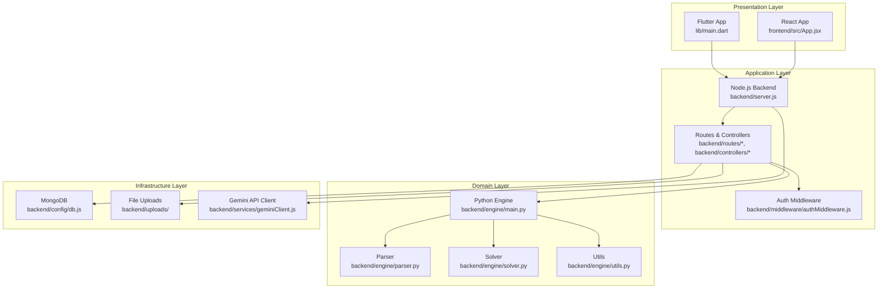
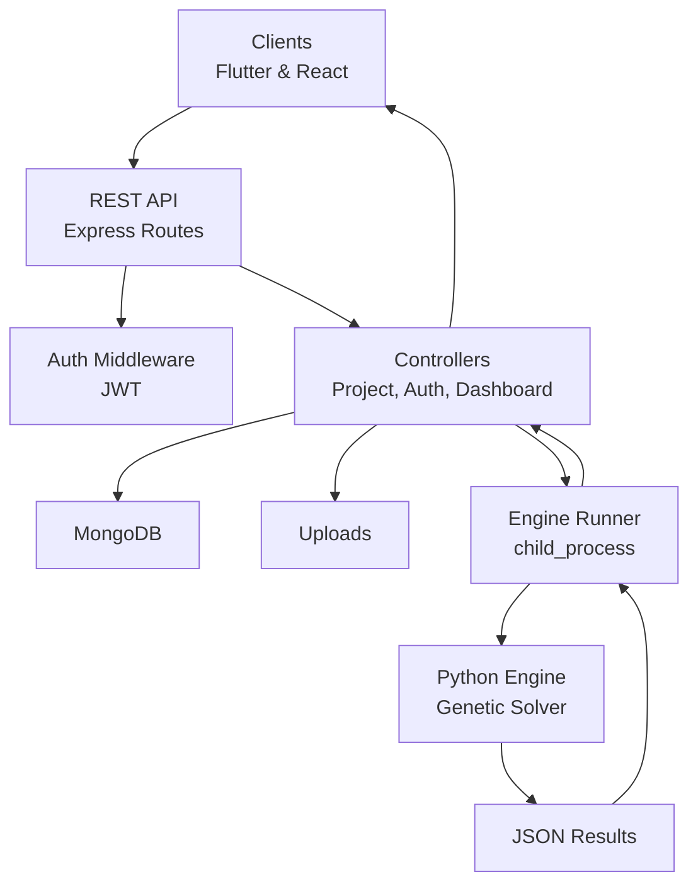
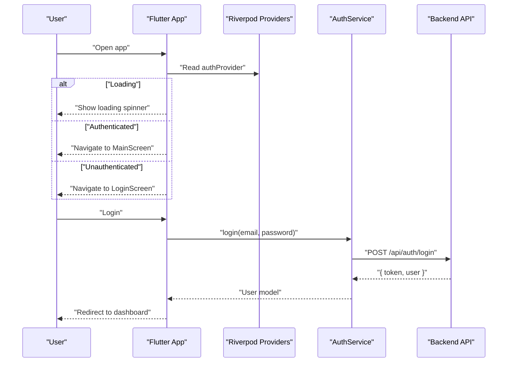
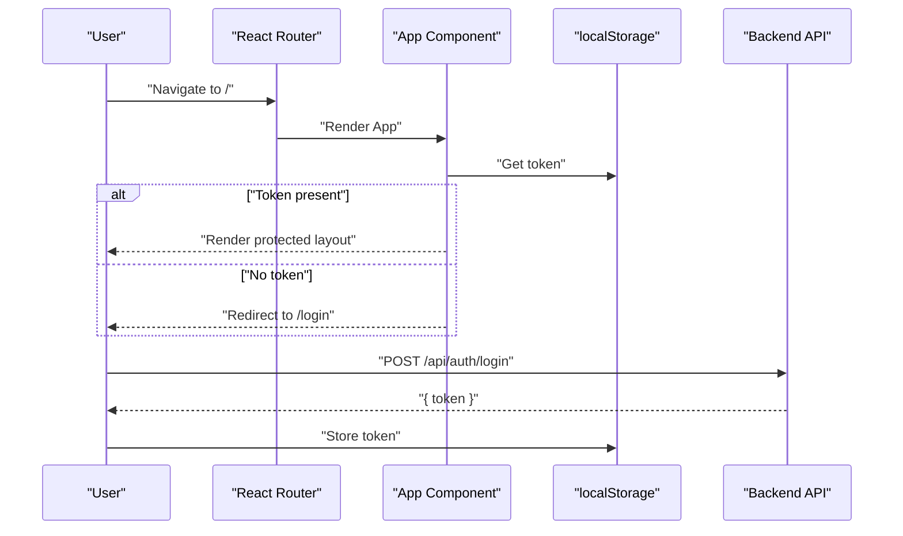
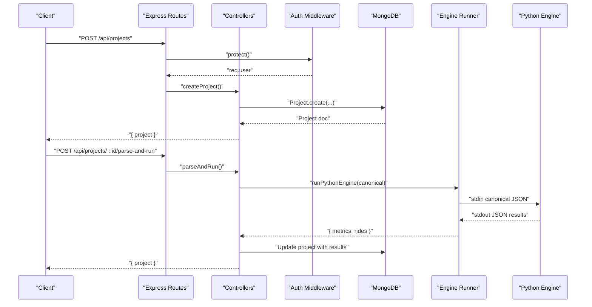
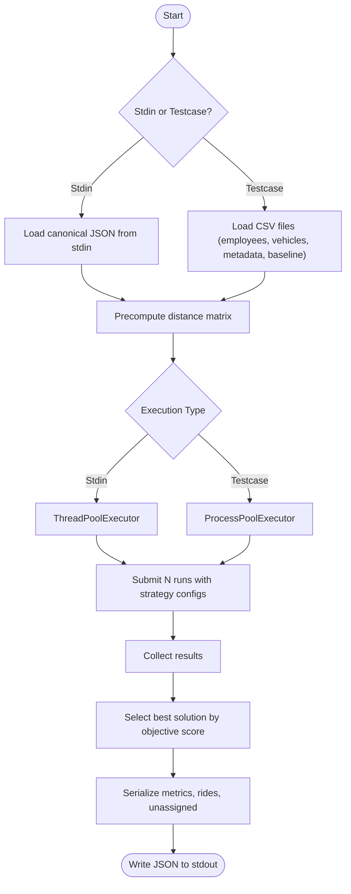
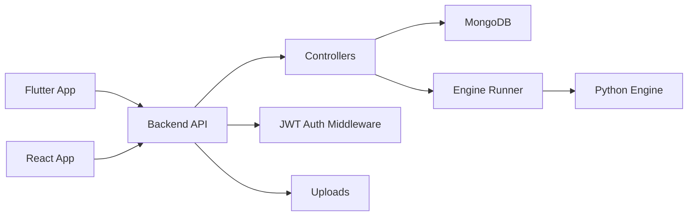
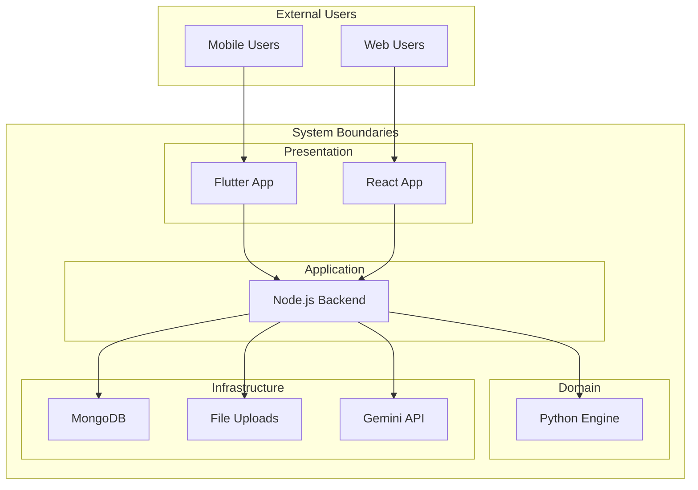

# Architecture Overview

<cite>
**Referenced Files in This Document**
- [README.md](file://README.md)
- [DEPLOY.md](file://DEPLOY.md)
- [backend/server.js](file://backend/server.js)
- [backend/package.json](file://backend/package.json)
- [backend/middleware/authMiddleware.js](file://backend/middleware/authMiddleware.js)
- [backend/controllers/projectController.js](file://backend/controllers/projectController.js)
- [backend/routes/projectRoutes.js](file://backend/routes/projectRoutes.js)
- [backend/services/engineRunner.js](file://backend/services/engineRunner.js)
- [backend/engine/main.py](file://backend/engine/main.py)
- [backend/engine/parser.py](file://backend/engine/parser.py)
- [backend/engine/solver.py](file://backend/engine/solver.py)
- [backend/engine/utils.py](file://backend/engine/utils.py)
- [frontend/package.json](file://frontend/package.json)
- [frontend/src/App.jsx](file://frontend/src/App.jsx)
- [lib/main.dart](file://lib/main.dart)
- [lib/providers/auth_provider.dart](file://lib/providers/auth_provider.dart)
- [lib/core/theme/app_theme.dart](file://lib/core/theme/app_theme.dart)
</cite>

## Table of Contents
1. [Introduction](#introduction)
2. [Project Structure](#project-structure)
3. [Core Components](#core-components)
4. [Architecture Overview](#architecture-overview)
5. [Detailed Component Analysis](#detailed-component-analysis)
6. [Dependency Analysis](#dependency-analysis)
7. [Performance Considerations](#performance-considerations)
8. [Troubleshooting Guide](#troubleshooting-guide)
9. [Conclusion](#conclusion)
10. [Appendices](#appendices)

## Introduction
This document presents the architecture of the Route Optimization system, covering the Flutter mobile application, React web interface, Node.js backend API, and the Python optimization engine. It explains the clean architecture layers (presentation, application, domain, and infrastructure), component relationships, data flow, cross-cutting concerns (authentication, error handling, state management), technology stack choices, architectural patterns (Riverpod, Express.js, Genetic Algorithm), and deployment topology. The goal is to enable both technical and non-technical stakeholders to understand how users interact with the system across platforms and how the backend orchestrates the optimization pipeline.

## Project Structure
The system is organized into four primary areas:
- Flutter mobile application (lib/)
- React web application (frontend/)
- Node.js backend (backend/)
- Python optimization engine (backend/engine/)

High-level module layout and responsibilities:
- Presentation layer: Flutter mobile app and React web app handle UI, routing, and user interactions.
- Application layer: Backend routes and controllers orchestrate workflows (auth, CRUD, dashboard, pipeline).
- Domain layer: Python engine encapsulates the optimization logic (parser, solver, objective).
- Infrastructure layer: Backend database (MongoDB), authentication (JWT), file uploads, and inter-process communication with the Python engine.

**Diagram sources**
- [lib/main.dart](file://lib/main.dart#L1-L220)
- [frontend/src/App.jsx](file://frontend/src/App.jsx#L1-L60)
- [backend/server.js](file://backend/server.js#L1-L56)
- [backend/routes/projectRoutes.js](file://backend/routes/projectRoutes.js#L1-L11)
- [backend/controllers/projectController.js](file://backend/controllers/projectController.js#L1-L117)
- [backend/middleware/authMiddleware.js](file://backend/middleware/authMiddleware.js#L1-L34)
- [backend/engine/main.py](file://backend/engine/main.py#L1-L193)
- [backend/engine/parser.py](file://backend/engine/parser.py)
- [backend/engine/solver.py](file://backend/engine/solver.py)
- [backend/engine/utils.py](file://backend/engine/utils.py)

**Section sources**
- [README.md](file://README.md#L1-L17)
- [DEPLOY.md](file://DEPLOY.md#L1-L169)
- [backend/server.js](file://backend/server.js#L1-L56)
- [frontend/src/App.jsx](file://frontend/src/App.jsx#L1-L60)
- [lib/main.dart](file://lib/main.dart#L1-L220)

## Core Components
- Flutter App: Uses Riverpod for state management, loads environment variables, and renders navigation with a bottom bar. Authentication state is managed via a provider and persisted implicitly through the backend session.
- React App: Uses React Router for protected routes, local storage for tokens, and shared UI components.
- Node.js Backend: Express server with CORS, JWT auth middleware, route modules, controller handlers, and an engine runner that spawns the Python optimization process.
- Python Engine: Implements a genetic algorithm solver with configurable strategies, parallel execution, and JSON serialization of results.

Key implementation references:
- Flutter main and theme: [lib/main.dart](file://lib/main.dart#L1-L220), [lib/core/theme/app_theme.dart](file://lib/core/theme/app_theme.dart#L1-L116)
- Riverpod auth provider: [lib/providers/auth_provider.dart](file://lib/providers/auth_provider.dart#L1-L89)
- React routing and auth wrapper: [frontend/src/App.jsx](file://frontend/src/App.jsx#L1-L60)
- Backend server bootstrap and CORS: [backend/server.js](file://backend/server.js#L1-L56)
- Auth middleware: [backend/middleware/authMiddleware.js](file://backend/middleware/authMiddleware.js#L1-L34)
- Project CRUD controller: [backend/controllers/projectController.js](file://backend/controllers/projectController.js#L1-L117)
- Engine runner: [backend/services/engineRunner.js](file://backend/services/engineRunner.js#L1-L73)
- Python engine entrypoint: [backend/engine/main.py](file://backend/engine/main.py#L1-L193)

**Section sources**
- [lib/main.dart](file://lib/main.dart#L1-L220)
- [lib/providers/auth_provider.dart](file://lib/providers/auth_provider.dart#L1-L89)
- [lib/core/theme/app_theme.dart](file://lib/core/theme/app_theme.dart#L1-L116)
- [frontend/src/App.jsx](file://frontend/src/App.jsx#L1-L60)
- [backend/server.js](file://backend/server.js#L1-L56)
- [backend/middleware/authMiddleware.js](file://backend/middleware/authMiddleware.js#L1-L34)
- [backend/controllers/projectController.js](file://backend/controllers/projectController.js#L1-L117)
- [backend/services/engineRunner.js](file://backend/services/engineRunner.js#L1-L73)
- [backend/engine/main.py](file://backend/engine/main.py#L1-L193)

## Architecture Overview
Clean Architecture Layers:
- Presentation: Flutter mobile app and React web app.
- Application: Express routes and controllers, middleware, and service orchestrators.
- Domain: Python optimization engine implementing genetic algorithms and problem parsing.
- Infrastructure: MongoDB persistence, JWT, file uploads, and external integrations.

Cross-cutting Concerns:
- Authentication: JWT-based bearer tokens validated by middleware; stored in local storage for React and implicitly handled by the backend for Flutter.
- Error Handling: Centralized Express error handler and robust Python output parsing with timeouts.
- State Management: Riverpod for Flutter; React context/local storage for React.

Integration Patterns:
- RESTful API: Both Flutter and React consume the same backend endpoints.
- Inter-process Communication: Node.js spawns the Python engine, streams canonical JSON to stdin, and parses structured output.
- Pipeline Orchestration: Project creation → artifact ingestion → parse-and-run → results update.

**Diagram sources**
- [backend/server.js](file://backend/server.js#L1-L56)
- [backend/middleware/authMiddleware.js](file://backend/middleware/authMiddleware.js#L1-L34)
- [backend/controllers/projectController.js](file://backend/controllers/projectController.js#L1-L117)
- [backend/services/engineRunner.js](file://backend/services/engineRunner.js#L1-L73)
- [backend/engine/main.py](file://backend/engine/main.py#L1-L193)

**Section sources**
- [DEPLOY.md](file://DEPLOY.md#L138-L169)
- [backend/server.js](file://backend/server.js#L1-L56)
- [backend/middleware/authMiddleware.js](file://backend/middleware/authMiddleware.js#L1-L34)
- [backend/controllers/projectController.js](file://backend/controllers/projectController.js#L1-L117)
- [backend/services/engineRunner.js](file://backend/services/engineRunner.js#L1-L73)
- [backend/engine/main.py](file://backend/engine/main.py#L1-L193)

## Detailed Component Analysis

### Flutter App (Presentation Layer)
- Bootstrapping: Loads environment variables, sets system UI overlay, and initializes Riverpod providers.
- Routing and Navigation: Bottom navigation bar with dashboard, metrics, and placeholders for history/settings.
- Authentication Wrapper: Watches auth provider state and switches between login and main screens.
- Theme: Dark theme with Material 3 and glassmorphism styling.

**Diagram sources**
- [lib/main.dart](file://lib/main.dart#L12-L64)
- [lib/providers/auth_provider.dart](file://lib/providers/auth_provider.dart#L1-L89)

**Section sources**
- [lib/main.dart](file://lib/main.dart#L1-L220)
- [lib/providers/auth_provider.dart](file://lib/providers/auth_provider.dart#L1-L89)
- [lib/core/theme/app_theme.dart](file://lib/core/theme/app_theme.dart#L1-L116)

### React Web App (Presentation Layer)
- Protected Routes: Requires token presence in local storage; otherwise redirects to login.
- Layout: Map background and sidebar; nested routes for dashboard, metrics, and project detail.
- Token Storage: Uses localStorage for JWT; backend enforces Bearer token validation.

**Diagram sources**
- [frontend/src/App.jsx](file://frontend/src/App.jsx#L14-L19)

**Section sources**
- [frontend/src/App.jsx](file://frontend/src/App.jsx#L1-L60)

### Backend API (Application Layer)
- Server Bootstrap: Express app with CORS configuration, JSON parsing, and mounted routes.
- Authentication: Middleware validates JWT and attaches user to request.
- Project CRUD: Create, list, fetch, and delete projects with ownership checks.
- Engine Integration: Spawns Python engine, streams canonical JSON, and extracts structured results.

**Diagram sources**
- [backend/server.js](file://backend/server.js#L1-L56)
- [backend/middleware/authMiddleware.js](file://backend/middleware/authMiddleware.js#L1-L34)
- [backend/controllers/projectController.js](file://backend/controllers/projectController.js#L1-L117)
- [backend/services/engineRunner.js](file://backend/services/engineRunner.js#L1-L73)
- [backend/engine/main.py](file://backend/engine/main.py#L1-L193)

**Section sources**
- [backend/server.js](file://backend/server.js#L1-L56)
- [backend/middleware/authMiddleware.js](file://backend/middleware/authMiddleware.js#L1-L34)
- [backend/controllers/projectController.js](file://backend/controllers/projectController.js#L1-L117)
- [backend/services/engineRunner.js](file://backend/services/engineRunner.js#L1-L73)

### Python Optimization Engine (Domain Layer)
- Strategies: Predefined configurations for genetic solver variants.
- Parallel Execution: Thread pool for stdin mode, process pool for test cases.
- Problem Loading: Accepts canonical JSON via stdin or CSV test cases.
- Solution Serialization: Aggregates per-route metrics, savings computation, and unassigned employees.

**Diagram sources**
- [backend/engine/main.py](file://backend/engine/main.py#L1-L193)

**Section sources**
- [backend/engine/main.py](file://backend/engine/main.py#L1-L193)

### Technology Stack and Architectural Patterns
- Flutter: Riverpod for reactive state management and modular UI.
- React: React Router for SPA routing and localStorage for auth tokens.
- Node.js: Express for REST API, JWT for auth, Multer for uploads, and child_process for Python integration.
- Python: Genetic Algorithm solver with configurable strategies and parallel execution.
- Database: MongoDB via Mongoose.
- External Integrations: Gemini API client for optional LLM parsing.

**Section sources**
- [backend/package.json](file://backend/package.json#L1-L28)
- [frontend/package.json](file://frontend/package.json#L1-L48)
- [lib/providers/auth_provider.dart](file://lib/providers/auth_provider.dart#L1-L89)
- [backend/middleware/authMiddleware.js](file://backend/middleware/authMiddleware.js#L1-L34)
- [backend/services/engineRunner.js](file://backend/services/engineRunner.js#L1-L73)
- [backend/engine/main.py](file://backend/engine/main.py#L1-L193)

## Dependency Analysis
- Presentation to Application: Both Flutter and React call identical backend endpoints.
- Application to Domain: Backend controllers delegate optimization to the Python engine via a runner service.
- Infrastructure Coupling: Controllers depend on MongoDB models and the upload directory; middleware depends on JWT secrets.
- External Dependencies: Backend depends on MongoDB, JWT, and optional Gemini API keys.

**Diagram sources**
- [lib/main.dart](file://lib/main.dart#L1-L220)
- [frontend/src/App.jsx](file://frontend/src/App.jsx#L1-L60)
- [backend/server.js](file://backend/server.js#L1-L56)
- [backend/controllers/projectController.js](file://backend/controllers/projectController.js#L1-L117)
- [backend/services/engineRunner.js](file://backend/services/engineRunner.js#L1-L73)
- [backend/engine/main.py](file://backend/engine/main.py#L1-L193)

**Section sources**
- [backend/server.js](file://backend/server.js#L1-L56)
- [backend/controllers/projectController.js](file://backend/controllers/projectController.js#L1-L117)
- [backend/services/engineRunner.js](file://backend/services/engineRunner.js#L1-L73)
- [backend/engine/main.py](file://backend/engine/main.py#L1-L193)

## Performance Considerations
- Backend: JSON payload limits and CORS configuration support large uploads and multiple origins. Consider rate limiting and pagination for project lists.
- Python Engine: Parallel execution reduces runtime; ensure adequate CPU resources. Timeout handling prevents hanging processes.
- Frontend: Debounce search/filter operations and lazy-load heavy components to improve responsiveness.

[No sources needed since this section provides general guidance]

## Troubleshooting Guide
Common issues and remedies:
- Authentication failures: Verify JWT_SECRET and token presence in local storage for React; ensure backend CORS includes the web origin.
- Engine timeouts: Increase timeoutMs in the runner or provision more CPU; validate Python installation and dependencies.
- CORS errors: Confirm CORS_ORIGINS includes Flutter web and React origins; backend logs indicate allowed origins.
- Upload problems: Ensure uploads directory exists and backend has write permissions.

**Section sources**
- [DEPLOY.md](file://DEPLOY.md#L37-L90)
- [backend/server.js](file://backend/server.js#L26-L41)
- [backend/services/engineRunner.js](file://backend/services/engineRunner.js#L21-L73)

## Conclusion
The Route Optimization system follows a clean architecture with clear separation of concerns across presentation, application, domain, and infrastructure layers. The Flutter and React applications share the same backend API and pipeline, ensuring consistent UX and maintainability. The Node.js backend integrates a Python genetic algorithm engine through a robust runner that handles timeouts, JSON parsing, and parallel execution. Cross-cutting concerns like authentication, error handling, and state management are implemented consistently across platforms, enabling scalable deployment and operation.

[No sources needed since this section summarizes without analyzing specific files]

## Appendices

### System Context Diagram

**Diagram sources**
- [lib/main.dart](file://lib/main.dart#L1-L220)
- [frontend/src/App.jsx](file://frontend/src/App.jsx#L1-L60)
- [backend/server.js](file://backend/server.js#L1-L56)
- [backend/engine/main.py](file://backend/engine/main.py#L1-L193)

### Deployment Topology
- Backend: Single Node.js service serving both Flutter and React clients; deployable to Render or similar platforms with environment variables configured.
- Clients: Flutter builds for Android/iOS/Web; React builds for static hosting; both point to the same backend base URL.
- Optimization Engine: Executed by the backend via child_process; ensure Python runtime availability and appropriate resource allocation.

**Section sources**
- [DEPLOY.md](file://DEPLOY.md#L1-L169)