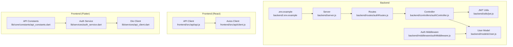
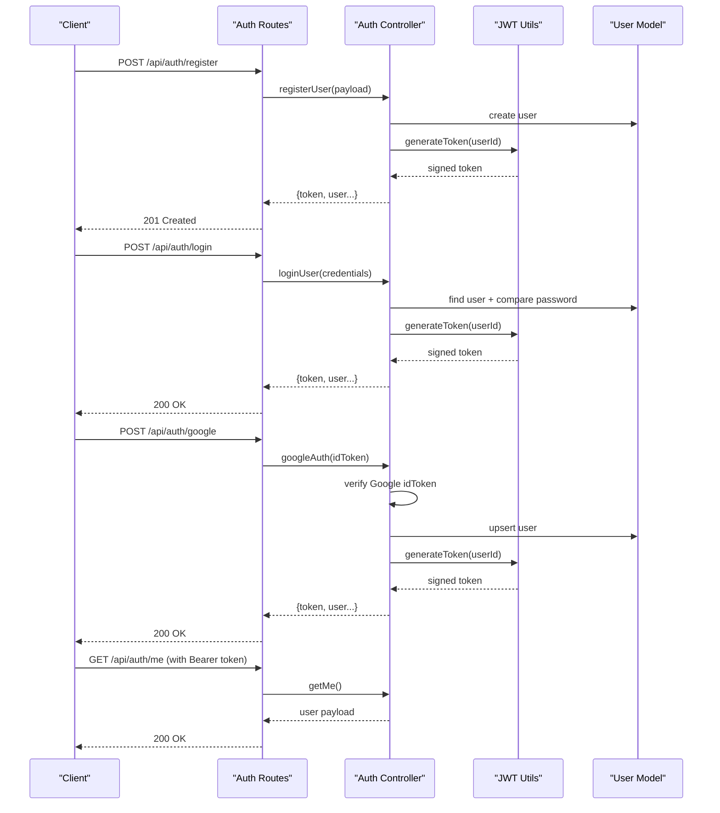
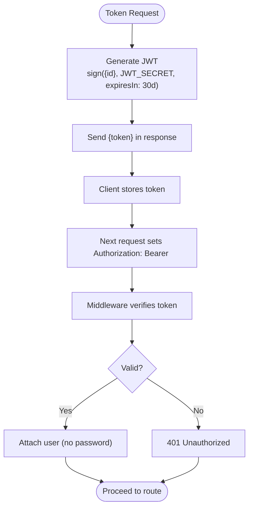
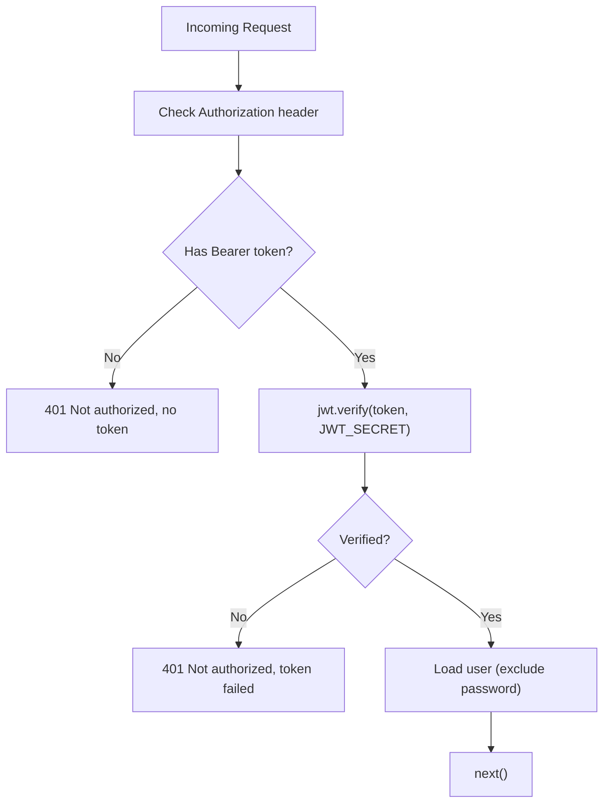
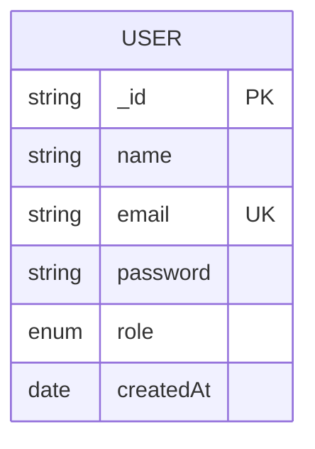
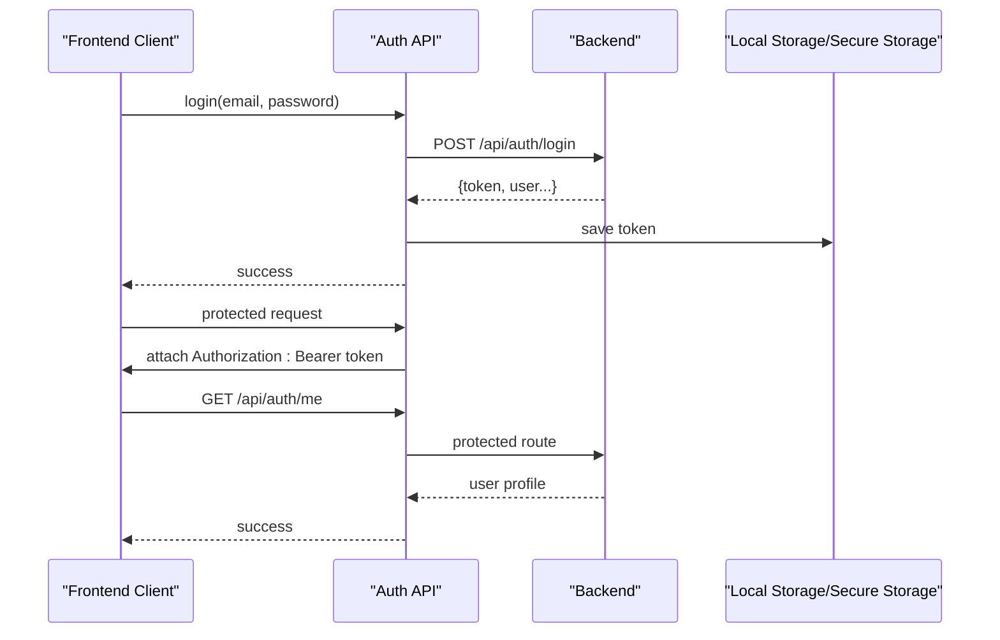
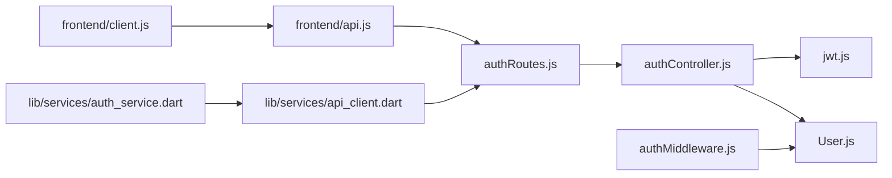

# Authentication API

<cite>
**Referenced Files in This Document**
- [backend/server.js](file://backend/server.js)
- [backend/routes/authRoutes.js](file://backend/routes/authRoutes.js)
- [backend/controllers/authController.js](file://backend/controllers/authController.js)
- [backend/middleware/authMiddleware.js](file://backend/middleware/authMiddleware.js)
- [backend/utils/jwt.js](file://backend/utils/jwt.js)
- [backend/models/User.js](file://backend/models/User.js)
- [backend/.env.example](file://backend/.env.example)
- [frontend/src/api/api.js](file://frontend/src/api/api.js)
- [frontend/src/api/client.js](file://frontend/src/api/client.js)
- [lib/services/api_client.dart](file://lib/services/api_client.dart)
- [lib/services/auth_service.dart](file://lib/services/auth_service.dart)
- [lib/core/constants/api_constants.dart](file://lib/core/constants/api_constants.dart)
</cite>

## Table of Contents
1. [Introduction](#introduction)
2. [Project Structure](#project-structure)
3. [Core Components](#core-components)
4. [Architecture Overview](#architecture-overview)
5. [Detailed Component Analysis](#detailed-component-analysis)
6. [Dependency Analysis](#dependency-analysis)
7. [Performance Considerations](#performance-considerations)
8. [Troubleshooting Guide](#troubleshooting-guide)
9. [Conclusion](#conclusion)
10. [Appendices](#appendices)

## Introduction
This document provides comprehensive API documentation for the authentication endpoints. It covers user registration, login, Google OAuth login, and protected profile retrieval. It also documents JWT token generation and verification, middleware behavior, error responses, and client-side integration patterns for both the React frontend and Flutter mobile/web clients.

## Project Structure
Authentication endpoints are exposed under the base path /api/auth and handled by dedicated routes, controllers, middleware, and utilities.

**Diagram sources**
- [backend/server.js](file://backend/server.js#L1-L56)
- [backend/routes/authRoutes.js](file://backend/routes/authRoutes.js#L1-L13)
- [backend/controllers/authController.js](file://backend/controllers/authController.js#L1-L108)
- [backend/middleware/authMiddleware.js](file://backend/middleware/authMiddleware.js#L1-L34)
- [backend/utils/jwt.js](file://backend/utils/jwt.js#L1-L7)
- [backend/models/User.js](file://backend/models/User.js#L1-L27)
- [backend/.env.example](file://backend/.env.example#L1-L12)
- [frontend/src/api/api.js](file://frontend/src/api/api.js#L1-L70)
- [frontend/src/api/client.js](file://frontend/src/api/client.js#L1-L14)
- [lib/services/api_client.dart](file://lib/services/api_client.dart#L1-L49)
- [lib/services/auth_service.dart](file://lib/services/auth_service.dart#L1-L91)
- [lib/core/constants/api_constants.dart](file://lib/core/constants/api_constants.dart#L1-L40)

**Section sources**
- [backend/server.js](file://backend/server.js#L1-L56)
- [backend/routes/authRoutes.js](file://backend/routes/authRoutes.js#L1-L13)

## Core Components
- Routes: Define endpoints for registration, login, Google login, and protected profile retrieval.
- Controller: Implements business logic for user creation, credential validation, Google token verification, and profile response.
- Middleware: Enforces Bearer token authorization for protected routes.
- JWT Utilities: Generates signed JWT tokens with expiration.
- User Model: Defines schema, hashing for passwords, and password comparison method.
- Frontend Clients: Axios-based for React and Dio-based for Flutter, both inject Authorization headers and handle token storage.

**Section sources**
- [backend/controllers/authController.js](file://backend/controllers/authController.js#L1-L108)
- [backend/middleware/authMiddleware.js](file://backend/middleware/authMiddleware.js#L1-L34)
- [backend/utils/jwt.js](file://backend/utils/jwt.js#L1-L7)
- [backend/models/User.js](file://backend/models/User.js#L1-L27)
- [frontend/src/api/api.js](file://frontend/src/api/api.js#L1-L70)
- [frontend/src/api/client.js](file://frontend/src/api/client.js#L1-L14)
- [lib/services/api_client.dart](file://lib/services/api_client.dart#L1-L49)
- [lib/services/auth_service.dart](file://lib/services/auth_service.dart#L1-L91)
- [lib/core/constants/api_constants.dart](file://lib/core/constants/api_constants.dart#L1-L40)

## Architecture Overview
High-level authentication flow:
- Registration: Client posts user details; server creates user and returns JWT token.
- Login: Client posts credentials; server verifies and returns JWT token.
- Google Login: Client posts Google idToken; server verifies via Google and returns JWT token.
- Protected Profile: Client includes Authorization: Bearer <token>; middleware validates and attaches user.

**Diagram sources**
- [backend/routes/authRoutes.js](file://backend/routes/authRoutes.js#L1-L13)
- [backend/controllers/authController.js](file://backend/controllers/authController.js#L1-L108)
- [backend/utils/jwt.js](file://backend/utils/jwt.js#L1-L7)
- [backend/models/User.js](file://backend/models/User.js#L1-L27)

## Detailed Component Analysis

### Endpoint Catalog

- POST /api/auth/register
  - Purpose: Register a new user.
  - Authentication: None.
  - Request JSON Schema:
    - name: string, required
    - email: string, required
    - password: string, required, minimum length 6
  - Response JSON Schema:
    - _id: string
    - name: string
    - email: string
    - role: enum ["Admin","Manager","Viewer"]
    - token: string (JWT)
  - Success: 201 Created
  - Errors:
    - 400 Bad Request: Missing fields
    - 409 Conflict: Email already registered
  - Validation Rules:
    - name, email, password required
    - email unique and lowercase
    - password min length 6
  - Security Notes:
    - Password hashed before persisting.
    - No sensitive fields returned to client except token.

- POST /api/auth/login
  - Purpose: Authenticate user with email/password.
  - Authentication: None.
  - Request JSON Schema:
    - email: string, required
    - password: string, required
  - Response JSON Schema:
    - Same as registration response.
  - Success: 200 OK
  - Errors:
    - 400 Bad Request: Missing fields
    - 401 Unauthorized: Invalid credentials
  - Validation Rules:
    - email and password required
    - Password compared using bcrypt
  - Security Notes:
    - Password comparison uses bcrypt.
    - Token expires in 30 days.

- POST /api/auth/google
  - Purpose: Authenticate via Google idToken.
  - Authentication: None.
  - Request JSON Schema:
    - idToken: string, required
  - Response JSON Schema:
    - Same as registration response.
  - Success: 200 OK
  - Errors:
    - 400 Bad Request: Missing idToken
    - 401 Unauthorized: Unverified email or token failure
    - 500 Internal Server: GOOGLE_CLIENT_ID not configured
  - Validation Rules:
    - idToken verified against GOOGLE_CLIENT_ID
    - Requires verified email
  - Security Notes:
    - New users created with randomly generated password if not found.

- GET /api/auth/me
  - Purpose: Retrieve currently authenticated user profile.
  - Authentication: Bearer token required.
  - Request Headers:
    - Authorization: Bearer <token>
  - Response JSON Schema:
    - _id: string
    - name: string
    - email: string
    - role: enum ["Admin","Manager","Viewer"]
  - Success: 200 OK
  - Errors:
    - 401 Unauthorized: Missing or invalid/expired token; user not found
  - Security Notes:
    - Token validated by middleware; password excluded from response.

**Section sources**
- [backend/controllers/authController.js](file://backend/controllers/authController.js#L17-L105)
- [backend/middleware/authMiddleware.js](file://backend/middleware/authMiddleware.js#L4-L32)
- [backend/models/User.js](file://backend/models/User.js#L4-L25)
- [backend/utils/jwt.js](file://backend/utils/jwt.js#L3-L5)

### JWT Token Handling
- Generation:
  - Payload: { id }
  - Secret: JWT_SECRET from environment
  - Expiration: 30 days
- Verification:
  - Middleware extracts Bearer token from Authorization header
  - Verifies signature using JWT_SECRET
  - Attaches user object (without password) to request
- Storage:
  - Frontend stores token in browser storage and adds Authorization header on subsequent requests.

**Diagram sources**
- [backend/utils/jwt.js](file://backend/utils/jwt.js#L3-L5)
- [backend/middleware/authMiddleware.js](file://backend/middleware/authMiddleware.js#L17-L27)

**Section sources**
- [backend/utils/jwt.js](file://backend/utils/jwt.js#L1-L7)
- [backend/middleware/authMiddleware.js](file://backend/middleware/authMiddleware.js#L1-L34)

### Authentication Middleware Stack
- Extracts token from Authorization header (Bearer <token>)
- Verifies token with JWT_SECRET
- Loads user excluding password and attaches to request
- Returns 401 for missing/invalid/expired tokens or user not found

**Diagram sources**
- [backend/middleware/authMiddleware.js](file://backend/middleware/authMiddleware.js#L4-L32)

**Section sources**
- [backend/middleware/authMiddleware.js](file://backend/middleware/authMiddleware.js#L1-L34)

### Data Models
User model defines fields, validation, and password hashing.

**Diagram sources**
- [backend/models/User.js](file://backend/models/User.js#L4-L14)

**Section sources**
- [backend/models/User.js](file://backend/models/User.js#L1-L27)

### Client Integration Patterns

- React (Axios):
  - Uses a base client that injects Authorization header when a token exists.
  - Provides convenience functions for login, register, Google login, and logout.
  - Stores token in localStorage after successful login/register.

- Flutter (Dio):
  - Uses a singleton Dio client with interceptors to inject Authorization header.
  - Clears token on 401 errors.
  - Provides AuthService to encapsulate login/register flows and token persistence.

- API Constants:
  - Flutter constants define endpoint paths aligned with backend routes.

**Diagram sources**
- [frontend/src/api/api.js](file://frontend/src/api/api.js#L4-L23)
- [frontend/src/api/client.js](file://frontend/src/api/client.js#L8-L12)
- [lib/services/api_client.dart](file://lib/services/api_client.dart#L24-L41)
- [lib/services/auth_service.dart](file://lib/services/auth_service.dart#L12-L31)
- [lib/core/constants/api_constants.dart](file://lib/core/constants/api_constants.dart#L16-L18)

**Section sources**
- [frontend/src/api/api.js](file://frontend/src/api/api.js#L1-L70)
- [frontend/src/api/client.js](file://frontend/src/api/client.js#L1-L14)
- [lib/services/api_client.dart](file://lib/services/api_client.dart#L1-L49)
- [lib/services/auth_service.dart](file://lib/services/auth_service.dart#L1-L91)
- [lib/core/constants/api_constants.dart](file://lib/core/constants/api_constants.dart#L1-L40)

## Dependency Analysis
- Routes depend on controller handlers.
- Controller depends on JWT utility and User model.
- Middleware depends on JWT library and User model.
- Frontend clients depend on backend endpoints and environment configuration.

**Diagram sources**
- [backend/routes/authRoutes.js](file://backend/routes/authRoutes.js#L1-L13)
- [backend/controllers/authController.js](file://backend/controllers/authController.js#L1-L108)
- [backend/utils/jwt.js](file://backend/utils/jwt.js#L1-L7)
- [backend/models/User.js](file://backend/models/User.js#L1-L27)
- [backend/middleware/authMiddleware.js](file://backend/middleware/authMiddleware.js#L1-L34)
- [frontend/src/api/api.js](file://frontend/src/api/api.js#L1-L70)
- [frontend/src/api/client.js](file://frontend/src/api/client.js#L1-L14)
- [lib/services/auth_service.dart](file://lib/services/auth_service.dart#L1-L91)
- [lib/services/api_client.dart](file://lib/services/api_client.dart#L1-L49)

**Section sources**
- [backend/server.js](file://backend/server.js#L46-L48)
- [backend/routes/authRoutes.js](file://backend/routes/authRoutes.js#L1-L13)
- [backend/controllers/authController.js](file://backend/controllers/authController.js#L1-L108)
- [backend/middleware/authMiddleware.js](file://backend/middleware/authMiddleware.js#L1-L34)
- [backend/utils/jwt.js](file://backend/utils/jwt.js#L1-L7)
- [backend/models/User.js](file://backend/models/User.js#L1-L27)
- [frontend/src/api/api.js](file://frontend/src/api/api.js#L1-L70)
- [frontend/src/api/client.js](file://frontend/src/api/client.js#L1-L14)
- [lib/services/api_client.dart](file://lib/services/api_client.dart#L1-L49)
- [lib/services/auth_service.dart](file://lib/services/auth_service.dart#L1-L91)
- [lib/core/constants/api_constants.dart](file://lib/core/constants/api_constants.dart#L1-L40)

## Performance Considerations
- Token expiration is set to 30 days; consider shorter expirations for higher security and refresh mechanisms if needed.
- Password hashing uses bcrypt with a salt; ensure appropriate server resources for concurrent sign-ups/logins.
- Middleware performs a single database lookup per protected request; keep indexes on email and user ID.

## Troubleshooting Guide
Common issues and resolutions:
- 400 Bad Request during registration/login:
  - Cause: Missing required fields (name/email/password).
  - Resolution: Ensure all required fields are present in the request body.
- 409 Conflict on registration:
  - Cause: Email already exists.
  - Resolution: Prompt user to log in or use another email.
- 401 Unauthorized on login:
  - Cause: Invalid credentials or missing Authorization header.
  - Resolution: Re-enter credentials; ensure Authorization header is included for protected routes.
- 401 Unauthorized on protected route:
  - Cause: Missing/expired token or user deleted.
  - Resolution: Re-authenticate to obtain a new token.
- 500 Internal Server on Google login:
  - Cause: GOOGLE_CLIENT_ID not configured.
  - Resolution: Set GOOGLE_CLIENT_ID in environment variables.
- Frontend token not sent:
  - Cause: Token not stored or interceptor not applied.
  - Resolution: Confirm token storage and interceptor setup in client.

**Section sources**
- [backend/controllers/authController.js](file://backend/controllers/authController.js#L21-L58)
- [backend/middleware/authMiddleware.js](file://backend/middleware/authMiddleware.js#L12-L31)
- [backend/.env.example](file://backend/.env.example#L8-L8)
- [frontend/src/api/api.js](file://frontend/src/api/api.js#L4-L23)
- [frontend/src/api/client.js](file://frontend/src/api/client.js#L8-L12)
- [lib/services/api_client.dart](file://lib/services/api_client.dart#L24-L41)
- [lib/services/auth_service.dart](file://lib/services/auth_service.dart#L69-L89)

## Conclusion
The authentication system provides secure, standardized endpoints for registration, login, Google OAuth, and protected profile retrieval. JWT-based sessions with middleware enforcement ensure consistent authorization across protected routes. Frontend clients integrate seamlessly by storing tokens and injecting Authorization headers. Extend the system with password reset and refresh endpoints as needed.

## Appendices

### Environment Variables
Required server-side variables:
- JWT_SECRET: Secret key for signing JWT tokens.
- GOOGLE_CLIENT_ID: Google OAuth client ID for verifying idTokens.
- Optional: CORS_ORIGINS for production origins.

**Section sources**
- [backend/.env.example](file://backend/.env.example#L4-L11)

### Endpoint Reference Summary
- POST /api/auth/register
  - Body: { name, email, password }
  - Response: { _id, name, email, role, token }
  - Auth: None
- POST /api/auth/login
  - Body: { email, password }
  - Response: { _id, name, email, role, token }
  - Auth: None
- POST /api/auth/google
  - Body: { idToken }
  - Response: { _id, name, email, role, token }
  - Auth: None
- GET /api/auth/me
  - Headers: Authorization: Bearer <token>
  - Response: { _id, name, email, role }
  - Auth: Required

**Section sources**
- [backend/routes/authRoutes.js](file://backend/routes/authRoutes.js#L7-L10)
- [backend/controllers/authController.js](file://backend/controllers/authController.js#L17-L105)
- [backend/middleware/authMiddleware.js](file://backend/middleware/authMiddleware.js#L7-L27)