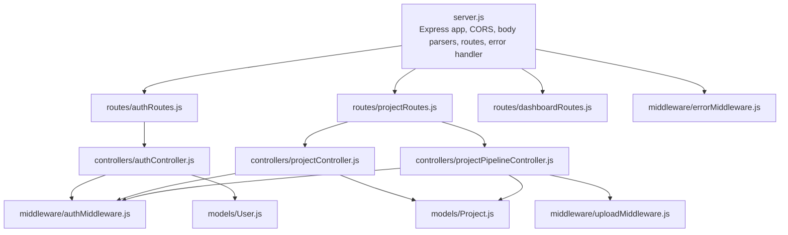
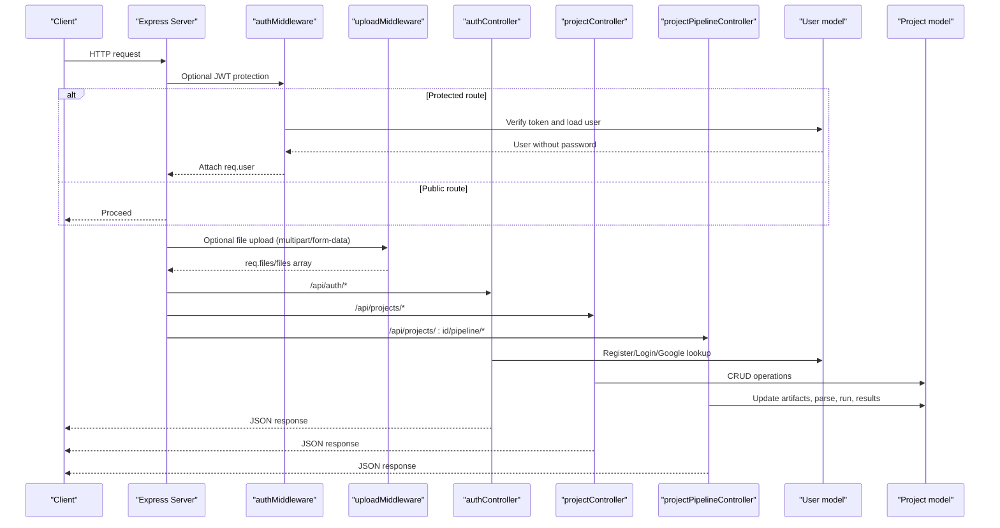
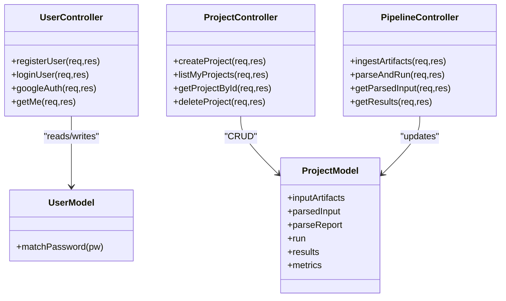
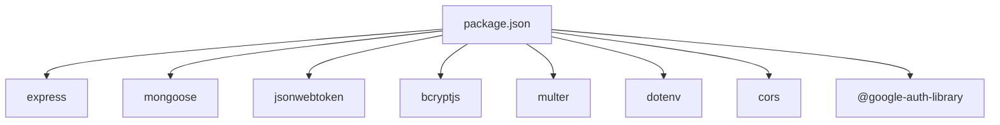

# Backend API (Node.js/Express)

<cite>
**Referenced Files in This Document**
- [server.js](file://backend/server.js)
- [package.json](file://backend/package.json)
- [authRoutes.js](file://backend/routes/authRoutes.js)
- [projectRoutes.js](file://backend/routes/projectRoutes.js)
- [projectCrudRoutes.js](file://backend/routes/projectCrudRoutes.js)
- [projectPipelineRoutes.js](file://backend/routes/projectPipelineRoutes.js)
- [dashboardRoutes.js](file://backend/routes/dashboardRoutes.js)
- [authController.js](file://backend/controllers/authController.js)
- [projectController.js](file://backend/controllers/projectController.js)
- [projectPipelineController.js](file://backend/controllers/projectPipelineController.js)
- [authMiddleware.js](file://backend/middleware/authMiddleware.js)
- [errorMiddleware.js](file://backend/middleware/errorMiddleware.js)
- [uploadMiddleware.js](file://backend/middleware/uploadMiddleware.js)
- [User.js](file://backend/models/User.js)
- [Project.js](file://backend/models/Project.js)
</cite>

## Table of Contents
1. [Introduction](#introduction)
2. [Project Structure](#project-structure)
3. [Core Components](#core-components)
4. [Architecture Overview](#architecture-overview)
5. [Detailed Component Analysis](#detailed-component-analysis)
6. [Dependency Analysis](#dependency-analysis)
7. [Performance Considerations](#performance-considerations)
8. [Troubleshooting Guide](#troubleshooting-guide)
9. [Conclusion](#conclusion)
10. [Appendices](#appendices)

## Introduction
This document provides comprehensive API documentation for the Node.js/Express backend serving the Route Optimization application. It covers authentication, project management, file ingestion and processing, and analytics endpoints. For each endpoint, you will find HTTP methods, URL patterns, request/response schemas, authentication requirements, parameter descriptions, validation rules, and error handling strategies. It also documents the middleware stack, controller-layer architecture, service integration, and database interaction patterns, along with practical client integration guidelines.

## Project Structure
The backend is organized around Express routes, controllers, middleware, models, and services. The server initializes environment configuration, connects to MongoDB, sets up CORS and body parsing, mounts route groups, and registers a global error handler.

**Diagram sources**
- [server.js](file://backend/server.js#L1-L56)
- [authRoutes.js](file://backend/routes/authRoutes.js#L1-L13)
- [projectRoutes.js](file://backend/routes/projectRoutes.js#L1-L11)
- [dashboardRoutes.js](file://backend/routes/dashboardRoutes.js#L1-L9)
- [authController.js](file://backend/controllers/authController.js#L1-L108)
- [projectController.js](file://backend/controllers/projectController.js#L1-L117)
- [projectPipelineController.js](file://backend/controllers/projectPipelineController.js#L1-L216)
- [authMiddleware.js](file://backend/middleware/authMiddleware.js#L1-L34)
- [uploadMiddleware.js](file://backend/middleware/uploadMiddleware.js#L1-L35)
- [errorMiddleware.js](file://backend/middleware/errorMiddleware.js#L1-L12)
- [User.js](file://backend/models/User.js#L1-L27)
- [Project.js](file://backend/models/Project.js#L1-L96)

**Section sources**
- [server.js](file://backend/server.js#L1-L56)
- [package.json](file://backend/package.json#L1-L28)

## Core Components
- Authentication endpoints: register, login, Google sign-in, current user.
- Project CRUD endpoints: create, list, fetch by ID, delete.
- Project pipeline endpoints: ingest artifacts (files/text), parse and run, get parsed input, get results.
- Dashboard endpoints: summary and metrics.
- Middleware: JWT-based authentication, error handling, and file upload processing.
- Models: User and Project with embedded schemas for requests, artifacts, metrics, parse reports, runs, and results.

**Section sources**
- [authRoutes.js](file://backend/routes/authRoutes.js#L1-L13)
- [projectCrudRoutes.js](file://backend/routes/projectCrudRoutes.js#L1-L18)
- [projectPipelineRoutes.js](file://backend/routes/projectPipelineRoutes.js#L1-L31)
- [dashboardRoutes.js](file://backend/routes/dashboardRoutes.js#L1-L9)
- [authController.js](file://backend/controllers/authController.js#L1-L108)
- [projectController.js](file://backend/controllers/projectController.js#L1-L117)
- [projectPipelineController.js](file://backend/controllers/projectPipelineController.js#L1-L216)
- [authMiddleware.js](file://backend/middleware/authMiddleware.js#L1-L34)
- [uploadMiddleware.js](file://backend/middleware/uploadMiddleware.js#L1-L35)
- [errorMiddleware.js](file://backend/middleware/errorMiddleware.js#L1-L12)
- [User.js](file://backend/models/User.js#L1-L27)
- [Project.js](file://backend/models/Project.js#L1-L96)

## Architecture Overview
The API follows a layered architecture:
- Express app bootstraps middleware and routes.
- Routes delegate to controllers.
- Controllers orchestrate services and models.
- Services encapsulate external integrations (LLM parsing, Python engine execution).
- Models define schemas and pre-save hooks.
- Middleware enforces auth, handles uploads, and standardizes error responses.

**Diagram sources**
- [server.js](file://backend/server.js#L1-L56)
- [authMiddleware.js](file://backend/middleware/authMiddleware.js#L1-L34)
- [uploadMiddleware.js](file://backend/middleware/uploadMiddleware.js#L1-L35)
- [authController.js](file://backend/controllers/authController.js#L1-L108)
- [projectController.js](file://backend/controllers/projectController.js#L1-L117)
- [projectPipelineController.js](file://backend/controllers/projectPipelineController.js#L1-L216)
- [User.js](file://backend/models/User.js#L1-L27)
- [Project.js](file://backend/models/Project.js#L1-L96)

## Detailed Component Analysis

### Authentication Endpoints
- Base path: /api/auth
- Authentication requirement: None for registration/login/google; protected route /api/auth/me requires a valid JWT.

Endpoints:
- POST /api/auth/register
  - Description: Registers a new user with name, email, password.
  - Authentication: Not required.
  - Request body: { name: string, email: string, password: string }.
  - Validation: All fields required; email uniqueness enforced; password minimum length enforced by model.
  - Responses:
    - 201 Created: Returns user payload with token.
    - 400 Bad Request: Missing fields.
    - 409 Conflict: Email already exists.
  - Error handling: Throws descriptive messages; global error middleware returns standardized JSON.

- POST /api/auth/login
  - Description: Logs in an existing user with email/password.
  - Authentication: Not required.
  - Request body: { email: string, password: string }.
  - Validation: Fields required; checks hashed password match.
  - Responses:
    - 200 OK: Returns user payload with token.
    - 400 Bad Request: Missing fields.
    - 401 Unauthorized: Invalid credentials.
  - Error handling: Standardized JSON response via error middleware.

- POST /api/auth/google
  - Description: Authenticates via Google ID token.
  - Authentication: Not required.
  - Request body: { idToken: string }.
  - Validation: idToken required; GOOGLE_CLIENT_ID must be configured; verifies token and ensures email is verified.
  - Responses:
    - 200 OK: Returns user payload with token; creates user if not found.
    - 400 Bad Request: Missing idToken.
    - 401 Unauthorized: Unverified email or invalid token.
    - 500 Internal Server Error: Missing GOOGLE_CLIENT_ID.
  - Error handling: Standardized JSON response.

- GET /api/auth/me
  - Description: Fetches currently authenticated user profile.
  - Authentication: Required (Bearer token).
  - Request headers: Authorization: Bearer <token>.
  - Responses:
    - 200 OK: Returns user object without password.
    - 401 Unauthorized: No/invalid token.
  - Error handling: Standardized JSON response.

Security and validation:
- Password hashing is handled via bcrypt pre-save hook.
- JWT secret is used to sign tokens; protected routes verify token and attach user to request.

**Section sources**
- [authRoutes.js](file://backend/routes/authRoutes.js#L1-L13)
- [authController.js](file://backend/controllers/authController.js#L1-L108)
- [authMiddleware.js](file://backend/middleware/authMiddleware.js#L1-L34)
- [User.js](file://backend/models/User.js#L1-L27)
- [errorMiddleware.js](file://backend/middleware/errorMiddleware.js#L1-L12)

### Project Management Endpoints
- Base path: /api/projects
- Authentication requirement: All endpoints require a valid JWT.

Endpoints:
- POST /api/projects
  - Description: Creates a new empty project for the authenticated user.
  - Authentication: Required.
  - Request body: { name: string }.
  - Validation: Name required and trimmed; default status Pending; initializes metrics and empty arrays.
  - Responses:
    - 201 Created: Returns the created project.
    - 400 Bad Request: Missing name.
  - Error handling: Standardized JSON response.

- GET /api/projects
  - Description: Lists user’s projects with pagination.
  - Authentication: Required.
  - Query parameters:
    - limit: integer, min 1, max 50 (default 10)
    - page: integer, min 1 (default 1)
  - Responses:
    - 200 OK: { items: Project[], page: number, limit: number, total: number, totalPages: number }.
  - Error handling: Standardized JSON response.

- GET /api/projects/:id
  - Description: Retrieves a single project by ID owned by the authenticated user.
  - Authentication: Required.
  - Path parameters: id: ObjectId.
  - Validation: ObjectId format; ownership check enforced.
  - Responses:
    - 200 OK: Returns the project.
    - 400 Bad Request: Invalid ObjectId.
    - 403 Forbidden: Not owner.
    - 404 Not Found: Project not found.
  - Error handling: Standardized JSON response.

- DELETE /api/projects/:id
  - Description: Deletes a project and cascades deletion of related vehicles and rides.
  - Authentication: Required.
  - Path parameters: id: ObjectId.
  - Validation: ObjectId format; ownership check enforced.
  - Responses:
    - 200 OK: { success: true }.
    - 400 Bad Request: Invalid ObjectId.
    - 403 Forbidden: Not owner.
    - 404 Not Found: Project not found.
  - Error handling: Standardized JSON response.

Data model highlights:
- Embedded schemas include employee requests, input artifacts, metrics, parse report, run state, and results.
- Status and run state enums ensure controlled lifecycle transitions.

**Section sources**
- [projectCrudRoutes.js](file://backend/routes/projectCrudRoutes.js#L1-L18)
- [projectController.js](file://backend/controllers/projectController.js#L1-L117)
- [Project.js](file://backend/models/Project.js#L1-L96)

### Project Pipeline Endpoints
- Base path: /api/projects/:id/pipeline
- Authentication requirement: All endpoints require a valid JWT.
- File upload: Uses multipart/form-data with dynamic field names; accepts Excel, CSV, PDF, images, TXT, JSON.

Endpoints:
- POST /api/projects/:id/ingest
  - Description: Adds user-uploaded files and/or notes as input artifacts to a project.
  - Authentication: Required.
  - Path parameters: id: ObjectId.
  - Form fields:
    - notes: string (optional)
    - files: multiple files (any combination of allowed types)
  - Validation: ObjectId; ownership check; file types validated by filter; file size limit enforced.
  - Responses:
    - 200 OK: { success: true, artifactsCount: number }.
    - 400 Bad Request: Invalid ObjectId.
    - 403 Forbidden: Not owner.
    - 404 Not Found: Project not found.
    - 400/413/415: Unsupported file type or file too large.
  - Error handling: Standardized JSON response.

- POST /api/projects/:id/parse-and-run
  - Description: Triggers parsing with LLM, validates canonical JSON, and executes Python engine if valid.
  - Authentication: Required.
  - Path parameters: id: ObjectId.
  - Validation: ObjectId; ownership check; ensures artifacts exist; updates run state and timestamps.
  - Processing:
    - Sets status to Processing and run state Running.
    - Calls LLM parser to produce canonical JSON.
    - Validates canonical JSON; updates parse report and status accordingly.
    - If valid, runs Python engine, merges metrics, and marks Completed; otherwise Failed.
  - Responses:
    - 200 OK: Parsed but needs review (partial success).
    - 200 OK: Completed with status and metrics.
    - 400 Bad Request: Parser produced no canonical output.
    - 500 Internal Server Error: Engine execution failure.
    - 403/404: Ownership or project not found.
  - Error handling: Standardized JSON response.

- GET /api/projects/:id/input
  - Description: Returns the latest parse report and parsed input for the project.
  - Authentication: Required.
  - Path parameters: id: ObjectId.
  - Responses:
    - 200 OK: { parseReport: object|null, parsedInput: object|null }.
    - 400/403/404: Validation or ownership errors.
  - Error handling: Standardized JSON response.

- GET /api/projects/:id/results
  - Description: Returns run status, metrics, and results for the project.
  - Authentication: Required.
  - Path parameters: id: ObjectId.
  - Responses:
    - 200 OK: { status: string, run: object|null, metrics: object|null, results: object|null }.
    - 400/403/404: Validation or ownership errors.
  - Error handling: Standardized JSON response.

File upload processing:
- Disk storage configured under uploads/.
- Allowed types: xlsx, xls, csv, pdf, png, jpg, jpeg, webp, txt, json.
- Size limit: 50 MB.
- Filename sanitized to avoid collisions.

**Section sources**
- [projectPipelineRoutes.js](file://backend/routes/projectPipelineRoutes.js#L1-L31)
- [projectPipelineController.js](file://backend/controllers/projectPipelineController.js#L1-L216)
- [uploadMiddleware.js](file://backend/middleware/uploadMiddleware.js#L1-L35)
- [Project.js](file://backend/models/Project.js#L1-L96)

### Dashboard Endpoints
- Base path: /api/dashboard
- Authentication requirement: All endpoints require a valid JWT.

Endpoints:
- GET /api/dashboard/summary
  - Description: Returns high-level summary metrics for the authenticated user.
  - Authentication: Required.
  - Responses:
    - 200 OK: Summary object (structure depends on implementation).
  - Error handling: Standardized JSON response.

- GET /api/dashboard/metrics
  - Description: Returns detailed metrics for the authenticated user.
  - Authentication: Required.
  - Responses:
    - 200 OK: Metrics object (structure depends on implementation).
  - Error handling: Standardized JSON response.

Note: Specific response schemas are determined by controller implementations.

**Section sources**
- [dashboardRoutes.js](file://backend/routes/dashboardRoutes.js#L1-L9)
- [dashboardController.js](file://backend/controllers/dashboardController.js#L1-L200)

### Middleware Stack
- Authentication middleware:
  - Extracts Bearer token from Authorization header.
  - Verifies JWT and loads user without password.
  - Attaches user to req.user for downstream controllers.
  - Returns 401 for missing/invalid tokens or missing user.

- Error handling middleware:
  - Ensures a proper status code (fallback to 500 if 200).
  - Returns JSON with message and stack trace in non-production environments.

- Upload middleware:
  - Disk storage with safe filenames.
  - Accepts allowed extensions and MIME types.
  - Enforces 50 MB file size limit.
  - Rejects unsupported types with descriptive error.

**Section sources**
- [authMiddleware.js](file://backend/middleware/authMiddleware.js#L1-L34)
- [errorMiddleware.js](file://backend/middleware/errorMiddleware.js#L1-L12)
- [uploadMiddleware.js](file://backend/middleware/uploadMiddleware.js#L1-L35)

### Controller-Layer Architecture and Service Integration
- Controllers coordinate:
  - Input validation and sanitization.
  - Access control (ownership checks).
  - Interaction with Mongoose models.
  - Invocation of services for specialized tasks (LLM parsing, Python engine execution).
- Services:
  - LLM parsing: Converts artifacts into canonical JSON.
  - Engine runner: Executes Python-based solver and returns results/metrics.
- Models:
  - User: Password hashing pre-save, password comparison method.
  - Project: Rich schema supporting artifacts, parsed input, parse report, run state, and results.

**Diagram sources**
- [authController.js](file://backend/controllers/authController.js#L1-L108)
- [projectController.js](file://backend/controllers/projectController.js#L1-L117)
- [projectPipelineController.js](file://backend/controllers/projectPipelineController.js#L1-L216)
- [User.js](file://backend/models/User.js#L1-L27)
- [Project.js](file://backend/models/Project.js#L1-L96)

## Dependency Analysis
Key runtime dependencies include Express, Mongoose, JWT, Bcrypt, Multer, and Google Auth client. Development dependencies include Nodemon. Environment variables are loaded via dotenv.

**Diagram sources**
- [package.json](file://backend/package.json#L1-L28)

**Section sources**
- [package.json](file://backend/package.json#L1-L28)

## Performance Considerations
- Body parsing limits: JSON and URL-encoded payloads are limited to 50 MB to prevent memory exhaustion.
- Pagination: Project listing supports configurable limit (max 50 per page) and page number to control result volume.
- Asynchronous handlers: Controllers use async handlers to avoid blocking and improve throughput.
- File uploads: 50 MB size cap and strict MIME/type filtering reduce risk and overhead.
- Database queries: Aggregation of counts and paginated reads minimize payload sizes.

[No sources needed since this section provides general guidance]

## Troubleshooting Guide
Common issues and resolutions:
- 401 Unauthorized:
  - Cause: Missing or invalid Bearer token.
  - Resolution: Ensure Authorization header is present and valid; re-authenticate if needed.
- 403 Forbidden:
  - Cause: Attempting to access another user’s project.
  - Resolution: Verify ownership; ensure the authenticated user matches the project owner.
- 404 Not Found:
  - Cause: Non-existent project ID.
  - Resolution: Validate ObjectId and existence before invoking pipeline endpoints.
- 413 Payload Too Large:
  - Cause: File exceeds 50 MB limit.
  - Resolution: Compress or split files; ensure single file size compliance.
- 415 Unsupported Media Type:
  - Cause: File type not allowed.
  - Resolution: Use supported extensions (xlsx, xls, csv, pdf, png, jpg, jpeg, webp, txt, json).
- 500 Internal Server Error:
  - Cause: LLM parsing failure or Python engine exception.
  - Resolution: Inspect parse report and run state; retry after correcting artifacts.

**Section sources**
- [authMiddleware.js](file://backend/middleware/authMiddleware.js#L1-L34)
- [uploadMiddleware.js](file://backend/middleware/uploadMiddleware.js#L1-L35)
- [projectPipelineController.js](file://backend/controllers/projectPipelineController.js#L1-L216)
- [errorMiddleware.js](file://backend/middleware/errorMiddleware.js#L1-L12)

## Conclusion
The backend provides a robust, layered API for authentication, project management, file ingestion and processing, and analytics. It enforces strong security via JWT, validates inputs rigorously, and integrates external services for parsing and solving. The documented endpoints, schemas, and error handling patterns enable reliable client integration across web and mobile platforms.

[No sources needed since this section summarizes without analyzing specific files]

## Appendices

### Endpoint Reference Summary
- Authentication
  - POST /api/auth/register
  - POST /api/auth/login
  - POST /api/auth/google
  - GET /api/auth/me
- Projects
  - POST /api/projects
  - GET /api/projects
  - GET /api/projects/:id
  - DELETE /api/projects/:id
- Pipeline
  - POST /api/projects/:id/ingest
  - POST /api/projects/:id/parse-and-run
  - GET /api/projects/:id/input
  - GET /api/projects/:id/results
- Dashboard
  - GET /api/dashboard/summary
  - GET /api/dashboard/metrics

[No sources needed since this section lists previously analyzed endpoints]

### Request/Response Schemas

- Authentication payloads
  - Registration/Login response: { _id, name, email, role, token }.
  - Current user response: { _id, name, email, role, createdAt }.
  - Google auth response: { _id, name, email, role, token }.

- Project CRUD responses
  - Create: Project object with default metrics and status.
  - List: { items: Project[], page, limit, total, totalPages }.
  - Retrieve: Project object.
  - Delete: { success: true }.

- Pipeline responses
  - Ingest: { success: true, artifactsCount: number }.
  - Parse and run:
    - Success: { success: true, projectId, status }.
    - Needs review: { success: true, message, parseReport, parsedInput }.
    - Failure: { success: false, parseReport|error }.
  - Get input: { parseReport, parsedInput }.
  - Get results: { status, run, metrics, results }.

- Dashboard responses
  - Summary: Summary object (implementation-defined).
  - Metrics: Metrics object (implementation-defined).

[No sources needed since this section summarizes previously analyzed schemas]

### Client Implementation Guidelines
- Authentication
  - Store the returned token securely (e.g., HttpOnly cookie or secure storage).
  - Include Authorization: Bearer <token> for protected routes.
- Project management
  - Use list endpoint with pagination for large datasets.
  - Validate ObjectId before GET/DELETE calls.
- Pipeline
  - For ingest, send multipart/form-data with files and optional notes.
  - For parse-and-run, ensure artifacts are ingested; handle both success and needs-review scenarios.
  - Poll results endpoint to track run state until completion.
- Dashboard
  - Fetch summary and metrics to render analytics UI.

[No sources needed since this section provides general guidance]