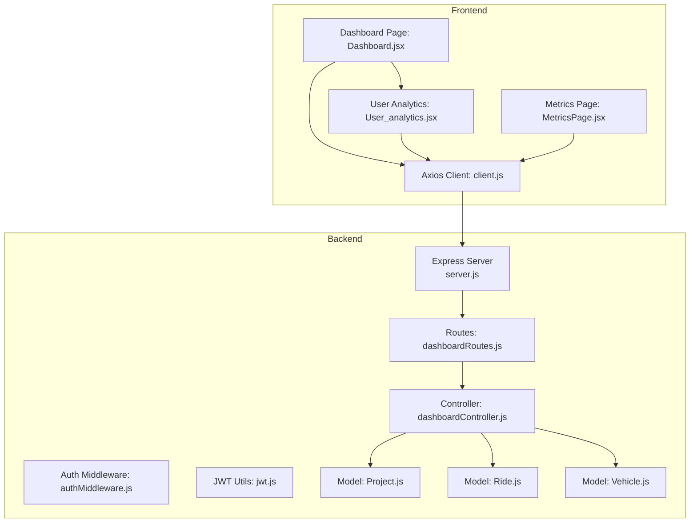
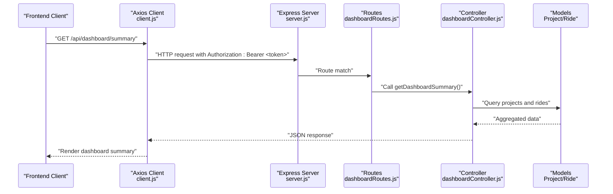
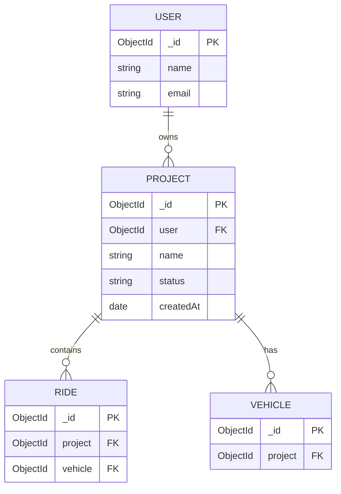
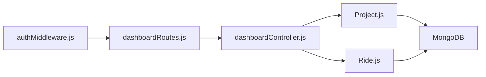

# Dashboard and Analytics API

<cite>
**Referenced Files in This Document**
- [server.js](file://backend/server.js)
- [.env](file://backend/.env)
- [dashboardRoutes.js](file://backend/routes/dashboardRoutes.js)
- [dashboardController.js](file://backend/controllers/dashboardController.js)
- [authMiddleware.js](file://backend/middleware/authMiddleware.js)
- [jwt.js](file://backend/utils/jwt.js)
- [client.js](file://frontend/src/api/client.js)
- [Project.js](file://backend/models/Project.js)
- [Ride.js](file://backend/models/Ride.js)
- [Vehicle.js](file://backend/models/Vehicle.js)
- [Dashboard.jsx](file://frontend/src/pages/dashboard/Dashboard.jsx)
- [User_analytics.jsx](file://frontend/src/pages/dashboard/components/User_analytics.jsx)
- [MetricsPage.jsx](file://frontend/src/pages/metrics/MetricsPage.jsx)
</cite>

## Table of Contents
1. [Introduction](#introduction)
2. [Project Structure](#project-structure)
3. [Core Components](#core-components)
4. [Architecture Overview](#architecture-overview)
5. [Detailed Component Analysis](#detailed-component-analysis)
6. [Dependency Analysis](#dependency-analysis)
7. [Performance Considerations](#performance-considerations)
8. [Troubleshooting Guide](#troubleshooting-guide)
9. [Conclusion](#conclusion)
10. [Appendices](#appendices)

## Introduction
This document provides comprehensive API documentation for the dashboard and analytics endpoints. It covers route statistics, performance metrics, vehicle utilization reports, and optimization results visualization. For each endpoint, you will find HTTP methods, URL patterns, request/response schemas, authentication requirements, parameter descriptions, and practical integration examples for both web and Flutter clients.

## Project Structure
The backend exposes REST endpoints under `/api/dashboard`. Authentication is enforced via a Bearer token. The frontend integrates with these endpoints to render dashboard summaries and analytics.

**Diagram sources**
- [server.js](file://backend/server.js#L12-L48)
- [dashboardRoutes.js](file://backend/routes/dashboardRoutes.js#L1-L9)
- [dashboardController.js](file://backend/controllers/dashboardController.js#L1-L73)
- [authMiddleware.js](file://backend/middleware/authMiddleware.js#L1-L34)
- [jwt.js](file://backend/utils/jwt.js#L1-L7)
- [Project.js](file://backend/models/Project.js#L1-L96)
- [Ride.js](file://backend/models/Ride.js#L1-L48)
- [Vehicle.js](file://backend/models/Vehicle.js#L1-L45)
- [client.js](file://frontend/src/api/client.js#L1-L14)
- [Dashboard.jsx](file://frontend/src/pages/dashboard/Dashboard.jsx#L1-L394)
- [User_analytics.jsx](file://frontend/src/pages/dashboard/components/User_analytics.jsx#L1-L132)
- [MetricsPage.jsx](file://frontend/src/pages/metrics/MetricsPage.jsx#L1-L134)

**Section sources**
- [server.js](file://backend/server.js#L12-L48)
- [dashboardRoutes.js](file://backend/routes/dashboardRoutes.js#L1-L9)

## Core Components
- Dashboard summary endpoint: aggregates counts and recent projects for the authenticated user.
- Dashboard metrics endpoint: computes cumulative savings, total time saved, number of projects, and average savings percentage across completed projects.

Key data models used:
- Project: stores user, status, metrics, and timestamps.
- Ride: stores per-vehicle optimized route steps and summary metrics.
- Vehicle: stores fleet attributes and performance history.

**Section sources**
- [dashboardController.js](file://backend/controllers/dashboardController.js#L5-L33)
- [dashboardController.js](file://backend/controllers/dashboardController.js#L36-L67)
- [Project.js](file://backend/models/Project.js#L37-L94)
- [Ride.js](file://backend/models/Ride.js#L19-L43)
- [Vehicle.js](file://backend/models/Vehicle.js#L9-L40)

## Architecture Overview
The dashboard endpoints are protected by an authentication middleware that validates a JWT Bearer token. The controller performs aggregations across Project documents and related Ride documents to produce summary analytics.

**Diagram sources**
- [client.js](file://frontend/src/api/client.js#L1-L14)
- [server.js](file://backend/server.js#L46-L48)
- [dashboardRoutes.js](file://backend/routes/dashboardRoutes.js#L6-L7)
- [dashboardController.js](file://backend/controllers/dashboardController.js#L5-L33)
- [Project.js](file://backend/models/Project.js#L37-L94)
- [Ride.js](file://backend/models/Ride.js#L19-L43)

## Detailed Component Analysis

### Authentication and Authorization
- Authentication scheme: Bearer token via Authorization header.
- Token verification: signed with a secret and validated by the middleware.
- Protected routes: all dashboard endpoints require a valid token.

Implementation highlights:
- Token extraction from Authorization header.
- JWT verification and user lookup.
- Error responses for missing or invalid tokens.

**Section sources**
- [authMiddleware.js](file://backend/middleware/authMiddleware.js#L4-L32)
- [jwt.js](file://backend/utils/jwt.js#L3-L5)
- [client.js](file://frontend/src/api/client.js#L8-L12)

### Endpoint Catalog

#### GET /api/dashboard/summary
- Purpose: Retrieve dashboard summary for the authenticated user.
- Authentication: Required (Bearer token).
- Response fields:
  - user: name, email, role
  - stats: projectsCount, completedCount, ridesCount
  - recentProjects: array of projects with name, status, metrics, createdAt
- Filtering/sorting: No query parameters; returns recent projects sorted by creation time descending.
- Notes: ridesCount is derived from rides linked to the user’s projects.

**Section sources**
- [dashboardRoutes.js](file://backend/routes/dashboardRoutes.js#L6-L7)
- [dashboardController.js](file://backend/controllers/dashboardController.js#L5-L33)
- [Project.js](file://backend/models/Project.js#L37-L94)
- [Ride.js](file://backend/models/Ride.js#L19-L43)

#### GET /api/dashboard/metrics
- Purpose: Compute aggregated optimization metrics for the authenticated user.
- Authentication: Required (Bearer token).
- Response fields:
  - totalSavings: sum of savings across completed projects
  - totalProjects: count of projects
  - totalTimeSaved: sum of baselineTimeMinutes minus totalTimeMinutes for projects with baseline > 0
  - avgSavingsPercent: average savingsPercent among projects with positive savingsPercent
- Aggregation logic:
  - Iterates over projects, sums numeric metrics from Project.metrics.
  - Computes time saved only when baseline exceeds zero.
  - Averages savings percent only over projects with valid positive percentages.

**Section sources**
- [dashboardRoutes.js](file://backend/routes/dashboardRoutes.js#L6-L7)
- [dashboardController.js](file://backend/controllers/dashboardController.js#L36-L67)
- [Project.js](file://backend/models/Project.js#L56-L64)

### Data Models Used by Analytics

**Diagram sources**
- [Project.js](file://backend/models/Project.js#L37-L94)
- [Ride.js](file://backend/models/Ride.js#L19-L43)
- [Vehicle.js](file://backend/models/Vehicle.js#L9-L40)

### Frontend Integration Examples

- Web (React):
  - Axios client automatically attaches the Bearer token from localStorage.
  - Dashboard page fetches projects and renders a summary card with aggregated metrics.
  - User analytics component displays four KPIs: Total Savings, Projects Optimized, Total Time Saved, Average Savings.

- Flutter:
  - The backend supports Flutter web and Android emulators via CORS configuration.
  - The frontend dashboard mirrors the web analytics layout and navigation to metrics.

Practical integration guidelines:
- Store the JWT token in secure storage and attach it to all protected requests.
- Paginate or filter project lists on the client side if needed; the summary endpoint does not accept query parameters.
- Render metrics in stat cards and link to a dedicated metrics page for deeper visualizations.

**Section sources**
- [client.js](file://frontend/src/api/client.js#L1-L14)
- [Dashboard.jsx](file://frontend/src/pages/dashboard/Dashboard.jsx#L208-L227)
- [User_analytics.jsx](file://frontend/src/pages/dashboard/components/User_analytics.jsx#L51-L129)
- [MetricsPage.jsx](file://frontend/src/pages/metrics/MetricsPage.jsx#L42-L131)

### Parameter Reference

- None for GET /api/dashboard/summary:
  - No query parameters supported.
  - Sorting is implicit by createdAt descending for recent projects.
- None for GET /api/dashboard/metrics:
  - No query parameters supported.
  - Aggregations are computed server-side across the authenticated user’s projects.

[No sources needed since this section summarizes parameter behavior already covered above]

## Dependency Analysis

**Diagram sources**
- [authMiddleware.js](file://backend/middleware/authMiddleware.js#L1-L34)
- [dashboardRoutes.js](file://backend/routes/dashboardRoutes.js#L1-L9)
- [dashboardController.js](file://backend/controllers/dashboardController.js#L1-L73)
- [Project.js](file://backend/models/Project.js#L1-L96)
- [Ride.js](file://backend/models/Ride.js#L1-L48)

**Section sources**
- [dashboardController.js](file://backend/controllers/dashboardController.js#L8-L18)
- [Project.js](file://backend/models/Project.js#L37-L94)
- [Ride.js](file://backend/models/Ride.js#L19-L43)

## Performance Considerations
- Aggregation queries:
  - The summary endpoint uses Promise.all to concurrently fetch counts and recent projects.
  - The metrics endpoint iterates over projects; consider limiting the number of returned projects or adding server-side pagination if datasets grow large.
- Database indexing:
  - Ride and Vehicle schemas include indexes on project to speed up dashboard queries.
- Payload sizes:
  - Responses are lightweight JSON objects suitable for frequent polling.
- CORS and caching:
  - Configure appropriate cache headers on the client for static dashboards.
  - Ensure CORS origins are restricted in production environments.

**Section sources**
- [dashboardController.js](file://backend/controllers/dashboardController.js#L8-L18)
- [Ride.js](file://backend/models/Ride.js#L45-L46)
- [Vehicle.js](file://backend/models/Vehicle.js#L42-L43)

## Troubleshooting Guide
Common issues and resolutions:
- 401 Unauthorized:
  - Cause: Missing or invalid Bearer token.
  - Resolution: Re-authenticate and store the new token; ensure Authorization header is present.
- 403 Forbidden:
  - Cause: Misconfigured CORS or origin mismatch.
  - Resolution: Verify allowed origins in server configuration and ensure the frontend origin matches.
- Empty or stale metrics:
  - Cause: Projects without populated metrics or not yet completed.
  - Resolution: Trigger a successful optimization run; metrics appear after completion.
- Large response times:
  - Cause: Unindexed queries or large datasets.
  - Resolution: Add pagination, leverage existing indexes, or precompute aggregates.

**Section sources**
- [authMiddleware.js](file://backend/middleware/authMiddleware.js#L12-L32)
- [server.js](file://backend/server.js#L26-L41)
- [dashboardController.js](file://backend/controllers/dashboardController.js#L36-L67)

## Conclusion
The dashboard and analytics endpoints provide a focused set of lightweight APIs to power route optimization insights. They rely on robust authentication, efficient aggregations, and clear data models. Integrating these endpoints into web and Flutter clients enables real-time visibility into savings, time saved, and project performance.

## Appendices

### API Definition

- Base URL
  - http://localhost:5001 (default development)
  - Environment variable overrides are supported.

- Authentication
  - Header: Authorization: Bearer <token>
  - Token stored in frontend localStorage and attached automatically by the client interceptor.

- Endpoints

  - GET /api/dashboard/summary
    - Headers: Authorization: Bearer <token>
    - Query parameters: none
    - Response body fields:
      - user: { name, email, role }
      - stats: { projectsCount, completedCount, ridesCount }
      - recentProjects: [{ name, status, metrics, createdAt }, ...]
    - Notes: ridesCount derived from rides linked to user’s projects.

  - GET /api/dashboard/metrics
    - Headers: Authorization: Bearer <token>
    - Query parameters: none
    - Response body fields:
      - totalSavings
      - totalProjects
      - totalTimeSaved
      - avgSavingsPercent
    - Notes: Aggregations computed from Project.metrics; time saved only when baseline > 0; average savings percent only over projects with positive percentages.

**Section sources**
- [server.js](file://backend/server.js#L18-L20)
- [.env](file://backend/.env#L1-L9)
- [client.js](file://frontend/src/api/client.js#L3-L6)
- [dashboardRoutes.js](file://backend/routes/dashboardRoutes.js#L6-L7)
- [dashboardController.js](file://backend/controllers/dashboardController.js#L5-L33)
- [dashboardController.js](file://backend/controllers/dashboardController.js#L36-L67)

### Client Implementation Guidelines

- Web (React)
  - Use the provided Axios client to send requests; it injects the Bearer token automatically.
  - On the dashboard page, fetch projects and compute metrics locally for quick rendering.
  - Link analytics cards to the metrics page for deeper visualizations.

- Flutter
  - Ensure CORS allows Flutter web and Android emulator origins.
  - Persist the JWT securely and reuse it across requests.
  - Mirror the web dashboard layout and navigation patterns.

**Section sources**
- [client.js](file://frontend/src/api/client.js#L1-L14)
- [Dashboard.jsx](file://frontend/src/pages/dashboard/Dashboard.jsx#L208-L227)
- [MetricsPage.jsx](file://frontend/src/pages/metrics/MetricsPage.jsx#L42-L131)
- [server.js](file://backend/server.js#L26-L41)