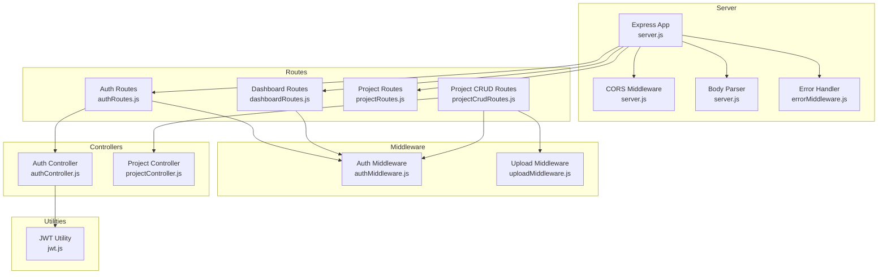
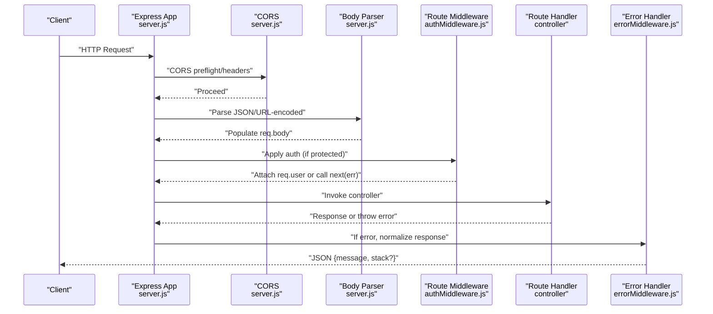
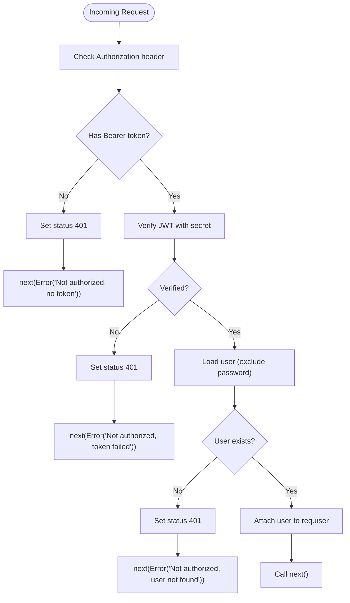
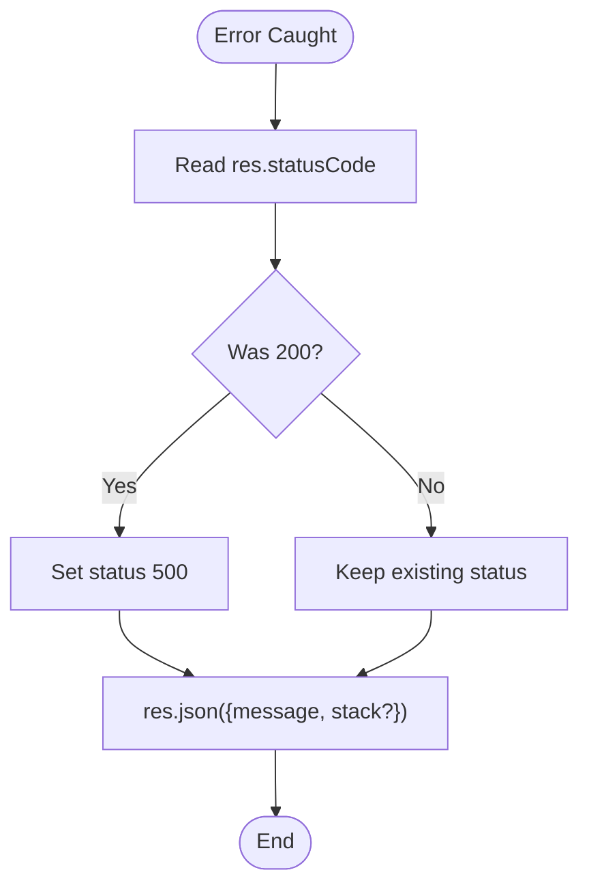
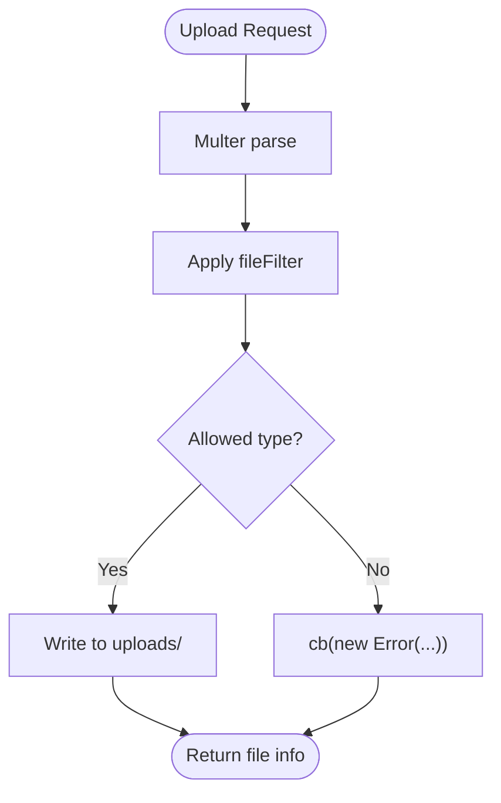
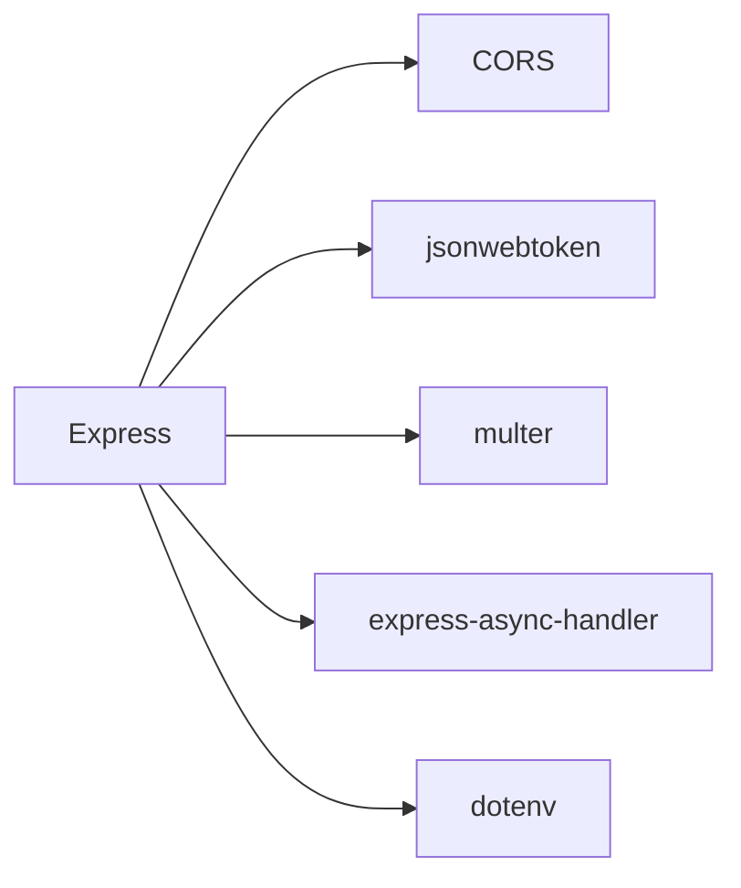

# Middleware and Error Handling

<cite>
**Referenced Files in This Document**
- [server.js](file://backend/server.js)
- [authMiddleware.js](file://backend/middleware/authMiddleware.js)
- [errorMiddleware.js](file://backend/middleware/errorMiddleware.js)
- [uploadMiddleware.js](file://backend/middleware/uploadMiddleware.js)
- [jwt.js](file://backend/utils/jwt.js)
- [authRoutes.js](file://backend/routes/authRoutes.js)
- [dashboardRoutes.js](file://backend/routes/dashboardRoutes.js)
- [projectRoutes.js](file://backend/routes/projectRoutes.js)
- [projectCrudRoutes.js](file://backend/routes/projectCrudRoutes.js)
- [authController.js](file://backend/controllers/authController.js)
- [projectController.js](file://backend/controllers/projectController.js)
- [.env](file://backend/.env)
- [package.json](file://backend/package.json)
</cite>

## Table of Contents
1. [Introduction](#introduction)
2. [Project Structure](#project-structure)
3. [Core Components](#core-components)
4. [Architecture Overview](#architecture-overview)
5. [Detailed Component Analysis](#detailed-component-analysis)
6. [Dependency Analysis](#dependency-analysis)
7. [Performance Considerations](#performance-considerations)
8. [Troubleshooting Guide](#troubleshooting-guide)
9. [Conclusion](#conclusion)

## Introduction
This document explains the middleware stack and error handling mechanisms in the backend service. It focuses on:
- Authentication middleware for protecting routes
- Error handling middleware for consistent error responses
- File upload middleware for processing multipart/form-data
- Middleware execution order and patterns
- Security middleware (CORS) and request preprocessing
- Custom error propagation strategies and debugging techniques

## Project Structure
The backend is an Express application that mounts route groups and applies middleware globally and per-route. Key middleware and routing files are organized as follows:
- server.js: Application bootstrap, CORS, body parsing, route mounting, and error handler registration
- middleware/: Authentication, error handling, and upload middleware
- routes/: Route groups and route handlers
- controllers/: Business logic implementing endpoints
- utils/: JWT token generation utility
- .env: Environment variables including secrets and feature flags
- package.json: Dependencies including Express, CORS, Multer, JSON Web Token, and async error handling

**Diagram sources**
- [server.js](file://backend/server.js#L1-L56)
- [authMiddleware.js](file://backend/middleware/authMiddleware.js#L1-L34)
- [errorMiddleware.js](file://backend/middleware/errorMiddleware.js#L1-L12)
- [uploadMiddleware.js](file://backend/middleware/uploadMiddleware.js#L1-L35)
- [authRoutes.js](file://backend/routes/authRoutes.js#L1-L13)
- [dashboardRoutes.js](file://backend/routes/dashboardRoutes.js#L1-L9)
- [projectRoutes.js](file://backend/routes/projectRoutes.js#L1-L11)
- [projectCrudRoutes.js](file://backend/routes/projectCrudRoutes.js#L1-L18)
- [authController.js](file://backend/controllers/authController.js#L1-L108)
- [projectController.js](file://backend/controllers/projectController.js#L1-L117)
- [jwt.js](file://backend/utils/jwt.js#L1-L7)

**Section sources**
- [server.js](file://backend/server.js#L1-L56)
- [package.json](file://backend/package.json#L1-L28)

## Core Components
- Authentication middleware: Validates Bearer tokens and attaches user context to requests
- Error handling middleware: Ensures consistent JSON error responses and safe stack exposure
- Upload middleware: Configured Multer for secure file ingestion with filters and limits
- CORS middleware: Controlled origins, credentials, methods, and headers
- Request preprocessing: Body parsing with size limits and upload directory creation

Key behaviors:
- Authentication middleware sets req.user when valid; otherwise delegates to error handler
- Error handler normalizes status codes and returns message plus stack in non-production
- Upload middleware enforces allowed file types and size limits
- CORS allows cross-origin requests from configured origins and credentials

**Section sources**
- [authMiddleware.js](file://backend/middleware/authMiddleware.js#L1-L34)
- [errorMiddleware.js](file://backend/middleware/errorMiddleware.js#L1-L12)
- [uploadMiddleware.js](file://backend/middleware/uploadMiddleware.js#L1-L35)
- [server.js](file://backend/server.js#L26-L43)

## Architecture Overview
The middleware stack executes in a defined order:
1. CORS and pre-flight handling
2. Body parsing (JSON and URL-encoded)
3. Route-specific middleware (authentication)
4. Route handlers (controllers)
5. Global error handler (last middleware)

**Diagram sources**
- [server.js](file://backend/server.js#L26-L51)
- [authMiddleware.js](file://backend/middleware/authMiddleware.js#L4-L32)
- [errorMiddleware.js](file://backend/middleware/errorMiddleware.js#L1-L10)

## Detailed Component Analysis

### Authentication Middleware
Purpose:
- Extract Bearer token from Authorization header
- Verify token against secret
- Load user and attach to req.user
- Propagate errors via next() when unauthorized

Execution flow:
- If no token, respond 401 and call next(new Error(...))
- If token invalid/expired, respond 401 and call next(new Error(...))
- On success, attach user and call next()

**Diagram sources**
- [authMiddleware.js](file://backend/middleware/authMiddleware.js#L4-L32)

Security and correctness:
- Uses environment-secret for signing and verification
- Attaches only non-sensitive user fields to request context
- Returns 401 for missing/invalid/unauthorized conditions

Integration:
- Mounted on protected routes via route-level middleware
- Used by auth routes and dashboard routes

**Section sources**
- [authMiddleware.js](file://backend/middleware/authMiddleware.js#L1-L34)
- [authRoutes.js](file://backend/routes/authRoutes.js#L10-L10)
- [dashboardRoutes.js](file://backend/routes/dashboardRoutes.js#L6-L7)

### Error Handling Middleware
Purpose:
- Normalize error responses
- Respect existing status codes or default to 500
- Conditionally expose stack traces based on environment

Behavior:
- If status is 200, treat as internal error and set 500
- Respond with JSON containing message and stack (non-production)
- Ensure next() is called to propagate error to default handler if needed

**Diagram sources**
- [errorMiddleware.js](file://backend/middleware/errorMiddleware.js#L1-L10)

Operational notes:
- Stack trace is hidden in production for security
- Intended to be registered last to catch unhandled errors

**Section sources**
- [errorMiddleware.js](file://backend/middleware/errorMiddleware.js#L1-L12)
- [server.js](file://backend/server.js#L50-L51)

### File Upload Middleware
Purpose:
- Securely accept multipart/form-data with controlled file types and sizes
- Persist files to disk with sanitized filenames

Configuration highlights:
- Storage: Disk storage with dynamic filenames
- Filters: Allow Excel, CSV, PDF, images, plain text, and JSON
- Limits: Max file size configured
- Error callback: Throws descriptive error for unsupported types

Usage pattern:
- Apply as route-level middleware for endpoints requiring uploads
- Combine with authentication for protected uploads

**Diagram sources**
- [uploadMiddleware.js](file://backend/middleware/uploadMiddleware.js#L4-L33)

Security and correctness:
- Enforces allowed MIME types and extensions
- Applies strict size limits
- Sanitized filenames prevent path traversal issues

**Section sources**
- [uploadMiddleware.js](file://backend/middleware/uploadMiddleware.js#L1-L35)

### CORS Configuration
Purpose:
- Enable controlled cross-origin requests for development and production

Configuration highlights:
- Origins: Localhost ports for Vite and Flutter web, Android emulator, plus optional environment overrides
- Credentials: Enabled
- Methods: Standard HTTP verbs plus OPTIONS
- Headers: Content-Type and Authorization

Pre-flight handling:
- Explicit preflight support for wildcard routes

**Section sources**
- [server.js](file://backend/server.js#L26-L41)

### Request Preprocessing Patterns
- Body parsing: JSON and URL-encoded with large payload support
- Uploads directory: Created at startup if missing
- Environment-driven configuration: CORS origins and secrets

**Section sources**
- [server.js](file://backend/server.js#L22-L43)
- [.env](file://backend/.env#L1-L9)

### JWT Utility
Purpose:
- Generate signed JWT tokens for authenticated sessions

Behavior:
- Signs with server secret and long expiration
- Used by authentication controller to issue tokens

**Section sources**
- [jwt.js](file://backend/utils/jwt.js#L1-L7)
- [authController.js](file://backend/controllers/authController.js#L7-L15)

### Route-Level Middleware Usage
- Protected routes: Authentication middleware applied at route level
- Upload routes: Multer middleware applied at route level
- Mixed usage: Some routes combine auth and upload

Examples:
- Auth routes: GET /api/auth/me protected by authentication middleware
- Dashboard routes: GET /api/dashboard/summary and /api/dashboard/metrics protected
- Project CRUD routes: POST/GET/DELETE protected by authentication middleware

**Section sources**
- [authRoutes.js](file://backend/routes/authRoutes.js#L10-L10)
- [dashboardRoutes.js](file://backend/routes/dashboardRoutes.js#L6-L7)
- [projectCrudRoutes.js](file://backend/routes/projectCrudRoutes.js#L12-L15)

## Dependency Analysis
External dependencies relevant to middleware:
- Express: Core framework and middleware model
- CORS: Cross-origin policy enforcement
- JSONwebtoken: JWT verification and token generation
- Multer: Multipart/form-data processing
- express-async-handler: Simplifies async error propagation in controllers

**Diagram sources**
- [package.json](file://backend/package.json#L9-L22)
- [server.js](file://backend/server.js#L1-L7)

**Section sources**
- [package.json](file://backend/package.json#L1-L28)

## Performance Considerations
- Multer file size limits: Prevent excessive memory/disk usage during uploads
- Body parser limits: Cap payload sizes to avoid resource exhaustion
- JWT verification cost: Keep secret secure and avoid unnecessary re-verification
- Error handler overhead: Minimal cost; ensure it runs last to avoid masking underlying issues

## Troubleshooting Guide
Common issues and resolutions:
- 401 Unauthorized on protected routes
  - Cause: Missing or invalid Bearer token
  - Resolution: Ensure Authorization header with valid JWT; verify secret and token expiration
  - References:
    - [authMiddleware.js](file://backend/middleware/authMiddleware.js#L12-L15)
    - [authMiddleware.js](file://backend/middleware/authMiddleware.js#L28-L31)
- CORS errors
  - Cause: Origin not in allowed list
  - Resolution: Add origin to CORS_ORIGINS or environment variable; enable credentials if needed
  - References:
    - [server.js](file://backend/server.js#L27-L40)
- Upload failures
  - Cause: Unsupported file type or size exceeded
  - Resolution: Confirm MIME type and extension are allowed; reduce file size
  - References:
    - [uploadMiddleware.js](file://backend/middleware/uploadMiddleware.js#L12-L27)
    - [uploadMiddleware.js](file://backend/middleware/uploadMiddleware.js#L31-L31)
- Unexpected 200 treated as error
  - Cause: Controller did not set status but threw error
  - Resolution: Ensure controller sets appropriate status or rely on error handler normalization
  - References:
    - [errorMiddleware.js](file://backend/middleware/errorMiddleware.js#L2-L4)

Environment variables to verify:
- NODE_ENV: Controls stack trace visibility
- JWT_SECRET: Secret used for signing and verifying tokens
- GOOGLE_CLIENT_ID: Required for Google authentication flow
- CORS_ORIGINS: Comma-separated allowed origins for production

**Section sources**
- [errorMiddleware.js](file://backend/middleware/errorMiddleware.js#L7-L8)
- [authMiddleware.js](file://backend/middleware/authMiddleware.js#L18-L18)
- [uploadMiddleware.js](file://backend/middleware/uploadMiddleware.js#L31-L31)
- [.env](file://backend/.env#L1-L9)

## Conclusion
The middleware stack provides a robust foundation for authentication, secure uploads, and consistent error handling. Authentication middleware protects routes by validating JWTs and attaching user context. The error handler ensures uniform responses across the API. Multer manages file ingestion safely with strict filters and limits. CORS is configured for development and production environments. Following the documented patterns enables secure, maintainable middleware customization and reliable debugging.