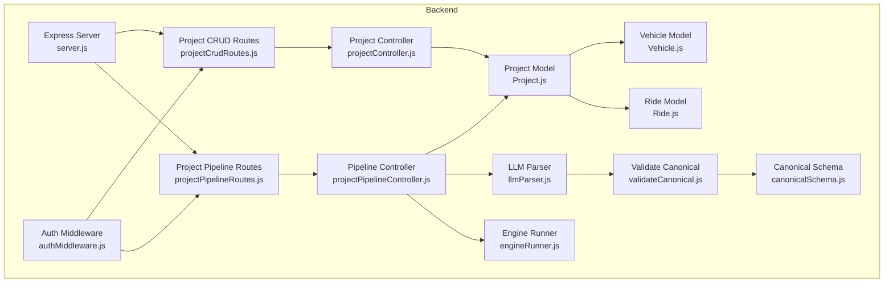
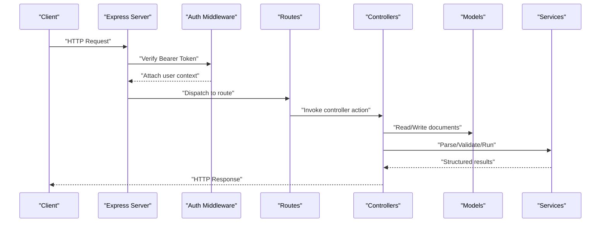
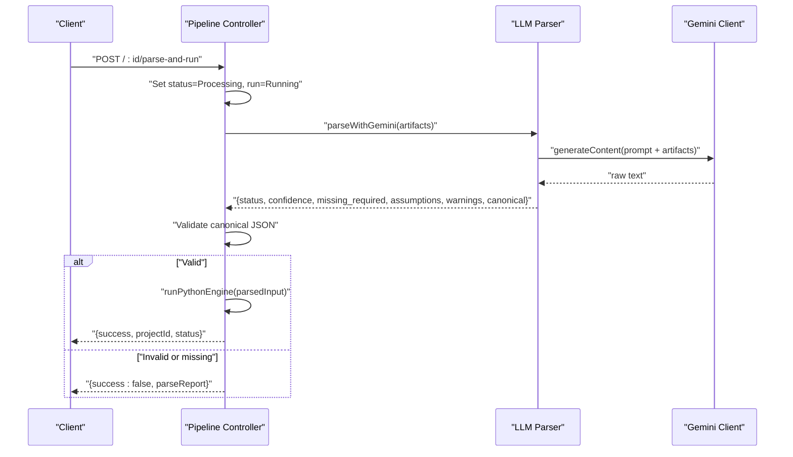
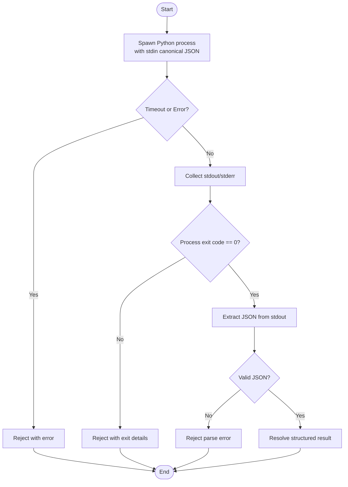
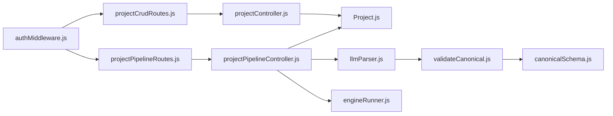

# Project Management API

<cite>
**Referenced Files in This Document**
- [server.js](file://backend/server.js)
- [authMiddleware.js](file://backend/middleware/authMiddleware.js)
- [projectCrudRoutes.js](file://backend/routes/projectCrudRoutes.js)
- [projectPipelineRoutes.js](file://backend/routes/projectPipelineRoutes.js)
- [projectController.js](file://backend/controllers/projectController.js)
- [projectPipelineController.js](file://backend/controllers/projectPipelineController.js)
- [Project.js](file://backend/models/Project.js)
- [Vehicle.js](file://backend/models/Vehicle.js)
- [Ride.js](file://backend/models/Ride.js)
- [llmParser.js](file://backend/services/llmParser.js)
- [validateCanonical.js](file://backend/validation/validateCanonical.js)
- [canonicalSchema.js](file://backend/validation/canonicalSchema.js)
- [engineRunner.js](file://backend/services/engineRunner.js)
- [client.js](file://frontend/src/api/client.js)
</cite>

## Table of Contents
1. [Introduction](#introduction)
2. [Project Structure](#project-structure)
3. [Core Components](#core-components)
4. [Architecture Overview](#architecture-overview)
5. [Detailed Component Analysis](#detailed-component-analysis)
6. [Dependency Analysis](#dependency-analysis)
7. [Performance Considerations](#performance-considerations)
8. [Troubleshooting Guide](#troubleshooting-guide)
9. [Conclusion](#conclusion)
10. [Appendices](#appendices)

## Introduction
This document provides comprehensive API documentation for the project management endpoints. It covers CRUD operations for projects, lifecycle management endpoints, pipeline execution triggers, and status tracking. For each endpoint, you will find HTTP methods, URL patterns, request/response schemas, authentication requirements, validation rules, and business logic. Practical examples, client implementation guidelines, and integration patterns with the optimization engine are included.

## Project Structure
The backend exposes REST endpoints under `/api/projects`. Authentication is enforced via a Bearer token. The project lifecycle integrates ingestion, parsing, validation, engine execution, and result retrieval.

**Diagram sources**
- [server.js](file://backend/server.js#L12-L48)
- [authMiddleware.js](file://backend/middleware/authMiddleware.js#L4-L32)
- [projectCrudRoutes.js](file://backend/routes/projectCrudRoutes.js#L1-L17)
- [projectPipelineRoutes.js](file://backend/routes/projectPipelineRoutes.js#L1-L31)
- [projectController.js](file://backend/controllers/projectController.js#L1-L117)
- [projectPipelineController.js](file://backend/controllers/projectPipelineController.js#L1-L216)
- [Project.js](file://backend/models/Project.js#L37-L94)
- [Vehicle.js](file://backend/models/Vehicle.js#L9-L40)
- [Ride.js](file://backend/models/Ride.js#L19-L43)
- [llmParser.js](file://backend/services/llmParser.js#L138-L170)
- [validateCanonical.js](file://backend/validation/validateCanonical.js#L10-L16)
- [canonicalSchema.js](file://backend/validation/canonicalSchema.js#L1-L105)
- [engineRunner.js](file://backend/services/engineRunner.js#L21-L71)

**Section sources**
- [server.js](file://backend/server.js#L12-L48)
- [authMiddleware.js](file://backend/middleware/authMiddleware.js#L4-L32)

## Core Components
- Authentication middleware enforces Bearer token validation and attaches user context to requests.
- Project CRUD routes handle creation, listing, retrieval, and deletion of projects.
- Pipeline routes handle artifact ingestion, parsing + run, and result retrieval.
- Project model defines lifecycle fields, metrics, artifacts, parsed input, parse report, run state, and results.
- Validation ensures canonical JSON conforms to a strict schema.
- Engine runner executes the Python optimization engine and extracts structured results.

**Section sources**
- [authMiddleware.js](file://backend/middleware/authMiddleware.js#L4-L32)
- [projectCrudRoutes.js](file://backend/routes/projectCrudRoutes.js#L12-L15)
- [projectPipelineRoutes.js](file://backend/routes/projectPipelineRoutes.js#L14-L29)
- [Project.js](file://backend/models/Project.js#L37-L94)
- [validateCanonical.js](file://backend/validation/validateCanonical.js#L10-L16)
- [canonicalSchema.js](file://backend/validation/canonicalSchema.js#L1-L105)
- [engineRunner.js](file://backend/services/engineRunner.js#L21-L71)

## Architecture Overview
The project management API follows a layered architecture:
- HTTP layer: Express routes define endpoints.
- Controller layer: Request handlers orchestrate business logic.
- Service layer: LLM parsing, validation, and engine execution.
- Persistence layer: Mongoose models for Project, Vehicle, and Ride.
- Cross-cutting concerns: Authentication, error handling, and uploads.

**Diagram sources**
- [server.js](file://backend/server.js#L12-L48)
- [authMiddleware.js](file://backend/middleware/authMiddleware.js#L4-L32)
- [projectCrudRoutes.js](file://backend/routes/projectCrudRoutes.js#L1-L17)
- [projectPipelineRoutes.js](file://backend/routes/projectPipelineRoutes.js#L1-L31)
- [projectController.js](file://backend/controllers/projectController.js#L1-L117)
- [projectPipelineController.js](file://backend/controllers/projectPipelineController.js#L1-L216)
- [Project.js](file://backend/models/Project.js#L37-L94)
- [llmParser.js](file://backend/services/llmParser.js#L138-L170)
- [validateCanonical.js](file://backend/validation/validateCanonical.js#L10-L16)
- [engineRunner.js](file://backend/services/engineRunner.js#L21-L71)

## Detailed Component Analysis

### Authentication and Authorization
- Method: None (enforced by middleware)
- Behavior: Extracts Bearer token from Authorization header, verifies JWT, loads user without password, attaches to request.
- Errors: 401 Not authorized if token missing/expired/user not found.

**Section sources**
- [authMiddleware.js](file://backend/middleware/authMiddleware.js#L4-L32)

### Project CRUD Endpoints

#### Create Project
- Method: POST
- URL: /api/projects
- Auth: Required
- Request body:
  - name: string (required)
- Response:
  - Project document with initial status "Pending", empty requests array, zeroed metrics, and createdAt timestamp.
- Validation:
  - name must be present and non-empty.
- Business logic:
  - Associates project with authenticated user.
  - Initializes metrics and status.
- Errors:
  - 400 Bad Request if name is invalid.
  - 401/403 on auth failure.

**Section sources**
- [projectCrudRoutes.js](file://backend/routes/projectCrudRoutes.js#L12-L12)
- [projectController.js](file://backend/controllers/projectController.js#L8-L33)

#### List Projects
- Method: GET
- URL: /api/projects?limit={n}&page={p}
- Auth: Required
- Query params:
  - limit: integer, min 1, max 50 (default 10)
  - page: integer >= 1 (default 1)
- Response:
  - items: array of projects for the user
  - page, limit, total, totalPages
- Business logic:
  - Paginates results sorted by creation time descending.
- Errors:
  - 401/403 on auth failure.

**Section sources**
- [projectCrudRoutes.js](file://backend/routes/projectCrudRoutes.js#L13-L13)
- [projectController.js](file://backend/controllers/projectController.js#L35-L56)

#### Get Project by Id
- Method: GET
- URL: /api/projects/:id
- Auth: Required
- Path params:
  - id: ObjectId (required)
- Response:
  - Full project document if owned by user.
- Security:
  - Enforces ownership check against authenticated user.
- Errors:
  - 400 Bad Request for invalid ObjectId.
  - 404 Not Found if project does not exist.
  - 403 Forbidden if not owner.

**Section sources**
- [projectCrudRoutes.js](file://backend/routes/projectCrudRoutes.js#L14-L14)
- [projectController.js](file://backend/controllers/projectController.js#L58-L80)

#### Delete Project
- Method: DELETE
- URL: /api/projects/:id
- Auth: Required
- Path params:
  - id: ObjectId (required)
- Behavior:
  - Deletes associated Vehicles and Rides, then deletes the project.
- Security:
  - Enforces ownership check.
- Response:
  - { success: true }
- Errors:
  - 400/404/403 similar to get by id.

**Section sources**
- [projectCrudRoutes.js](file://backend/routes/projectCrudRoutes.js#L15-L15)
- [projectController.js](file://backend/controllers/projectController.js#L82-L110)

### Project Lifecycle and Pipeline Endpoints

#### Ingest Artifacts
- Method: POST
- URL: /api/projects/:id/ingest
- Auth: Required
- Path params:
  - id: ObjectId (required)
- Body:
  - multipart/form-data with arbitrary files and optional notes (text/plain).
- Behavior:
  - Validates project ownership.
  - Appends uploaded files and notes as input artifacts.
- Response:
  - { success: true, artifactsCount }
- Errors:
  - 400/404/403 on validation/ownership failures.

**Section sources**
- [projectPipelineRoutes.js](file://backend/routes/projectPipelineRoutes.js#L14-L20)
- [projectPipelineController.js](file://backend/controllers/projectPipelineController.js#L27-L63)

#### Parse and Run
- Method: POST
- URL: /api/projects/:id/parse-and-run
- Auth: Required
- Path params:
  - id: ObjectId (required)
- Behavior:
  - Sets project status to "Processing" and run state to "Running".
  - Parses artifacts via LLM to produce canonical JSON.
  - Validates canonical JSON against schema.
  - If valid, runs Python optimization engine and updates metrics/results.
  - On failure, sets status to "Failed" and records error.
- Response:
  - Success: { success: true, projectId, status }
  - Needs review: { success: true, message, parseReport, parsedInput }
  - Parse failure: { success: false, parseReport }
  - Engine error: { success: false, error }
- Errors:
  - 400/404/403 on validation/ownership failures.
  - 500 on engine/runtime errors.

**Section sources**
- [projectPipelineRoutes.js](file://backend/routes/projectPipelineRoutes.js#L22-L23)
- [projectPipelineController.js](file://backend/controllers/projectPipelineController.js#L65-L171)

#### Get Parsed Input
- Method: GET
- URL: /api/projects/:id/input
- Auth: Required
- Path params:
  - id: ObjectId (required)
- Response:
  - { parseReport, parsedInput }
- Errors:
  - 400/404/403 on validation/ownership failures.

**Section sources**
- [projectPipelineRoutes.js](file://backend/routes/projectPipelineRoutes.js#L25-L26)
- [projectPipelineController.js](file://backend/controllers/projectPipelineController.js#L173-L189)

#### Get Results
- Method: GET
- URL: /api/projects/:id/results
- Auth: Required
- Path params:
  - id: ObjectId (required)
- Response:
  - { status, run, metrics, results }
- Errors:
  - 400/404/403 on validation/ownership failures.

**Section sources**
- [projectPipelineRoutes.js](file://backend/routes/projectPipelineRoutes.js#L28-L29)
- [projectPipelineController.js](file://backend/controllers/projectPipelineController.js#L192-L214)

### Data Models and Validation

#### Project Model
- Fields:
  - user: ObjectId reference to User
  - name: string
  - status: enum ["Pending","Processing","Completed","Failed"]
  - requests: array of embedded EmployeeRequest
  - metrics: object with numeric totals and percentages
  - inputArtifacts: array of InputArtifact
  - parsedInput: mixed canonical JSON
  - parseReport: structured report with status, confidence, missing, assumptions, warnings
  - run: state machine with timestamps and error
  - results: mixed engine output
  - createdAt: timestamp
- Embedded schemas:
  - PointSchema: lat, lng, address
  - EmployeeRequestSchema: identifiers, priority, pickup/dropoff points, timeWindow, preferences
  - InputArtifactSchema: file/text metadata and storage path

**Section sources**
- [Project.js](file://backend/models/Project.js#L3-L94)

#### Canonical JSON Schema
- Purpose: Defines required and optional fields for optimization engine consumption.
- Validation:
  - Uses AJV with formats.
  - Returns ok flag and formatted error messages.
- Required top-level keys:
  - schema_version, problem_type, employees, vehicles
- Additional properties allowed.

**Section sources**
- [validateCanonical.js](file://backend/validation/validateCanonical.js#L10-L16)
- [canonicalSchema.js](file://backend/validation/canonicalSchema.js#L1-L105)

#### Vehicle and Ride Models
- Vehicle:
  - project reference, sourceId, mode, fuelType, capacity, costPerKm, specs, startLocation, availableTime
- Ride:
  - project and vehicle references, ordered path steps, metrics, assignedEmployees

**Section sources**
- [Vehicle.js](file://backend/models/Vehicle.js#L9-L40)
- [Ride.js](file://backend/models/Ride.js#L19-L43)

### Processing Logic and Workflows

#### LLM Parsing Workflow

**Diagram sources**
- [projectPipelineController.js](file://backend/controllers/projectPipelineController.js#L65-L171)
- [llmParser.js](file://backend/services/llmParser.js#L138-L170)
- [validateCanonical.js](file://backend/validation/validateCanonical.js#L10-L16)
- [engineRunner.js](file://backend/services/engineRunner.js#L21-L71)

#### Engine Execution Flow

**Diagram sources**
- [engineRunner.js](file://backend/services/engineRunner.js#L21-L71)

### API Definitions

#### Project CRUD
- POST /api/projects
  - Auth: Bearer
  - Request: { name: string }
  - Response: Project document
  - Errors: 400, 401, 403
- GET /api/projects?limit=&page=
  - Auth: Bearer
  - Query: limit (1-50), page (>=1)
  - Response: { items[], page, limit, total, totalPages }
  - Errors: 401, 403
- GET /api/projects/:id
  - Auth: Bearer
  - Path: id (ObjectId)
  - Response: Project document
  - Errors: 400, 404, 403
- DELETE /api/projects/:id
  - Auth: Bearer
  - Path: id (ObjectId)
  - Response: { success: true }
  - Errors: 400, 404, 403

**Section sources**
- [projectCrudRoutes.js](file://backend/routes/projectCrudRoutes.js#L12-L15)
- [projectController.js](file://backend/controllers/projectController.js#L8-L110)

#### Pipeline
- POST /api/projects/:id/ingest
  - Auth: Bearer
  - Path: id (ObjectId)
  - Body: multipart/form-data (files + optional notes)
  - Response: { success: true, artifactsCount }
  - Errors: 400, 404, 403
- POST /api/projects/:id/parse-and-run
  - Auth: Bearer
  - Path: id (ObjectId)
  - Response:
    - Success: { success: true, projectId, status }
    - Needs review: { success: true, message, parseReport, parsedInput }
    - Parse failure: { success: false, parseReport }
    - Engine error: { success: false, error }
  - Errors: 400, 404, 403, 500
- GET /api/projects/:id/input
  - Auth: Bearer
  - Path: id (ObjectId)
  - Response: { parseReport, parsedInput }
  - Errors: 400, 404, 403
- GET /api/projects/:id/results
  - Auth: Bearer
  - Path: id (ObjectId)
  - Response: { status, run, metrics, results }
  - Errors: 400, 404, 403

**Section sources**
- [projectPipelineRoutes.js](file://backend/routes/projectPipelineRoutes.js#L14-L29)
- [projectPipelineController.js](file://backend/controllers/projectPipelineController.js#L27-L214)

### Client Implementation Guidelines
- Authentication:
  - Store Bearer token in local storage and attach to all requests via Authorization header.
- Frontend client example:
  - Axios instance configured with base URL and credentials.
  - Interceptor adds Authorization header if token exists.
- Recommended workflow:
  - Create project, ingest artifacts, trigger parse-and-run, poll results, display metrics.

**Section sources**
- [client.js](file://frontend/src/api/client.js#L1-L14)

### Integration Patterns with Optimization Engine
- Artifact ingestion supports arbitrary files and notes; the LLM parser normalizes artifacts (Excel, PDF, images, text) into a unified prompt.
- Canonical JSON validation ensures required fields are present; missing required fields halt execution and return a structured report.
- Engine execution runs a Python script with stdin canonical JSON and captures structured output; timeouts and non-zero exits are handled gracefully.

**Section sources**
- [llmParser.js](file://backend/services/llmParser.js#L49-L101)
- [validateCanonical.js](file://backend/validation/validateCanonical.js#L10-L16)
- [engineRunner.js](file://backend/services/engineRunner.js#L21-L71)

## Dependency Analysis

**Diagram sources**
- [projectCrudRoutes.js](file://backend/routes/projectCrudRoutes.js#L1-L17)
- [projectPipelineRoutes.js](file://backend/routes/projectPipelineRoutes.js#L1-L31)
- [projectController.js](file://backend/controllers/projectController.js#L1-L117)
- [projectPipelineController.js](file://backend/controllers/projectPipelineController.js#L1-L216)
- [Project.js](file://backend/models/Project.js#L37-L94)
- [llmParser.js](file://backend/services/llmParser.js#L138-L170)
- [validateCanonical.js](file://backend/validation/validateCanonical.js#L10-L16)
- [canonicalSchema.js](file://backend/validation/canonicalSchema.js#L1-L105)
- [engineRunner.js](file://backend/services/engineRunner.js#L21-L71)
- [authMiddleware.js](file://backend/middleware/authMiddleware.js#L4-L32)

**Section sources**
- [projectCrudRoutes.js](file://backend/routes/projectCrudRoutes.js#L1-L17)
- [projectPipelineRoutes.js](file://backend/routes/projectPipelineRoutes.js#L1-L31)
- [projectController.js](file://backend/controllers/projectController.js#L1-L117)
- [projectPipelineController.js](file://backend/controllers/projectPipelineController.js#L1-L216)
- [Project.js](file://backend/models/Project.js#L37-L94)
- [llmParser.js](file://backend/services/llmParser.js#L138-L170)
- [validateCanonical.js](file://backend/validation/validateCanonical.js#L10-L16)
- [canonicalSchema.js](file://backend/validation/canonicalSchema.js#L1-L105)
- [engineRunner.js](file://backend/services/engineRunner.js#L21-L71)
- [authMiddleware.js](file://backend/middleware/authMiddleware.js#L4-L32)

## Performance Considerations
- Pagination limits: Max 50 per page for listing projects.
- Large payloads: Server accepts up to 50MB for JSON and URL-encoded bodies.
- Engine timeouts: Python engine execution is bounded by a configurable timeout; adjust as needed.
- File uploads: Ensure adequate disk space and consider cleanup policies for uploaded artifacts.

[No sources needed since this section provides general guidance]

## Troubleshooting Guide
- Authentication failures:
  - Ensure Bearer token is present and valid; verify token expiration and user existence.
- Project not found or forbidden:
  - Confirm ObjectId validity and ownership of the project.
- Parse failures:
  - Review parseReport for missing_required, assumptions, and warnings; re-ingest artifacts with clearer data.
- Engine errors:
  - Check engineRunner logs for timeout or non-zero exit codes; validate canonical JSON against schema.

**Section sources**
- [authMiddleware.js](file://backend/middleware/authMiddleware.js#L4-L32)
- [projectController.js](file://backend/controllers/projectController.js#L58-L110)
- [projectPipelineController.js](file://backend/controllers/projectPipelineController.js#L65-L171)
- [engineRunner.js](file://backend/services/engineRunner.js#L21-L71)

## Conclusion
The project management API provides a robust foundation for creating, managing, and optimizing employee transport projects. By leveraging ingestion, parsing, validation, and engine execution, teams can automate optimization workflows while maintaining strong security and clear status tracking.

[No sources needed since this section summarizes without analyzing specific files]

## Appendices

### Request/Response Schemas

- Create Project
  - Request: { name: string }
  - Response: Project document
- List Projects
  - Query: limit (1-50), page (>=1)
  - Response: { items[], page, limit, total, totalPages }
- Get Project by Id
  - Response: Project document
- Delete Project
  - Response: { success: true }
- Ingest Artifacts
  - Body: multipart/form-data (files + optional notes)
  - Response: { success: true, artifactsCount }
- Parse and Run
  - Response variants:
    - Success: { success: true, projectId, status }
    - Needs review: { success: true, message, parseReport, parsedInput }
    - Parse failure: { success: false, parseReport }
    - Engine error: { success: false, error }
- Get Parsed Input
  - Response: { parseReport, parsedInput }
- Get Results
  - Response: { status, run, metrics, results }

**Section sources**
- [projectController.js](file://backend/controllers/projectController.js#L8-L110)
- [projectPipelineController.js](file://backend/controllers/projectPipelineController.js#L27-L214)