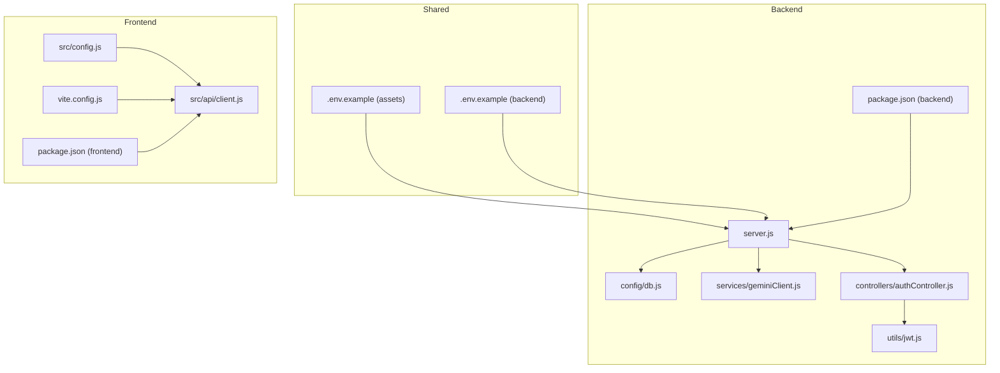
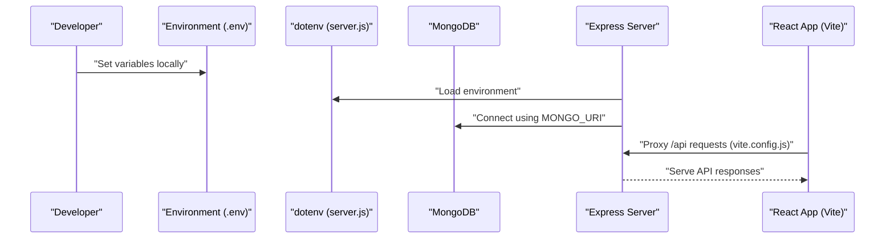
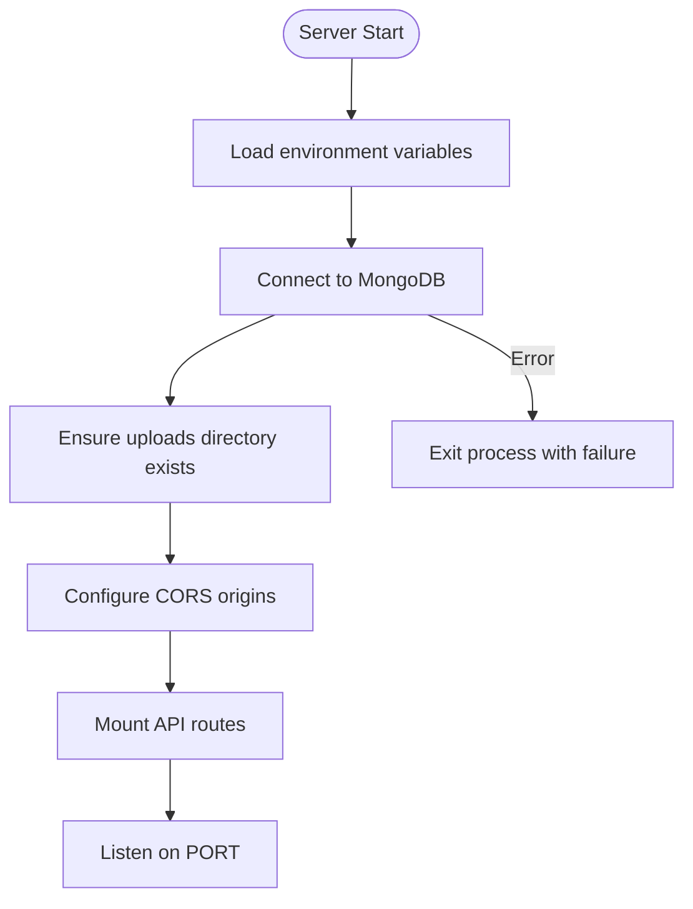
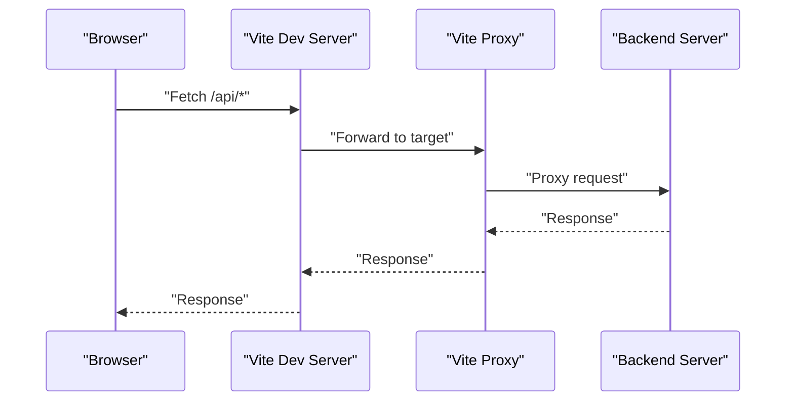
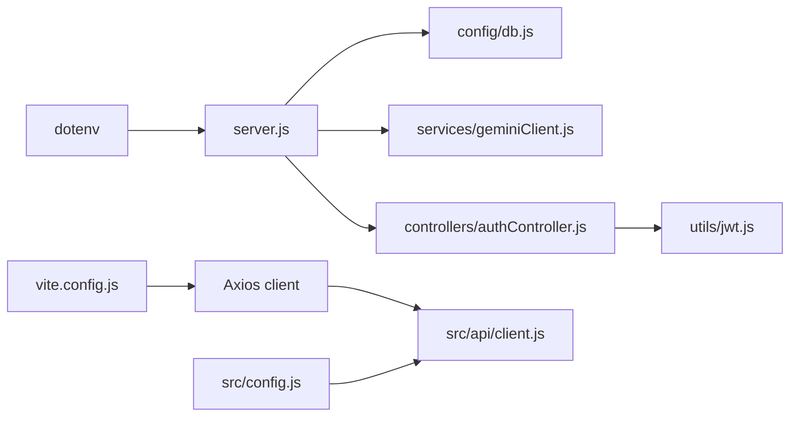

# Configuration Management

<cite>
**Referenced Files in This Document**
- [assets/.env.example](file://assets/.env.example)
- [backend/.env.example](file://backend/.env.example)
- [backend/server.js](file://backend/server.js)
- [backend/config/db.js](file://backend/config/db.js)
- [backend/services/geminiClient.js](file://backend/services/geminiClient.js)
- [backend/controllers/authController.js](file://backend/controllers/authController.js)
- [backend/utils/jwt.js](file://backend/utils/jwt.js)
- [frontend/src/config.js](file://frontend/src/config.js)
- [frontend/src/api/client.js](file://frontend/src/api/client.js)
- [frontend/vite.config.js](file://frontend/vite.config.js)
- [backend/package.json](file://backend/package.json)
- [frontend/package.json](file://frontend/package.json)
</cite>

## Table of Contents
1. [Introduction](#introduction)
2. [Project Structure](#project-structure)
3. [Core Components](#core-components)
4. [Architecture Overview](#architecture-overview)
5. [Detailed Component Analysis](#detailed-component-analysis)
6. [Dependency Analysis](#dependency-analysis)
7. [Performance Considerations](#performance-considerations)
8. [Troubleshooting Guide](#troubleshooting-guide)
9. [Conclusion](#conclusion)
10. [Appendices](#appendices)

## Introduction
This document explains how configuration is managed across the project’s backend, frontend, and shared assets. It covers environment variables, API keys, database connections, cross-platform deployment settings, and the configuration loading mechanisms in both Flutter and React applications. It also documents the configuration hierarchy between development, staging, and production environments and provides examples for setting up configuration in different deployment scenarios.

## Project Structure
The configuration surface spans three primary areas:
- Shared environment templates under assets and backend
- Backend runtime configuration and environment loading
- Frontend runtime configuration and environment variable consumption via Vite

**Diagram sources**
- [assets/.env.example](file://assets/.env.example#L1-L10)
- [backend/.env.example](file://backend/.env.example#L1-L12)
- [backend/server.js](file://backend/server.js#L1-L56)
- [backend/config/db.js](file://backend/config/db.js#L1-L18)
- [backend/services/geminiClient.js](file://backend/services/geminiClient.js#L1-L12)
- [backend/controllers/authController.js](file://backend/controllers/authController.js#L1-L108)
- [backend/utils/jwt.js](file://backend/utils/jwt.js#L1-L7)
- [frontend/src/config.js](file://frontend/src/config.js#L1-L7)
- [frontend/src/api/client.js](file://frontend/src/api/client.js#L1-L14)
- [frontend/vite.config.js](file://frontend/vite.config.js#L1-L17)
- [backend/package.json](file://backend/package.json#L1-L28)
- [frontend/package.json](file://frontend/package.json#L1-L48)

**Section sources**
- [assets/.env.example](file://assets/.env.example#L1-L10)
- [backend/.env.example](file://backend/.env.example#L1-L12)
- [backend/server.js](file://backend/server.js#L1-L56)
- [frontend/vite.config.js](file://frontend/vite.config.js#L1-L17)

## Core Components
- Environment templates:
  - assets/.env.example defines the API base URL consumed by the frontend and used during development and deployment.
  - backend/.env.example defines backend environment variables including database URI, JWT secret, Gemini API key, Google Maps API key, Google OAuth client ID, and optional CORS origins.
- Backend configuration loader:
  - server.js loads environment variables via dotenv and connects to MongoDB using MONGO_URI.
  - config/db.js centralizes the database connection with timeouts and exit-on-fail semantics.
  - services/geminiClient.js reads GEMINI_API_KEY and throws if missing.
  - controllers/authController.js reads GOOGLE_CLIENT_ID for Google OAuth verification and uses JWT_SECRET from environment for token generation.
- Frontend configuration:
  - src/config.js defines Google Maps API key and default map settings.
  - src/api/client.js constructs the Axios base URL using VITE_API_BASE and injects Authorization headers from localStorage.
  - vite.config.js proxies /api requests to the backend during development.

**Section sources**
- [assets/.env.example](file://assets/.env.example#L1-L10)
- [backend/.env.example](file://backend/.env.example#L1-L12)
- [backend/server.js](file://backend/server.js#L1-L56)
- [backend/config/db.js](file://backend/config/db.js#L1-L18)
- [backend/services/geminiClient.js](file://backend/services/geminiClient.js#L1-L12)
- [backend/controllers/authController.js](file://backend/controllers/authController.js#L1-L108)
- [backend/utils/jwt.js](file://backend/utils/jwt.js#L1-L7)
- [frontend/src/config.js](file://frontend/src/config.js#L1-L7)
- [frontend/src/api/client.js](file://frontend/src/api/client.js#L1-L14)
- [frontend/vite.config.js](file://frontend/vite.config.js#L1-L17)

## Architecture Overview
The configuration architecture separates concerns across layers:
- Environment templates provide placeholders and defaults.
- Runtime loaders populate process.env at startup.
- Services and controllers consume process.env for behavior.
- Frontend consumes Vite environment variables and proxies API calls to the backend.

**Diagram sources**
- [backend/server.js](file://backend/server.js#L1-L56)
- [backend/config/db.js](file://backend/config/db.js#L1-L18)
- [frontend/vite.config.js](file://frontend/vite.config.js#L1-L17)

## Detailed Component Analysis

### Environment Templates and Variables
- assets/.env.example
  - Defines API_URL used by the frontend during development and deployment.
  - Includes comments for Android emulator and physical device LAN IP usage.
- backend/.env.example
  - NODE_ENV, PORT, MONGO_URI, JWT_SECRET, GEMINI_API_KEY, GEMINI_MODEL, GOOGLE_MAPS_API_KEY, GOOGLE_CLIENT_ID.
  - Optional CORS_ORIGINS for production deployments.

Key environment variables and their roles:
- API_URL: Frontend base URL for API calls.
- MONGO_URI: MongoDB connection string.
- JWT_SECRET: Secret for signing JWT tokens.
- GEMINI_API_KEY: Google Generative AI API key.
- GOOGLE_MAPS_API_KEY: Google Maps JavaScript API key.
- GOOGLE_CLIENT_ID: Google OAuth client identifier for verifying ID tokens.
- CORS_ORIGINS: Comma-separated list of allowed origins in production.

**Section sources**
- [assets/.env.example](file://assets/.env.example#L1-L10)
- [backend/.env.example](file://backend/.env.example#L1-L12)

### Backend Configuration Loading and Validation
- server.js
  - Loads environment variables via dotenv.
  - Initializes database connection and ensures uploads directory exists.
  - Configures CORS with defaults for local development and optionally extends with CORS_ORIGINS.
  - Starts the Express server on PORT.
- config/db.js
  - Connects to MongoDB using MONGO_URI with timeouts and exits on failure.
- services/geminiClient.js
  - Reads GEMINI_API_KEY and throws if missing.
- controllers/authController.js
  - Validates GOOGLE_CLIENT_ID presence and uses it to verify Google ID tokens.
- utils/jwt.js
  - Uses JWT_SECRET to sign tokens.

**Diagram sources**
- [backend/server.js](file://backend/server.js#L1-L56)
- [backend/config/db.js](file://backend/config/db.js#L1-L18)

**Section sources**
- [backend/server.js](file://backend/server.js#L1-L56)
- [backend/config/db.js](file://backend/config/db.js#L1-L18)
- [backend/services/geminiClient.js](file://backend/services/geminiClient.js#L1-L12)
- [backend/controllers/authController.js](file://backend/controllers/authController.js#L1-L108)
- [backend/utils/jwt.js](file://backend/utils/jwt.js#L1-L7)

### Frontend Configuration Loading and Proxy Behavior
- src/config.js
  - Exposes GOOGLE_MAPS_API_KEY and default map center/zoom constants.
- src/api/client.js
  - Constructs baseURL using import.meta.env.VITE_API_BASE.
  - Injects Authorization header from localStorage for protected routes.
- vite.config.js
  - Proxies /api requests to the backend during development.
- package.json
  - Declares frontend dependencies including @react-google-maps/api and axios.

**Diagram sources**
- [frontend/vite.config.js](file://frontend/vite.config.js#L1-L17)
- [frontend/src/api/client.js](file://frontend/src/api/client.js#L1-L14)

**Section sources**
- [frontend/src/config.js](file://frontend/src/config.js#L1-L7)
- [frontend/src/api/client.js](file://frontend/src/api/client.js#L1-L14)
- [frontend/vite.config.js](file://frontend/vite.config.js#L1-L17)
- [frontend/package.json](file://frontend/package.json#L1-L48)

### Cross-Platform Deployment Settings
- Android Emulator: Use the documented API_URL value for the emulator host gateway.
- Physical Device: Use the machine’s LAN IP address on the same Wi-Fi network.
- Production: Set CORS_ORIGINS to your domain(s) and configure API_URL accordingly.

**Section sources**
- [assets/.env.example](file://assets/.env.example#L5-L9)
- [backend/server.js](file://backend/server.js#L26-L41)

### Configuration Hierarchy: Development, Staging, Production
- Development
  - Local backend runs on default port; frontend proxies /api to backend.
  - Default CORS origins include localhost and emulator targets.
- Staging
  - Set MONGO_URI to staging database endpoint.
  - Configure GEMINI_API_KEY and GOOGLE_MAPS_API_KEY for staging services.
  - Set CORS_ORIGINS to staging domains.
- Production
  - Use production database URI and secrets.
  - Configure CORS_ORIGINS to production domains.
  - Set API_URL to the production backend endpoint.

**Section sources**
- [backend/server.js](file://backend/server.js#L18-L41)
- [backend/.env.example](file://backend/.env.example#L1-L12)
- [assets/.env.example](file://assets/.env.example#L1-L10)

### Required Environment Variables Reference
- Backend
  - MONGO_URI: Database connection string.
  - JWT_SECRET: Secret for JWT signing.
  - GEMINI_API_KEY: Gemini AI API key.
  - GOOGLE_CLIENT_ID: Google OAuth client ID.
  - GOOGLE_MAPS_API_KEY: Google Maps API key.
  - CORS_ORIGINS: Optional, comma-separated allowed origins.
- Frontend
  - VITE_API_BASE: Used by the frontend client to construct the base URL.
  - GOOGLE_MAPS_API_KEY: Defined in src/config.js for map rendering.

**Section sources**
- [backend/.env.example](file://backend/.env.example#L1-L12)
- [backend/server.js](file://backend/server.js#L26-L41)
- [frontend/src/config.js](file://frontend/src/config.js#L1-L7)
- [frontend/src/api/client.js](file://frontend/src/api/client.js#L3-L6)

### Configuration Loading Mechanisms
- Backend
  - dotenv.config() loads variables from .env files into process.env.
  - Controllers and services read process.env directly.
- Frontend
  - Vite exposes environment variables prefixed with VITE_* at runtime.
  - The client uses import.meta.env.VITE_API_BASE to set baseURL.

**Section sources**
- [backend/server.js](file://backend/server.js#L7-L7)
- [frontend/src/api/client.js](file://frontend/src/api/client.js#L3-L6)
- [backend/package.json](file://backend/package.json#L14-L15)
- [frontend/package.json](file://frontend/package.json#L30-L42)

## Dependency Analysis
- Backend depends on dotenv for environment loading and mongoose for database connectivity.
- Frontend depends on axios for HTTP requests and Vite for environment variable exposure and proxying.
- Google Maps API key is defined in frontend configuration and used for map rendering.
- Gemini API key is consumed by backend services.

**Diagram sources**
- [backend/server.js](file://backend/server.js#L1-L56)
- [backend/config/db.js](file://backend/config/db.js#L1-L18)
- [backend/services/geminiClient.js](file://backend/services/geminiClient.js#L1-L12)
- [backend/controllers/authController.js](file://backend/controllers/authController.js#L1-L108)
- [backend/utils/jwt.js](file://backend/utils/jwt.js#L1-L7)
- [frontend/vite.config.js](file://frontend/vite.config.js#L1-L17)
- [frontend/src/api/client.js](file://frontend/src/api/client.js#L1-L14)
- [frontend/src/config.js](file://frontend/src/config.js#L1-L7)

**Section sources**
- [backend/package.json](file://backend/package.json#L14-L22)
- [frontend/package.json](file://frontend/package.json#L13-L28)

## Performance Considerations
- Fast fail on database connection errors prevents prolonged downtime.
- Socket and selection timeouts reduce hanging connections.
- CORS configuration restricts origins to improve security and reduce overhead.
- Using Vite proxy avoids preflight overhead during development.

[No sources needed since this section provides general guidance]

## Troubleshooting Guide
- MongoDB connection fails
  - Verify MONGO_URI correctness and network accessibility.
  - Check server logs for connection errors.
- Missing GEMINI_API_KEY
  - Ensure GEMINI_API_KEY is set in the environment; otherwise, client creation will throw.
- Google OAuth verification fails
  - Confirm GOOGLE_CLIENT_ID is set and matches the Google ID token audience.
- Frontend cannot reach backend
  - Ensure VITE_API_BASE is set or use Vite proxy for development.
  - Confirm API_URL in assets/.env.example matches deployment environment.

**Section sources**
- [backend/config/db.js](file://backend/config/db.js#L11-L15)
- [backend/services/geminiClient.js](file://backend/services/geminiClient.js#L5-L8)
- [backend/controllers/authController.js](file://backend/controllers/authController.js#L69-L73)
- [frontend/src/api/client.js](file://frontend/src/api/client.js#L3-L6)
- [assets/.env.example](file://assets/.env.example#L1-L10)

## Conclusion
The project’s configuration model relies on environment templates and dotenv for backend, and Vite environment variables for frontend. Clear separation of concerns enables straightforward deployment across development, staging, and production environments. Ensuring required environment variables are present and correctly scoped is essential for reliable operation.

[No sources needed since this section summarizes without analyzing specific files]

## Appendices

### Example Setup Scenarios
- Local Development
  - Copy backend/.env.example to backend/.env and set API_URL to the backend endpoint.
  - Keep VITE_API_BASE unset or match the backend URL; rely on Vite proxy.
- Android Emulator
  - Set API_URL to the documented emulator gateway value.
- Production
  - Set production MONGO_URI, JWT_SECRET, GEMINI_API_KEY, GOOGLE_MAPS_API_KEY, and GOOGLE_CLIENT_ID.
  - Configure CORS_ORIGINS to production domains and set API_URL to the production backend.

**Section sources**
- [assets/.env.example](file://assets/.env.example#L5-L9)
- [backend/.env.example](file://backend/.env.example#L1-L12)
- [backend/server.js](file://backend/server.js#L26-L41)