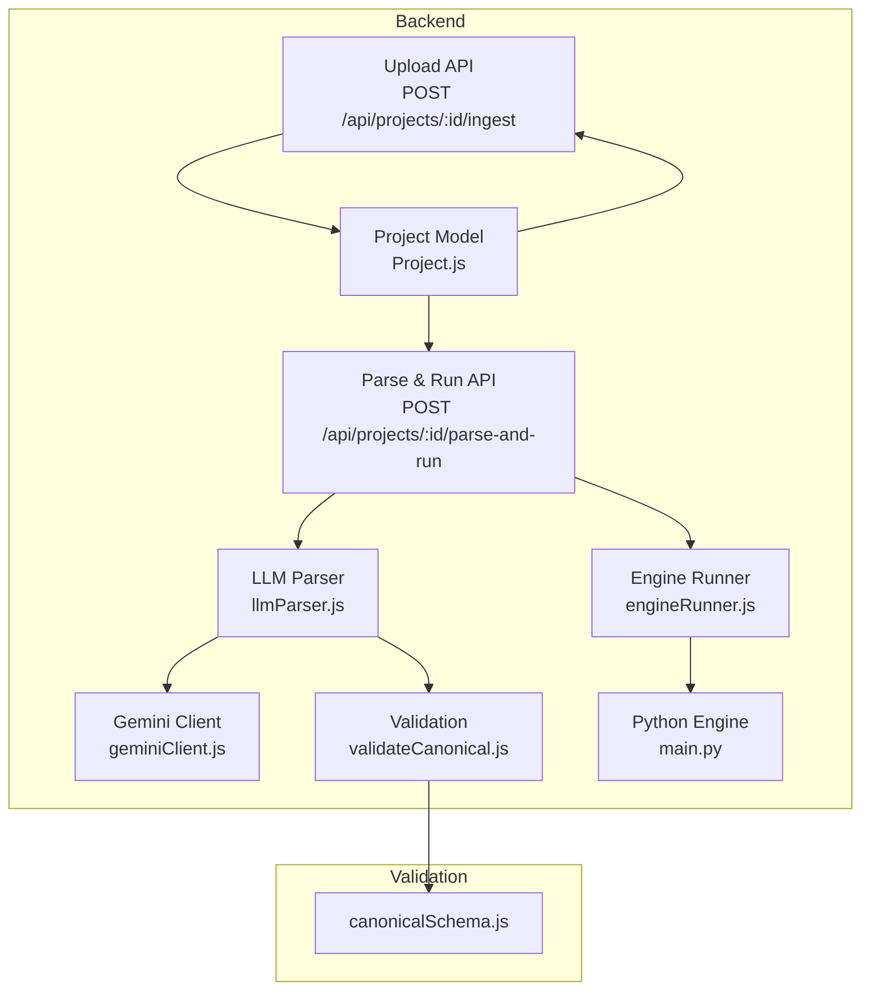
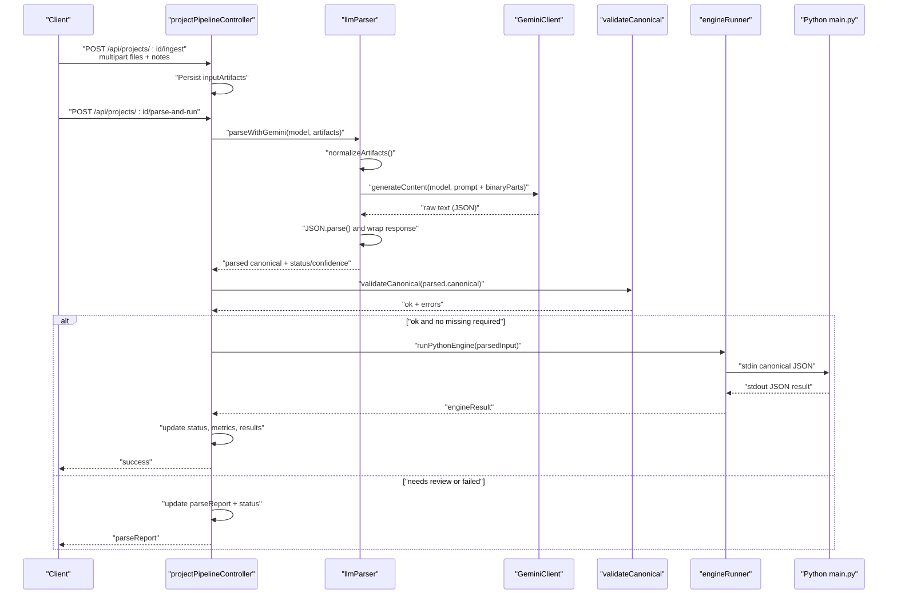
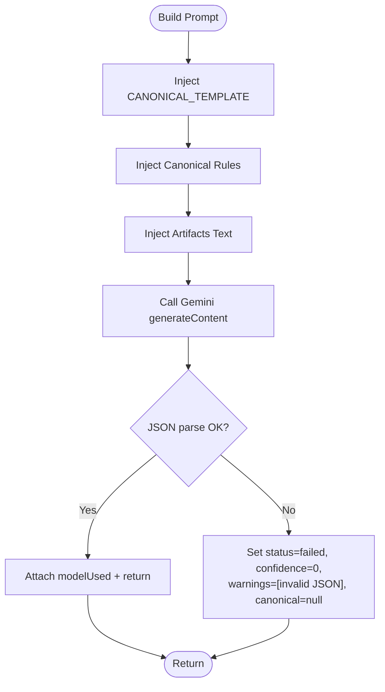
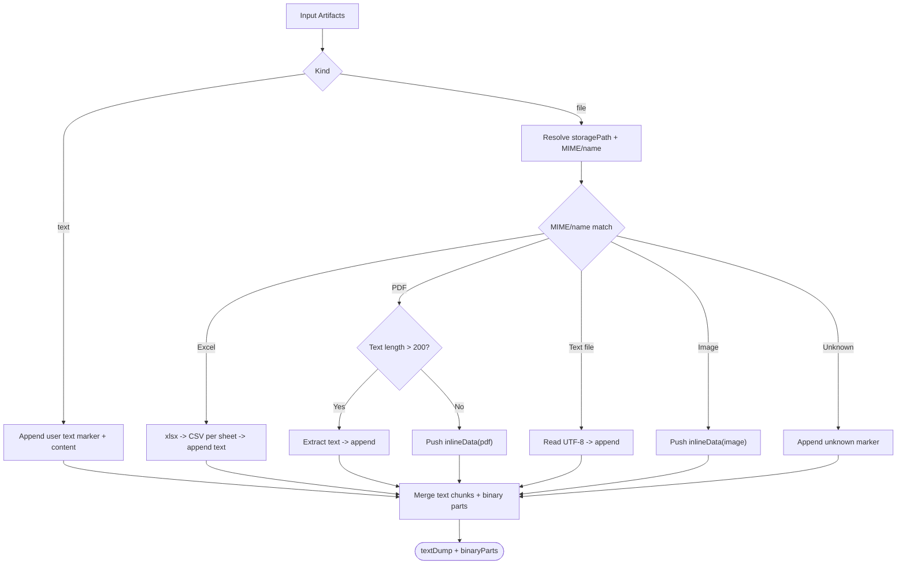
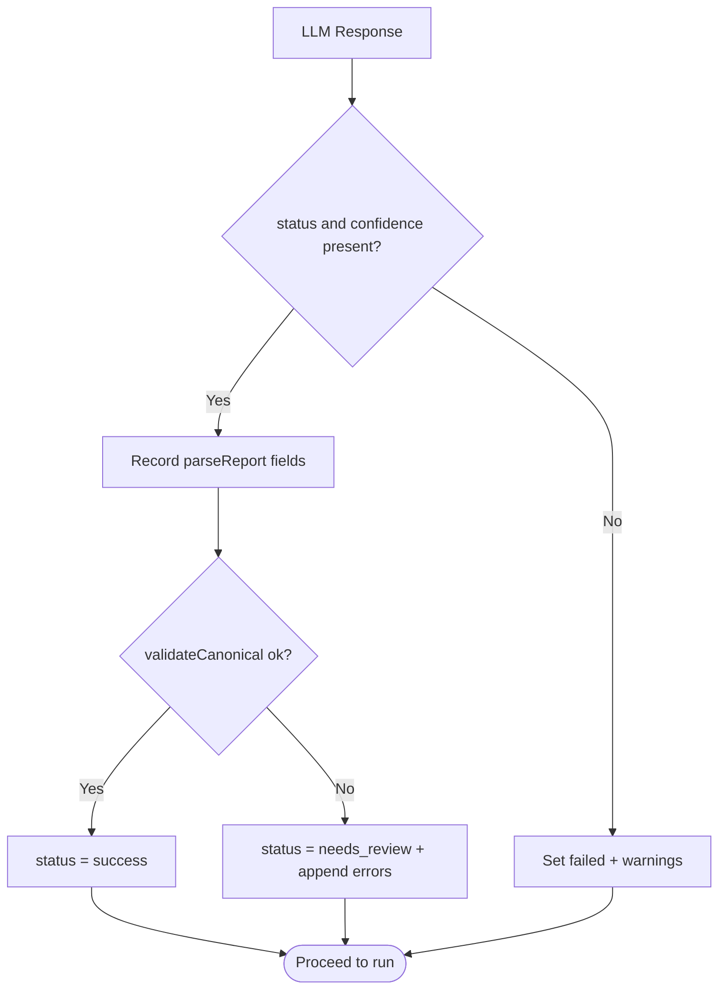
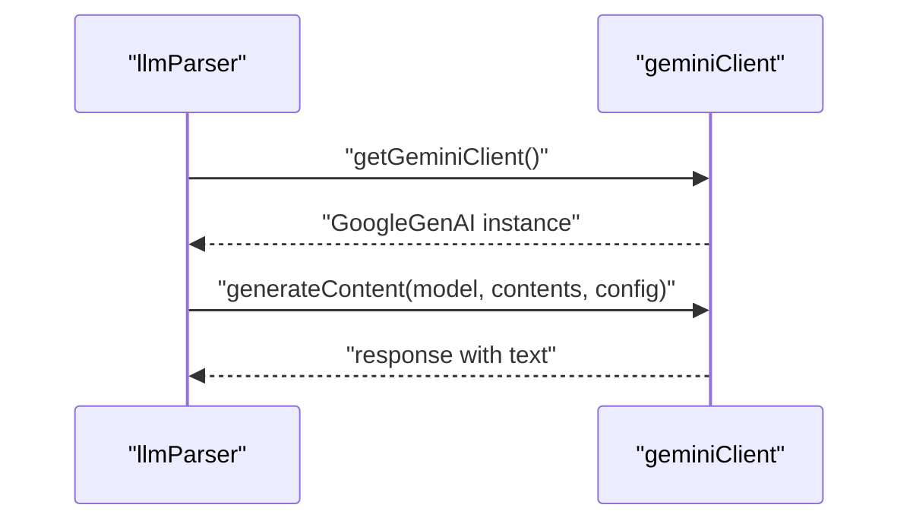
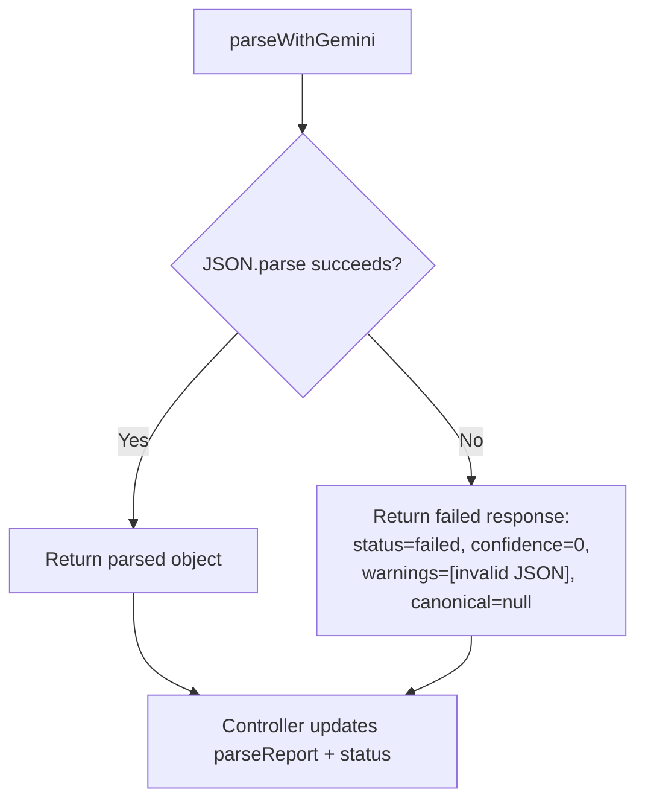
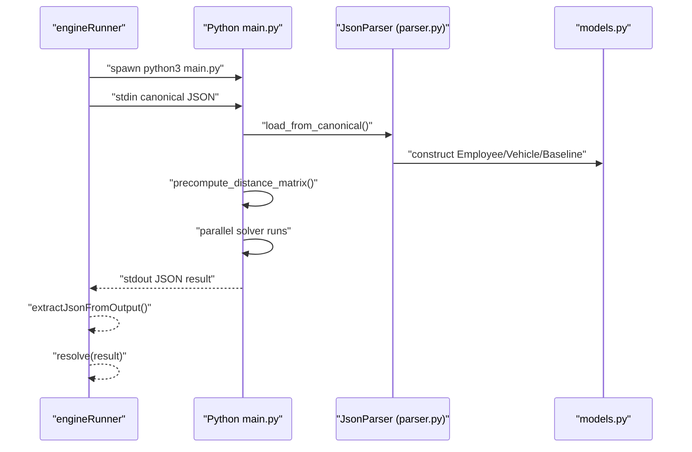
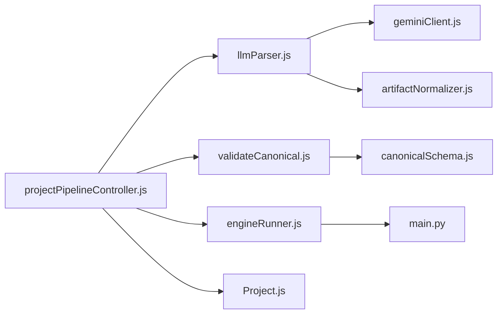

# AI-Powered Data Parsing

<cite>
**Referenced Files in This Document**
- [geminiClient.js](file://backend/services/geminiClient.js)
- [llmParser.js](file://backend/services/llmParser.js)
- [artifactNormalizer.js](file://backend/services/artifactNormalizer.js)
- [canonicalSchema.js](file://backend/validation/canonicalSchema.js)
- [validateCanonical.js](file://backend/validation/validateCanonical.js)
- [projectPipelineController.js](file://backend/controllers/projectPipelineController.js)
- [engineRunner.js](file://backend/services/engineRunner.js)
- [main.py](file://backend/engine/main.py)
- [parser.py](file://backend/engine/parser.py)
- [models.py](file://backend/engine/models.py)
- [.env](file://backend/.env)
- [Project.js](file://backend/models/Project.js)
- [PIPELINE_DOCUMENTATION.md](file://backend/engine/PIPELINE_DOCUMENTATION.md)
</cite>

## Table of Contents
1. [Introduction](#introduction)
2. [Project Structure](#project-structure)
3. [Core Components](#core-components)
4. [Architecture Overview](#architecture-overview)
5. [Detailed Component Analysis](#detailed-component-analysis)
6. [Dependency Analysis](#dependency-analysis)
7. [Performance Considerations](#performance-considerations)
8. [Troubleshooting Guide](#troubleshooting-guide)
9. [Conclusion](#conclusion)
10. [Appendices](#appendices)

## Introduction
This document explains the AI-powered data parsing system that extracts structured route-optimization data from multi-modal inputs (text, spreadsheets, PDFs, and images) using Google Gemini. It covers the LLM-based information extraction process, strict JSON prompt engineering, multi-modal input handling, the canonical template structure, data extraction rules, confidence scoring, error handling, supported input formats, parsing workflows, quality assessment, integration with the Gemini API, model selection criteria, and fallback strategies for parsing failures.

## Project Structure
The parsing pipeline spans backend services, controllers, validation, and a Python engine:
- Input ingestion and artifact normalization
- LLM-based extraction to canonical JSON
- Canonical schema validation
- Execution of a Python genetic algorithm engine
- Project state and reporting persistence



**Diagram sources**
- [projectPipelineController.js](file://backend/controllers/projectPipelineController.js#L27-L171)
- [llmParser.js](file://backend/services/llmParser.js#L138-L168)
- [geminiClient.js](file://backend/services/geminiClient.js#L4-L10)
- [validateCanonical.js](file://backend/validation/validateCanonical.js#L10-L16)
- [canonicalSchema.js](file://backend/validation/canonicalSchema.js#L1-L105)
- [engineRunner.js](file://backend/services/engineRunner.js#L21-L71)
- [main.py](file://backend/engine/main.py#L145-L193)
- [Project.js](file://backend/models/Project.js#L37-L94)

**Section sources**
- [projectPipelineController.js](file://backend/controllers/projectPipelineController.js#L27-L171)
- [PIPELINE_DOCUMENTATION.md](file://backend/engine/PIPELINE_DOCUMENTATION.md#L13-L46)

## Core Components
- Gemini client initialization and API access
- Multi-modal artifact normalization (text, Excel, PDF, image)
- Strict JSON prompt building for canonical extraction
- LLM parsing with confidence and quality signals
- Canonical schema validation using AJV
- Python engine orchestration and result extraction
- Project state management and reporting

**Section sources**
- [geminiClient.js](file://backend/services/geminiClient.js#L4-L10)
- [llmParser.js](file://backend/services/llmParser.js#L16-L101)
- [llmParser.js](file://backend/services/llmParser.js#L103-L136)
- [llmParser.js](file://backend/services/llmParser.js#L138-L168)
- [validateCanonical.js](file://backend/validation/validateCanonical.js#L10-L16)
- [canonicalSchema.js](file://backend/validation/canonicalSchema.js#L1-L105)
- [engineRunner.js](file://backend/services/engineRunner.js#L21-L71)
- [main.py](file://backend/engine/main.py#L145-L193)
- [Project.js](file://backend/models/Project.js#L37-L94)

## Architecture Overview
End-to-end ingestion, parsing, validation, and optimization workflow.



**Diagram sources**
- [projectPipelineController.js](file://backend/controllers/projectPipelineController.js#L27-L171)
- [llmParser.js](file://backend/services/llmParser.js#L138-L168)
- [geminiClient.js](file://backend/services/geminiClient.js#L4-L10)
- [validateCanonical.js](file://backend/validation/validateCanonical.js#L10-L16)
- [engineRunner.js](file://backend/services/engineRunner.js#L21-L71)
- [main.py](file://backend/engine/main.py#L107-L129)

## Detailed Component Analysis

### LLM-Based Information Extraction and Prompt Engineering
- Strict JSON requirement enforced in the prompt to ensure machine-readable output.
- Canonical template embedded in the prompt to guide extraction to a fixed structure.
- Extraction rules and constraints are explicitly stated (e.g., time formats, null-filling, stable IDs).
- Wrapper response includes status, confidence, missing_required, assumptions, warnings, and canonical output.



**Diagram sources**
- [llmParser.js](file://backend/services/llmParser.js#L103-L136)
- [llmParser.js](file://backend/services/llmParser.js#L138-L168)

**Section sources**
- [llmParser.js](file://backend/services/llmParser.js#L6-L14)
- [llmParser.js](file://backend/services/llmParser.js#L103-L136)
- [llmParser.js](file://backend/services/llmParser.js#L138-L168)

### Multi-Modal Input Handling (Text + Images)
- Normalization supports text, Excel, PDF, and image inputs.
- Excel sheets are converted to CSV text per sheet.
- PDFs are either extracted to text (if long enough) or sent as binary images.
- Images are sent as inlineData parts.
- Unknown or missing files are recorded as text markers for transparency.



**Diagram sources**
- [llmParser.js](file://backend/services/llmParser.js#L49-L101)
- [artifactNormalizer.js](file://backend/services/artifactNormalizer.js#L38-L89)

**Section sources**
- [llmParser.js](file://backend/services/llmParser.js#L16-L101)
- [artifactNormalizer.js](file://backend/services/artifactNormalizer.js#L38-L89)

### Canonical Template Structure and Data Extraction Rules
- Canonical template defines schema_version, problem_type, metadata, depot, employees, vehicles, baseline.
- Extraction rules:
  - Employees must include id, pickup, dropoff with lat/lng; optional name, priority, time_window or earliest_pickup/latest_drop.
  - Vehicles must include id, capacity, start_location with lat/lng; optional mode/category, cost_per_km, available_time.
  - Depot requires lat/lng when office/depot is present in input.
  - Time formats should be "HH:MM" when present.
  - Stable IDs are generated if missing (EMP001../VEH001..).
  - Nulls are used for unknown values; missing required fields reported in missing_required[].

```mermaid
erDiagram
CANONICAL {
string schema_version
string problem_type
object metadata
object depot
array employees
array vehicles
object baseline
}
EMPLOYEE {
string id
string name
string|number priority
object pickup
object dropoff
object time_window
}
VEHICLE {
string id
string mode
number capacity
number cost_per_km
object start_location
string available_time
}
CANONICAL ||--o{ EMPLOYEE : "contains"
CANONICAL ||--o{ VEHICLE : "contains"
```

**Diagram sources**
- [llmParser.js](file://backend/services/llmParser.js#L6-L14)
- [canonicalSchema.js](file://backend/validation/canonicalSchema.js#L1-L105)

**Section sources**
- [llmParser.js](file://backend/services/llmParser.js#L6-L14)
- [llmParser.js](file://backend/services/llmParser.js#L127-L131)
- [canonicalSchema.js](file://backend/validation/canonicalSchema.js#L1-L105)

### Confidence Scoring and Quality Assessment
- The LLM response wrapper includes a numeric confidence score between 0 and 1.
- Quality signals:
  - status: success | needs_review | failed
  - missing_required: JSON paths for required fields not found
  - assumptions: explicit assumptions made by the model
  - warnings: notes about potential issues
- After parsing, the canonical JSON is validated against the schema. If validation fails, errors are appended to warnings.



**Diagram sources**
- [llmParser.js](file://backend/services/llmParser.js#L152-L167)
- [validateCanonical.js](file://backend/validation/validateCanonical.js#L10-L16)
- [projectPipelineController.js](file://backend/controllers/projectPipelineController.js#L118-L144)

**Section sources**
- [llmParser.js](file://backend/services/llmParser.js#L114-L122)
- [llmParser.js](file://backend/services/llmParser.js#L152-L167)
- [validateCanonical.js](file://backend/validation/validateCanonical.js#L10-L16)
- [projectPipelineController.js](file://backend/controllers/projectPipelineController.js#L118-L144)

### Integration with Google Gemini API and Model Selection
- Gemini client is initialized from environment variable GEMINI_API_KEY.
- Model selection defaults to GEMINI_MODEL environment variable (e.g., gemini-2.5-flash-lite).
- Generation configuration sets temperature and maxOutputTokens for deterministic, long-form extraction.



**Diagram sources**
- [geminiClient.js](file://backend/services/geminiClient.js#L4-L10)
- [llmParser.js](file://backend/services/llmParser.js#L138-L149)
- [.env](file://backend/.env#L5-L6)

**Section sources**
- [geminiClient.js](file://backend/services/geminiClient.js#L4-L10)
- [llmParser.js](file://backend/services/llmParser.js#L138-L149)
- [.env](file://backend/.env#L5-L6)

### Fallback Strategies for Parsing Failures
- If the LLM does not return valid JSON, the parser returns a structured failure response with status=failed, confidence=0, and a warning indicating invalid JSON.
- The controller records parseReport and sets project status to Failed when canonical output is absent.
- Validation errors are appended to warnings to inform the user of required corrections.



**Diagram sources**
- [llmParser.js](file://backend/services/llmParser.js#L152-L167)
- [projectPipelineController.js](file://backend/controllers/projectPipelineController.js#L99-L116)

**Section sources**
- [llmParser.js](file://backend/services/llmParser.js#L152-L167)
- [projectPipelineController.js](file://backend/controllers/projectPipelineController.js#L99-L116)

### Python Engine Orchestration and Canonical Conversion
- The Node engine runner spawns the Python main.py, passes canonical JSON via stdin, and captures stdout.
- The Python engine converts canonical JSON to a ProblemInstance using JsonParser, computes distances, runs multiple strategies in parallel, selects the best solution, and writes results to stdout.
- The Node runner extracts the final JSON from stdout and updates project results.



**Diagram sources**
- [engineRunner.js](file://backend/services/engineRunner.js#L21-L71)
- [main.py](file://backend/engine/main.py#L107-L129)
- [parser.py](file://backend/engine/parser.py#L80-L278)
- [models.py](file://backend/engine/models.py#L4-L56)

**Section sources**
- [engineRunner.js](file://backend/services/engineRunner.js#L21-L71)
- [main.py](file://backend/engine/main.py#L145-L193)
- [parser.py](file://backend/engine/parser.py#L80-L278)
- [models.py](file://backend/engine/models.py#L4-L56)

### Supported Input Formats and Examples
- Text: plain text, CSV, TXT, JSON
- Spreadsheet: XLSX/XLS (sheets converted to CSV text)
- PDF: text extraction if sufficient content; otherwise sent as binary image
- Image: PNG, JPG, JPEG, WEBP (sent as inlineData)

**Section sources**
- [llmParser.js](file://backend/services/llmParser.js#L21-L30)
- [artifactNormalizer.js](file://backend/services/artifactNormalizer.js#L10-L19)
- [PIPELINE_DOCUMENTATION.md](file://backend/engine/PIPELINE_DOCUMENTATION.md#L127-L131)

## Dependency Analysis
- Controllers depend on the LLM parser, validator, and engine runner.
- LLM parser depends on the Gemini client and artifact normalizer.
- Engine runner depends on the Python engine entry point.
- Validation depends on the canonical schema.
- Project model persists ingestion, parsing, and run state.



**Diagram sources**
- [projectPipelineController.js](file://backend/controllers/projectPipelineController.js#L5-L7)
- [llmParser.js](file://backend/services/llmParser.js#L4-L4)
- [geminiClient.js](file://backend/services/geminiClient.js#L2-L2)
- [artifactNormalizer.js](file://backend/services/artifactNormalizer.js#L1-L3)
- [validateCanonical.js](file://backend/validation/validateCanonical.js#L1-L3)
- [canonicalSchema.js](file://backend/validation/canonicalSchema.js#L1-L3)
- [engineRunner.js](file://backend/services/engineRunner.js#L1-L2)
- [main.py](file://backend/engine/main.py#L1-L10)
- [Project.js](file://backend/models/Project.js#L1-L2)

**Section sources**
- [projectPipelineController.js](file://backend/controllers/projectPipelineController.js#L5-L7)
- [llmParser.js](file://backend/services/llmParser.js#L4-L4)
- [validateCanonical.js](file://backend/validation/validateCanonical.js#L1-L3)
- [engineRunner.js](file://backend/services/engineRunner.js#L1-L2)
- [Project.js](file://backend/models/Project.js#L37-L94)

## Performance Considerations
- Gemini generation uses a low temperature and large maxOutputTokens to improve determinism and allow long responses.
- PDF text extraction threshold (200 chars) balances accuracy vs. multimodal sending.
- Python engine runs multiple strategies in parallel; adjust NUM_PARALLEL_RUNS and strategy weights based on workload.
- Precompute road distances once per run to reduce repeated API calls.

[No sources needed since this section provides general guidance]

## Troubleshooting Guide
Common issues and remedies:
- Missing GEMINI_API_KEY: Initialize client throws an error; ensure environment variable is set.
- Invalid JSON from LLM: Parser wraps a failed response with confidence=0 and a warning; re-prompt or refine instructions.
- No canonical output: Controller marks parseReport.failed and project status Failed; inspect warnings and missing_required.
- Validation errors: Append to warnings; fix missing fields or incorrect types in the canonical JSON.
- Python engine timeouts or non-JSON output: Runner enforces timeouts and extracts the last JSON object; check stderr/stdout logs.

**Section sources**
- [geminiClient.js](file://backend/services/geminiClient.js#L6-L8)
- [llmParser.js](file://backend/services/llmParser.js#L152-L167)
- [projectPipelineController.js](file://backend/controllers/projectPipelineController.js#L99-L116)
- [validateCanonical.js](file://backend/validation/validateCanonical.js#L10-L16)
- [engineRunner.js](file://backend/services/engineRunner.js#L35-L65)

## Conclusion
The system integrates multi-modal artifact ingestion, strict JSON prompt engineering, and robust validation to produce a canonical representation suitable for route optimization. It leverages Google Gemini for extraction, validates outputs against a canonical schema, and executes a high-performance Python engine to derive optimized solutions. Clear quality signals, error handling, and environment-driven model selection enable reliable operation across diverse inputs.

[No sources needed since this section summarizes without analyzing specific files]

## Appendices

### Environment Variables
- GEMINI_API_KEY: Required for Gemini client initialization.
- GEMINI_MODEL: Model selection for parsing (default used if unset).
- GOOGLE_MAPS_API_KEY: Used by the Python engine for distance computation.

**Section sources**
- [.env](file://backend/.env#L5-L7)

### Example End-to-End Workflow
- Upload artifacts via ingest endpoint.
- Trigger parse-and-run to extract canonical JSON and validate.
- If valid, run the Python engine and fetch results.

**Section sources**
- [PIPELINE_DOCUMENTATION.md](file://backend/engine/PIPELINE_DOCUMENTATION.md#L117-L163)