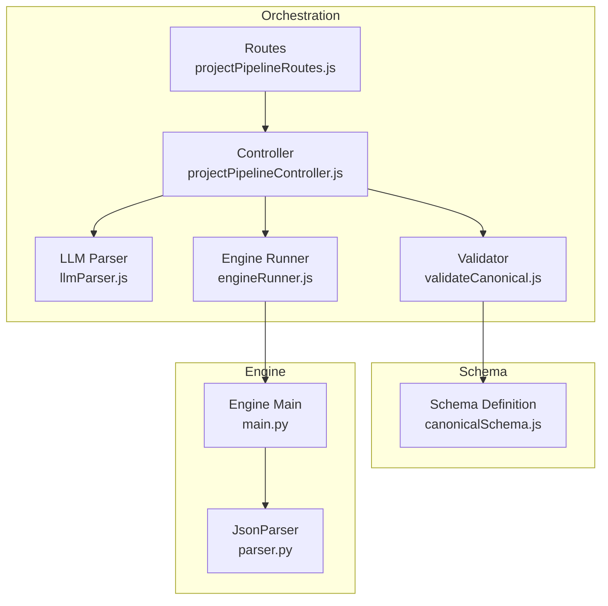
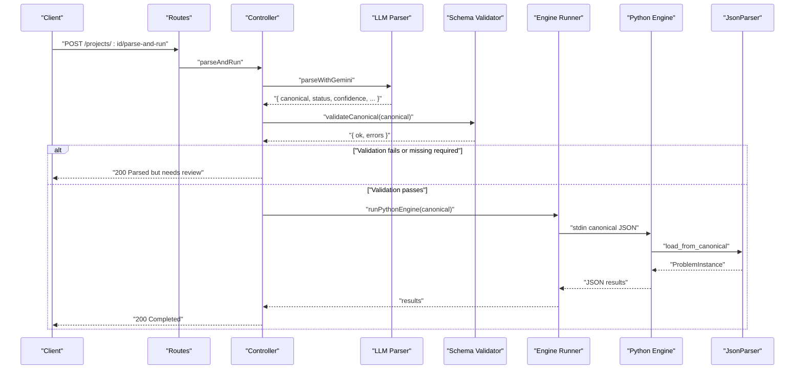
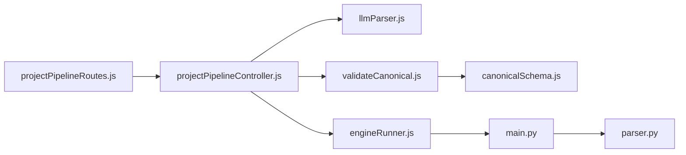

# Canonical Schema Validation

<cite>
**Referenced Files in This Document**
- [canonicalSchema.js](file://backend/validation/canonicalSchema.js)
- [validateCanonical.js](file://backend/validation/validateCanonical.js)
- [llmParser.js](file://backend/services/llmParser.js)
- [projectPipelineController.js](file://backend/controllers/projectPipelineController.js)
- [engineRunner.js](file://backend/services/engineRunner.js)
- [main.py](file://backend/engine/main.py)
- [parser.py](file://backend/engine/parser.py)
- [projectPipelineRoutes.js](file://backend/routes/projectPipelineRoutes.js)
- [Project.js](file://backend/models/Project.js)
- [employees.csv](file://backend/engine/testcase1/employees.csv)
- [vehicles.csv](file://backend/engine/testcase1/vehicles.csv)
- [metadata.csv](file://backend/engine/testcase1/metadata.csv)
</cite>

## Table of Contents
1. [Introduction](#introduction)
2. [Project Structure](#project-structure)
3. [Core Components](#core-components)
4. [Architecture Overview](#architecture-overview)
5. [Detailed Component Analysis](#detailed-component-analysis)
6. [Dependency Analysis](#dependency-analysis)
7. [Performance Considerations](#performance-considerations)
8. [Troubleshooting Guide](#troubleshooting-guide)
9. [Conclusion](#conclusion)

## Introduction
This document describes the canonical schema validation system used to enforce strict JSON structure and data types for route optimization. It explains the schema definition, validation rules, and the end-to-end pipeline from parsed data to validation and optimization. It also documents how validation integrates with preprocessing, data quality thresholds, and optimization engine requirements.

## Project Structure
The validation system spans three layers:
- Frontend/Backend orchestration: ingestion, parsing, and validation
- Canonical schema definition: strict JSON schema for canonical form
- Optimization engine: Python-based solver consuming validated canonical data

**Diagram sources**
- [projectPipelineRoutes.js](file://backend/routes/projectPipelineRoutes.js#L1-L31)
- [projectPipelineController.js](file://backend/controllers/projectPipelineController.js#L1-L216)
- [llmParser.js](file://backend/services/llmParser.js#L1-L170)
- [validateCanonical.js](file://backend/validation/validateCanonical.js#L1-L18)
- [canonicalSchema.js](file://backend/validation/canonicalSchema.js#L1-L105)
- [engineRunner.js](file://backend/services/engineRunner.js#L1-L73)
- [main.py](file://backend/engine/main.py#L1-L193)
- [parser.py](file://backend/engine/parser.py#L1-L278)

**Section sources**
- [projectPipelineRoutes.js](file://backend/routes/projectPipelineRoutes.js#L1-L31)
- [projectPipelineController.js](file://backend/controllers/projectPipelineController.js#L1-L216)
- [llmParser.js](file://backend/services/llmParser.js#L1-L170)
- [validateCanonical.js](file://backend/validation/validateCanonical.js#L1-L18)
- [canonicalSchema.js](file://backend/validation/canonicalSchema.js#L1-L105)
- [engineRunner.js](file://backend/services/engineRunner.js#L1-L73)
- [main.py](file://backend/engine/main.py#L1-L193)
- [parser.py](file://backend/engine/parser.py#L1-L278)

## Core Components
- Canonical schema definition: Enforces required fields, data types, and nested structures for canonical JSON.
- Validation module: Compiles the schema and returns structured validation results.
- Orchestration controller: Integrates parsing, validation, and engine execution.
- Engine: Consumes validated canonical JSON and runs optimization.

Key responsibilities:
- Schema enforces required keys and nested structures for employees, vehicles, depot, metadata, and baseline.
- Validation returns pass/fail with human-readable error messages.
- Controller gates execution until validation passes and missing-required markers are addressed.
- Engine expects canonical JSON with normalized types and defaults.

**Section sources**
- [canonicalSchema.js](file://backend/validation/canonicalSchema.js#L1-L105)
- [validateCanonical.js](file://backend/validation/validateCanonical.js#L1-L18)
- [projectPipelineController.js](file://backend/controllers/projectPipelineController.js#L118-L144)
- [parser.py](file://backend/engine/parser.py#L159-L278)

## Architecture Overview
End-to-end validation pipeline from ingestion to optimization:

**Diagram sources**
- [projectPipelineRoutes.js](file://backend/routes/projectPipelineRoutes.js#L22-L23)
- [projectPipelineController.js](file://backend/controllers/projectPipelineController.js#L65-L171)
- [llmParser.js](file://backend/services/llmParser.js#L138-L170)
- [validateCanonical.js](file://backend/validation/validateCanonical.js#L10-L16)
- [engineRunner.js](file://backend/services/engineRunner.js#L21-L71)
- [main.py](file://backend/engine/main.py#L107-L129)
- [parser.py](file://backend/engine/parser.py#L159-L278)

## Detailed Component Analysis

### Canonical Schema Definition
The canonical schema defines:
- Top-level required fields: schema_version, problem_type, employees, vehicles.
- Optional metadata, depot, and baseline.
- Nested structures for employees (id, pickup, dropoff, optional time_window, priority) and vehicles (id, capacity, start_location, optional cost_per_km, mode/category, available_time).
- All properties support union types with null to allow missing values where permitted.
- Additional properties are allowed to preserve forward compatibility.

Validation characteristics:
- Strict type enforcement for strings, numbers, and arrays.
- Required nested keys enforced for employees (id, pickup, dropoff) and vehicles (id, capacity, start_location).
- Null-tolerant fields enable graceful handling of missing data.

**Section sources**
- [canonicalSchema.js](file://backend/validation/canonicalSchema.js#L1-L105)

### Validation Module
The validator:
- Uses AJV with allErrors and union types enabled.
- Compiles the canonical schema.
- Returns an object with ok flag and a flat array of error messages derived from AJV errors.

Error message format:
- Each error includes the instance path and message for precise identification of invalid fields.

**Section sources**
- [validateCanonical.js](file://backend/validation/validateCanonical.js#L1-L18)

### Orchestration Controller
The controller coordinates:
- Parsing via Gemini-based LLM parser.
- Canonical validation and reporting missing required fields.
- Conditional execution of the Python engine only when validation passes and missing-required is empty.
- Storing parse reports, warnings, and results in the project model.

Decision flow:
- If canonical is missing or validation fails or missing-required is non-empty, mark status as Pending and return a needs-review response.
- Otherwise, run the engine and update status to Completed or Failed accordingly.

**Section sources**
- [projectPipelineController.js](file://backend/controllers/projectPipelineController.js#L65-L171)
- [Project.js](file://backend/models/Project.js#L37-L94)

### LLM Parser and Business Rule Extraction
The LLM parser:
- Normalizes artifacts (Excel, PDF, images, text) into a unified text dump and binary parts.
- Builds a strict prompt requiring canonical JSON output, explicit missing required fields, and stable IDs.
- Enforces time formats and disallows invented values; sets null where unknown.

Business rule alignment:
- Emphasizes returning canonical JSON with required fields and nulls for missing data.
- Populates missing_required[] with JSON paths for fields that prevent optimization.

**Section sources**
- [llmParser.js](file://backend/services/llmParser.js#L103-L136)
- [llmParser.js](file://backend/services/llmParser.js#L138-L170)

### Engine Integration and Preprocessing
The engine:
- Reads canonical JSON from stdin and constructs a ProblemInstance via JsonParser.
- Normalizes priorities, time windows, locations, speeds, and capacities with safe defaults.
- Precomputes a distance matrix for optimization.
- Runs multiple solver strategies in parallel and returns consolidated results.

Preprocessing requirements:
- Canonical JSON must include employees and vehicles with required nested fields.
- Locations must be numeric; defaults are applied where missing.
- Baseline can be provided as dict or list; normalization handles both forms.

**Section sources**
- [main.py](file://backend/engine/main.py#L107-L129)
- [parser.py](file://backend/engine/parser.py#L159-L278)

## Dependency Analysis
The validation system exhibits clear separation of concerns:
- Routes depend on Controller.
- Controller depends on Parser, Validator, and EngineRunner.
- Validator depends on Schema.
- EngineRunner spawns Engine; Engine depends on JsonParser.

**Diagram sources**
- [projectPipelineRoutes.js](file://backend/routes/projectPipelineRoutes.js#L1-L31)
- [projectPipelineController.js](file://backend/controllers/projectPipelineController.js#L1-L216)
- [llmParser.js](file://backend/services/llmParser.js#L1-L170)
- [validateCanonical.js](file://backend/validation/validateCanonical.js#L1-L18)
- [canonicalSchema.js](file://backend/validation/canonicalSchema.js#L1-L105)
- [engineRunner.js](file://backend/services/engineRunner.js#L1-L73)
- [main.py](file://backend/engine/main.py#L1-L193)
- [parser.py](file://backend/engine/parser.py#L1-L278)

**Section sources**
- [projectPipelineController.js](file://backend/controllers/projectPipelineController.js#L1-L216)
- [validateCanonical.js](file://backend/validation/validateCanonical.js#L1-L18)
- [canonicalSchema.js](file://backend/validation/canonicalSchema.js#L1-L105)
- [engineRunner.js](file://backend/services/engineRunner.js#L1-L73)
- [main.py](file://backend/engine/main.py#L1-L193)
- [parser.py](file://backend/engine/parser.py#L1-L278)

## Performance Considerations
- Validation overhead is minimal due to compiled AJV schema.
- Engine precomputation of distance matrices scales with the number of locations; ensure canonical input minimizes redundant or malformed entries.
- Parallel execution in the engine improves throughput; keep canonical input consistent to avoid repeated re-runs.

## Troubleshooting Guide

### Validation Failures
Common causes and remedies:
- Missing required top-level keys (schema_version, problem_type, employees, vehicles): Add all required keys with appropriate types.
- Invalid types for nested fields (e.g., non-numeric lat/lng): Ensure numeric values; nulls are allowed where specified.
- Missing required nested keys under employees or vehicles: Provide id, pickup, dropoff for employees; id, capacity, start_location for vehicles.
- Unexpected additional properties: Remove unsupported fields or adjust schema expectations.

Remediation steps:
- Review parse report for missing_required and warnings.
- Correct canonical JSON according to schema rules.
- Re-run parse-and-run to validate again.

**Section sources**
- [projectPipelineController.js](file://backend/controllers/projectPipelineController.js#L118-L144)
- [validateCanonical.js](file://backend/validation/validateCanonical.js#L10-L16)

### Engine Execution Issues
Symptoms:
- Empty or malformed stdout from engine.
- Timeouts or non-zero exit codes.

Remedies:
- Verify canonical JSON validity and completeness.
- Confirm presence of employees and vehicles with required fields.
- Reduce input scale for testing; ensure sufficient compute resources.

**Section sources**
- [engineRunner.js](file://backend/services/engineRunner.js#L21-L71)
- [main.py](file://backend/engine/main.py#L145-L193)

### Data Quality Thresholds
- Priorities: Normalized to 1–3; missing values default to medium.
- Time windows: Accept "HH:MM" strings; missing values default to 0.
- Locations: Numeric lat/lng; missing values default to 0.
- Capacities and costs: Numeric; missing defaults applied by engine.

**Section sources**
- [parser.py](file://backend/engine/parser.py#L120-L157)
- [parser.py](file://backend/engine/parser.py#L104-L118)

## Conclusion
The canonical schema validation system enforces strict JSON structure and data types, ensuring reliable downstream processing by the optimization engine. By integrating schema validation early in the pipeline, the system prevents invalid configurations from reaching the solver, reduces runtime errors, and improves data quality. Adhering to the schema and addressing validation feedback ensures successful route optimization runs.