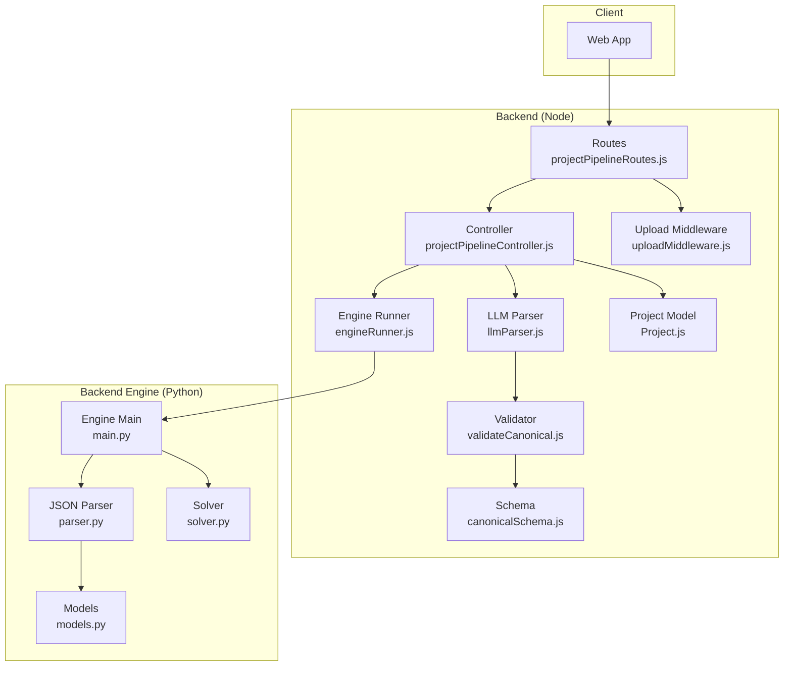
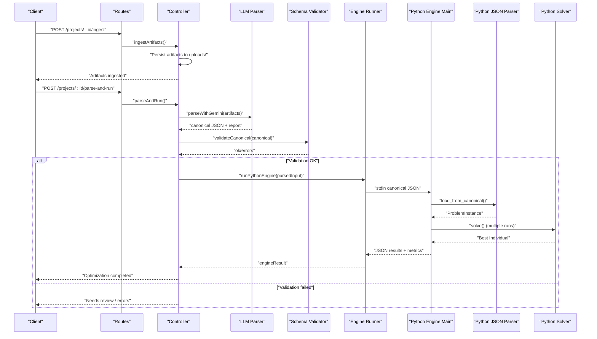
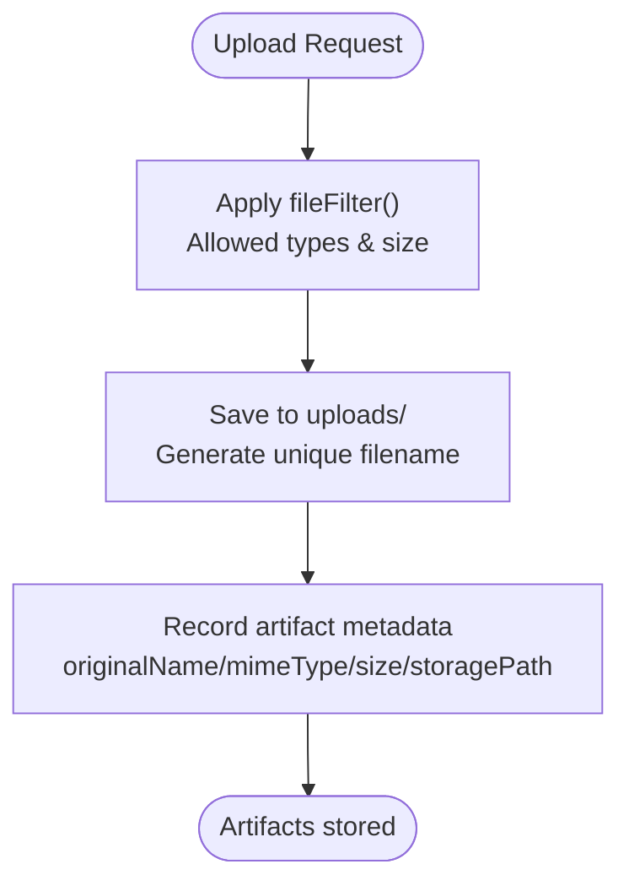
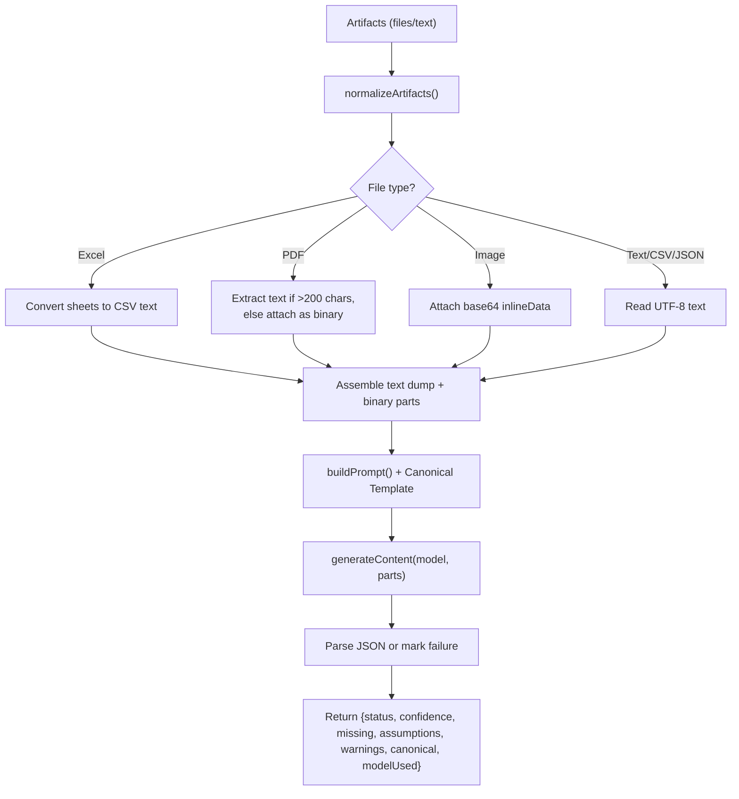
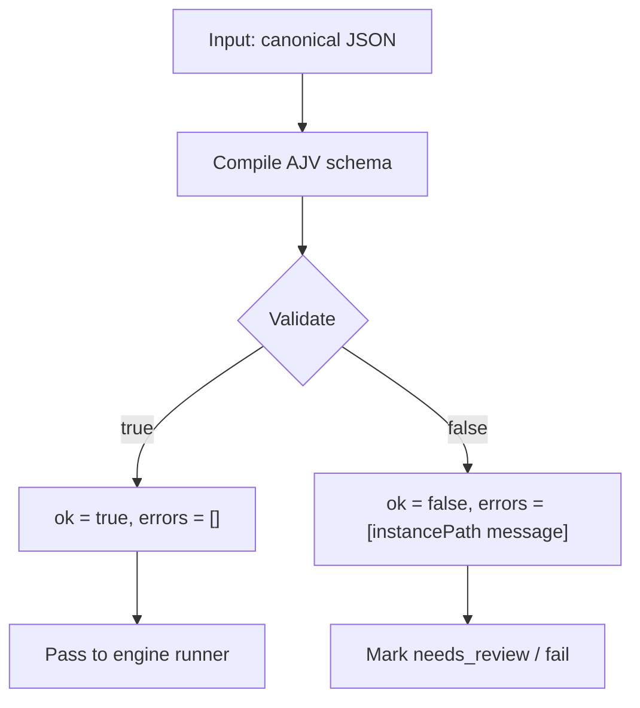
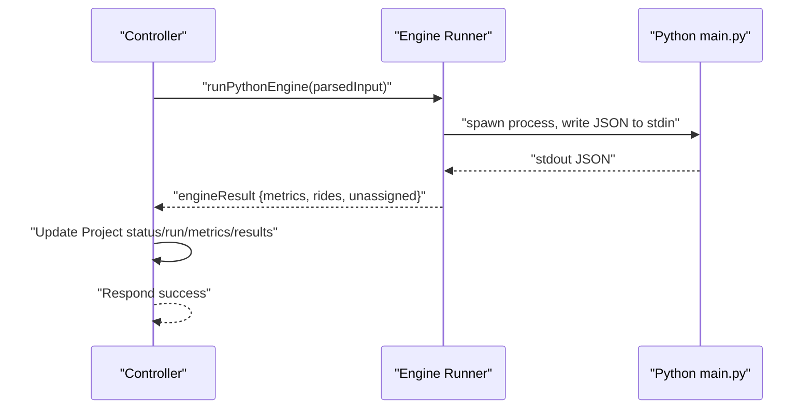
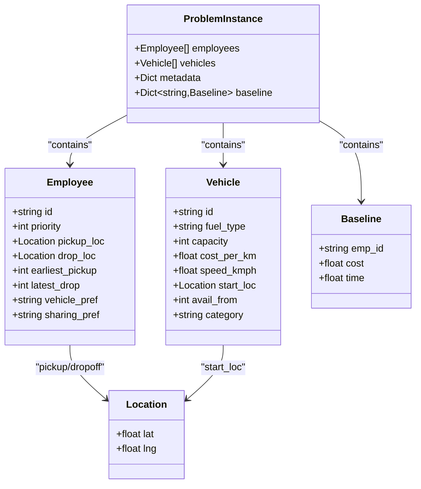
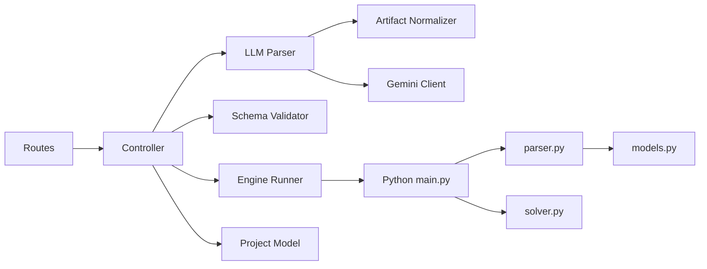

# Data Processing Pipeline

<cite>
**Referenced Files in This Document**
- [projectPipelineController.js](file://backend/controllers/projectPipelineController.js)
- [projectPipelineRoutes.js](file://backend/routes/projectPipelineRoutes.js)
- [uploadMiddleware.js](file://backend/middleware/uploadMiddleware.js)
- [llmParser.js](file://backend/services/llmParser.js)
- [geminiClient.js](file://backend/services/geminiClient.js)
- [validateCanonical.js](file://backend/validation/validateCanonical.js)
- [canonicalSchema.js](file://backend/validation/canonicalSchema.js)
- [artifactNormalizer.js](file://backend/services/artifactNormalizer.js)
- [engineRunner.js](file://backend/services/engineRunner.js)
- [Project.js](file://backend/models/Project.js)
- [parser.py](file://backend/engine/parser.py)
- [main.py](file://backend/engine/main.py)
- [models.py](file://backend/engine/models.py)
- [solver.py](file://backend/engine/solver.py)
</cite>

## Table of Contents
1. [Introduction](#introduction)
2. [Project Structure](#project-structure)
3. [Core Components](#core-components)
4. [Architecture Overview](#architecture-overview)
5. [Detailed Component Analysis](#detailed-component-analysis)
6. [Dependency Analysis](#dependency-analysis)
7. [Performance Considerations](#performance-considerations)
8. [Troubleshooting Guide](#troubleshooting-guide)
9. [Conclusion](#conclusion)

## Introduction
This document explains the end-to-end data processing pipeline that transforms user-uploaded artifacts into optimized route plans. It covers:
- File ingestion and preprocessing
- AI-powered parsing into a canonical schema
- Canonical schema validation
- Transformation into the internal optimization model
- Execution of the Python-based optimization engine
- Error handling, data quality checks, and preprocessing requirements for optimal results

The pipeline integrates a Node.js backend with a Python optimization engine via a robust JSON contract and a strict canonical schema.

## Project Structure
The pipeline spans three major layers:
- Frontend/Client: Initiates upload and retrieves results
- Backend (Node.js): Routes, ingestion, LLM parsing, validation, orchestration, and engine invocation
- Backend Engine (Python): Parsing, modeling, and genetic optimization

**Diagram sources**
- [projectPipelineRoutes.js](file://backend/routes/projectPipelineRoutes.js#L1-L31)
- [projectPipelineController.js](file://backend/controllers/projectPipelineController.js#L1-L216)
- [uploadMiddleware.js](file://backend/middleware/uploadMiddleware.js#L1-L35)
- [llmParser.js](file://backend/services/llmParser.js#L1-L170)
- [validateCanonical.js](file://backend/validation/validateCanonical.js#L1-L18)
- [canonicalSchema.js](file://backend/validation/canonicalSchema.js#L1-L105)
- [engineRunner.js](file://backend/services/engineRunner.js#L1-L73)
- [main.py](file://backend/engine/main.py#L1-L193)
- [parser.py](file://backend/engine/parser.py#L1-L278)
- [models.py](file://backend/engine/models.py#L1-L56)
- [solver.py](file://backend/engine/solver.py#L1-L107)
- [Project.js](file://backend/models/Project.js#L1-L96)

**Section sources**
- [projectPipelineRoutes.js](file://backend/routes/projectPipelineRoutes.js#L1-L31)
- [projectPipelineController.js](file://backend/controllers/projectPipelineController.js#L1-L216)
- [uploadMiddleware.js](file://backend/middleware/uploadMiddleware.js#L1-L35)
- [llmParser.js](file://backend/services/llmParser.js#L1-L170)
- [validateCanonical.js](file://backend/validation/validateCanonical.js#L1-L18)
- [canonicalSchema.js](file://backend/validation/canonicalSchema.js#L1-L105)
- [engineRunner.js](file://backend/services/engineRunner.js#L1-L73)
- [main.py](file://backend/engine/main.py#L1-L193)
- [parser.py](file://backend/engine/parser.py#L1-L278)
- [models.py](file://backend/engine/models.py#L1-L56)
- [solver.py](file://backend/engine/solver.py#L1-L107)
- [Project.js](file://backend/models/Project.js#L1-L96)

## Core Components
- Upload and ingestion: Accepts files and optional notes, persists artifacts to disk, and records metadata in the Project document.
- LLM parsing: Normalizes artifacts (Excel, PDF, images, text), builds a structured prompt, and extracts canonical JSON via Gemini.
- Canonical validation: Validates the parsed JSON against a strict schema and records parse report outcomes.
- Engine orchestration: Invokes the Python engine with the validated canonical JSON and aggregates results and metrics.
- Optimization engine: Parses canonical JSON into internal models, runs multiple solver strategies, and produces optimized routes and metrics.

Key responsibilities and flows are implemented across the files listed above.

**Section sources**
- [projectPipelineController.js](file://backend/controllers/projectPipelineController.js#L27-L171)
- [llmParser.js](file://backend/services/llmParser.js#L138-L168)
- [validateCanonical.js](file://backend/validation/validateCanonical.js#L10-L16)
- [engineRunner.js](file://backend/services/engineRunner.js#L21-L71)
- [main.py](file://backend/engine/main.py#L107-L129)

## Architecture Overview
The pipeline follows a staged workflow:
1. User uploads artifacts via a multipart form.
2. Artifacts are normalized and passed to an LLM to produce canonical JSON.
3. The canonical JSON is validated against a schema.
4. If valid, the canonical JSON is transformed into the internal model and fed to the Python engine.
5. Results and metrics are persisted and returned to the client.

**Diagram sources**
- [projectPipelineRoutes.js](file://backend/routes/projectPipelineRoutes.js#L14-L23)
- [projectPipelineController.js](file://backend/controllers/projectPipelineController.js#L65-L171)
- [llmParser.js](file://backend/services/llmParser.js#L138-L168)
- [validateCanonical.js](file://backend/validation/validateCanonical.js#L10-L16)
- [engineRunner.js](file://backend/services/engineRunner.js#L21-L71)
- [main.py](file://backend/engine/main.py#L107-L129)
- [parser.py](file://backend/engine/parser.py#L159-L278)
- [solver.py](file://backend/engine/solver.py#L38-L107)

## Detailed Component Analysis

### Upload and Ingestion
- Accepts arbitrary artifacts via a multipart form and enforces allowed file types and sizes.
- Persists files to disk and records metadata (original name, MIME type, size, storage path) in the Project’s inputArtifacts array.
- Supports optional free-text notes appended as artifacts.

Supported file formats:
- Excel: .xlsx, .xls
- CSV
- PDF
- Images: png, jpg, jpeg, webp
- Text/JSON: txt, json

**Diagram sources**
- [uploadMiddleware.js](file://backend/middleware/uploadMiddleware.js#L12-L33)
- [projectPipelineController.js](file://backend/controllers/projectPipelineController.js#L17-L63)

**Section sources**
- [uploadMiddleware.js](file://backend/middleware/uploadMiddleware.js#L1-L35)
- [projectPipelineController.js](file://backend/controllers/projectPipelineController.js#L17-L63)

### LLM-Based Parsing (Gemini)
- Normalizes artifacts:
  - Excel: sheets converted to CSV text per sheet
  - PDF: text extracted; short PDFs sent as binary attachments
  - Images: base64-encoded inline data
  - Text/CSV/JSON: read as UTF-8 text
- Builds a strict prompt instructing the model to return canonical JSON and report missing fields, assumptions, and warnings.
- Calls Gemini to generate content and parses the response into a structured object with metadata.

**Diagram sources**
- [llmParser.js](file://backend/services/llmParser.js#L49-L101)
- [llmParser.js](file://backend/services/llmParser.js#L103-L136)
- [llmParser.js](file://backend/services/llmParser.js#L138-L168)
- [geminiClient.js](file://backend/services/geminiClient.js#L4-L10)

**Section sources**
- [llmParser.js](file://backend/services/llmParser.js#L1-L170)
- [geminiClient.js](file://backend/services/geminiClient.js#L1-L12)

### Canonical Schema Validation
- Uses AJV with union types to validate the canonical JSON against a comprehensive schema.
- Returns ok flag and a flattened list of errors for downstream handling.

Validation rules overview:
- Top-level required fields: schema_version, problem_type, employees, vehicles
- Nested structures enforce presence of lat/lng for locations and required IDs
- Flexible metadata and optional fields are allowed

**Diagram sources**
- [validateCanonical.js](file://backend/validation/validateCanonical.js#L10-L16)
- [canonicalSchema.js](file://backend/validation/canonicalSchema.js#L1-L105)

**Section sources**
- [validateCanonical.js](file://backend/validation/validateCanonical.js#L1-L18)
- [canonicalSchema.js](file://backend/validation/canonicalSchema.js#L1-L105)

### Engine Orchestration and Results
- On successful validation, invokes the Python engine with the canonical JSON via stdin.
- Extracts and parses the engine’s JSON output, merges metrics, and updates the Project status and run state.
- Handles timeouts, process errors, and malformed JSON gracefully.

**Diagram sources**
- [projectPipelineController.js](file://backend/controllers/projectPipelineController.js#L146-L171)
- [engineRunner.js](file://backend/services/engineRunner.js#L21-L71)
- [main.py](file://backend/engine/main.py#L107-L129)

**Section sources**
- [projectPipelineController.js](file://backend/controllers/projectPipelineController.js#L65-L171)
- [engineRunner.js](file://backend/services/engineRunner.js#L1-L73)

### Python Engine: Parsing and Optimization
- Accepts canonical JSON via stdin or loads from CSV testcases.
- Converts canonical JSON into internal models (Employee, Vehicle, Location, Baseline, ProblemInstance).
- Precomputes distance matrices for performance.
- Runs multiple solver strategies concurrently, selects the best solution, and emits metrics and route details.

**Diagram sources**
- [models.py](file://backend/engine/models.py#L4-L56)

**Section sources**
- [main.py](file://backend/engine/main.py#L107-L129)
- [parser.py](file://backend/engine/parser.py#L159-L278)
- [models.py](file://backend/engine/models.py#L1-L56)
- [solver.py](file://backend/engine/solver.py#L14-L107)

## Dependency Analysis
- Routes depend on controller actions.
- Controller depends on:
  - LLM parser for canonical extraction
  - Schema validator for correctness
  - Engine runner for optimization
  - Project model for persistence
- LLM parser depends on:
  - Artifact normalizer for file handling
  - Gemini client for model access
- Engine runner spawns Python main, which depends on:
  - JSON parser for canonical conversion
  - Solver for optimization
  - Models for typed structures

**Diagram sources**
- [projectPipelineRoutes.js](file://backend/routes/projectPipelineRoutes.js#L1-L31)
- [projectPipelineController.js](file://backend/controllers/projectPipelineController.js#L1-L216)
- [llmParser.js](file://backend/services/llmParser.js#L1-L170)
- [artifactNormalizer.js](file://backend/services/artifactNormalizer.js#L1-L91)
- [geminiClient.js](file://backend/services/geminiClient.js#L1-L12)
- [engineRunner.js](file://backend/services/engineRunner.js#L1-L73)
- [main.py](file://backend/engine/main.py#L1-L193)
- [parser.py](file://backend/engine/parser.py#L1-L278)
- [models.py](file://backend/engine/models.py#L1-L56)
- [solver.py](file://backend/engine/solver.py#L1-L107)
- [Project.js](file://backend/models/Project.js#L1-L96)

**Section sources**
- [projectPipelineRoutes.js](file://backend/routes/projectPipelineRoutes.js#L1-L31)
- [projectPipelineController.js](file://backend/controllers/projectPipelineController.js#L1-L216)
- [llmParser.js](file://backend/services/llmParser.js#L1-L170)
- [artifactNormalizer.js](file://backend/services/artifactNormalizer.js#L1-L91)
- [geminiClient.js](file://backend/services/geminiClient.js#L1-L12)
- [engineRunner.js](file://backend/services/engineRunner.js#L1-L73)
- [main.py](file://backend/engine/main.py#L1-L193)
- [parser.py](file://backend/engine/parser.py#L1-L278)
- [models.py](file://backend/engine/models.py#L1-L56)
- [solver.py](file://backend/engine/solver.py#L1-L107)
- [Project.js](file://backend/models/Project.js#L1-L96)

## Performance Considerations
- Precomputation: Distance matrices are precomputed once per run to reduce runtime overhead.
- Parallelism: Multiple solver runs execute concurrently; stdin mode uses thread pool to avoid stdout pollution, while testcases use process pool.
- Robustness: The engine extracts the last JSON object from stdout to tolerate incidental logs.
- Timeouts: The Node runner enforces a hard timeout for long-running engines.
- Data normalization: Large PDFs are attached as binaries; only substantial text is extracted to reduce prompt size.

[No sources needed since this section provides general guidance]

## Troubleshooting Guide
Common issues and resolutions:
- Unsupported file type: Ensure uploads match allowed extensions and MIME types.
- Empty or invalid JSON from LLM: Review parse report for model failures and adjust prompts or inputs.
- Validation failures: Address missing required fields and schema violations reported by the validator.
- Engine errors: Inspect stderr/stdout captured by the runner; ensure Python environment and dependencies are installed.
- Timeout: Increase timeout or optimize input data (reduce rows, remove large attachments).
- Missing artifacts: Verify artifact storage paths and existence before invoking the parser.

Operational endpoints:
- Ingest artifacts: POST /api/projects/:id/ingest
- Parse and run: POST /api/projects/:id/parse-and-run
- Get parsed input: GET /api/projects/:id/input
- Get results: GET /api/projects/:id/results

**Section sources**
- [uploadMiddleware.js](file://backend/middleware/uploadMiddleware.js#L12-L27)
- [projectPipelineController.js](file://backend/controllers/projectPipelineController.js#L65-L171)
- [engineRunner.js](file://backend/services/engineRunner.js#L4-L19)
- [main.py](file://backend/engine/main.py#L52-L66)

## Conclusion
The pipeline provides a robust, extensible workflow from artifact ingestion to optimized routing. By enforcing a strict canonical schema, validating inputs, and leveraging a parallelized Python engine, it ensures reliable and high-quality route generation. Proper preprocessing, clear error reporting, and modular design enable maintainability and scalability.