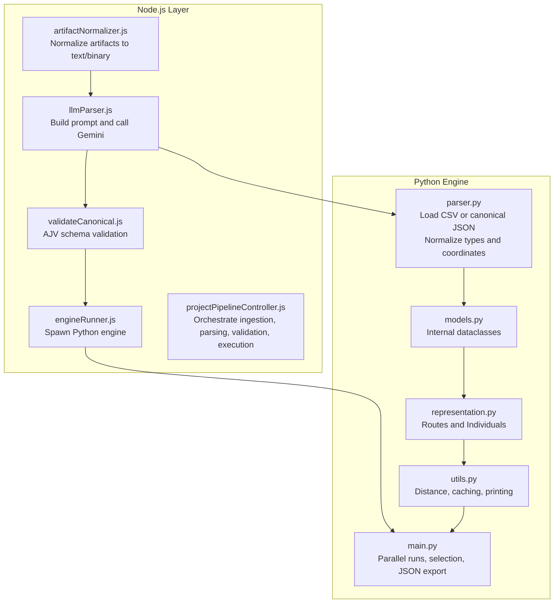
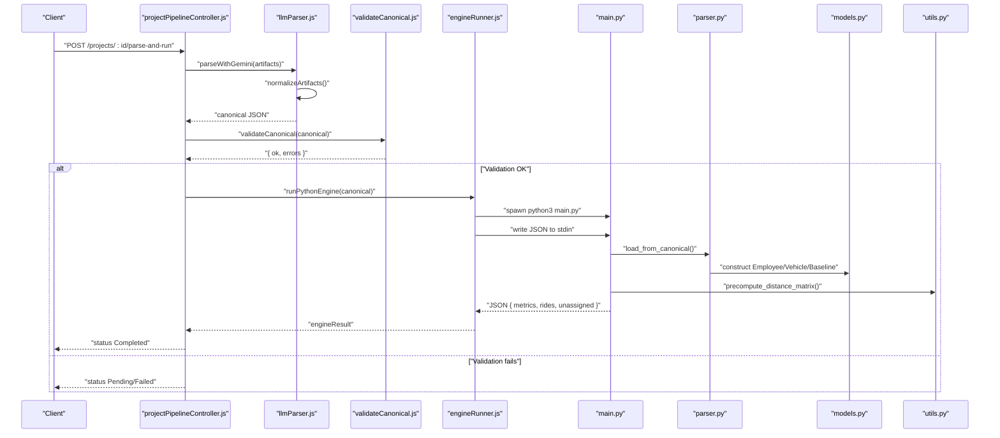
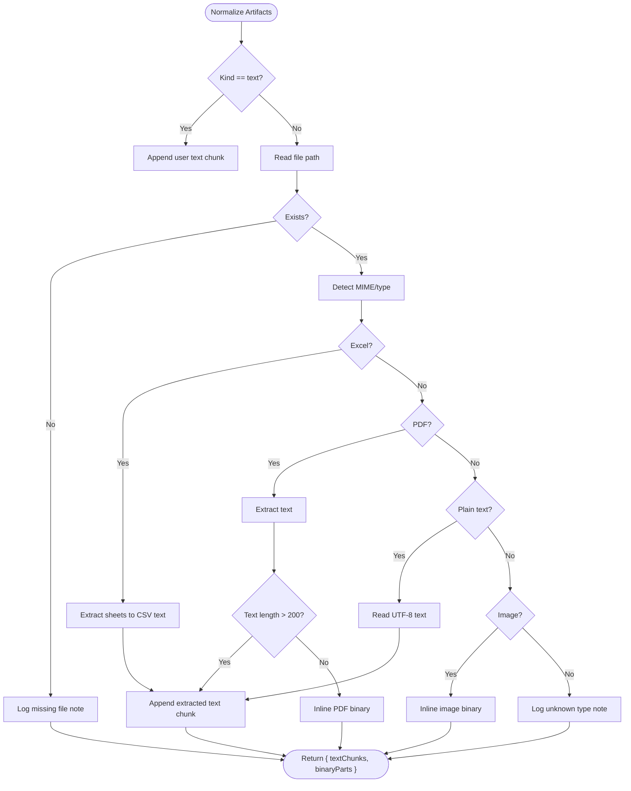
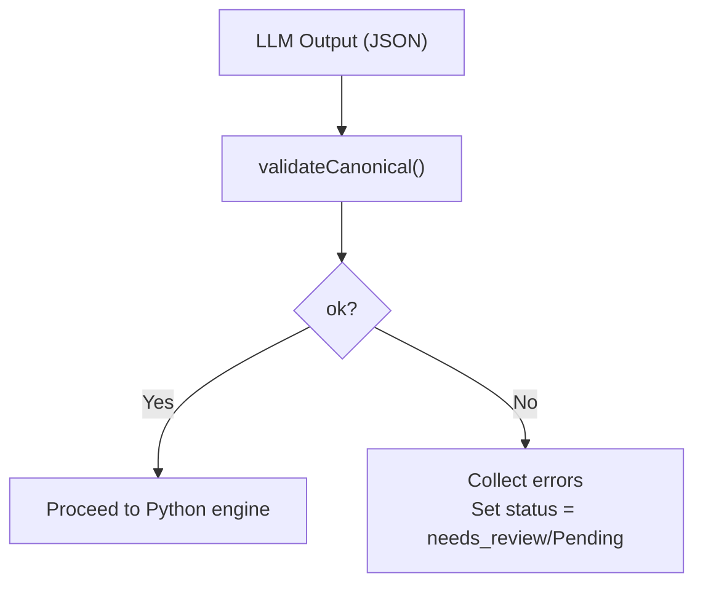
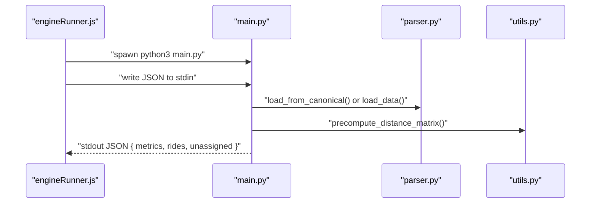
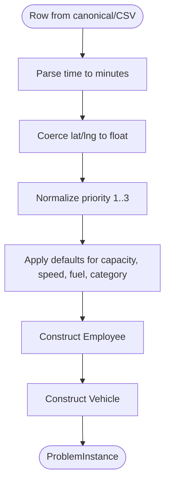
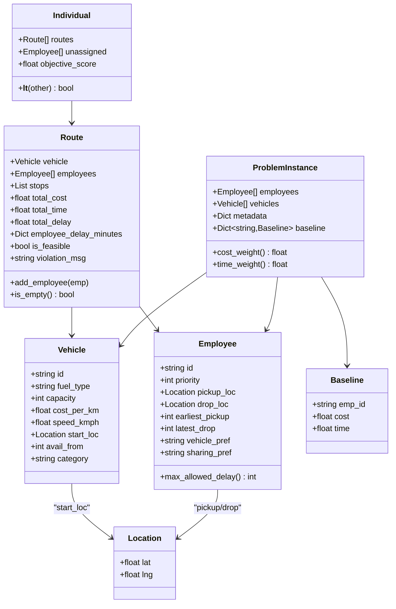
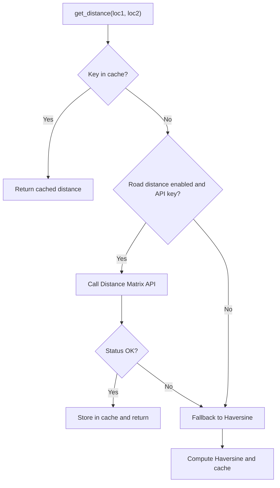
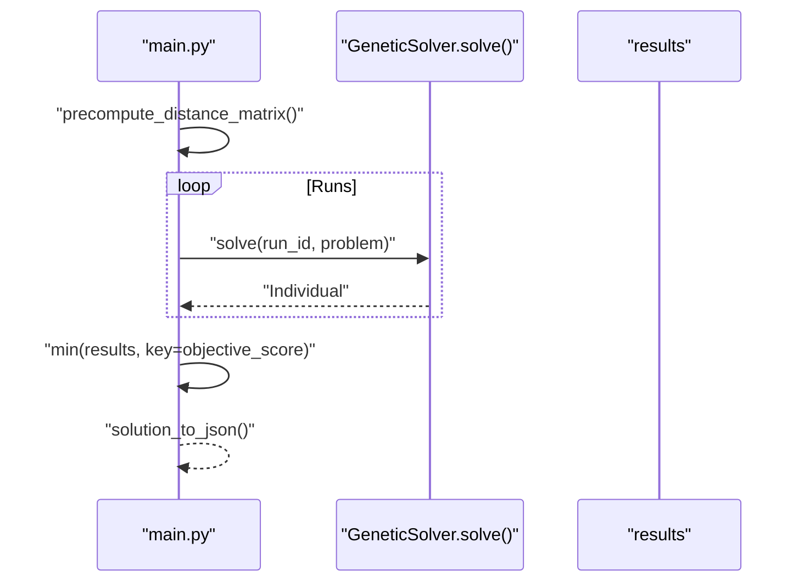
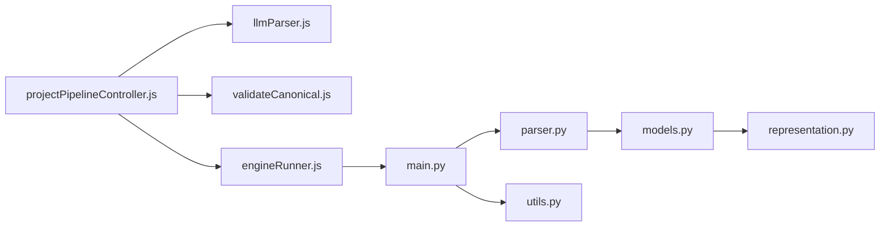

# Data Transformation and Normalization

<cite>
**Referenced Files in This Document**
- [artifactNormalizer.js](file://backend/services/artifactNormalizer.js)
- [llmParser.js](file://backend/services/llmParser.js)
- [canonicalSchema.js](file://backend/validation/canonicalSchema.js)
- [validateCanonical.js](file://backend/validation/validateCanonical.js)
- [parser.py](file://backend/engine/parser.py)
- [models.py](file://backend/engine/models.py)
- [representation.py](file://backend/engine/representation.py)
- [utils.py](file://backend/engine/utils.py)
- [main.py](file://backend/engine/main.py)
- [engineRunner.js](file://backend/services/engineRunner.js)
- [projectPipelineController.js](file://backend/controllers/projectPipelineController.js)
- [employees.csv](file://backend/engine/testcase1/employees.csv)
- [vehicles.csv](file://backend/engine/testcase1/vehicles.csv)
- [metadata.csv](file://backend/engine/testcase1/metadata.csv)
- [baseline.csv](file://backend/engine/testcase1/baseline.csv)
</cite>

## Table of Contents
1. [Introduction](#introduction)
2. [Project Structure](#project-structure)
3. [Core Components](#core-components)
4. [Architecture Overview](#architecture-overview)
5. [Detailed Component Analysis](#detailed-component-analysis)
6. [Dependency Analysis](#dependency-analysis)
7. [Performance Considerations](#performance-considerations)
8. [Troubleshooting Guide](#troubleshooting-guide)
9. [Conclusion](#conclusion)
10. [Appendices](#appendices)

## Introduction
This document explains the complete data transformation and normalization pipeline that converts heterogeneous input artifacts into a canonical JSON schema, validates it, and feeds it into a Python-based optimization engine. It covers:
- Conversion from raw artifacts to canonical JSON via an LLM-based parser
- Canonical JSON validation against a formal schema
- Transformation from canonical JSON to internal optimization data structures
- Coordinate transformations and data type standardization
- Integration with the Python optimization engine and genetic algorithm processing
- Format conversions for genetic algorithm input/output
- Examples of data mapping, edge case handling, and performance optimization
- Relationship between normalized data and optimization requirements, constraints, and result interpretation

## Project Structure
The transformation pipeline spans three layers:
- Frontend ingestion and orchestration (Node.js)
- Canonical schema validation (Node.js)
- Python optimization engine (genetic algorithm, distance computation, and result serialization)

**Diagram sources**
- [artifactNormalizer.js](file://backend/services/artifactNormalizer.js#L38-L89)
- [llmParser.js](file://backend/services/llmParser.js#L103-L136)
- [validateCanonical.js](file://backend/validation/validateCanonical.js#L10-L16)
- [engineRunner.js](file://backend/services/engineRunner.js#L21-L71)
- [projectPipelineController.js](file://backend/controllers/projectPipelineController.js#L65-L171)
- [parser.py](file://backend/engine/parser.py#L29-L77)
- [models.py](file://backend/engine/models.py#L4-L56)
- [representation.py](file://backend/engine/representation.py#L5-L32)
- [utils.py](file://backend/engine/utils.py#L27-L110)
- [main.py](file://backend/engine/main.py#L107-L187)

**Section sources**
- [projectPipelineController.js](file://backend/controllers/projectPipelineController.js#L1-L216)
- [engineRunner.js](file://backend/services/engineRunner.js#L1-L73)
- [llmParser.js](file://backend/services/llmParser.js#L1-L170)
- [validateCanonical.js](file://backend/validation/validateCanonical.js#L1-L18)
- [canonicalSchema.js](file://backend/validation/canonicalSchema.js#L1-L105)
- [parser.py](file://backend/engine/parser.py#L1-L278)
- [models.py](file://backend/engine/models.py#L1-L56)
- [representation.py](file://backend/engine/representation.py#L1-L32)
- [utils.py](file://backend/engine/utils.py#L1-L245)
- [main.py](file://backend/engine/main.py#L1-L193)

## Core Components
- Artifact normalization: Converts uploaded files (Excel, PDF, images, text) into a unified text dump and inline binary parts for the LLM.
- LLM-based canonical parser: Generates canonical JSON from the normalized artifacts using a structured prompt and Gemini.
- Schema validation: Validates canonical JSON against a formal AJV schema to ensure completeness and correctness.
- Python engine integration: Spawns the Python optimization script, streams canonical JSON to stdin, and parses the resulting JSON.
- Data transformation: Parses canonical JSON into typed internal models, normalizes coordinates and time windows, and prepares GA-ready structures.
- Distance computation and caching: Computes road distances via Google Maps Distance Matrix API with caching and fallback to Haversine.

**Section sources**
- [artifactNormalizer.js](file://backend/services/artifactNormalizer.js#L38-L89)
- [llmParser.js](file://backend/services/llmParser.js#L103-L170)
- [validateCanonical.js](file://backend/validation/validateCanonical.js#L10-L16)
- [canonicalSchema.js](file://backend/validation/canonicalSchema.js#L1-L105)
- [engineRunner.js](file://backend/services/engineRunner.js#L21-L71)
- [parser.py](file://backend/engine/parser.py#L80-L278)
- [models.py](file://backend/engine/models.py#L4-L56)
- [utils.py](file://backend/engine/utils.py#L27-L110)

## Architecture Overview
End-to-end flow from artifacts to optimization results:

**Diagram sources**
- [projectPipelineController.js](file://backend/controllers/projectPipelineController.js#L65-L171)
- [llmParser.js](file://backend/services/llmParser.js#L138-L170)
- [artifactNormalizer.js](file://backend/services/artifactNormalizer.js#L38-L101)
- [validateCanonical.js](file://backend/validation/validateCanonical.js#L10-L16)
- [engineRunner.js](file://backend/services/engineRunner.js#L21-L71)
- [main.py](file://backend/engine/main.py#L107-L187)
- [parser.py](file://backend/engine/parser.py#L159-L278)
- [models.py](file://backend/engine/models.py#L4-L56)
- [utils.py](file://backend/engine/utils.py#L112-L161)

## Detailed Component Analysis

### Artifact Normalization and LLM Prompt Construction
- Purpose: Normalize diverse input artifacts (Excel spreadsheets, PDFs, images, plain text) into a single text dump and inline binary parts for the LLM.
- Key behaviors:
  - Detect MIME types and file extensions to route to appropriate extractor.
  - Extract tabular data from Excel sheets to CSV-like text.
  - Extract textual content from PDFs; if minimal, send as inline binary.
  - Preserve images as base64-encoded inline data.
  - Aggregate chunks with contextual headers for the LLM prompt.
- Edge cases handled:
  - Missing files or unreadable paths are recorded as text notes.
  - Unknown or unsupported types are logged as “unknown” chunks.
  - Binary fallback ensures images and short PDFs are preserved.

**Diagram sources**
- [artifactNormalizer.js](file://backend/services/artifactNormalizer.js#L38-L89)

**Section sources**
- [artifactNormalizer.js](file://backend/services/artifactNormalizer.js#L38-L89)
- [llmParser.js](file://backend/services/llmParser.js#L49-L101)

### Canonical JSON Generation and Validation
- Canonical template defines required fields and structure for employee transport problems.
- LLM prompt enforces strict JSON output, null-filling for missing data, and explicit reporting of missing required fields.
- Validation uses AJV with union types to ensure correctness and completeness.

**Diagram sources**
- [llmParser.js](file://backend/services/llmParser.js#L103-L136)
- [validateCanonical.js](file://backend/validation/validateCanonical.js#L10-L16)
- [canonicalSchema.js](file://backend/validation/canonicalSchema.js#L1-L105)

**Section sources**
- [llmParser.js](file://backend/services/llmParser.js#L103-L170)
- [validateCanonical.js](file://backend/validation/validateCanonical.js#L10-L16)
- [canonicalSchema.js](file://backend/validation/canonicalSchema.js#L1-L105)

### Python Engine Integration and Data Preprocessing
- Node spawns the Python engine and streams canonical JSON to stdin.
- Python loads either CSV test cases or canonical JSON depending on stdin availability.
- Precomputes a distance matrix to warm the cache and reduce repeated API calls.

**Diagram sources**
- [engineRunner.js](file://backend/services/engineRunner.js#L21-L71)
- [main.py](file://backend/engine/main.py#L107-L187)
- [parser.py](file://backend/engine/parser.py#L159-L278)
- [utils.py](file://backend/engine/utils.py#L112-L161)

**Section sources**
- [engineRunner.js](file://backend/services/engineRunner.js#L21-L71)
- [main.py](file://backend/engine/main.py#L107-L187)

### Data Type Standardization and Coordinate Transformations
- Time normalization:
  - Accepts HH:MM or HH:MM:SS formats and converts to minutes as integers.
  - Defaults to zero for invalid or missing values.
- Coordinates:
  - Latitude and longitude are normalized to floats; defaults to zero for missing values.
- Priority normalization:
  - Converts numeric or string priorities to 1 (High), 2 (Medium), or 3+ (Low), with clamping and fallback.
- Vehicle and metadata defaults:
  - Speed defaults to metadata value if present; otherwise a safe fallback.
  - Fuel type, category, and capacity are normalized to safe defaults when missing.

**Diagram sources**
- [parser.py](file://backend/engine/parser.py#L12-L28)
- [parser.py](file://backend/engine/parser.py#L104-L158)
- [parser.py](file://backend/engine/parser.py#L215-L243)

**Section sources**
- [parser.py](file://backend/engine/parser.py#L12-L28)
- [parser.py](file://backend/engine/parser.py#L104-L158)
- [parser.py](file://backend/engine/parser.py#L215-L243)

### Internal Optimization Data Structures
- Location: Immutable pair of latitude and longitude.
- Employee: Immutable entity with priority, pickup/drop coordinates, time windows, and preferences.
- Vehicle: Immutable entity with capacity, cost per km, speed, start location, availability, and category.
- Baseline: Per-employee baseline cost/time used for savings calculation.
- ProblemInstance: Aggregates employees, vehicles, metadata, and baseline dictionary.
- Route and Individual: Container for vehicle-specific routes, stop sequences, feasibility, and objective score.

**Diagram sources**
- [models.py](file://backend/engine/models.py#L4-L56)
- [representation.py](file://backend/engine/representation.py#L5-L32)

**Section sources**
- [models.py](file://backend/engine/models.py#L4-L56)
- [representation.py](file://backend/engine/representation.py#L5-L32)

### Distance Computation, Caching, and Precomputation
- Distance functions:
  - Haversine fallback for straight-line distance.
  - Road distance via Google Maps Distance Matrix API with API key.
- Caching:
  - Stores distances in a tuple-keyed cache to avoid redundant network calls.
- Precomputation:
  - Batch requests to warm the cache for all locations in the problem instance.

**Diagram sources**
- [utils.py](file://backend/engine/utils.py#L86-L110)
- [utils.py](file://backend/engine/utils.py#L112-L161)

**Section sources**
- [utils.py](file://backend/engine/utils.py#L27-L110)
- [utils.py](file://backend/engine/utils.py#L112-L161)

### Genetic Algorithm Processing and Result Serialization
- Parallel runs:
  - Executes multiple solver runs with different strategy configurations using thread/process pools depending on stdin mode.
- Solution selection:
  - Picks the individual with the lowest objective score.
- Result serialization:
  - Converts routes to ride objects with stop types, coordinates, and metrics.
  - Aggregates system-wide metrics including baseline comparisons and savings.

**Diagram sources**
- [main.py](file://backend/engine/main.py#L27-L30)
- [main.py](file://backend/engine/main.py#L170-L187)
- [main.py](file://backend/engine/main.py#L42-L104)

**Section sources**
- [main.py](file://backend/engine/main.py#L12-L21)
- [main.py](file://backend/engine/main.py#L27-L30)
- [main.py](file://backend/engine/main.py#L42-L104)
- [main.py](file://backend/engine/main.py#L170-L187)

### Example Data Mapping and Edge Cases
- CSV to canonical mapping (example fields):
  - Employees: employee_id, priority, pickup_lat/pickup_lng, drop_lat/drop_lng, earliest_pickup, latest_drop, vehicle_preference, sharing_preference.
  - Vehicles: vehicle_id, fuel_type, capacity, cost_per_km, avg_speed_kmph, current_lat/current_lng, available_from, category.
  - Metadata: keys like objective weights and delay caps.
  - Baseline: employee_id, baseline_cost, baseline_time_min.
- Edge cases:
  - Missing or malformed time strings default to zero minutes.
  - Missing coordinates default to zero; metadata-driven defaults apply for speed.
  - Unrecognized priority values fall back to medium priority.
  - Short PDFs are sent as inline binaries; long PDFs are extracted as text.

**Section sources**
- [employees.csv](file://backend/engine/testcase1/employees.csv#L1-L9)
- [vehicles.csv](file://backend/engine/testcase1/vehicles.csv#L1-L4)
- [metadata.csv](file://backend/engine/testcase1/metadata.csv#L1-L12)
- [baseline.csv](file://backend/engine/testcase1/baseline.csv#L1-L9)
- [parser.py](file://backend/engine/parser.py#L12-L28)
- [parser.py](file://backend/engine/parser.py#L104-L158)
- [parser.py](file://backend/engine/parser.py#L215-L243)

## Dependency Analysis
- Node orchestration depends on:
  - LLM parser for canonical JSON generation
  - Schema validator for correctness
  - Python engine runner for execution
- Python engine depends on:
  - Parser for canonical/CSV loading and normalization
  - Models for typed data structures
  - Representation for route/individual containers
  - Utils for distance computation and caching

**Diagram sources**
- [projectPipelineController.js](file://backend/controllers/projectPipelineController.js#L65-L171)
- [llmParser.js](file://backend/services/llmParser.js#L138-L170)
- [validateCanonical.js](file://backend/validation/validateCanonical.js#L10-L16)
- [engineRunner.js](file://backend/services/engineRunner.js#L21-L71)
- [main.py](file://backend/engine/main.py#L107-L187)
- [parser.py](file://backend/engine/parser.py#L159-L278)
- [models.py](file://backend/engine/models.py#L4-L56)
- [representation.py](file://backend/engine/representation.py#L5-L32)
- [utils.py](file://backend/engine/utils.py#L27-L110)

**Section sources**
- [projectPipelineController.js](file://backend/controllers/projectPipelineController.js#L65-L171)
- [engineRunner.js](file://backend/services/engineRunner.js#L21-L71)
- [main.py](file://backend/engine/main.py#L107-L187)
- [parser.py](file://backend/engine/parser.py#L159-L278)
- [models.py](file://backend/engine/models.py#L4-L56)
- [representation.py](file://backend/engine/representation.py#L5-L32)
- [utils.py](file://backend/engine/utils.py#L27-L110)

## Performance Considerations
- Distance precomputation:
  - Warm the cache at the start of solving to minimize repeated API calls.
  - Use batch requests with reasonable batch sizes to leverage Google Maps limits.
- Time normalization:
  - Parsing time strings once and reusing numeric values avoids repeated conversions.
- Dataclass immutability:
  - Frozen dataclasses reduce accidental mutations and improve memory locality.
- Parallel execution:
  - Thread pool for stdin mode to avoid stdout contamination; process pool for test cases to maximize CPU utilization.
- Caching strategy:
  - Round coordinates to six decimals to maximize cache hit rate while preserving accuracy.

[No sources needed since this section provides general guidance]

## Troubleshooting Guide
- Empty or malformed canonical JSON:
  - The engine runner extracts the last JSON object/array from stdout if direct parsing fails; ensure the Python script emits a single JSON object at the end.
- Validation failures:
  - Review missing required fields reported by the validator; update artifacts or adjust assumptions accordingly.
- Distance API errors:
  - Verify the Google Maps API key and quota; fallback to Haversine when API is unavailable.
- Time parsing issues:
  - Ensure time strings conform to HH:MM or HH:MM:SS; otherwise they default to zero minutes.
- Priority normalization:
  - Non-standard priority values are normalized to 1–3; confirm expected behavior in downstream scoring.

**Section sources**
- [engineRunner.js](file://backend/services/engineRunner.js#L4-L19)
- [validateCanonical.js](file://backend/validation/validateCanonical.js#L10-L16)
- [utils.py](file://backend/engine/utils.py#L54-L84)
- [parser.py](file://backend/engine/parser.py#L12-L28)
- [parser.py](file://backend/engine/parser.py#L120-L158)

## Conclusion
The pipeline transforms heterogeneous inputs into a canonical JSON schema, validates it rigorously, and feeds a Python-based genetic algorithm engine. Robust normalization of coordinates, time windows, and priorities ensures compatibility with optimization constraints. Distance caching and precomputation significantly improve performance. The modular design enables clear separation of concerns across ingestion, validation, transformation, and execution, while maintaining traceability and extensibility.

[No sources needed since this section summarizes without analyzing specific files]

## Appendices

### Canonical JSON Schema Highlights
- Required fields: schema_version, problem_type, employees, vehicles.
- Optional metadata for project_name, date, average speed, and distance metric.
- Depot definition for office/depot coordinates.
- Employees array with id, pickup/dropoff locations, time windows, and preferences.
- Vehicles array with capacity, cost per km, start location, and availability.
- Baseline object or list for per-employee cost/time.

**Section sources**
- [canonicalSchema.js](file://backend/validation/canonicalSchema.js#L1-L105)

### Test Case Data Formats
- Employees CSV: employee identifiers, coordinates, time windows, preferences.
- Vehicles CSV: vehicle identifiers, capabilities, and start locations.
- Metadata CSV: objective weights, delay caps, and distance method.
- Baseline CSV: per-employee baseline cost and time.

**Section sources**
- [employees.csv](file://backend/engine/testcase1/employees.csv#L1-L9)
- [vehicles.csv](file://backend/engine/testcase1/vehicles.csv#L1-L4)
- [metadata.csv](file://backend/engine/testcase1/metadata.csv#L1-L12)
- [baseline.csv](file://backend/engine/testcase1/baseline.csv#L1-L9)