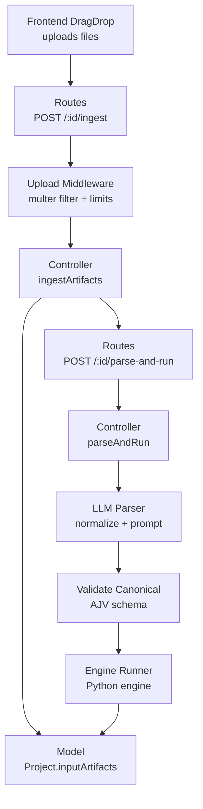
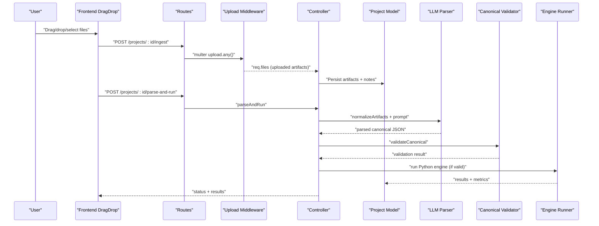
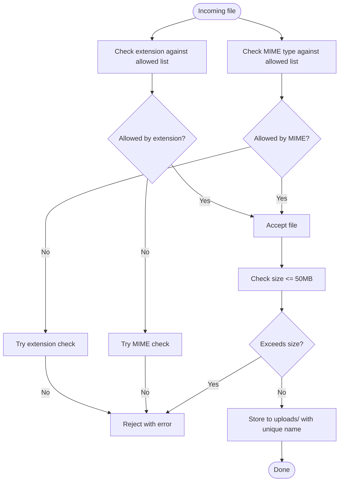
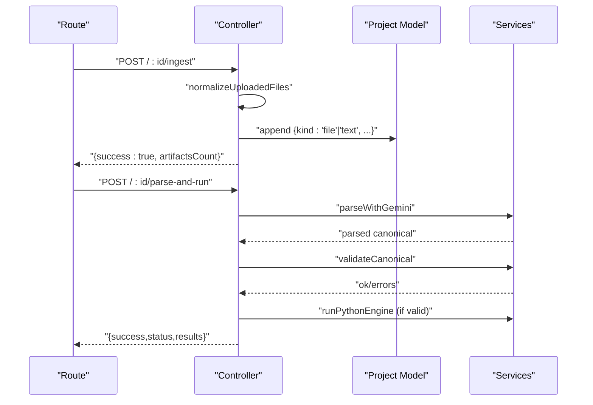
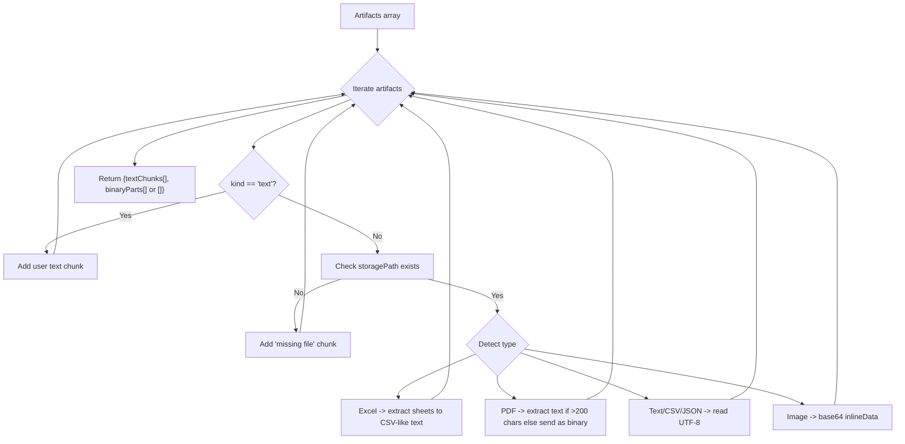
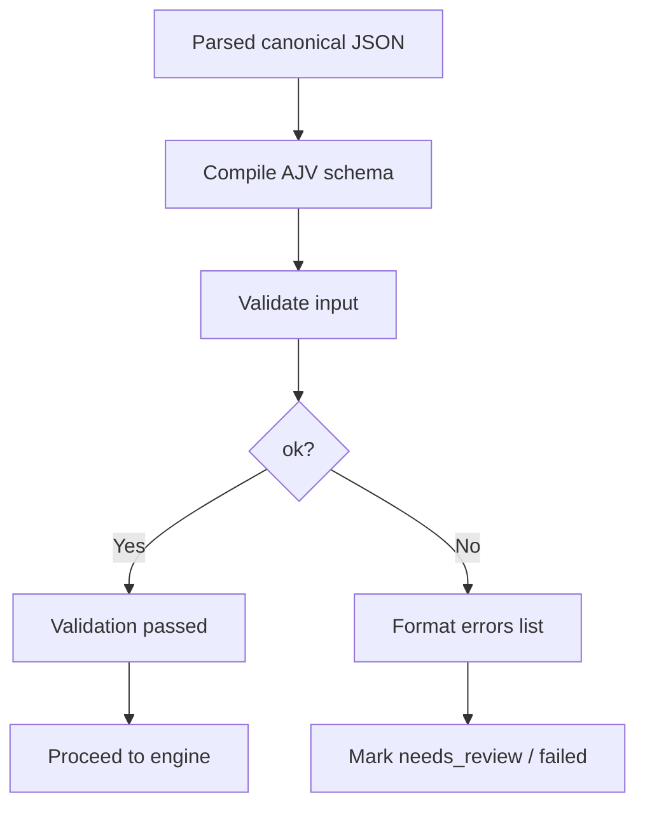
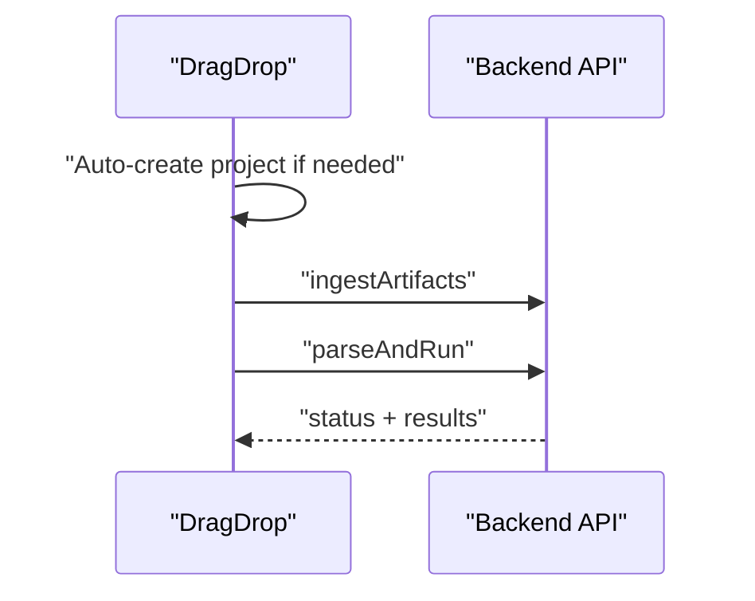
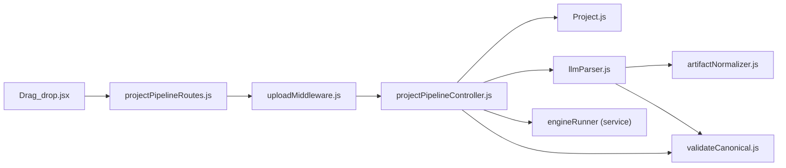

# File Upload and Validation

<cite>
**Referenced Files in This Document**
- [uploadMiddleware.js](file://backend/middleware/uploadMiddleware.js)
- [projectPipelineRoutes.js](file://backend/routes/projectPipelineRoutes.js)
- [projectPipelineController.js](file://backend/controllers/projectPipelineController.js)
- [artifactNormalizer.js](file://backend/services/artifactNormalizer.js)
- [llmParser.js](file://backend/services/llmParser.js)
- [validateCanonical.js](file://backend/validation/validateCanonical.js)
- [canonicalSchema.js](file://backend/validation/canonicalSchema.js)
- [Project.js](file://backend/models/Project.js)
- [errorMiddleware.js](file://backend/middleware/errorMiddleware.js)
- [package.json](file://backend/package.json)
- [Drag_drop.jsx](file://frontend/src/pages/dashboard/components/Drag_drop.jsx)
</cite>

## Table of Contents
1. [Introduction](#introduction)
2. [Project Structure](#project-structure)
3. [Core Components](#core-components)
4. [Architecture Overview](#architecture-overview)
5. [Detailed Component Analysis](#detailed-component-analysis)
6. [Dependency Analysis](#dependency-analysis)
7. [Performance Considerations](#performance-considerations)
8. [Troubleshooting Guide](#troubleshooting-guide)
9. [Conclusion](#conclusion)

## Introduction
This document describes the file upload and validation subsystem responsible for accepting user-uploaded datasets and converting them into a normalized internal representation for downstream processing. It covers multipart handling, supported formats (Excel, PDF, images, text), MIME type detection, file size limits, artifact normalization, validation rules, and error handling. It also outlines end-to-end workflows and integration points with the broader data processing pipeline.

## Project Structure
The upload and validation subsystem spans the backend middleware, routes, controllers, services, and models, plus the frontend drag-and-drop component that triggers the workflow.

**Diagram sources**
- [projectPipelineRoutes.js](file://backend/routes/projectPipelineRoutes.js#L14-L20)
- [uploadMiddleware.js](file://backend/middleware/uploadMiddleware.js#L29-L33)
- [projectPipelineController.js](file://backend/controllers/projectPipelineController.js#L27-L63)
- [Project.js](file://backend/models/Project.js#L66-L67)
- [llmParser.js](file://backend/services/llmParser.js#L138-L168)
- [validateCanonical.js](file://backend/validation/validateCanonical.js#L10-L16)

**Section sources**
- [projectPipelineRoutes.js](file://backend/routes/projectPipelineRoutes.js#L1-L31)
- [projectPipelineController.js](file://backend/controllers/projectPipelineController.js#L1-L216)
- [Project.js](file://backend/models/Project.js#L1-L96)
- [llmParser.js](file://backend/services/llmParser.js#L1-L170)
- [validateCanonical.js](file://backend/validation/validateCanonical.js#L1-L18)

## Core Components
- Upload middleware: Validates file extensions and MIME types, enforces size limits, and persists files to disk.
- Routes: Expose endpoints for ingesting artifacts and triggering parsing and execution.
- Controller: Persists uploaded artifacts into the Project model and orchestrates parsing and execution.
- Artifact normalizer: Converts files into text chunks and binary parts for LLM consumption.
- LLM parser: Builds prompts, sends multimodal content to Gemini, parses structured output.
- Canonical validator: Ensures parsed JSON conforms to the canonical schema.
- Model: Defines the Project schema including input artifacts and run state.
- Error middleware: Centralized error handling for consistent responses.

**Section sources**
- [uploadMiddleware.js](file://backend/middleware/uploadMiddleware.js#L1-L35)
- [projectPipelineRoutes.js](file://backend/routes/projectPipelineRoutes.js#L14-L20)
- [projectPipelineController.js](file://backend/controllers/projectPipelineController.js#L27-L63)
- [artifactNormalizer.js](file://backend/services/artifactNormalizer.js#L38-L89)
- [llmParser.js](file://backend/services/llmParser.js#L138-L168)
- [validateCanonical.js](file://backend/validation/validateCanonical.js#L10-L16)
- [Project.js](file://backend/models/Project.js#L27-L91)
- [errorMiddleware.js](file://backend/middleware/errorMiddleware.js#L1-L12)

## Architecture Overview
The subsystem integrates frontend drag-and-drop uploads with backend ingestion, normalization, LLM parsing, canonical validation, and engine execution.

**Diagram sources**
- [Drag_drop.jsx](file://frontend/src/pages/dashboard/components/Drag_drop.jsx#L9-L44)
- [projectPipelineRoutes.js](file://backend/routes/projectPipelineRoutes.js#L14-L20)
- [uploadMiddleware.js](file://backend/middleware/uploadMiddleware.js#L29-L33)
- [projectPipelineController.js](file://backend/controllers/projectPipelineController.js#L27-L171)
- [llmParser.js](file://backend/services/llmParser.js#L138-L168)
- [validateCanonical.js](file://backend/validation/validateCanonical.js#L10-L16)

## Detailed Component Analysis

### Upload Middleware
- Purpose: Configure disk storage, enforce allowed file extensions and MIME types, and apply a 50 MB size limit.
- Supported formats:
  - Excel: .xlsx, .xls via explicit extensions and MIME types.
  - PDF: .pdf via extension and MIME type.
  - Images: png, jpg, jpeg, webp via extensions and MIME type families.
  - Text/JSON: csv, txt, json via extensions and MIME types.
- MIME detection: Uses both extension-based and MIME-type-based checks for robustness.
- Size limit: 50 MB enforced globally.

**Diagram sources**
- [uploadMiddleware.js](file://backend/middleware/uploadMiddleware.js#L12-L33)

**Section sources**
- [uploadMiddleware.js](file://backend/middleware/uploadMiddleware.js#L1-L35)
- [package.json](file://backend/package.json#L20-L22)

### Routes and Controller
- Routes:
  - POST /projects/:id/ingest: Accepts arbitrary artifacts via upload.any().
  - POST /projects/:id/parse-and-run: Triggers parsing and execution.
- Controller:
  - ingestArtifacts: Normalizes req.files, appends user notes as text artifacts, persists to Project.inputArtifacts.
  - parseAndRun: Orchestrates parsing, validation, and engine execution; updates run state and results.

**Diagram sources**
- [projectPipelineRoutes.js](file://backend/routes/projectPipelineRoutes.js#L14-L29)
- [projectPipelineController.js](file://backend/controllers/projectPipelineController.js#L27-L171)
- [llmParser.js](file://backend/services/llmParser.js#L138-L168)
- [validateCanonical.js](file://backend/validation/validateCanonical.js#L10-L16)

**Section sources**
- [projectPipelineRoutes.js](file://backend/routes/projectPipelineRoutes.js#L1-L31)
- [projectPipelineController.js](file://backend/controllers/projectPipelineController.js#L17-L63)

### Artifact Normalization and LLM Parsing
- Normalization:
  - Reads files and categorizes by type: Excel (extract to text), PDF (extract text if substantial; otherwise send as binary), Text/CSV/JSON (read as text), Images (send as binary).
  - Produces two arrays: textChunks and binaryParts for multimodal prompting.
- LLM parsing:
  - Builds a strict prompt instructing the model to produce canonical JSON.
  - Sends combined text and binary parts to Gemini.
  - Parses and validates the response; records model name and confidence.

**Diagram sources**
- [artifactNormalizer.js](file://backend/services/artifactNormalizer.js#L38-L89)
- [llmParser.js](file://backend/services/llmParser.js#L49-L101)

**Section sources**
- [artifactNormalizer.js](file://backend/services/artifactNormalizer.js#L1-L91)
- [llmParser.js](file://backend/services/llmParser.js#L1-L170)

### Canonical Validation
- Uses AJV with formats to validate parsed canonical JSON against a strict schema.
- Returns ok flag and formatted error messages listing missing required fields and violations.

**Diagram sources**
- [validateCanonical.js](file://backend/validation/validateCanonical.js#L10-L16)
- [canonicalSchema.js](file://backend/validation/canonicalSchema.js#L1-L105)

**Section sources**
- [validateCanonical.js](file://backend/validation/validateCanonical.js#L1-L18)
- [canonicalSchema.js](file://backend/validation/canonicalSchema.js#L1-L105)

### Frontend Integration
- The drag-and-drop component auto-creates a project if none is selected, uploads artifacts, triggers parsing and execution, and surfaces progress and errors.

**Diagram sources**
- [Drag_drop.jsx](file://frontend/src/pages/dashboard/components/Drag_drop.jsx#L9-L44)

**Section sources**
- [Drag_drop.jsx](file://frontend/src/pages/dashboard/components/Drag_drop.jsx#L1-L90)

## Dependency Analysis
- External libraries:
  - Multer for multipart handling and disk storage.
  - XLSX for Excel parsing.
  - pdf-parse for PDF text extraction.
  - @google/genai for Gemini integration.
  - AJV + ajv-formats for schema validation.
- Internal dependencies:
  - Routes depend on middleware and controllers.
  - Controllers depend on models, LLM parser, and engine runner.
  - Services depend on file system and external parsers.

**Diagram sources**
- [uploadMiddleware.js](file://backend/middleware/uploadMiddleware.js#L1-L35)
- [projectPipelineRoutes.js](file://backend/routes/projectPipelineRoutes.js#L1-L31)
- [projectPipelineController.js](file://backend/controllers/projectPipelineController.js#L1-L216)
- [Project.js](file://backend/models/Project.js#L1-L96)
- [llmParser.js](file://backend/services/llmParser.js#L1-L170)
- [artifactNormalizer.js](file://backend/services/artifactNormalizer.js#L1-L91)
- [validateCanonical.js](file://backend/validation/validateCanonical.js#L1-L18)
- [Drag_drop.jsx](file://frontend/src/pages/dashboard/components/Drag_drop.jsx#L1-L90)

**Section sources**
- [package.json](file://backend/package.json#L9-L26)

## Performance Considerations
- File size limit: 50 MB prevents excessive memory and disk usage during parsing.
- PDF threshold: Small PDFs are sent as binary to reduce token overhead; larger PDFs are extracted to text.
- Streaming vs. buffering: Current implementation reads entire files synchronously; consider asynchronous streams for very large files to reduce peak memory.
- Parallelization: Normalize artifacts concurrently per file to improve throughput.
- Caching: Reuse parsed canonical JSON when inputs are unchanged to avoid recomputation.

## Troubleshooting Guide
Common issues and resolutions:
- Unsupported file type:
  - Symptom: Error indicating unsupported type.
  - Cause: Extension or MIME type not in allowed lists.
  - Resolution: Use allowed formats and correct MIME types.
- File too large:
  - Symptom: Upload rejected due to size limit.
  - Cause: Exceeds 50 MB.
  - Resolution: Split files or compress where applicable.
- Missing or corrupted files:
  - Symptom: “missing file” chunk in normalization.
  - Cause: Storage path invalid or file deleted.
  - Resolution: Re-upload; ensure uploads directory is writable.
- LLM returned invalid JSON:
  - Symptom: Parser marks as failed with “did not return valid JSON”.
  - Cause: Model output not parseable.
  - Resolution: Retry with clearer artifacts or adjust prompt constraints.
- Canonical validation failures:
  - Symptom: Validation errors list missing required fields.
  - Cause: Missing keys or wrong types.
  - Resolution: Provide required fields (e.g., employees[].pickup/dropoff, vehicles[].start_location) or fix types.

Operational tips:
- Enable development mode to see stack traces in error responses.
- Monitor uploads directory permissions and disk space.
- Validate artifact content early (e.g., open a sample Excel sheet) to preempt runtime errors.

**Section sources**
- [uploadMiddleware.js](file://backend/middleware/uploadMiddleware.js#L12-L27)
- [errorMiddleware.js](file://backend/middleware/errorMiddleware.js#L1-L12)
- [llmParser.js](file://backend/services/llmParser.js#L152-L167)
- [validateCanonical.js](file://backend/validation/validateCanonical.js#L10-L16)

## Conclusion
The file upload and validation subsystem provides a robust pipeline for accepting diverse file types, normalizing them into a unified form, extracting meaningful content, validating it against a canonical schema, and integrating with the broader optimization engine. By enforcing strict format and size policies, leveraging multimodal LLM parsing, and centralizing error handling, the system ensures reliable ingestion and processing of user datasets.