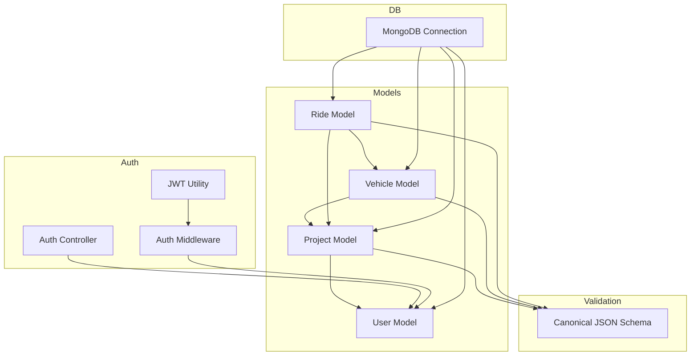
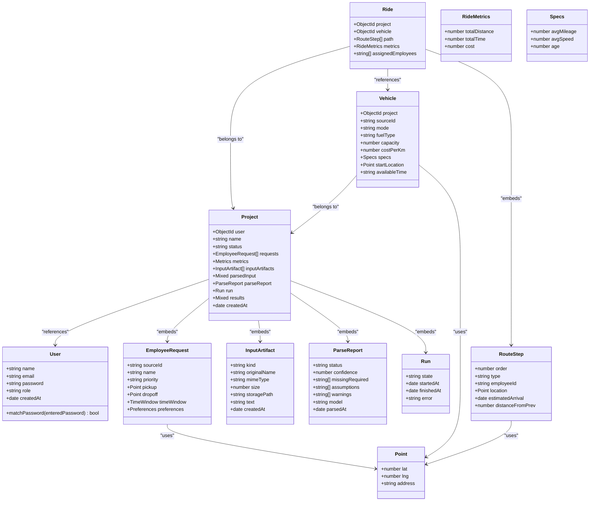
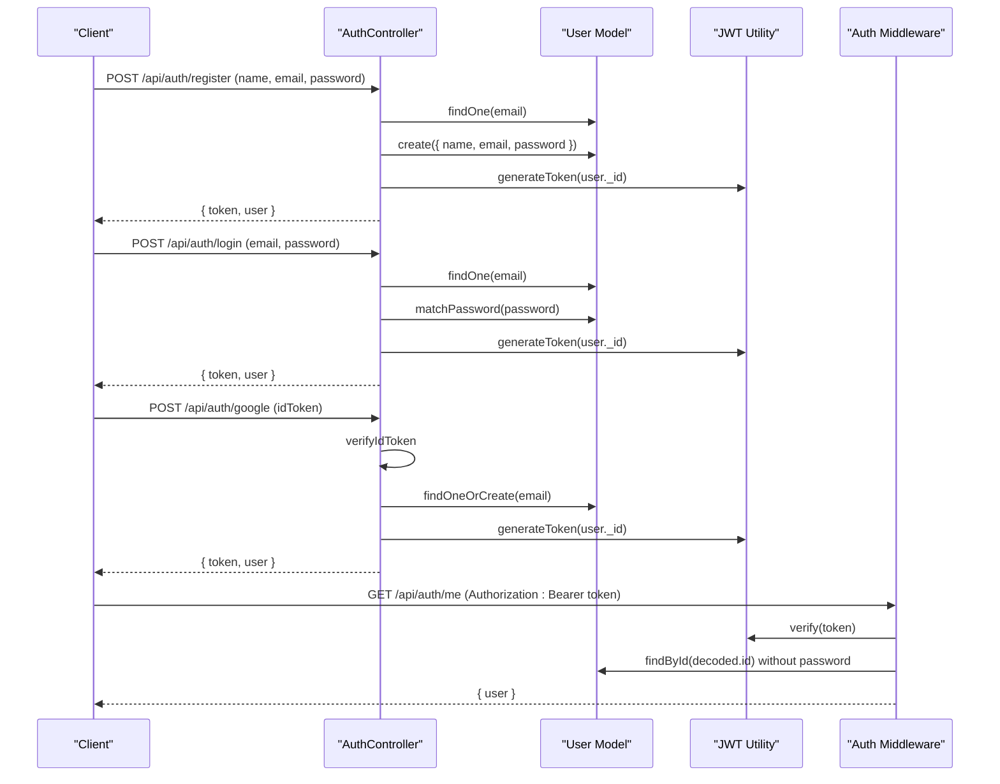
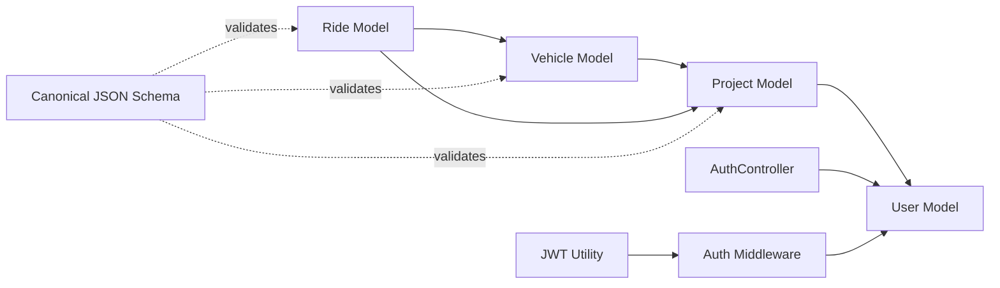

# Collection Models

<cite>
**Referenced Files in This Document**
- [Project.js](file://backend/models/Project.js)
- [Vehicle.js](file://backend/models/Vehicle.js)
- [Ride.js](file://backend/models/Ride.js)
- [User.js](file://backend/models/User.js)
- [db.js](file://backend/config/db.js)
- [canonicalSchema.js](file://backend/validation/canonicalSchema.js)
- [jwt.js](file://backend/utils/jwt.js)
- [authMiddleware.js](file://backend/middleware/authMiddleware.js)
- [authController.js](file://backend/controllers/authController.js)
</cite>

## Table of Contents
1. [Introduction](#introduction)
2. [Project Structure](#project-structure)
3. [Core Components](#core-components)
4. [Architecture Overview](#architecture-overview)
5. [Detailed Component Analysis](#detailed-component-analysis)
6. [Dependency Analysis](#dependency-analysis)
7. [Performance Considerations](#performance-considerations)
8. [Troubleshooting Guide](#troubleshooting-guide)
9. [Conclusion](#conclusion)

## Introduction
This document provides comprehensive documentation for the MongoDB collection models used in the Route Optimization project. It covers the Project model with its embedded schemas and metrics, the Vehicle model for fleet management, the Ride model for optimized route data, and the User model for authentication and authorization. For each model, we define fields, data types, validation rules, defaults, and required constraints, and we outline typical document structures and common query patterns.

## Project Structure
The models are defined in the backend under the models directory and are integrated with the database connection and validation utilities. The User model integrates with JWT-based authentication and password hashing. The Project model embeds EmployeeRequestSchema, InputArtifactSchema, and a comprehensive metrics structure. The Vehicle and Ride models form the core of the routing engine’s data representation.

**Diagram sources**
- [Project.js](file://backend/models/Project.js#L1-L96)
- [Vehicle.js](file://backend/models/Vehicle.js#L1-L45)
- [Ride.js](file://backend/models/Ride.js#L1-L48)
- [User.js](file://backend/models/User.js#L1-L27)
- [canonicalSchema.js](file://backend/validation/canonicalSchema.js#L1-L105)
- [jwt.js](file://backend/utils/jwt.js#L1-L7)
- [authController.js](file://backend/controllers/authController.js#L1-L108)
- [authMiddleware.js](file://backend/middleware/authMiddleware.js#L1-L34)
- [db.js](file://backend/config/db.js#L1-L18)

**Section sources**
- [Project.js](file://backend/models/Project.js#L1-L96)
- [Vehicle.js](file://backend/models/Vehicle.js#L1-L45)
- [Ride.js](file://backend/models/Ride.js#L1-L48)
- [User.js](file://backend/models/User.js#L1-L27)
- [db.js](file://backend/config/db.js#L1-L18)

## Core Components
This section summarizes the four primary collections and their roles:
- Project: Central orchestration document containing user ownership, status, parsed inputs, run state, and metrics.
- Vehicle: Fleet asset with capacity, cost, and location/time constraints.
- Ride: Optimized route for a vehicle, including ordered stops and summary metrics.
- User: Authentication and authorization entity with role-based access control.

Key implementation highlights:
- Embedded schemas for location data (PointSchema) are reused across models.
- Validation enums restrict acceptable values for fields like status, priority, and modes.
- Password hashing and JWT tokenization are handled in the User model and utilities.
- Canonical JSON schema defines the expected structure for ingestion and parsing.

**Section sources**
- [Project.js](file://backend/models/Project.js#L3-L8)
- [Vehicle.js](file://backend/models/Vehicle.js#L3-L7)
- [Ride.js](file://backend/models/Ride.js#L3-L7)
- [User.js](file://backend/models/User.js#L1-L27)
- [canonicalSchema.js](file://backend/validation/canonicalSchema.js#L1-L105)

## Architecture Overview
The models are interconnected:
- Project references User and embeds EmployeeRequestSchema and InputArtifactSchema.
- Vehicle belongs to a Project and includes PointSchema for start location.
- Ride belongs to a Project and references a Vehicle, with RouteStepSchema for stops.
- User is independent and used for authentication; JWT tokens are issued by the JWT utility and validated by middleware.

**Diagram sources**
- [Project.js](file://backend/models/Project.js#L10-L96)
- [Vehicle.js](file://backend/models/Vehicle.js#L9-L40)
- [Ride.js](file://backend/models/Ride.js#L9-L43)
- [User.js](file://backend/models/User.js#L4-L14)

## Detailed Component Analysis

### Project Model
The Project model encapsulates the end-to-end lifecycle of a routing job, including ingestion, parsing, execution, and reporting.

- Fields and constraints
  - user: ObjectId referencing User; required.
  - name: String; required.
  - status: Enum ['Pending', 'Processing', 'Completed', 'Failed']; default 'Pending'.
  - requests: Array of embedded EmployeeRequestSchema.
  - metrics: Embedded metrics object with numeric defaults for totals and savings.
  - inputArtifacts: Array of embedded InputArtifactSchema; default empty array.
  - parsedInput: Mixed; default null.
  - parseReport: Embedded object with status enum and arrays/lists; default values for counts and lists.
  - run: Embedded object with state enum and timestamps; default 'NotRun'.
  - results: Mixed; default null.
  - createdAt: Date; default current time.

- Embedded schemas
  - PointSchema: lat, lng (required), address (optional).
  - EmployeeRequestSchema: sourceId (required), name, priority enum ['High', 'Medium', 'Low'] with default 'Medium', pickup/dropoff (PointSchema), timeWindow with start/end strings, preferences with vehicleType enum ['Normal', 'Premium'] and sharing enum ['Single', 'Double', 'Triple'].
  - InputArtifactSchema: kind enum ['file', 'text'] (required), originalName, mimeType, size, storagePath, text, createdAt default now.

- Typical document structure
  - Minimal project with user reference, name, pending status, empty arrays for requests and inputArtifacts, null parsedInput, default parseReport and run, and null results.
  - Example path: [Project minimal example](file://backend/models/Project.js#L37-L94)

- Common query patterns
  - Find projects by user: filter by user ObjectId.
  - Filter by status: use status enum values.
  - Lookup by name: case-insensitive search via text index or regex.
  - Aggregate metrics: sum totals from metrics object across projects.
  - Project with populated user: join with User to get author details.

**Section sources**
- [Project.js](file://backend/models/Project.js#L3-L96)

### Vehicle Model
The Vehicle model represents fleet assets used for routing.

- Fields and constraints
  - project: ObjectId referencing Project; required.
  - sourceId: String; required.
  - mode: Enum ['2-wheeler', '4-wheeler', 'Van']; required.
  - fuelType: Enum ['Petrol', 'Diesel', 'Electric'].
  - capacity: Number; required.
  - costPerKm: Number; required.
  - specs: Embedded object with avgMileage, avgSpeed, age (all numbers).
  - startLocation: PointSchema (lat/lng/address).
  - availableTime: String (time format like "HH:mm").

- Typical document structure
  - Vehicle with project reference, sourceId, mode, fuelType, capacity, costPerKm, optional specs, startLocation, and availableTime.
  - Example path: [Vehicle minimal example](file://backend/models/Vehicle.js#L9-L40)

- Common query patterns
  - Find vehicles by project: filter by project ObjectId.
  - Filter by mode/fuelType: enum filters.
  - Capacity constraints: compare capacity against demand.
  - Location proximity: use geospatial queries on startLocation.
  - Time availability: match availableTime against schedule windows.

**Section sources**
- [Vehicle.js](file://backend/models/Vehicle.js#L3-L45)

### Ride Model
The Ride model captures the optimized route for a specific vehicle.

- Fields and constraints
  - project: ObjectId referencing Project; required.
  - vehicle: ObjectId referencing Vehicle; required.
  - path: Array of RouteStepSchema with order, type enum ['pickup', 'dropoff'], employeeId, location (PointSchema), estimatedArrival, distanceFromPrev.
  - metrics: Embedded object with totalDistance, totalTime (minutes), cost.
  - assignedEmployees: Array of employee sourceIds (strings).

- Typical document structure
  - Ride with project and vehicle references, ordered path of stops, summary metrics, and assigned employees.
  - Example path: [Ride minimal example](file://backend/models/Ride.js#L19-L43)

- Common query patterns
  - Get rides for a project: filter by project ObjectId.
  - Get rides for a vehicle: filter by vehicle ObjectId.
  - Order path by order field for display.
  - Summarize metrics across rides for a project.
  - Assign employees to rides: update assignedEmployees array.

**Section sources**
- [Ride.js](file://backend/models/Ride.js#L3-L48)

### User Model
The User model manages authentication and authorization with role-based access control.

- Fields and constraints
  - name: String; required, trimmed.
  - email: String; required, unique, lowercase, trimmed.
  - password: String; required, min length 6.
  - role: Enum ['Admin', 'Manager', 'Viewer']; default 'Manager'.
  - createdAt: Date; default current time.

- Security features
  - Pre-save hook hashes passwords using bcrypt.
  - matchPassword method compares entered password with stored hash.

- Typical document structure
  - User with name, email, hashed password, role, and creation timestamp.
  - Example path: [User minimal example](file://backend/models/User.js#L4-L14)

- Common query patterns
  - Register: create user with name, email, password.
  - Login: find by email, verify password.
  - Google login: verify idToken, create user if needed.
  - Protected routes: use authMiddleware to attach user to request.

**Section sources**
- [User.js](file://backend/models/User.js#L1-L27)
- [jwt.js](file://backend/utils/jwt.js#L1-L7)
- [authMiddleware.js](file://backend/middleware/authMiddleware.js#L1-L34)
- [authController.js](file://backend/controllers/authController.js#L1-L108)

## Architecture Overview

**Diagram sources**
- [authController.js](file://backend/controllers/authController.js#L17-L108)
- [jwt.js](file://backend/utils/jwt.js#L3-L5)
- [authMiddleware.js](file://backend/middleware/authMiddleware.js#L4-L32)
- [User.js](file://backend/models/User.js#L16-L25)

## Detailed Component Analysis

### Project Model Details
- Embedded schemas and defaults
  - EmployeeRequestSchema: priority defaults to 'Medium'; preferences optional enums; timeWindow with string times.
  - InputArtifactSchema: kind required; createdAt defaults to now.
  - Metrics: numeric fields default to 0; useful for aggregation.
  - ParseReport: status defaults to 'failed'; arrays default to empty; confidence defaults to 0.
  - Run: state defaults to 'NotRun'; timestamps optional until set.

- Typical document structure
  - Minimal: user, name, status 'Pending', empty arrays, null mixed fields.
  - Example path: [Project minimal example](file://backend/models/Project.js#L37-L94)

- Common query patterns
  - By user: Project.find({ user: userId }).
  - By status: Project.find({ status: 'Completed' }).
  - With populated user: Project.populate('user').
  - Aggregation: sum metrics across projects.

**Section sources**
- [Project.js](file://backend/models/Project.js#L10-L96)

### Vehicle Model Details
- Constraints and defaults
  - mode and capacity required; costPerKm required; fuelType optional.
  - specs fields optional; startLocation required; availableTime optional.

- Typical document structure
  - Minimal: project, sourceId, mode, fuelType, capacity, costPerKm, optional specs, startLocation, availableTime.
  - Example path: [Vehicle minimal example](file://backend/models/Vehicle.js#L9-L40)

- Common query patterns
  - By project: Vehicle.find({ project: projectId }).
  - By mode: Vehicle.find({ mode: { $in: ['4-wheeler', 'Van'] } }).
  - Capacity vs demand: compare capacity with total passengers.

**Section sources**
- [Vehicle.js](file://backend/models/Vehicle.js#L9-L45)

### Ride Model Details
- Route steps and metrics
  - RouteStepSchema: order required; type required; employeeId optional; location required; arrival and distance optional.
  - RideMetrics: totalDistance, totalTime, cost optional until computed.

- Typical document structure
  - Minimal: project, vehicle, path with ordered steps, metrics, assignedEmployees.
  - Example path: [Ride minimal example](file://backend/models/Ride.js#L19-L43)

- Common query patterns
  - By project: Ride.find({ project: projectId }).
  - By vehicle: Ride.find({ vehicle: vehicleId }).
  - Sort path: sort by order for display.

**Section sources**
- [Ride.js](file://backend/models/Ride.js#L9-L48)

### User Model Details
- Authentication and authorization
  - Pre-save hook hashes password; matchPassword compares plain text with hash.
  - Role-based access control via role enum; default 'Manager'.

- Typical document structure
  - Minimal: name, email, hashed password, role, createdAt.
  - Example path: [User minimal example](file://backend/models/User.js#L4-L14)

- Common query patterns
  - Register: User.create({ name, email, password }).
  - Login: User.findOne({ email }) and matchPassword.
  - Protected route: MW verifies token and attaches user.

**Section sources**
- [User.js](file://backend/models/User.js#L16-L25)
- [jwt.js](file://backend/utils/jwt.js#L3-L5)
- [authMiddleware.js](file://backend/middleware/authMiddleware.js#L4-L32)
- [authController.js](file://backend/controllers/authController.js#L17-L108)

## Dependency Analysis

**Diagram sources**
- [Project.js](file://backend/models/Project.js#L37-L42)
- [Vehicle.js](file://backend/models/Vehicle.js#L10-L14)
- [Ride.js](file://backend/models/Ride.js#L20-L29)
- [User.js](file://backend/models/User.js#L4-L14)
- [authController.js](file://backend/controllers/authController.js#L17-L108)
- [authMiddleware.js](file://backend/middleware/authMiddleware.js#L4-L32)
- [jwt.js](file://backend/utils/jwt.js#L3-L5)
- [canonicalSchema.js](file://backend/validation/canonicalSchema.js#L1-L105)

**Section sources**
- [Project.js](file://backend/models/Project.js#L37-L42)
- [Vehicle.js](file://backend/models/Vehicle.js#L10-L14)
- [Ride.js](file://backend/models/Ride.js#L20-L29)
- [User.js](file://backend/models/User.js#L4-L14)
- [authController.js](file://backend/controllers/authController.js#L17-L108)
- [authMiddleware.js](file://backend/middleware/authMiddleware.js#L4-L32)
- [jwt.js](file://backend/utils/jwt.js#L3-L5)
- [canonicalSchema.js](file://backend/validation/canonicalSchema.js#L1-L105)

## Performance Considerations
- Indexes
  - Vehicle and Ride models include indexes on project to speed up lookups by project.
  - Consider adding compound indexes for frequent queries (e.g., project + status for Projects).
- Embedded vs referenced documents
  - Embedded schemas reduce joins but can increase document size; evaluate based on query patterns.
- Geospatial queries
  - Use PointSchema for location fields; consider 2dsphere indexes for geospatial queries.
- Password hashing
  - bcrypt cost is set in pre-save hook; adjust based on hardware constraints.
- Token verification
  - Ensure JWT secret is strong and environment-specific; middleware verifies tokens efficiently.

[No sources needed since this section provides general guidance]

## Troubleshooting Guide
- Authentication errors
  - Missing or invalid token: ensure Authorization header starts with "Bearer ".
  - User not found: verify token payload and user existence.
  - Invalid credentials: confirm email/password correctness.
- Registration conflicts
  - Duplicate email: ensure uniqueness constraint is respected.
- Parsing and ingestion
  - Parse report status: check status, confidence, missingRequired, assumptions, warnings.
  - Canonical schema mismatches: validate against canonicalSchema.js.
- Database connectivity
  - Connection timeout: review serverSelectionTimeoutMS and socketTimeoutMS.
  - Connection failures: verify MONGO_URI and network access.

**Section sources**
- [authMiddleware.js](file://backend/middleware/authMiddleware.js#L4-L32)
- [authController.js](file://backend/controllers/authController.js#L17-L108)
- [db.js](file://backend/config/db.js#L3-L16)
- [canonicalSchema.js](file://backend/validation/canonicalSchema.js#L1-L105)

## Conclusion
The Route Optimization project models provide a structured foundation for managing projects, fleets, routes, and users. The embedded schemas enable compact representations of related data, while the canonical schema ensures consistent ingestion. Authentication and authorization are handled securely with JWT and bcrypt. Proper indexing and validation help maintain performance and data integrity across the system.