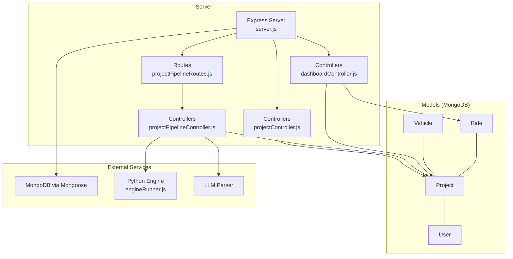
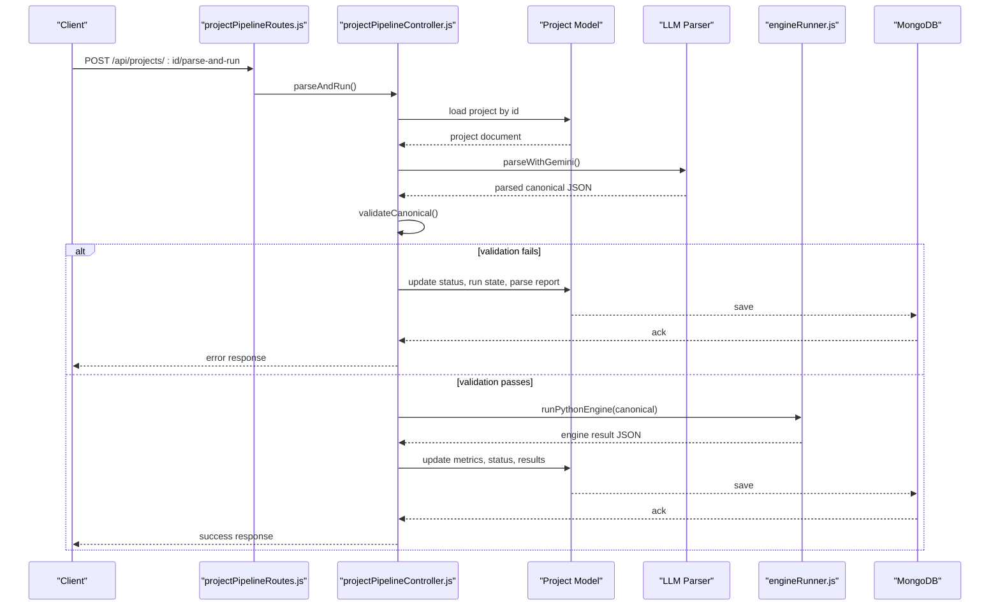
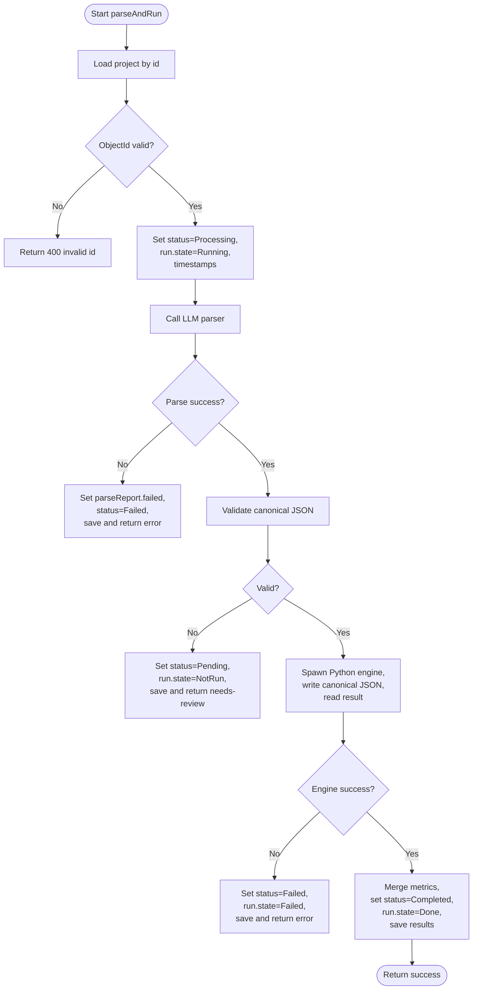
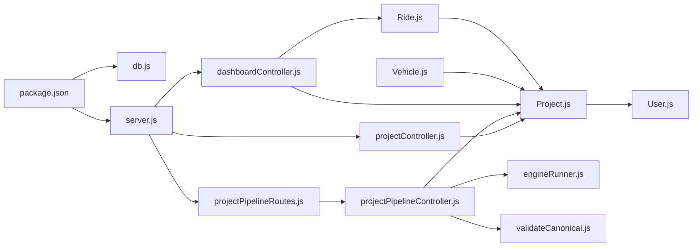

# Data Access Patterns and Optimization

<cite>
**Referenced Files in This Document**
- [db.js](file://backend/config/db.js)
- [server.js](file://backend/server.js)
- [package.json](file://backend/package.json)
- [Project.js](file://backend/models/Project.js)
- [Ride.js](file://backend/models/Ride.js)
- [Vehicle.js](file://backend/models/Vehicle.js)
- [User.js](file://backend/models/User.js)
- [projectController.js](file://backend/controllers/projectController.js)
- [projectPipelineController.js](file://backend/controllers/projectPipelineController.js)
- [dashboardController.js](file://backend/controllers/dashboardController.js)
- [projectPipelineRoutes.js](file://backend/routes/projectPipelineRoutes.js)
- [.env](file://backend/.env)
- [engineRunner.js](file://backend/services/engineRunner.js)
- [validateCanonical.js](file://backend/validation/validateCanonical.js)
</cite>

## Table of Contents
1. [Introduction](#introduction)
2. [Project Structure](#project-structure)
3. [Core Components](#core-components)
4. [Architecture Overview](#architecture-overview)
5. [Detailed Component Analysis](#detailed-component-analysis)
6. [Dependency Analysis](#dependency-analysis)
7. [Performance Considerations](#performance-considerations)
8. [Troubleshooting Guide](#troubleshooting-guide)
9. [Conclusion](#conclusion)
10. [Appendices](#appendices)

## Introduction
This document explains MongoDB data access patterns and performance optimization strategies for the route optimization backend. It focuses on:
- Query optimization for retrieving projects, ride optimization results, and analytics aggregation
- Indexing strategies for user references, project status, and timestamp ranges
- Data access patterns in the optimization pipeline including ingestion, parsing, running the Python engine, and persisting results
- Bulk operations, aggregation-like computations, and transaction handling considerations
- Performance considerations for large datasets, memory usage, and connection pooling
- Data lifecycle management including cleanup, archival, and retention of optimization results

## Project Structure
The backend uses Express.js with Mongoose ODM to manage MongoDB collections for Users, Projects, Vehicles, and Rides. Controllers orchestrate data access and pipeline steps, while routes expose REST endpoints. Environment variables configure the MongoDB connection and external integrations.

**Diagram sources**
- [server.js](file://backend/server.js#L17-L55)
- [projectPipelineRoutes.js](file://backend/routes/projectPipelineRoutes.js#L1-L31)
- [projectController.js](file://backend/controllers/projectController.js#L1-L117)
- [projectPipelineController.js](file://backend/controllers/projectPipelineController.js#L1-L216)
- [dashboardController.js](file://backend/controllers/dashboardController.js#L1-L73)
- [Project.js](file://backend/models/Project.js#L1-L96)
- [Ride.js](file://backend/models/Ride.js#L1-L48)
- [Vehicle.js](file://backend/models/Vehicle.js#L1-L45)
- [User.js](file://backend/models/User.js#L1-L27)
- [engineRunner.js](file://backend/services/engineRunner.js#L1-L73)

**Section sources**
- [server.js](file://backend/server.js#L1-L56)
- [package.json](file://backend/package.json#L1-L28)

## Core Components
- Database connection and options: centralized connection with timeouts configured for reliability and fail-fast behavior.
- Models:
  - Project: stores user ownership, status, metrics, artifacts, parsed input, run state, and results.
  - Vehicle: fleet entries linked to a project with attributes and specs.
  - Ride: optimized routes per vehicle linked to a project, with path steps and summary metrics.
  - User: authentication and role model with pre-save hashing.
- Controllers:
  - Project CRUD and deletion with cascading deletes for dependent documents.
  - Pipeline ingestion, parsing, and engine execution with status transitions.
  - Dashboard summary and metrics aggregation over project-level metrics.
- Routes: protected endpoints for ingestion, parsing/run, and result retrieval.

**Section sources**
- [db.js](file://backend/config/db.js#L1-L18)
- [Project.js](file://backend/models/Project.js#L1-L96)
- [Vehicle.js](file://backend/models/Vehicle.js#L1-L45)
- [Ride.js](file://backend/models/Ride.js#L1-L48)
- [User.js](file://backend/models/User.js#L1-L27)
- [projectController.js](file://backend/controllers/projectController.js#L1-L117)
- [projectPipelineController.js](file://backend/controllers/projectPipelineController.js#L1-L216)
- [dashboardController.js](file://backend/controllers/dashboardController.js#L1-L73)
- [projectPipelineRoutes.js](file://backend/routes/projectPipelineRoutes.js#L1-L31)

## Architecture Overview
The system connects to MongoDB via Mongoose, exposes REST endpoints, and integrates with a Python engine for optimization runs. Data access follows a layered pattern: routes -> controllers -> models, with asynchronous operations coordinated using promises.

**Diagram sources**
- [projectPipelineRoutes.js](file://backend/routes/projectPipelineRoutes.js#L22-L23)
- [projectPipelineController.js](file://backend/controllers/projectPipelineController.js#L65-L171)
- [engineRunner.js](file://backend/services/engineRunner.js#L21-L73)
- [validateCanonical.js](file://backend/validation/validateCanonical.js#L10-L18)
- [Project.js](file://backend/models/Project.js#L1-L96)

## Detailed Component Analysis

### Data Access Patterns and Query Optimization

- Project retrieval and pagination
  - Listing projects with sorting by creation date and pagination via skip/limit.
  - Parallel count and fetch for efficient pagination metadata.
  - Security enforced by filtering by user ownership.
  - Optimization: keep sort key aligned with index; avoid deep pagination for very large sets.

- Single project retrieval
  - Fetch by ObjectId with ownership check; minimal projection for listing endpoints.

- Dashboard analytics aggregation
  - Summary counts and recent projects with selective field projection.
  - Aggregation-like computation client-side over metrics fields for savings, time saved, and averages.

- Ride and Vehicle access
  - Queries filtered by project to ensure scoping and ownership.
  - Indexes on foreign keys improve join-like reads.

- Pipeline ingestion and updates
  - Append artifacts to arrays and save; later stages update status and metrics atomically.

- Deletion cascade
  - Delete vehicles and rides for a project before deleting the project itself.

**Section sources**
- [projectController.js](file://backend/controllers/projectController.js#L35-L56)
- [projectController.js](file://backend/controllers/projectController.js#L58-L80)
- [projectController.js](file://backend/controllers/projectController.js#L82-L110)
- [dashboardController.js](file://backend/controllers/dashboardController.js#L5-L33)
- [dashboardController.js](file://backend/controllers/dashboardController.js#L35-L67)
- [Ride.js](file://backend/models/Ride.js#L45-L47)
- [Vehicle.js](file://backend/models/Vehicle.js#L42-L43)

### Indexing Strategies

- Purpose-built indexes
  - Project.user: supports user-scoped queries and dashboard summaries.
  - Project.status: supports filtering by status for analytics and monitoring.
  - Project.createdAt: supports reverse chronological listing and pagination.
  - Ride.project: supports fetching rides for a given project.
  - Vehicle.project: supports fetching fleet for a project.

- Recommended compound indexes (conceptual)
  - { user: 1, createdAt: -1 }: improves paginated user dashboards.
  - { user: 1, status: 1 }: improves analytics by status for a user.
  - { project: 1, createdAt: -1 }: improves listing rides/vehicles per project with timestamps.

- Timestamp range scans
  - For future analytics over createdAt ranges, ensure appropriate indexes exist to avoid collection scans.

Note: Current code defines indexes on single fields; compound indexes can be added to further optimize frequent query patterns.

**Section sources**
- [Project.js](file://backend/models/Project.js#L37-L94)
- [Ride.js](file://backend/models/Ride.js#L45-L47)
- [Vehicle.js](file://backend/models/Vehicle.js#L42-L43)

### Optimization Pipeline Data Access

- Ingestion
  - Append artifacts to project.inputArtifacts and save; supports both text notes and uploaded files.

- Parsing and validation
  - LLM produces canonical JSON; validation uses AJV schema to compute pass/fail and collect errors.
  - Updates parseReport and parsedInput; transitions project to Pending or Processing accordingly.

- Engine execution
  - Spawns Python process, streams stdin with canonical JSON, captures stdout/stderr, extracts final JSON.
  - Applies timeout to prevent hanging; handles child process errors.

- Persisting results
  - On success, merges engine metrics into project.metrics, updates status to Completed, and saves results.

- Transaction handling
  - Current implementation performs multiple writes without explicit transactions. For stronger consistency across updates, consider Mongoose transactions around critical sequences (e.g., updating run state, saving parsed input, and engine results).

**Diagram sources**
- [projectPipelineController.js](file://backend/controllers/projectPipelineController.js#L65-L171)
- [engineRunner.js](file://backend/services/engineRunner.js#L21-L73)
- [validateCanonical.js](file://backend/validation/validateCanonical.js#L10-L18)

**Section sources**
- [projectPipelineController.js](file://backend/controllers/projectPipelineController.js#L27-L63)
- [projectPipelineController.js](file://backend/controllers/projectPipelineController.js#L65-L171)
- [engineRunner.js](file://backend/services/engineRunner.js#L1-L73)
- [validateCanonical.js](file://backend/validation/validateCanonical.js#L1-L18)

### Analytics Aggregation Patterns

- Dashboard summary
  - Counts projects and completed projects for a user.
  - Retrieves recent projects with selected fields to minimize payload.
  - Counts rides for the recent project set.

- Metrics aggregation
  - Loads project metrics and computes totals and averages client-side.
  - Suitable for moderate dataset sizes; for large-scale analytics, consider moving aggregation to MongoDB using aggregation pipelines.

**Section sources**
- [dashboardController.js](file://backend/controllers/dashboardController.js#L5-L33)
- [dashboardController.js](file://backend/controllers/dashboardController.js#L35-L67)

### Data Lifecycle Management

- Cleanup policy
  - Deleting a project triggers cascading deletion of associated vehicles and rides, preventing orphaned records.

- Archive and retention
  - No explicit archive or TTL collections are configured in the current codebase.
  - Recommendation: introduce TTL indexes on createdAt for temporary artifacts or old runs, and archive completed projects to a separate collection or bucket for long-term retention.

- Data retention for optimization results
  - Results are stored in the project document; consider periodic archiving of completed projects and purging of intermediate artifacts after a retention period.

**Section sources**
- [projectController.js](file://backend/controllers/projectController.js#L82-L110)
- [Project.js](file://backend/models/Project.js#L66-L91)

## Dependency Analysis

**Diagram sources**
- [package.json](file://backend/package.json#L9-L22)
- [db.js](file://backend/config/db.js#L1-L18)
- [server.js](file://backend/server.js#L1-L56)
- [Project.js](file://backend/models/Project.js#L1-L96)
- [Ride.js](file://backend/models/Ride.js#L1-L48)
- [Vehicle.js](file://backend/models/Vehicle.js#L1-L45)
- [User.js](file://backend/models/User.js#L1-L27)
- [projectController.js](file://backend/controllers/projectController.js#L1-L117)
- [projectPipelineController.js](file://backend/controllers/projectPipelineController.js#L1-L216)
- [dashboardController.js](file://backend/controllers/dashboardController.js#L1-L73)
- [projectPipelineRoutes.js](file://backend/routes/projectPipelineRoutes.js#L1-L31)
- [engineRunner.js](file://backend/services/engineRunner.js#L1-L73)
- [validateCanonical.js](file://backend/validation/validateCanonical.js#L1-L18)

**Section sources**
- [package.json](file://backend/package.json#L1-L28)
- [server.js](file://backend/server.js#L1-L56)

## Performance Considerations

- Connection pooling and options
  - Connection established with server selection and socket timeouts to improve resilience and fail-fast behavior.
  - Consider adding connection pool configuration (poolSize, maxPoolSize) in production deployments.

- Query performance
  - Use targeted indexes on user, status, and createdAt for efficient pagination and filtering.
  - Prefer projections to reduce payload size for listing endpoints.
  - Avoid N+1 queries by batching operations and using populate judiciously.

- Memory usage optimization
  - Stream large file uploads and avoid loading entire payloads into memory unnecessarily.
  - Limit response sizes for analytics endpoints; paginate and filter aggressively.

- Bulk operations
  - Use array updates for appending artifacts and batch writes where possible.
  - For large-scale analytics, consider aggregation pipelines to offload computation to the database.

- Transactions
  - Wrap critical write sequences (e.g., parsing, validating, and saving engine results) in transactions to maintain consistency.

- Python engine integration
  - Apply timeouts and handle process errors gracefully.
  - Ensure the Python script outputs a single JSON object/array; robust extraction prevents parsing overhead.

- Large datasets
  - Introduce compound indexes for frequent filters (user + status, project + timestamp).
  - Consider sharding by user or project for horizontal scaling.

**Section sources**
- [db.js](file://backend/config/db.js#L3-L16)
- [projectController.js](file://backend/controllers/projectController.js#L35-L56)
- [dashboardController.js](file://backend/controllers/dashboardController.js#L35-L67)
- [engineRunner.js](file://backend/services/engineRunner.js#L21-L73)

## Troubleshooting Guide

- MongoDB connection failures
  - Verify MONGO_URI and network connectivity; the connection routine logs errors and exits on failure.

- Invalid ObjectId errors
  - Ensure endpoints receive valid ObjectId strings; handlers return 400 for malformed IDs.

- Forbidden access
  - Controllers enforce ownership checks; ensure authentication middleware attaches user to the request.

- Pipeline errors
  - LLM parser failures lead to failed parseReport and project status set to Failed.
  - Engine errors are captured and surfaced with error messages; verify Python environment and script availability.

- Timeout during engine execution
  - Adjust timeoutMs in engineRunner; ensure sufficient resources for the Python process.

**Section sources**
- [db.js](file://backend/config/db.js#L12-L15)
- [projectController.js](file://backend/controllers/projectController.js#L62-L77)
- [projectPipelineController.js](file://backend/controllers/projectPipelineController.js#L31-L40)
- [projectPipelineController.js](file://backend/controllers/projectPipelineController.js#L162-L170)
- [engineRunner.js](file://backend/services/engineRunner.js#L35-L40)

## Conclusion
The backend implements clear data access patterns with Mongoose, focusing on user-scoped queries, pipeline-driven ingestion and optimization, and dashboard analytics. Current indexes on foreign keys support common read patterns. To scale, introduce compound indexes, consider aggregation pipelines for analytics, apply transactions for critical write sequences, and implement lifecycle policies for artifacts and archived results.

## Appendices

### Environment Variables
- MONGO_URI: MongoDB connection string
- JWT_SECRET: Secret for JWT signing
- GEMINI_API_KEY and GEMINI_MODEL: LLM configuration
- GOOGLE_MAPS_API_KEY: Maps integration
- CORS_ORIGINS: Comma-separated list of allowed origins

**Section sources**
- [.env](file://backend/.env#L1-L9)