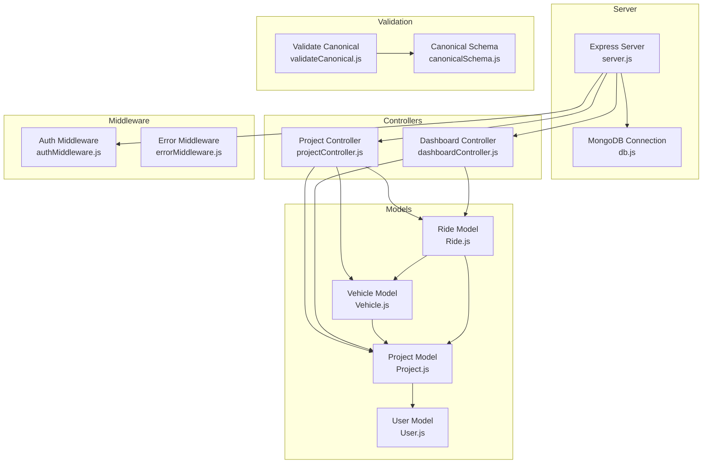
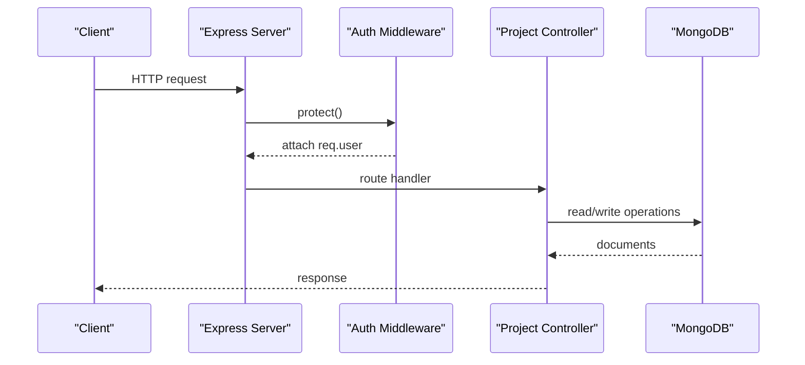
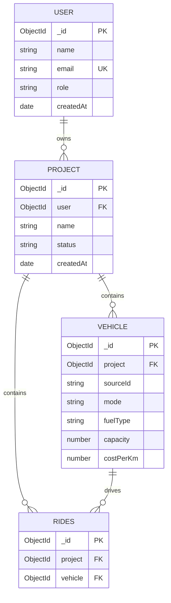
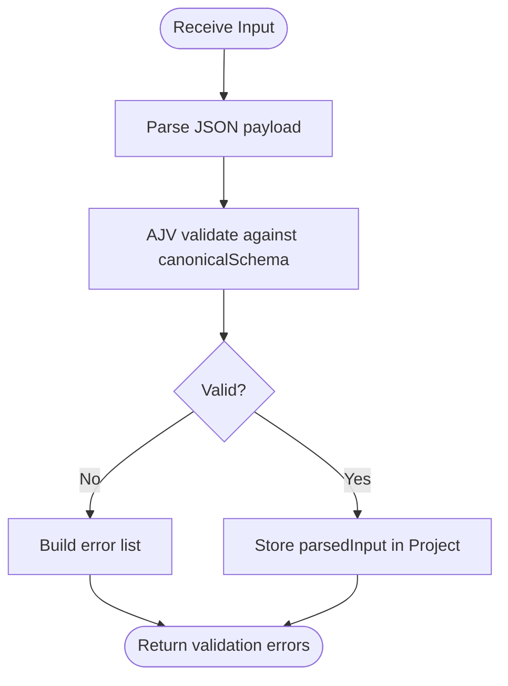
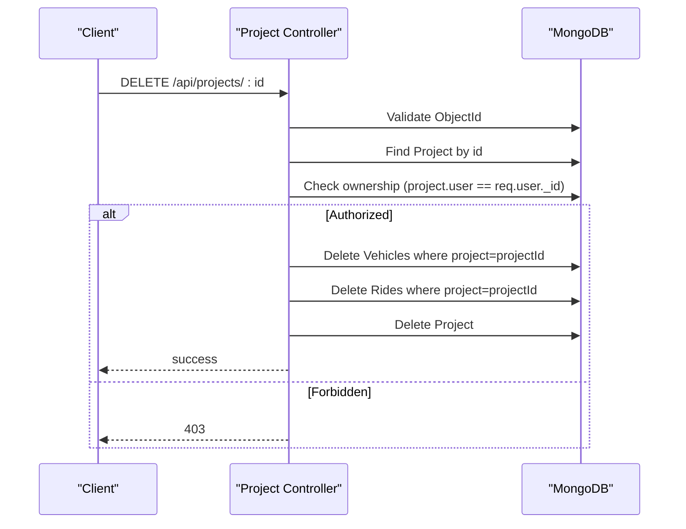
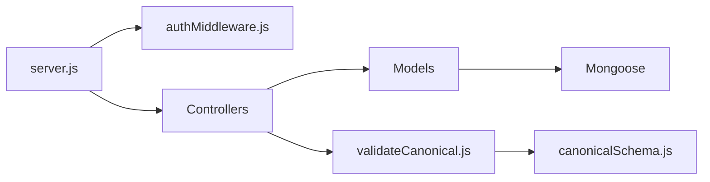

# Database Design

<cite>
**Referenced Files in This Document**
- [db.js](file://backend/config/db.js)
- [server.js](file://backend/server.js)
- [User.js](file://backend/models/User.js)
- [Project.js](file://backend/models/Project.js)
- [Vehicle.js](file://backend/models/Vehicle.js)
- [Ride.js](file://backend/models/Ride.js)
- [projectController.js](file://backend/controllers/projectController.js)
- [dashboardController.js](file://backend/controllers/dashboardController.js)
- [authMiddleware.js](file://backend/middleware/authMiddleware.js)
- [errorMiddleware.js](file://backend/middleware/errorMiddleware.js)
- [canonicalSchema.js](file://backend/validation/canonicalSchema.js)
- [validateCanonical.js](file://backend/validation/validateCanonical.js)
</cite>

## Table of Contents
1. [Introduction](#introduction)
2. [Project Structure](#project-structure)
3. [Core Components](#core-components)
4. [Architecture Overview](#architecture-overview)
5. [Detailed Component Analysis](#detailed-component-analysis)
6. [Dependency Analysis](#dependency-analysis)
7. [Performance Considerations](#performance-considerations)
8. [Troubleshooting Guide](#troubleshooting-guide)
9. [Conclusion](#conclusion)
10. [Appendices](#appendices)

## Introduction
This document describes the MongoDB database schema and data model for the Route Optimization project. It focuses on the entities Projects, Vehicles, Rides, and Users, detailing field definitions, data types, relationships, indexes, constraints, validation rules, and business logic. It also covers data access patterns, query optimization strategies, lifecycle management, and security considerations for sensitive routing data.

## Project Structure
The backend uses Mongoose ODM to define schemas and enforce basic validation at the application level. The server initializes the database connection and mounts routes that operate on these models. Authentication middleware ensures per-user isolation, while controllers orchestrate CRUD operations and aggregations.

**Diagram sources**
- [server.js](file://backend/server.js#L1-L56)
- [db.js](file://backend/config/db.js#L1-L18)
- [User.js](file://backend/models/User.js#L1-L27)
- [Project.js](file://backend/models/Project.js#L1-L96)
- [Vehicle.js](file://backend/models/Vehicle.js#L1-L45)
- [Ride.js](file://backend/models/Ride.js#L1-L48)
- [projectController.js](file://backend/controllers/projectController.js#L1-L117)
- [dashboardController.js](file://backend/controllers/dashboardController.js#L1-L73)
- [authMiddleware.js](file://backend/middleware/authMiddleware.js#L1-L34)
- [errorMiddleware.js](file://backend/middleware/errorMiddleware.js#L1-L12)
- [canonicalSchema.js](file://backend/validation/canonicalSchema.js#L1-L105)
- [validateCanonical.js](file://backend/validation/validateCanonical.js#L1-L18)

**Section sources**
- [server.js](file://backend/server.js#L1-L56)
- [db.js](file://backend/config/db.js#L1-L18)

## Core Components
This section defines each collection’s purpose, fields, data types, and constraints.

- Users
  - Purpose: Store user account information and roles.
  - Fields:
    - name: string, required, trimmed
    - email: string, required, unique, lowercase, trimmed
    - password: string, required, min length 6
    - role: enum ['Admin', 'Manager', 'Viewer'], default 'Manager'
    - createdAt: date, default now
  - Constraints:
    - Unique index on email via schema option.
    - Password hashing pre-save hook.
  - Access control: JWT-based middleware enforces user identity and prevents unauthorized access.

- Projects
  - Purpose: Represent optimization runs scoped to a user. Stores raw inputs, parsed canonical data, run state, and metrics.
  - Fields:
    - user: ObjectId, ref User, required
    - name: string, required
    - status: enum ['Pending', 'Processing', 'Completed', 'Failed'], default 'Pending'
    - requests: array of embedded EmployeeRequest (see below)
    - metrics: object with numeric totals and durations
    - inputArtifacts: array of embedded InputArtifact
    - parsedInput: mixed JSON (canonical form)
    - parseReport: object with status, confidence, lists of missing/assumptions/warnings, model, parsedAt
    - run: object with state, timestamps, error
    - results: mixed JSON (engine output)
    - createdAt: date, default now
  - Embedded subdocuments:
    - EmployeeRequest: sourceId, name, priority, pickup/dropoff PointSchema, timeWindow, preferences
    - InputArtifact: kind, originalName, mimeType, size, storagePath, text, createdAt
    - PointSchema: lat, lng, address
  - Constraints:
    - Enum constraints on status, priority, preferences.vehicleType/sharing.
    - Embedded arrays default to empty.
  - Business rules:
    - Controllers enforce ownership checks and cascading deletion of related Vehicles and Rides.

- Vehicles
  - Purpose: Fleet entries associated with a Project.
  - Fields:
    - project: ObjectId, ref Project, required
    - sourceId: string, required
    - mode: enum ['2-wheeler', '4-wheeler', 'Van'], required
    - fuelType: enum ['Petrol', 'Diesel', 'Electric']
    - capacity: number, required
    - costPerKm: number, required
    - specs: avgMileage, avgSpeed, age
    - startLocation: PointSchema
    - availableTime: string (time format)
  - Indexes:
    - project: 1 (to quickly fetch fleet by project)
  - Constraints:
    - Enum constraints on mode/fuelType.
    - Embedded PointSchema.

- Rides
  - Purpose: Optimized routes for a Vehicle within a Project.
  - Fields:
    - project: ObjectId, ref Project, required
    - vehicle: ObjectId, ref Vehicle, required
    - path: array of RouteStepSchema
    - metrics: totalDistance, totalTime(minutes), cost
    - assignedEmployees: array of employee sourceIds
  - Indexes:
    - project: 1 (for dashboard aggregation)
  - Embedded subdocuments:
    - RouteStepSchema: order, type enum ['pickup','dropoff'], employeeId, location PointSchema, estimatedArrival, distanceFromPrev
    - PointSchema: lat, lng, address
  - Constraints:
    - Enum constraints on step type.
    - Arrays default to empty.

**Section sources**
- [User.js](file://backend/models/User.js#L1-L27)
- [Project.js](file://backend/models/Project.js#L1-L96)
- [Vehicle.js](file://backend/models/Vehicle.js#L1-L45)
- [Ride.js](file://backend/models/Ride.js#L1-L48)

## Architecture Overview
The system follows a layered architecture:
- Server initializes DB and registers routes.
- Middleware authenticates requests and attaches user context.
- Controllers handle business logic and interact with models.
- Models define schemas and indexes; validation ensures canonical input shape.

**Diagram sources**
- [server.js](file://backend/server.js#L1-L56)
- [authMiddleware.js](file://backend/middleware/authMiddleware.js#L1-L34)
- [projectController.js](file://backend/controllers/projectController.js#L1-L117)

## Detailed Component Analysis

### Entity Relationship Model
The relationships are modeled with references:
- User → Projects (one-to-many)
- Project → Vehicles (one-to-many)
- Project → Rides (one-to-many)
- Vehicle → Rides (one-to-many)

**Diagram sources**
- [User.js](file://backend/models/User.js#L1-L27)
- [Project.js](file://backend/models/Project.js#L1-L96)
- [Vehicle.js](file://backend/models/Vehicle.js#L1-L45)
- [Ride.js](file://backend/models/Ride.js#L1-L48)

**Section sources**
- [User.js](file://backend/models/User.js#L1-L27)
- [Project.js](file://backend/models/Project.js#L1-L96)
- [Vehicle.js](file://backend/models/Vehicle.js#L1-L45)
- [Ride.js](file://backend/models/Ride.js#L1-L48)

### Data Validation and Canonical Schema
- Canonical input shape is validated against a JSON schema that defines required fields and shapes for employees, vehicles, depot, and metadata.
- Validation uses AJV with union types support and formats.
- The parsed canonical JSON is stored in Project.parsedInput and used by the engine.

**Diagram sources**
- [canonicalSchema.js](file://backend/validation/canonicalSchema.js#L1-L105)
- [validateCanonical.js](file://backend/validation/validateCanonical.js#L1-L18)
- [Project.js](file://backend/models/Project.js#L66-L91)

**Section sources**
- [canonicalSchema.js](file://backend/validation/canonicalSchema.js#L1-L105)
- [validateCanonical.js](file://backend/validation/validateCanonical.js#L1-L18)
- [Project.js](file://backend/models/Project.js#L66-L91)

### Data Access Patterns and Business Rules
- Ownership enforcement: Controllers verify that the requesting user owns the target Project before allowing access or deletion.
- Cascading delete: Deleting a Project removes associated Vehicles and Rides.
- Aggregation: Dashboard controller computes counts and metrics across a user’s Projects and related Rides.

**Diagram sources**
- [projectController.js](file://backend/controllers/projectController.js#L82-L110)

**Section sources**
- [projectController.js](file://backend/controllers/projectController.js#L1-L117)
- [dashboardController.js](file://backend/controllers/dashboardController.js#L1-L73)

### Indexes and Constraints
- Vehicle.project: 1 (speed up fleet lookup by project)
- Ride.project: 1 (optimize dashboard queries)
- User.email: unique (via schema option)
- Enum constraints enforced at schema level for status, priority, preferences, modes, fuels, step types, run states, and parse report status.

**Section sources**
- [Vehicle.js](file://backend/models/Vehicle.js#L42-L45)
- [Ride.js](file://backend/models/Ride.js#L45-L48)
- [User.js](file://backend/models/User.js#L6)
- [Project.js](file://backend/models/Project.js#L46-L50)
- [Project.js](file://backend/models/Project.js#L14-L24)
- [Vehicle.js](file://backend/models/Vehicle.js#L18-L26)
- [Ride.js](file://backend/models/Ride.js#L12)

## Dependency Analysis
- Controllers depend on models for persistence and on middleware for authentication.
- Models depend on Mongoose for schema definition and indexes.
- Validation depends on AJV and the canonical schema definition.
- Server orchestrates middleware, routes, and error handling.

**Diagram sources**
- [server.js](file://backend/server.js#L1-L56)
- [authMiddleware.js](file://backend/middleware/authMiddleware.js#L1-L34)
- [projectController.js](file://backend/controllers/projectController.js#L1-L117)
- [User.js](file://backend/models/User.js#L1-L27)
- [Project.js](file://backend/models/Project.js#L1-L96)
- [Vehicle.js](file://backend/models/Vehicle.js#L1-L45)
- [Ride.js](file://backend/models/Ride.js#L1-L48)
- [validateCanonical.js](file://backend/validation/validateCanonical.js#L1-L18)
- [canonicalSchema.js](file://backend/validation/canonicalSchema.js#L1-L105)

**Section sources**
- [server.js](file://backend/server.js#L1-L56)
- [authMiddleware.js](file://backend/middleware/authMiddleware.js#L1-L34)
- [projectController.js](file://backend/controllers/projectController.js#L1-L117)
- [validateCanonical.js](file://backend/validation/validateCanonical.js#L1-L18)
- [canonicalSchema.js](file://backend/validation/canonicalSchema.js#L1-L105)

## Performance Considerations
- Indexes
  - Ensure Vehicle.project and Ride.project are used in queries to avoid collection scans.
  - Consider compound indexes if queries filter by user and project frequently.
- Queries
  - Pagination: Controllers already implement skip/limit; ensure sort keys match index prefixes.
  - Aggregations: Dashboard queries use countDocuments and filtered selects; keep projections minimal.
- Embedding vs Referencing
  - Requests and artifacts are embedded in Projects; this reduces joins but may increase document size. Monitor update frequency and size limits.
- Network and timeouts
  - DB connection sets server selection and socket timeouts; tune based on deployment latency.

[No sources needed since this section provides general guidance]

## Troubleshooting Guide
- Authentication failures
  - Symptom: 401 Not authorized.
  - Cause: Missing or invalid Bearer token.
  - Resolution: Verify Authorization header and token validity.
- Ownership violations
  - Symptom: 403 Forbidden on project access/delete.
  - Cause: Requesting user does not own the project.
  - Resolution: Ensure the authenticated user matches the project’s user field.
- Validation errors
  - Symptom: Canonical input rejected.
  - Cause: Missing required fields or incorrect types.
  - Resolution: Align input with canonicalSchema and review error messages returned by validateCanonical.
- Connection issues
  - Symptom: MongoDB connection error on startup.
  - Cause: Invalid MONGO_URI or network issues.
  - Resolution: Confirm environment variables and connectivity.

**Section sources**
- [authMiddleware.js](file://backend/middleware/authMiddleware.js#L1-L34)
- [projectController.js](file://backend/controllers/projectController.js#L74-L101)
- [validateCanonical.js](file://backend/validation/validateCanonical.js#L10-L16)
- [db.js](file://backend/config/db.js#L3-L16)

## Conclusion
The database design centers on four collections with clear references and embedded subdocuments. Application-level validation enforces canonical input shape, while middleware and controllers enforce access control and ownership. Indexes on foreign keys optimize common queries, and embedding reduces join complexity. Robust error handling and connection tuning support reliable operation.

[No sources needed since this section summarizes without analyzing specific files]

## Appendices

### Sample Data Structures
- User
  - Fields: id, name, email, role, createdAt
  - Example: see [User model](file://lib/models/user.dart#L1-L32) for frontend mapping
- Project
  - Fields: id, user, name, status, requests[], metrics{}, inputArtifacts[], parsedInput, parseReport{}, run{}, results, createdAt
- Vehicle
  - Fields: id, project, sourceId, mode, fuelType, capacity, costPerKm, specs{}, startLocation, availableTime
- Ride
  - Fields: id, project, vehicle, path[], metrics{}, assignedEmployees[]

**Section sources**
- [User.js](file://backend/models/User.js#L1-L27)
- [Project.js](file://backend/models/Project.js#L37-L94)
- [Vehicle.js](file://backend/models/Vehicle.js#L9-L40)
- [Ride.js](file://backend/models/Ride.js#L19-L43)

### Data Lifecycle Management
- Creation: Projects are created with default metrics and status.
- Parsing: Canonical input is validated and stored; parseReport captures confidence and warnings.
- Execution: Engine updates run state and results; metrics reflect outcomes.
- Deletion: Deleting a Project cascades to Vehicles and Rides.

**Section sources**
- [projectController.js](file://backend/controllers/projectController.js#L10-L33)
- [Project.js](file://backend/models/Project.js#L84-L91)
- [projectController.js](file://backend/controllers/projectController.js#L84-L110)

### Security, Access Control, and Privacy
- Authentication: JWT bearer tokens verified by middleware; user attached to request.
- Authorization: Controllers check ownership before read/update/delete.
- Data exposure: Error handler avoids exposing stack traces in production.
- Sensitive routing data: Keep parsedInput and results scoped to authenticated users; avoid logging raw coordinates unnecessarily.

**Section sources**
- [authMiddleware.js](file://backend/middleware/authMiddleware.js#L1-L34)
- [projectController.js](file://backend/controllers/projectController.js#L74-L101)
- [errorMiddleware.js](file://backend/middleware/errorMiddleware.js#L1-L12)