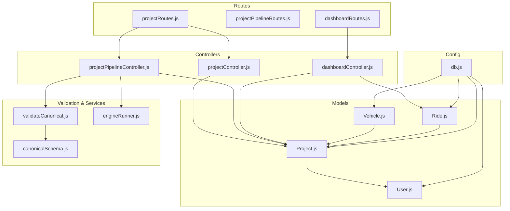
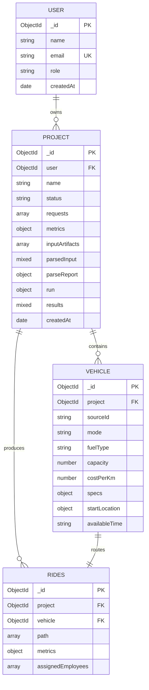
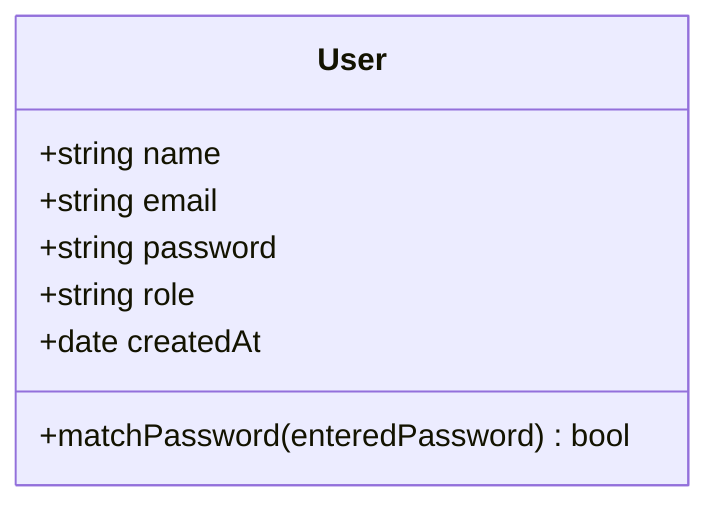
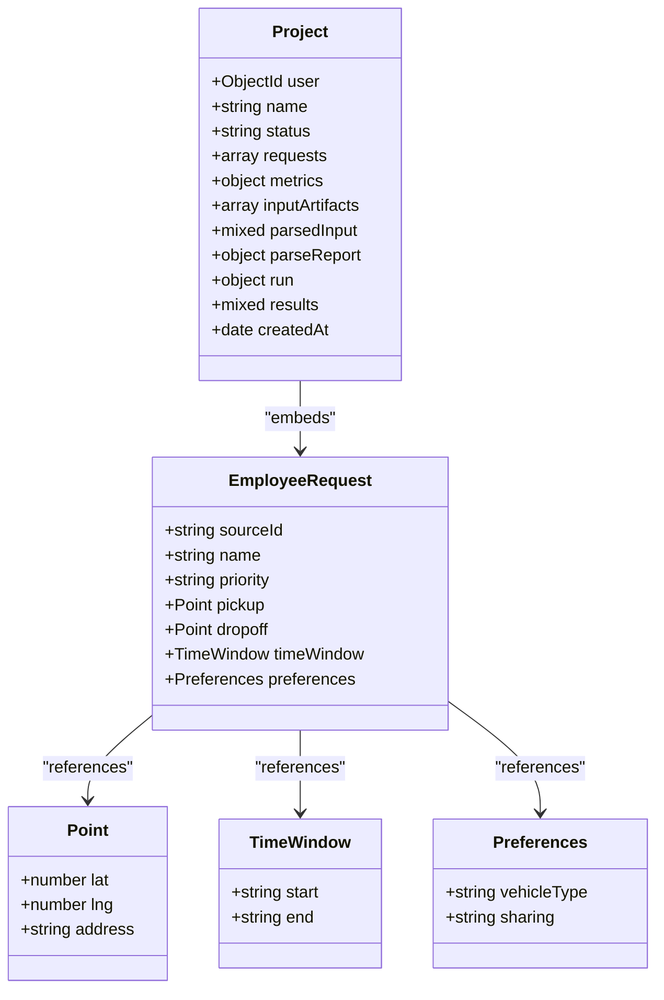
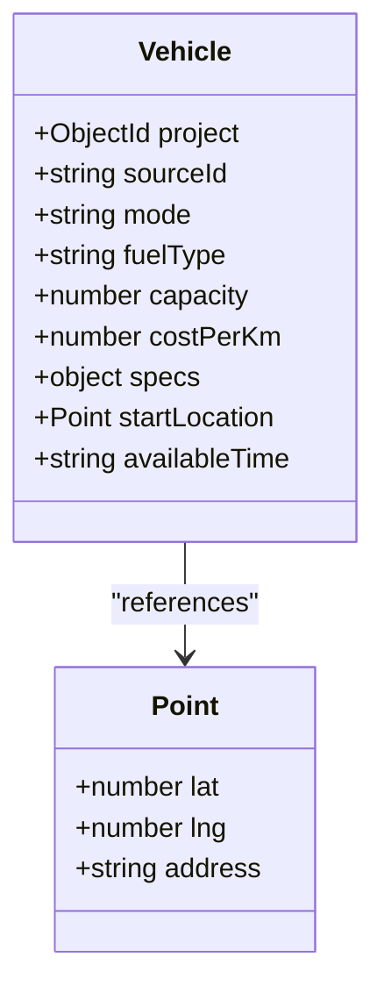
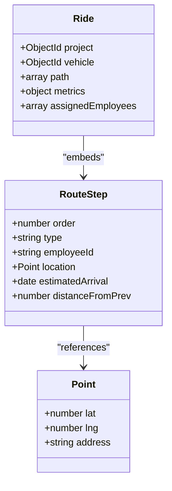
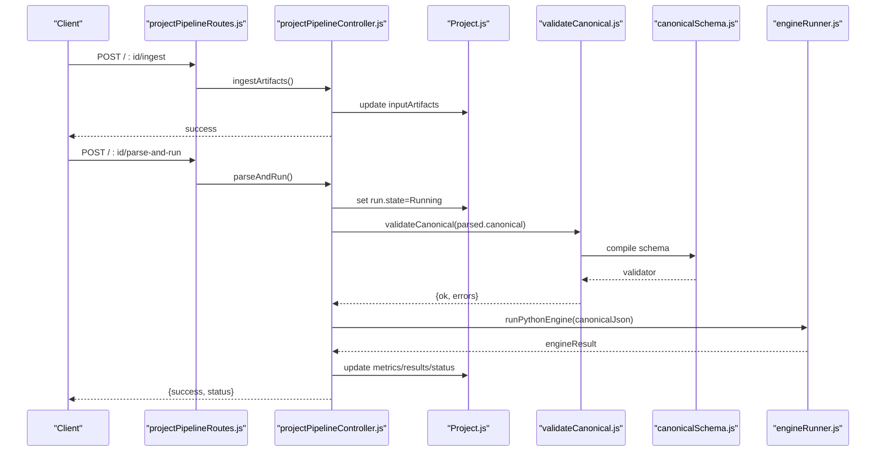
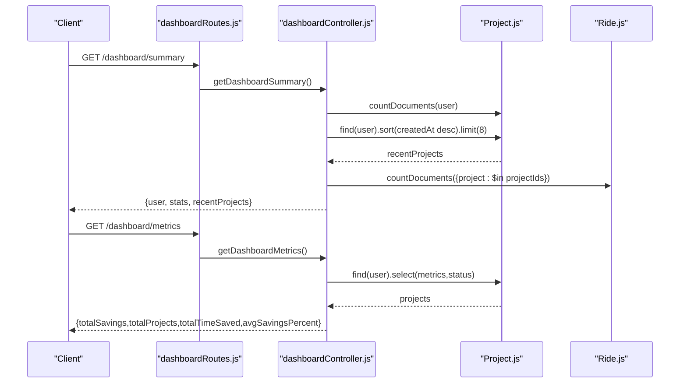
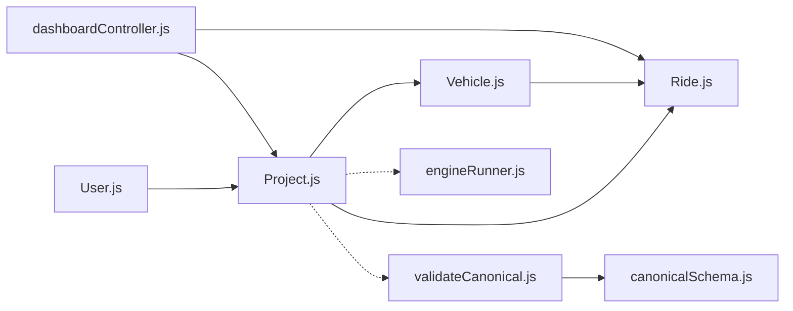

# Entity Relationships and Schema Design

<cite>
**Referenced Files in This Document**
- [Project.js](file://backend/models/Project.js)
- [User.js](file://backend/models/User.js)
- [Ride.js](file://backend/models/Ride.js)
- [Vehicle.js](file://backend/models/Vehicle.js)
- [db.js](file://backend/config/db.js)
- [projectController.js](file://backend/controllers/projectController.js)
- [projectPipelineController.js](file://backend/controllers/projectPipelineController.js)
- [dashboardController.js](file://backend/controllers/dashboardController.js)
- [projectRoutes.js](file://backend/routes/projectRoutes.js)
- [projectPipelineRoutes.js](file://backend/routes/projectPipelineRoutes.js)
- [dashboardRoutes.js](file://backend/routes/dashboardRoutes.js)
- [validateCanonical.js](file://backend/validation/validateCanonical.js)
- [canonicalSchema.js](file://backend/validation/canonicalSchema.js)
- [engineRunner.js](file://backend/services/engineRunner.js)
- [authController.js](file://backend/controllers/authController.js)
</cite>

## Table of Contents
1. [Introduction](#introduction)
2. [Project Structure](#project-structure)
3. [Core Components](#core-components)
4. [Architecture Overview](#architecture-overview)
5. [Detailed Component Analysis](#detailed-component-analysis)
6. [Dependency Analysis](#dependency-analysis)
7. [Performance Considerations](#performance-considerations)
8. [Troubleshooting Guide](#troubleshooting-guide)
9. [Conclusion](#conclusion)

## Introduction
This document explains the MongoDB entity relationship schema design for Projects, Vehicles, Rides, and Users. It details foreign key references, embedding patterns, and normalization strategies. It also documents the hierarchical structure where Projects embed EmployeeRequest data and reference Users, while Rides are embedded within Projects via derived results. The focus is on performance optimization, query patterns, and data consistency, including ObjectId references for User relationships and embedded schemas for performance-critical data.

## Project Structure
The backend models define the schema and relationships. Controllers orchestrate CRUD and pipeline operations. Routes expose endpoints for project management and dashboard analytics. Validation and services support ingestion, parsing, and engine execution.

**Diagram sources**
- [Project.js](file://backend/models/Project.js#L1-L96)
- [User.js](file://backend/models/User.js#L1-L27)
- [Ride.js](file://backend/models/Ride.js#L1-L48)
- [Vehicle.js](file://backend/models/Vehicle.js#L1-L45)
- [projectController.js](file://backend/controllers/projectController.js#L1-L117)
- [projectPipelineController.js](file://backend/controllers/projectPipelineController.js#L1-L216)
- [dashboardController.js](file://backend/controllers/dashboardController.js#L1-L73)
- [projectRoutes.js](file://backend/routes/projectRoutes.js#L1-L11)
- [projectPipelineRoutes.js](file://backend/routes/projectPipelineRoutes.js#L1-L31)
- [dashboardRoutes.js](file://backend/routes/dashboardRoutes.js#L1-L9)
- [validateCanonical.js](file://backend/validation/validateCanonical.js#L1-L18)
- [canonicalSchema.js](file://backend/validation/canonicalSchema.js#L1-L105)
- [engineRunner.js](file://backend/services/engineRunner.js#L1-L73)
- [db.js](file://backend/config/db.js#L1-L18)

**Section sources**
- [Project.js](file://backend/models/Project.js#L1-L96)
- [User.js](file://backend/models/User.js#L1-L27)
- [Ride.js](file://backend/models/Ride.js#L1-L48)
- [Vehicle.js](file://backend/models/Vehicle.js#L1-L45)
- [projectController.js](file://backend/controllers/projectController.js#L1-L117)
- [projectPipelineController.js](file://backend/controllers/projectPipelineController.js#L1-L216)
- [dashboardController.js](file://backend/controllers/dashboardController.js#L1-L73)
- [projectRoutes.js](file://backend/routes/projectRoutes.js#L1-L11)
- [projectPipelineRoutes.js](file://backend/routes/projectPipelineRoutes.js#L1-L31)
- [dashboardRoutes.js](file://backend/routes/dashboardRoutes.js#L1-L9)
- [validateCanonical.js](file://backend/validation/validateCanonical.js#L1-L18)
- [canonicalSchema.js](file://backend/validation/canonicalSchema.js#L1-L105)
- [engineRunner.js](file://backend/services/engineRunner.js#L1-L73)
- [db.js](file://backend/config/db.js#L1-L18)

## Core Components
- User: Stores identity and role. Used as a foreign key reference from Project.
- Project: Root entity that embeds EmployeeRequest and other metadata; references User via ObjectId.
- Vehicle: Fleet asset per Project, referenced by ObjectId to Project.
- Ride: Route result per Vehicle; embedded within Project-derived results; references Project and Vehicle via ObjectId.

Key design highlights:
- Embedding EmployeeRequest within Project supports frequent reads of demand data without joins.
- Using ObjectId references ensures referential integrity and efficient cross-collection queries.
- Derived results (Ride) are stored separately for scalability and to avoid large embedded arrays.

**Section sources**
- [User.js](file://backend/models/User.js#L1-L27)
- [Project.js](file://backend/models/Project.js#L1-L96)
- [Vehicle.js](file://backend/models/Vehicle.js#L1-L45)
- [Ride.js](file://backend/models/Ride.js#L1-L48)

## Architecture Overview
The system follows a hierarchical, normalized design:
- Ownership: Projects own Vehicles and derive Rides.
- Identity: Users own Projects.
- Data flow: Ingestion → Parsing → Engine Execution → Results stored on Project; dashboard aggregates metrics.

**Diagram sources**
- [User.js](file://backend/models/User.js#L1-L27)
- [Project.js](file://backend/models/Project.js#L1-L96)
- [Vehicle.js](file://backend/models/Vehicle.js#L1-L45)
- [Ride.js](file://backend/models/Ride.js#L1-L48)

## Detailed Component Analysis

### User Model
- Purpose: Authentication and authorization container.
- Role-based access control is supported via role field.
- Password hashing is handled pre-save hook.

**Diagram sources**
- [User.js](file://backend/models/User.js#L1-L27)

**Section sources**
- [User.js](file://backend/models/User.js#L1-L27)

### Project Model
- Embeds EmployeeRequest for demand data.
- References User via ObjectId.
- Tracks ingestion artifacts, parsed input, parse report, run state, and results.
- Supports metrics aggregation for analytics.

**Diagram sources**
- [Project.js](file://backend/models/Project.js#L1-L96)

**Section sources**
- [Project.js](file://backend/models/Project.js#L1-L96)

### Vehicle Model
- Per-project fleet asset with attributes for capacity, cost, and start location.
- Indexed by project for fast lookup.

**Diagram sources**
- [Vehicle.js](file://backend/models/Vehicle.js#L1-L45)

**Section sources**
- [Vehicle.js](file://backend/models/Vehicle.js#L1-L45)

### Ride Model
- Represents optimized route for a Vehicle within a Project.
- Embeds path steps and metrics; includes assigned employees by sourceId.
- Indexed by project for dashboard queries.

**Diagram sources**
- [Ride.js](file://backend/models/Ride.js#L1-L48)

**Section sources**
- [Ride.js](file://backend/models/Ride.js#L1-L48)

### Pipeline and Dashboard Workflows
- Ingestion: Adds artifacts to Project.inputArtifacts.
- Parsing: Uses Gemini to produce canonical JSON validated against canonicalSchema.
- Engine execution: Runs Python solver and updates Project.metrics and results.
- Dashboard: Aggregates counts and metrics across a user’s Projects and associated Rides.

**Diagram sources**
- [projectPipelineRoutes.js](file://backend/routes/projectPipelineRoutes.js#L1-L31)
- [projectPipelineController.js](file://backend/controllers/projectPipelineController.js#L1-L216)
- [Project.js](file://backend/models/Project.js#L1-L96)
- [validateCanonical.js](file://backend/validation/validateCanonical.js#L1-L18)
- [canonicalSchema.js](file://backend/validation/canonicalSchema.js#L1-L105)
- [engineRunner.js](file://backend/services/engineRunner.js#L1-L73)

**Section sources**
- [projectPipelineRoutes.js](file://backend/routes/projectPipelineRoutes.js#L1-L31)
- [projectPipelineController.js](file://backend/controllers/projectPipelineController.js#L1-L216)
- [Project.js](file://backend/models/Project.js#L1-L96)
- [validateCanonical.js](file://backend/validation/validateCanonical.js#L1-L18)
- [canonicalSchema.js](file://backend/validation/canonicalSchema.js#L1-L105)
- [engineRunner.js](file://backend/services/engineRunner.js#L1-L73)

### Dashboard Analytics
- Aggregates project counts, completed counts, and total rides across a user’s projects.
- Computes summary metrics across Project.metrics.

**Diagram sources**
- [dashboardRoutes.js](file://backend/routes/dashboardRoutes.js#L1-L9)
- [dashboardController.js](file://backend/controllers/dashboardController.js#L1-L73)
- [Project.js](file://backend/models/Project.js#L1-L96)
- [Ride.js](file://backend/models/Ride.js#L1-L48)

**Section sources**
- [dashboardRoutes.js](file://backend/routes/dashboardRoutes.js#L1-L9)
- [dashboardController.js](file://backend/controllers/dashboardController.js#L1-L73)

## Dependency Analysis
- Project depends on User via ObjectId reference.
- Vehicle and Ride depend on Project via ObjectId references.
- Dashboard queries rely on indexed fields for performance.
- Pipeline controllers coordinate ingestion, validation, and engine execution.

**Diagram sources**
- [User.js](file://backend/models/User.js#L1-L27)
- [Project.js](file://backend/models/Project.js#L1-L96)
- [Vehicle.js](file://backend/models/Vehicle.js#L1-L45)
- [Ride.js](file://backend/models/Ride.js#L1-L48)
- [validateCanonical.js](file://backend/validation/validateCanonical.js#L1-L18)
- [canonicalSchema.js](file://backend/validation/canonicalSchema.js#L1-L105)
- [engineRunner.js](file://backend/services/engineRunner.js#L1-L73)
- [dashboardController.js](file://backend/controllers/dashboardController.js#L1-L73)

**Section sources**
- [User.js](file://backend/models/User.js#L1-L27)
- [Project.js](file://backend/models/Project.js#L1-L96)
- [Vehicle.js](file://backend/models/Vehicle.js#L1-L45)
- [Ride.js](file://backend/models/Ride.js#L1-L48)
- [validateCanonical.js](file://backend/validation/validateCanonical.js#L1-L18)
- [canonicalSchema.js](file://backend/validation/canonicalSchema.js#L1-L105)
- [engineRunner.js](file://backend/services/engineRunner.js#L1-L73)
- [dashboardController.js](file://backend/controllers/dashboardController.js#L1-L73)

## Performance Considerations
- Indexed fields:
  - Ride.project and Vehicle.project enable fast filtering by project.
  - Dashboard queries benefit from these indexes for counts and summaries.
- Embedded vs referenced:
  - EmployeeRequest is embedded to minimize joins during frequent reads.
  - Derived results (Ride) are stored as separate documents to avoid massive embedded arrays.
- Validation and parsing:
  - Canonical schema validation prevents malformed inputs and reduces downstream errors.
- Connection tuning:
  - Connection timeouts and socket timeouts improve resilience and fail-fast behavior.

[No sources needed since this section provides general guidance]

## Troubleshooting Guide
- Authentication and authorization:
  - Ensure user is authenticated and owns the requested resource before operations.
- Project lifecycle:
  - Deletion cascades to Vehicles and Rides under the project.
- Pipeline errors:
  - Parse failures update parseReport and status accordingly.
  - Engine execution errors are captured and surfaced with run.error.
- Dashboard queries:
  - Verify project ownership and presence of indexed fields for performance.

**Section sources**
- [projectController.js](file://backend/controllers/projectController.js#L82-L110)
- [projectPipelineController.js](file://backend/controllers/projectPipelineController.js#L65-L171)
- [dashboardController.js](file://backend/controllers/dashboardController.js#L5-L33)
- [authController.js](file://backend/controllers/authController.js#L17-L108)

## Conclusion
The schema design balances normalization and embedding to optimize query patterns and performance. Projects embed frequently accessed demand data and reference Users for ownership. Vehicles and Rides are modeled as separate collections with ObjectId references, enabling scalable analytics and dashboard views. Indexes and validation further strengthen reliability and performance.