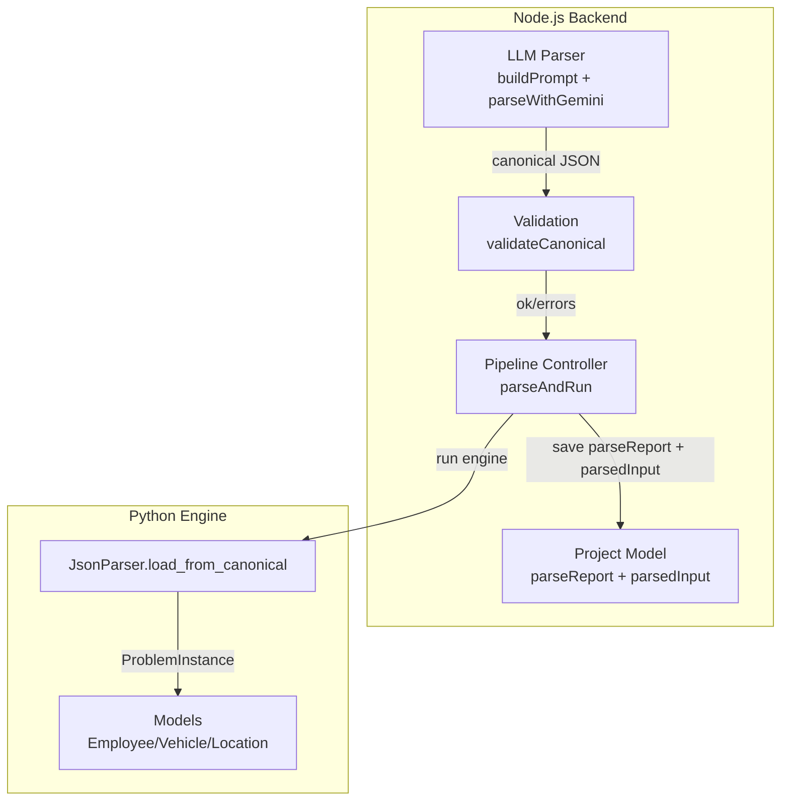
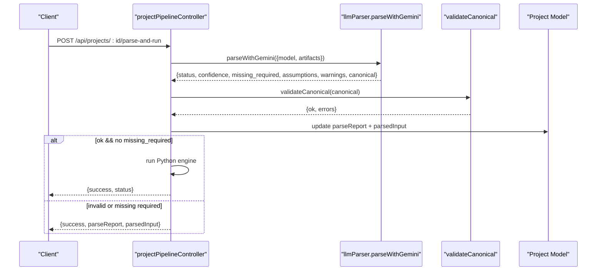
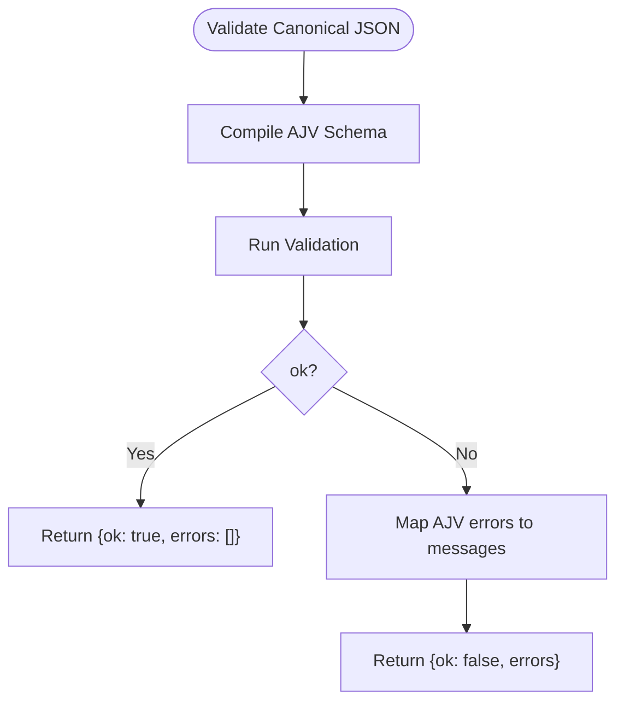
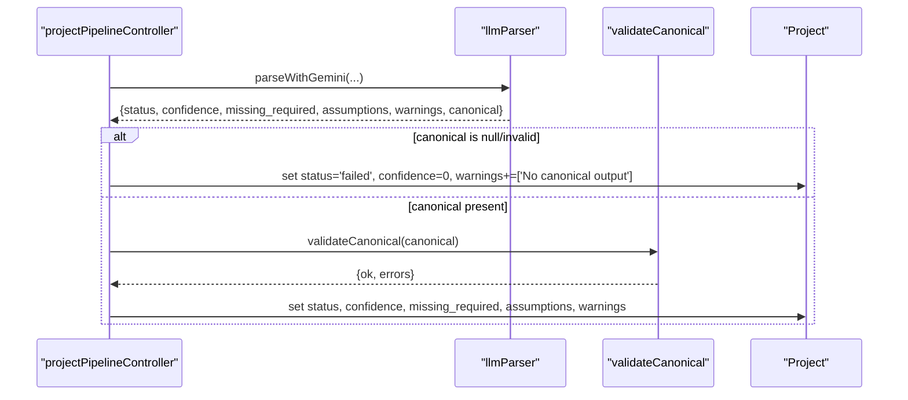
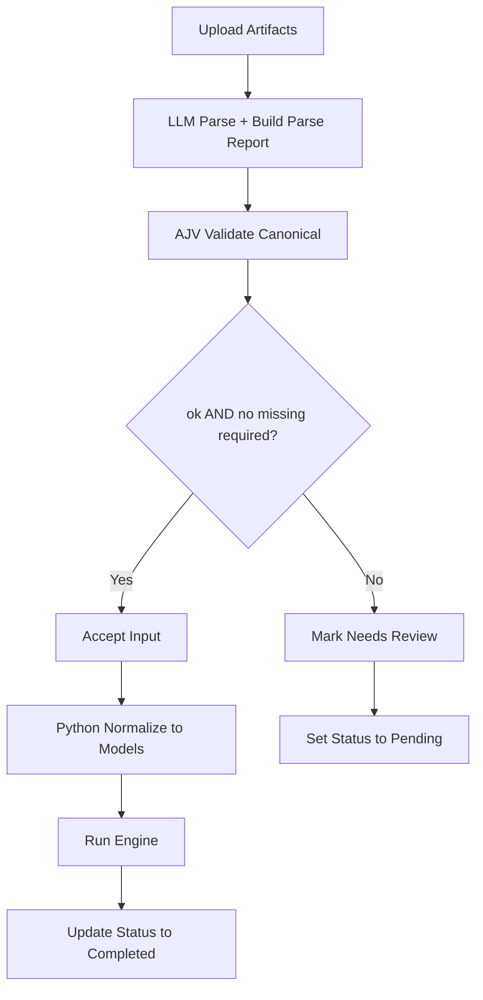
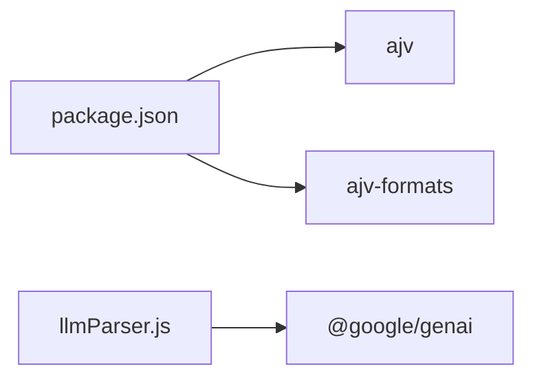

# Validation and Constraints

<cite>
**Referenced Files in This Document**
- [canonicalSchema.js](file://backend/validation/canonicalSchema.js)
- [validateCanonical.js](file://backend/validation/validateCanonical.js)
- [llmParser.js](file://backend/services/llmParser.js)
- [projectPipelineController.js](file://backend/controllers/projectPipelineController.js)
- [parser.py](file://backend/engine/parser.py)
- [models.py](file://backend/engine/models.py)
- [Project.js](file://backend/models/Project.js)
- [package.json](file://backend/package.json)
</cite>

## Table of Contents
1. [Introduction](#introduction)
2. [Project Structure](#project-structure)
3. [Core Components](#core-components)
4. [Architecture Overview](#architecture-overview)
5. [Detailed Component Analysis](#detailed-component-analysis)
6. [Dependency Analysis](#dependency-analysis)
7. [Performance Considerations](#performance-considerations)
8. [Troubleshooting Guide](#troubleshooting-guide)
9. [Conclusion](#conclusion)

## Introduction
This document explains the data validation and constraint mechanisms that ensure integrity during AI parsing and user input ingestion. It covers the canonical schema validation system, validation rules for location coordinates, time windows, priority levels, and preference constraints, and the parse report validation system including confidence scoring, missing required fields detection, and assumption logging. It also documents the validation pipeline from data ingestion to final acceptance.

## Project Structure
The validation system spans three layers:
- Canonical schema definition and runtime validation in Node.js
- LLM-driven parsing and parse report generation in Node.js
- Post-parse normalization and constraint enforcement in Python

**Diagram sources**
- [llmParser.js](file://backend/services/llmParser.js#L103-L136)
- [validateCanonical.js](file://backend/validation/validateCanonical.js#L1-L18)
- [projectPipelineController.js](file://backend/controllers/projectPipelineController.js#L65-L171)
- [parser.py](file://backend/engine/parser.py#L80-L278)
- [models.py](file://backend/engine/models.py#L1-L56)
- [Project.js](file://backend/models/Project.js#L37-L96)

**Section sources**
- [llmParser.js](file://backend/services/llmParser.js#L103-L136)
- [validateCanonical.js](file://backend/validation/validateCanonical.js#L1-L18)
- [projectPipelineController.js](file://backend/controllers/projectPipelineController.js#L65-L171)
- [parser.py](file://backend/engine/parser.py#L80-L278)
- [models.py](file://backend/engine/models.py#L1-L56)
- [Project.js](file://backend/models/Project.js#L37-L96)

## Core Components
- Canonical schema definition: Defines required fields, nested structures, and optional fields for location coordinates and time windows.
- Runtime validator: Uses AJV with union types and formats to validate incoming canonical JSON.
- LLM parser: Generates canonical JSON with confidence, missing required fields, assumptions, and warnings.
- Pipeline controller: Orchestrates ingestion, parsing, validation, and execution; updates parse reports and project state.
- Python JSON parser: Normalizes coordinates, time windows, priorities, and preferences into typed models for the engine.

**Section sources**
- [canonicalSchema.js](file://backend/validation/canonicalSchema.js#L1-L105)
- [validateCanonical.js](file://backend/validation/validateCanonical.js#L1-L18)
- [llmParser.js](file://backend/services/llmParser.js#L103-L136)
- [projectPipelineController.js](file://backend/controllers/projectPipelineController.js#L65-L171)
- [parser.py](file://backend/engine/parser.py#L80-L278)

## Architecture Overview
End-to-end validation pipeline:
1. Artifacts ingestion (files/text) stored in Project.inputArtifacts.
2. LLM extracts canonical JSON and returns a parse report with confidence, missing required fields, assumptions, and warnings.
3. Node.js validates canonical JSON against the canonical schema; updates parseReport and project state.
4. If valid, the Python engine normalizes canonical JSON into typed models and runs optimization.

**Diagram sources**
- [projectPipelineController.js](file://backend/controllers/projectPipelineController.js#L65-L171)
- [llmParser.js](file://backend/services/llmParser.js#L138-L168)
- [validateCanonical.js](file://backend/validation/validateCanonical.js#L10-L16)
- [Project.js](file://backend/models/Project.js#L72-L81)

## Detailed Component Analysis

### Canonical Schema Validation System
- Purpose: Enforce structural integrity of the canonical JSON produced by the LLM parser.
- Required top-level fields: schema_version, problem_type, employees, vehicles.
- Nested constraints:
  - employees[].id, employees[].pickup, employees[].dropoff are required.
  - employees[].pickup and employees[].dropoff require lat, lng; address is optional.
  - employees[].time_window supports start/end (optional).
  - vehicles[].id, vehicles[].capacity, vehicles[].start_location are required.
  - vehicles[].start_location requires lat, lng; address is optional.
  - Additional properties are allowed at all levels.
- Union types and nullability: Many fields accept either a specific type or null, enabling graceful handling of missing data.

**Diagram sources**
- [validateCanonical.js](file://backend/validation/validateCanonical.js#L1-L18)
- [canonicalSchema.js](file://backend/validation/canonicalSchema.js#L1-L105)

**Section sources**
- [canonicalSchema.js](file://backend/validation/canonicalSchema.js#L1-L105)
- [validateCanonical.js](file://backend/validation/validateCanonical.js#L1-L18)

### Parse Report Validation System
- Fields captured:
  - status: success | needs_review | failed
  - confidence: numeric score in [0,1]
  - missing_required: array of JSON paths for required fields not present
  - assumptions: array of user-facing assumptions made by the LLM
  - warnings: array of warnings
  - canonical: validated canonical JSON
- Pipeline behavior:
  - On failure to produce canonical JSON, status is failed, confidence is 0, and warnings include a JSON parsing issue.
  - On canonical JSON presence, validation sets status to success or needs_review depending on ok and missing_required.
  - parseReport is persisted on the Project model.

**Diagram sources**
- [projectPipelineController.js](file://backend/controllers/projectPipelineController.js#L99-L127)
- [llmParser.js](file://backend/services/llmParser.js#L152-L168)
- [validateCanonical.js](file://backend/validation/validateCanonical.js#L10-L16)
- [Project.js](file://backend/models/Project.js#L72-L81)

**Section sources**
- [llmParser.js](file://backend/services/llmParser.js#L103-L136)
- [llmParser.js](file://backend/services/llmParser.js#L138-L168)
- [projectPipelineController.js](file://backend/controllers/projectPipelineController.js#L99-L127)
- [Project.js](file://backend/models/Project.js#L72-L81)

### Constraint Enforcement for Coordinates, Time Windows, Priority, and Preferences

#### Location Coordinates
- Required fields enforced by schema:
  - employees[].pickup.lat, employees[].pickup.lng
  - employees[].dropoff.lat, employees[].dropoff.lng
  - vehicles[].start_location.lat, vehicles[].start_location.lng
- Address is optional; additional properties allowed.
- Python normalization defaults missing coordinates to safe values to prevent crashes.

**Section sources**
- [canonicalSchema.js](file://backend/validation/canonicalSchema.js#L41-L70)
- [canonicalSchema.js](file://backend/validation/canonicalSchema.js#L87-L99)
- [parser.py](file://backend/engine/parser.py#L169-L181)

#### Time Windows
- Supported forms:
  - time_window: { start, end }
  - earliest_pickup / latest_drop (legacy keys)
- Parsing converts time strings into minutes-from-origin; defaults to 0 when absent or unparsable.
- Engine enforces precedence and lateness constraints using earliest_pickup/latest_drop plus per-priority allowed delays.

**Section sources**
- [parser.py](file://backend/engine/parser.py#L183-L196)
- [models.py](file://backend/engine/models.py#L20-L24)

#### Priority Levels
- Accepts numeric or string values; normalized to 1=High, 2=Medium, 3=Low.
- Out-of-range numeric values are clamped; unrecognized strings fall back to medium.
- Used to compute per-priority allowed delay windows.

**Section sources**
- [parser.py](file://backend/engine/parser.py#L120-L157)
- [models.py](file://backend/engine/models.py#L20-L24)

#### Preference Constraints
- Vehicle category preference:
  - If a passenger has a premium preference, the assigned vehicle must be premium; otherwise, the route is marked infeasible.
- Sharing preferences:
  - Enforced by operator checks ensuring precedence and feasibility constraints.

**Section sources**
- [parser.py](file://backend/engine/parser.py#L154-L157)
- [operators.py](file://backend/engine/operators.py#L154-L157)

### Enum Values and Business Rule Validations
- Enum enforcement occurs at two levels:
  - Schema-level union types allow nulls alongside intended types.
  - Application-level normalization and checks (e.g., priority, vehicle category) ensure consistent internal representation.
- Business rules:
  - Over-capacity detection.
  - Drop before pickup detection.
  - Lateness beyond allowed window per priority.

**Section sources**
- [canonicalSchema.js](file://backend/validation/canonicalSchema.js#L39-L39)
- [canonicalSchema.js](file://backend/validation/canonicalSchema.js#L83-L83)
- [objective.py](file://backend/engine/objective.py#L138-L172)
- [operators.py](file://backend/engine/operators.py#L160-L165)

### Validation Pipeline From Ingestion to Final Acceptance
- Ingestion: Artifacts appended to Project.inputArtifacts.
- Parsing: LLM produces canonical JSON with parse report.
- Validation: Node.js validates canonical JSON; updates parseReport and project status accordingly.
- Execution: If accepted, Python engine normalizes canonical JSON into typed models and runs optimization.

**Diagram sources**
- [projectPipelineController.js](file://backend/controllers/projectPipelineController.js#L27-L63)
- [llmParser.js](file://backend/services/llmParser.js#L138-L168)
- [validateCanonical.js](file://backend/validation/validateCanonical.js#L10-L16)
- [parser.py](file://backend/engine/parser.py#L159-L278)

**Section sources**
- [projectPipelineController.js](file://backend/controllers/projectPipelineController.js#L27-L63)
- [projectPipelineController.js](file://backend/controllers/projectPipelineController.js#L99-L171)
- [parser.py](file://backend/engine/parser.py#L159-L278)

## Dependency Analysis
- Node.js dependencies for validation:
  - ajv: core JSON schema validator
  - ajv-formats: adds format keywords for richer validation
- External integrations:
  - Gemini client invoked by the LLM parser to generate canonical JSON.

**Diagram sources**
- [package.json](file://backend/package.json#L9-L22)
- [llmParser.js](file://backend/services/llmParser.js#L1-L4)

**Section sources**
- [package.json](file://backend/package.json#L9-L22)
- [llmParser.js](file://backend/services/llmParser.js#L138-L149)

## Performance Considerations
- Validation cost: AJV compilation and validation are lightweight; keep canonical JSON minimal and avoid unnecessary nesting.
- Parsing cost: LLM calls are the dominant cost; ensure prompts are concise and artifacts are preprocessed efficiently.
- Python normalization: Float/int conversions and time parsing are O(n) over arrays; ensure canonical JSON is structured to minimize redundant fields.

## Troubleshooting Guide
Common validation and parsing issues:
- Missing required fields:
  - Symptoms: parseReport.status = needs_review; parseReport.missingRequired contains JSON paths.
  - Resolution: Provide values for required fields (e.g., employees[].id, employees[].pickup.lat/lng, vehicles[].id/capacity/start_location.lat/lng).
- Invalid JSON from LLM:
  - Symptoms: parseReport.warnings includes a JSON parsing error; parseReport.status = failed.
  - Resolution: Regenerate canonical JSON; ensure the LLM response is valid JSON only.
- Coordinate or time parsing failures:
  - Symptoms: Defaults applied (0.0 for coordinates, 0 for time) leading to unexpected routes.
  - Resolution: Supply valid lat/lng and time strings in supported formats.
- Constraint violations in engine:
  - Symptoms: Route marked infeasible with messages like “Over Capacity” or “Drop before pickup.”
  - Resolution: Adjust vehicle capacity, order stops, or remove premium passengers from non-premium vehicles.

Operational checks:
- Confirm parseAndRun saved parseReport and parsedInput.
- Verify canonical JSON matches schema requirements before re-running.

**Section sources**
- [projectPipelineController.js](file://backend/controllers/projectPipelineController.js#L99-L127)
- [llmParser.js](file://backend/services/llmParser.js#L152-L168)
- [validateCanonical.js](file://backend/validation/validateCanonical.js#L10-L16)
- [parser.py](file://backend/engine/parser.py#L169-L196)
- [objective.py](file://backend/engine/objective.py#L138-L172)
- [operators.py](file://backend/engine/operators.py#L144-L170)

## Conclusion
The system combines a strict canonical schema with robust parse reporting to maintain data integrity from user artifacts through AI parsing, validation, and engine execution. Location coordinates, time windows, priority levels, and preferences are validated and normalized consistently across Node.js and Python layers. The parse report provides actionable feedback via confidence scores, missing required fields, assumptions, and warnings, enabling efficient triage and correction.