# Deployment Guide

<cite>
**Referenced Files in This Document**
- [DEPLOY.md](file://DEPLOY.md)
- [README.md](file://README.md)
- [pubspec.yaml](file://pubspec.yaml)
- [assets/.env.example](file://assets/.env.example)
- [backend/.env.example](file://backend/.env.example)
- [backend/server.js](file://backend/server.js)
- [backend/config/db.js](file://backend/config/db.js)
- [backend/package.json](file://backend/package.json)
- [frontend/package.json](file://frontend/package.json)
- [android/app/build.gradle.kts](file://android/app/build.gradle.kts)
- [ios/Podfile](file://ios/Podfile)
- [web/manifest.json](file://web/manifest.json)
- [linux/CMakeLists.txt](file://linux/CMakeLists.txt)
- [macos/Runner/Info.plist](file://macos/Runner/Info.plist)
- [windows/CMakeLists.txt](file://windows/CMakeLists.txt)
</cite>

## Table of Contents
1. [Introduction](#introduction)
2. [Project Structure](#project-structure)
3. [Core Components](#core-components)
4. [Architecture Overview](#architecture-overview)
5. [Detailed Component Analysis](#detailed-component-analysis)
6. [Dependency Analysis](#dependency-analysis)
7. [Performance Considerations](#performance-considerations)
8. [Troubleshooting Guide](#troubleshooting-guide)
9. [Conclusion](#conclusion)
10. [Appendices](#appendices)

## Introduction
This document provides end-to-end deployment guidance for the Route Optimization project, covering development setup, production deployment, and cross-platform distribution. It explains how to deploy the backend Node/Express service, configure the Flutter frontend for Android, iOS, Web, Linux, macOS, and Windows, and integrate external services such as MongoDB, Google APIs, and optional static hosting. It also outlines production hardening, CI/CD considerations, and troubleshooting steps.

## Project Structure
The repository follows a multi-module layout:
- Frontend applications:
  - Flutter app at the repository root supporting Android, iOS, Web, Linux, macOS, and Windows.
  - React/Vite website under models/frontend/.
- Backend service:
  - Node/Express API under backend/, serving authentication, project management, dashboard metrics, and pipeline orchestration.
- Shared assets and configuration:
  - Environment templates under assets/.env.example and backend/.env.example.
  - Platform-specific packaging and build scripts under android/, ios/, linux/, macos/, windows/, and web/.

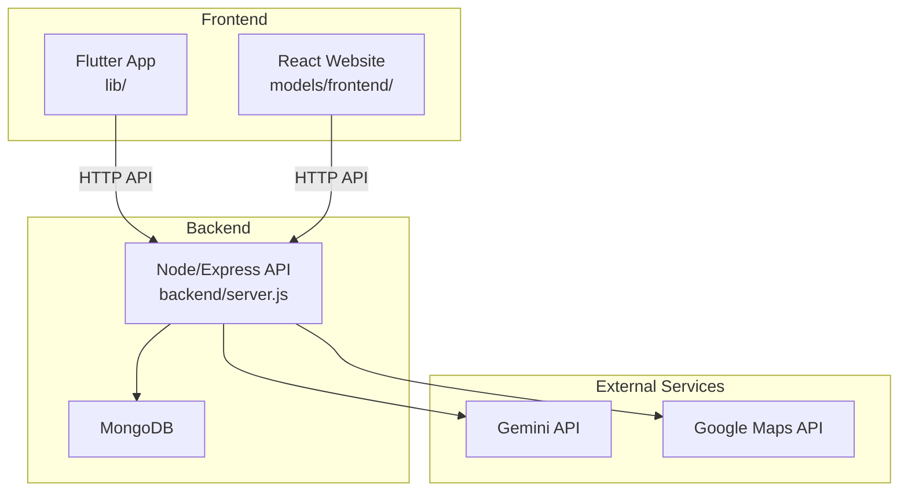

**Diagram sources**
- [backend/server.js](file://backend/server.js#L1-L56)
- [backend/config/db.js](file://backend/config/db.js#L1-L18)
- [backend/.env.example](file://backend/.env.example#L1-L12)
- [assets/.env.example](file://assets/.env.example#L1-L10)

**Section sources**
- [DEPLOY.md](file://DEPLOY.md#L20-L25)
- [README.md](file://README.md#L1-L17)

## Core Components
- Backend API (Node/Express): Provides authentication, project CRUD, ingestion, parsing, and optimization pipeline orchestration. It mounts routes under /api and enforces CORS policies. It connects to MongoDB and integrates optional external services.
- Flutter App: A cross-platform client supporting Android, iOS, Web, Linux, macOS, and Windows. It loads API configuration from assets/.env and communicates with the backend via HTTP.
- React Website: A companion frontend under models/frontend/ that consumes the same backend API.
- Environment Configuration: Environment variables for backend (database, tokens, CORS) and Flutter (API base URL) are documented and templated.

**Section sources**
- [backend/server.js](file://backend/server.js#L1-L56)
- [backend/config/db.js](file://backend/config/db.js#L1-L18)
- [backend/.env.example](file://backend/.env.example#L1-L12)
- [assets/.env.example](file://assets/.env.example#L1-L10)
- [pubspec.yaml](file://pubspec.yaml#L92-L117)

## Architecture Overview
The system comprises:
- Backend: Node/Express with MongoDB persistence, CORS-enabled, and mounted routes for auth, projects, and dashboard.
- Frontends: Flutter app (mobile/Web/Linux/macOS/Windows) and React website sharing the same API.
- External integrations: Optional Gemini and Google Maps APIs configured via environment variables.

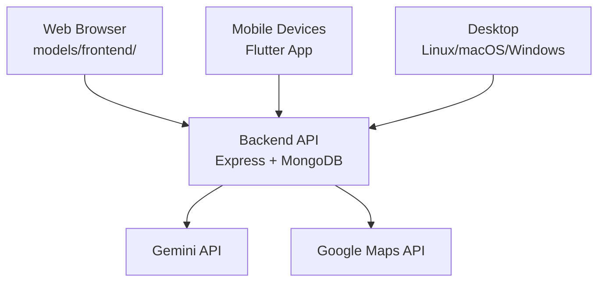

**Diagram sources**
- [backend/server.js](file://backend/server.js#L1-L56)
- [backend/.env.example](file://backend/.env.example#L5-L11)
- [frontend/package.json](file://frontend/package.json#L12-L29)
- [pubspec.yaml](file://pubspec.yaml#L30-L60)

## Detailed Component Analysis

### Backend Deployment (Node/Express)
- Local setup:
  - Copy backend/.env.example to backend/.env and set database, secrets, and optional API keys.
  - Install dependencies and start the server.
- Production deployment:
  - Choose a platform that supports Node.js and sets environment variables. The guide lists several options and emphasizes setting the backend root to the backend directory and using npm start as the start command.
  - Configure CORS_ORIGINS to include the Flutter web origin(s) in production.
- Security and stability:
  - MongoDB connection uses timeouts for resilience.
  - CORS policy supports development origins and accepts dynamic origins from environment variables.

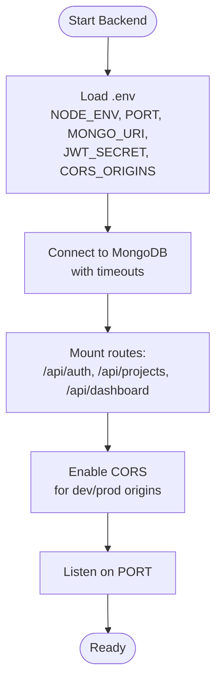

**Diagram sources**
- [backend/server.js](file://backend/server.js#L1-L56)
- [backend/config/db.js](file://backend/config/db.js#L1-L18)
- [backend/.env.example](file://backend/.env.example#L1-L12)

**Section sources**
- [DEPLOY.md](file://DEPLOY.md#L26-L90)
- [backend/server.js](file://backend/server.js#L26-L41)
- [backend/config/db.js](file://backend/config/db.js#L3-L16)
- [backend/.env.example](file://backend/.env.example#L1-L12)

### Flutter App Deployment (Android, iOS, Web, Linux, macOS, Windows)
- Local development:
  - Copy assets/.env.example to assets/.env and set API_URL according to your backend endpoint (local, emulator, or LAN).
  - Run flutter run for mobile or flutter run -d chrome for web.
- Production builds:
  - Android APK: Use flutter build apk with --dart-define=API_URL to embed the production backend URL.
  - Web: Use flutter build web with --dart-define=API_URL and deploy the build/web/ directory to any static host. Add the web origin to backend CORS_ORIGINS.
  - iOS, macOS, Windows: Use flutter build ios, flutter build macos, and flutter build windows with the same API_URL configuration.
- Asset embedding:
  - The Flutter app includes assets/.env in the app bundle and loads it at runtime.

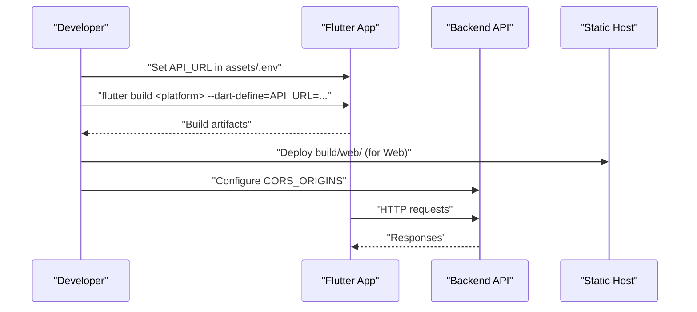

**Diagram sources**
- [DEPLOY.md](file://DEPLOY.md#L91-L137)
- [assets/.env.example](file://assets/.env.example#L1-L10)
- [pubspec.yaml](file://pubspec.yaml#L92-L117)

**Section sources**
- [DEPLOY.md](file://DEPLOY.md#L91-L137)
- [assets/.env.example](file://assets/.env.example#L1-L10)
- [pubspec.yaml](file://pubspec.yaml#L92-L117)

### Platform-Specific Build and Distribution

#### Android
- Build type configuration defaults to debug signing in release; adjust signing configuration for production releases.
- Minimum SDK and target SDK are derived from Flutter configuration.

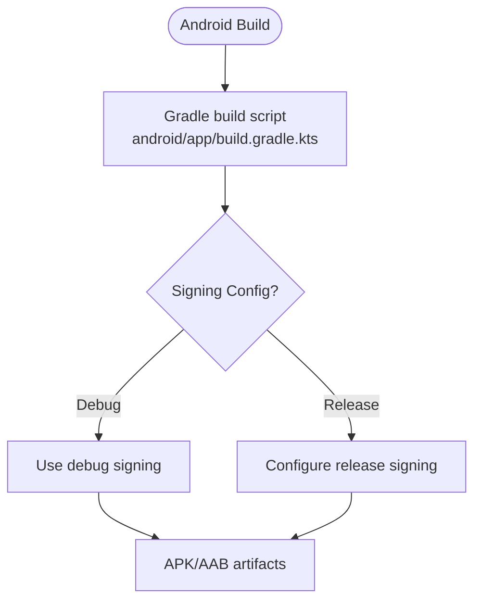

**Diagram sources**
- [android/app/build.gradle.kts](file://android/app/build.gradle.kts#L33-L39)

**Section sources**
- [android/app/build.gradle.kts](file://android/app/build.gradle.kts#L1-L45)

#### iOS
- CocoaPods integration is managed via the Podfile, ensuring Flutter pods are installed and build settings are applied.

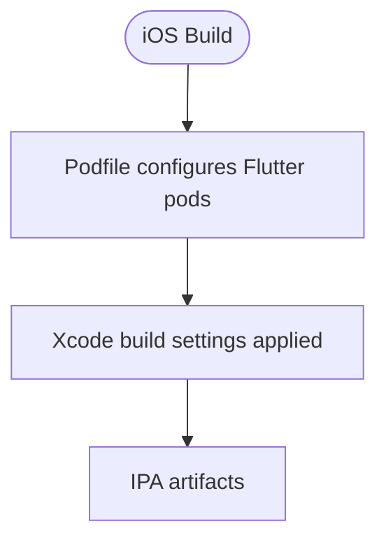

**Diagram sources**
- [ios/Podfile](file://ios/Podfile#L28-L43)

**Section sources**
- [ios/Podfile](file://ios/Podfile#L1-L44)

#### Web
- Progressive Web App manifest is defined for web deployment.
- Build artifacts are served statically; ensure CORS_ORIGINS includes the deployed web origin.

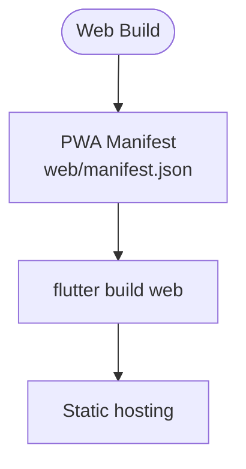

**Diagram sources**
- [web/manifest.json](file://web/manifest.json#L1-L36)

**Section sources**
- [web/manifest.json](file://web/manifest.json#L1-L36)
- [DEPLOY.md](file://DEPLOY.md#L116-L127)

#### Linux
- Uses CMake to assemble Flutter assets and install runtime libraries and assets into a relocatable bundle.

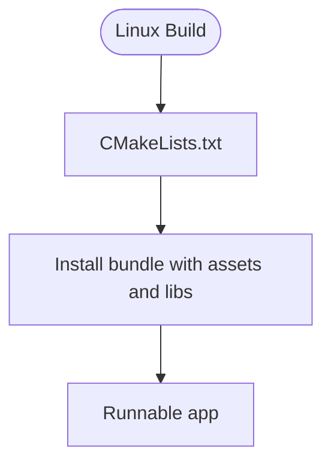

**Diagram sources**
- [linux/CMakeLists.txt](file://linux/CMakeLists.txt#L78-L129)

**Section sources**
- [linux/CMakeLists.txt](file://linux/CMakeLists.txt#L1-L129)

#### macOS
- App metadata and entitlements are configured via Info.plist and Xcode workspace settings.

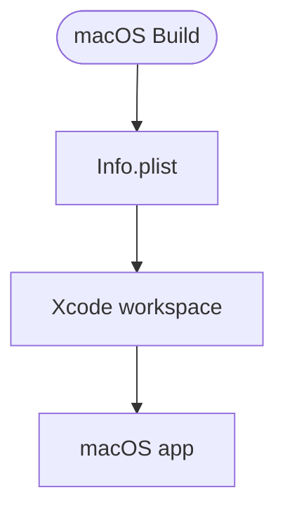

**Diagram sources**
- [macos/Runner/Info.plist](file://macos/Runner/Info.plist#L1-L33)

**Section sources**
- [macos/Runner/Info.plist](file://macos/Runner/Info.plist#L1-L33)

#### Windows
- CMake-based build with installation rules for ICU data, Flutter libraries, plugins, and assets.

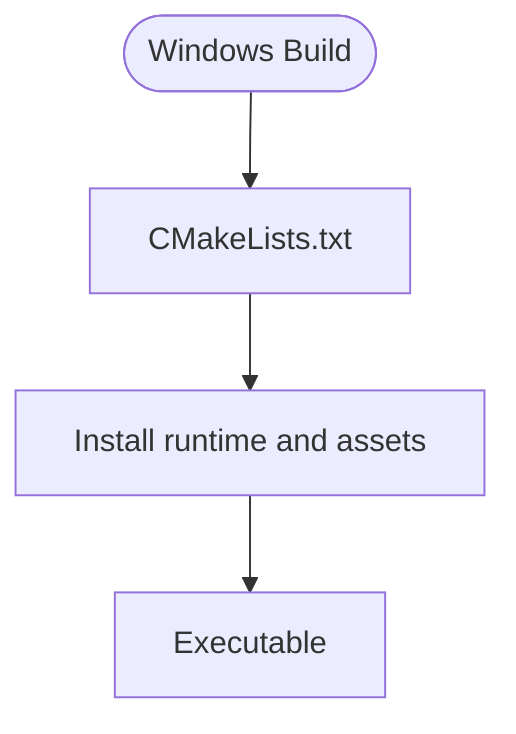

**Diagram sources**
- [windows/CMakeLists.txt](file://windows/CMakeLists.txt#L61-L109)

**Section sources**
- [windows/CMakeLists.txt](file://windows/CMakeLists.txt#L1-L109)

### External Service Integration
- Gemini API: Configured via GEMINI_API_KEY and GEMINI_MODEL in backend environment.
- Google Maps API: Configured via GOOGLE_MAPS_API_KEY in backend environment.
- Authentication: JWT_SECRET is required for signed tokens.

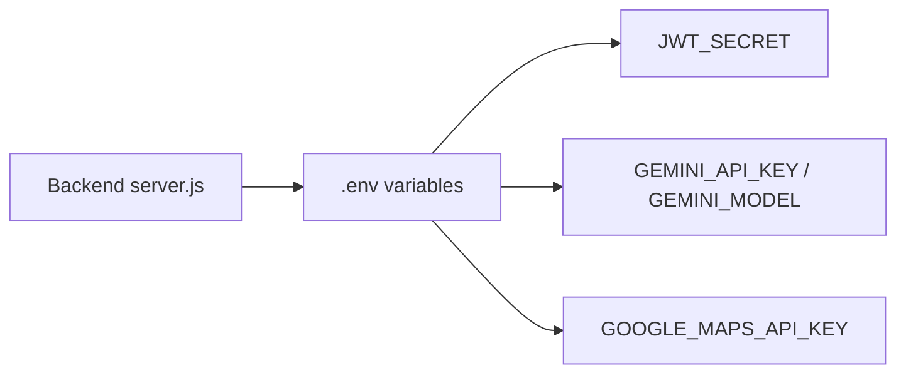

**Diagram sources**
- [backend/server.js](file://backend/server.js#L1-L56)
- [backend/.env.example](file://backend/.env.example#L4-L11)

**Section sources**
- [backend/.env.example](file://backend/.env.example#L1-L12)
- [backend/server.js](file://backend/server.js#L1-L56)

## Dependency Analysis
- Flutter app depends on:
  - dio for HTTP networking.
  - flutter_riverpod for state management.
  - google_maps_flutter, geolocator, geocoding for maps and location.
  - flutter_secure_storage, shared_preferences for secure storage and preferences.
  - flutter_dotenv for loading environment variables from assets/.env.
- Backend depends on:
  - express for routing and middleware.
  - mongoose for MongoDB connectivity.
  - jsonwebtoken for authentication.
  - @google/genai for Gemini integration.
  - xlsx/pdf-parse for file parsing.
  - multer for multipart uploads.
- Frontend (React) depends on:
  - axios for HTTP requests.
  - react-router-dom, recharts, leaflet for UI and charts.
  - @react-google-maps/api for map rendering.
  - xlsx/pdf-parse for spreadsheet/pdf parsing.

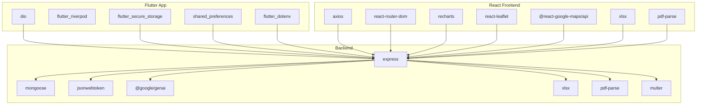

**Diagram sources**
- [pubspec.yaml](file://pubspec.yaml#L30-L60)
- [backend/package.json](file://backend/package.json#L9-L26)
- [frontend/package.json](file://frontend/package.json#L12-L29)

**Section sources**
- [pubspec.yaml](file://pubspec.yaml#L30-L60)
- [backend/package.json](file://backend/package.json#L9-L26)
- [frontend/package.json](file://frontend/package.json#L12-L29)

## Performance Considerations
- Backend:
  - Enable production mode and tune CORS_ORIGINS to minimize preflight overhead.
  - Monitor MongoDB connection timeouts and retry strategies.
  - Use appropriate logging and health checks in production.
- Frontend:
  - Optimize asset sizes and enable compression on static hosts.
  - Minimize network requests and cache responses where feasible.
- Cross-platform:
  - Use release builds for Android and iOS; configure signing for distribution.
  - Ensure PWA manifests are optimized for web deployments.

[No sources needed since this section provides general guidance]

## Troubleshooting Guide
- Backend does not start:
  - Verify MONGO_URI and ensure the database is reachable.
  - Confirm NODE_ENV and PORT are set appropriately.
- CORS errors:
  - Ensure CORS_ORIGINS includes the Flutter web origin and any additional frontends.
- Flutter app cannot connect:
  - Confirm API_URL in assets/.env matches the deployed backend base URL.
  - For Android emulator, use the documented IP address for API_URL.
- First request slow on free tiers:
  - Some platforms spin down idle instances; subsequent requests are fast.

**Section sources**
- [DEPLOY.md](file://DEPLOY.md#L151-L169)
- [backend/server.js](file://backend/server.js#L26-L41)
- [backend/config/db.js](file://backend/config/db.js#L3-L16)
- [assets/.env.example](file://assets/.env.example#L1-L10)

## Conclusion
This guide outlines a complete deployment workflow from development to production across Android, iOS, Web, Linux, macOS, and Windows. It covers backend configuration, environment variables, platform-specific builds, static hosting, and external service integration. Following the steps and best practices outlined here will help ensure reliable, secure, and performant deployments.

[No sources needed since this section summarizes without analyzing specific files]

## Appendices

### A. Environment Variables Reference
- Backend (.env):
  - NODE_ENV, PORT, MONGO_URI, JWT_SECRET, GEMINI_API_KEY, GEMINI_MODEL, GOOGLE_MAPS_API_KEY, GOOGLE_CLIENT_ID, CORS_ORIGINS
- Flutter (assets/.env):
  - API_URL

**Section sources**
- [backend/.env.example](file://backend/.env.example#L1-L12)
- [assets/.env.example](file://assets/.env.example#L1-L10)

### B. Build Commands Quick Reference
- Backend:
  - Install and start: see deployment guide.
- Flutter:
  - Local: flutter run (mobile) or flutter run -d chrome (web).
  - Android: flutter build apk --dart-define=API_URL=...
  - Web: flutter build web --dart-define=API_URL=...
  - iOS/macOS/Windows: flutter build ios / flutter build macos / flutter build windows

**Section sources**
- [DEPLOY.md](file://DEPLOY.md#L91-L137)