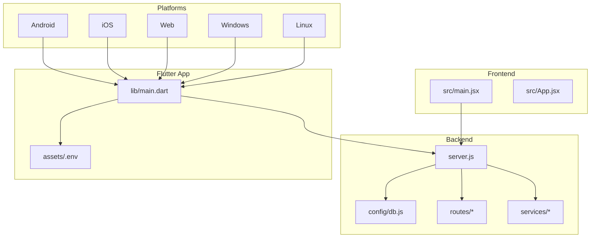
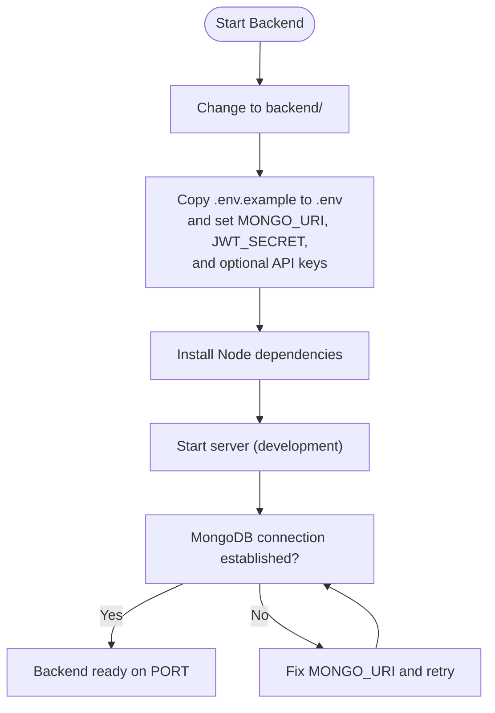
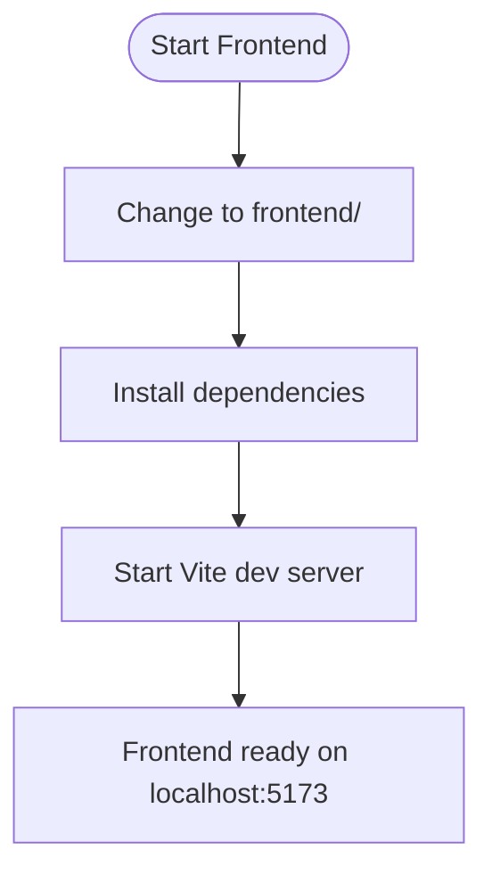
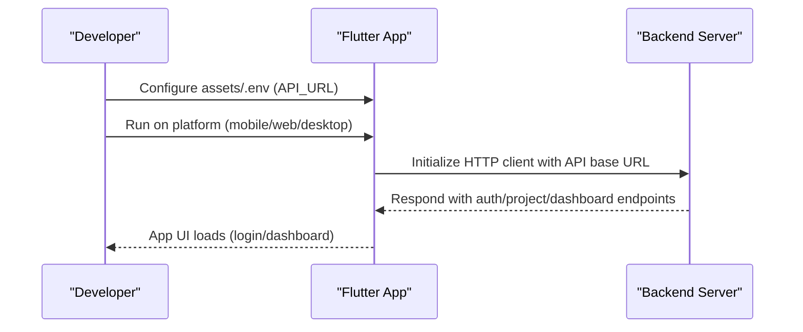
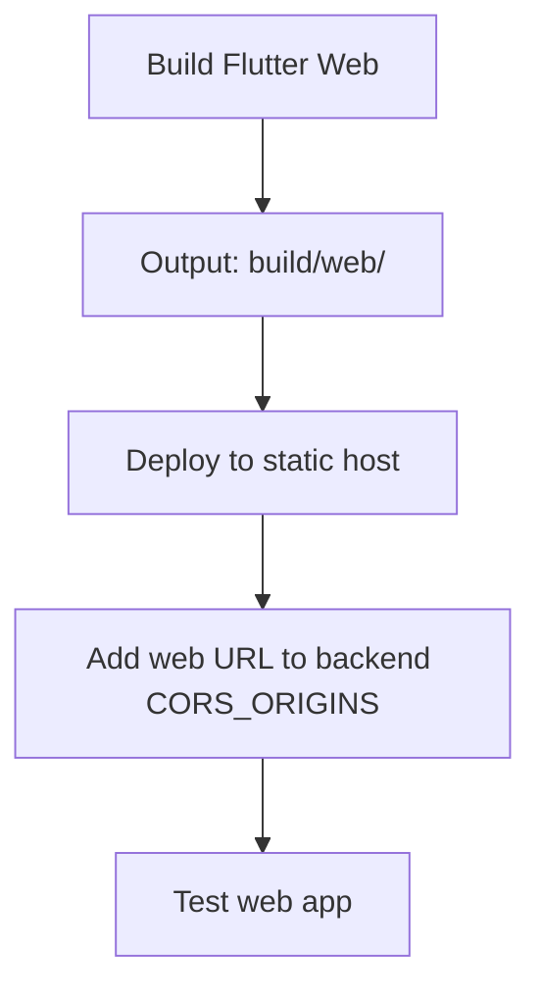
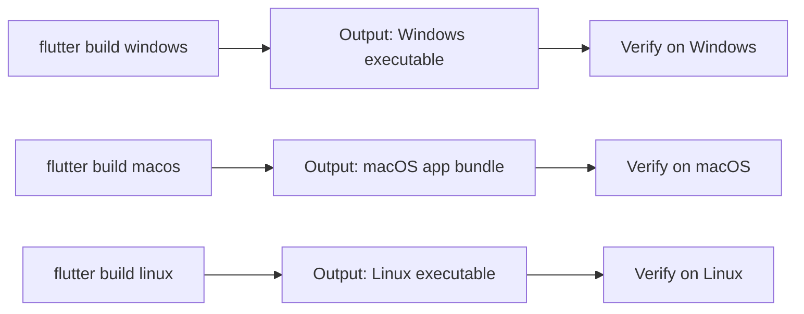

# Getting Started

<cite>
**Referenced Files in This Document**
- [README.md](file://README.md)
- [pubspec.yaml](file://pubspec.yaml)
- [backend/package.json](file://backend/package.json)
- [frontend/package.json](file://frontend/package.json)
- [backend/.env.example](file://backend/.env.example)
- [assets/.env.example](file://assets/.env.example)
- [lib/main.dart](file://lib/main.dart)
- [backend/server.js](file://backend/server.js)
- [backend/config/db.js](file://backend/config/db.js)
- [frontend/src/main.jsx](file://frontend/src/main.jsx)
- [android/app/src/main/kotlin/com/example/kritiopti/MainActivity.kt](file://android/app/src/main/kotlin/com/example/kritiopti/MainActivity.kt)
- [ios/Runner/AppDelegate.swift](file://ios/Runner/AppDelegate.swift)
- [DEPLOY.md](file://DEPLOY.md)
- [web/manifest.json](file://web/manifest.json)
- [linux/CMakeLists.txt](file://linux/CMakeLists.txt)
- [windows/CMakeLists.txt](file://windows/CMakeLists.txt)
</cite>

## Table of Contents
1. [Introduction](#introduction)
2. [Prerequisites](#prerequisites)
3. [Project Structure](#project-structure)
4. [Environment Setup](#environment-setup)
5. [Backend Initialization](#backend-initialization)
6. [Frontend Initialization](#frontend-initialization)
7. [Mobile App Initialization](#mobile-app-initialization)
8. [Web Deployment](#web-deployment)
9. [Desktop Builds](#desktop-builds)
10. [Verification Steps](#verification-steps)
11. [Troubleshooting Guide](#troubleshooting-guide)
12. [Platform-Specific Requirements](#platform-specific-requirements)
13. [Conclusion](#conclusion)

## Introduction
This guide helps you set up and run the Route Optimization project locally and deploy it across platforms. The project consists of:
- A Flutter mobile application (supports Android, iOS, Web, Windows, macOS)
- A Node.js/Express backend providing authentication, project management, and optimization pipeline APIs
- A React-based website (Vite) sharing the same backend

The application uses environment variables for API base URLs, database connections, and third-party service keys. Follow this guide to configure prerequisites, initialize the backend, set up environment variables, and run the app on your chosen platform.

## Prerequisites
Before starting, ensure you have the following installed on your development machine:

- Flutter SDK: Required for building and running the Flutter app on mobile, web, and desktop platforms
- Node.js (LTS): Required to run the backend server
- MongoDB: Required for the backend database
- Python (for the optimization engine): The backend includes a Python engine directory; ensure Python is available if you plan to run or modify the engine scripts

These tools are essential for local development and deployment. Verify versions by running:
- flutter --version
- node --version
- npm --version
- python3 --version or python --version

**Section sources**
- [README.md](file://README.md#L1-L17)
- [pubspec.yaml](file://pubspec.yaml#L21-L23)
- [backend/package.json](file://backend/package.json#L1-L28)
- [frontend/package.json](file://frontend/package.json#L1-L48)

## Project Structure
The repository is organized into distinct modules:

- backend/: Node.js/Express server with routes, controllers, models, and services
- frontend/: React/Vite website (separate from Flutter app)
- lib/: Flutter application entrypoint and UI
- android/, ios/, web/, linux/, windows/: Platform-specific configurations and build files
- assets/: Shared assets including environment configuration for the Flutter app
- models/: Additional model implementations (shared between backend and frontend)

**Diagram sources**
- [lib/main.dart](file://lib/main.dart#L12-L26)
- [backend/server.js](file://backend/server.js#L1-L56)
- [backend/config/db.js](file://backend/config/db.js#L1-L18)
- [frontend/src/main.jsx](file://frontend/src/main.jsx#L1-L14)

**Section sources**
- [lib/main.dart](file://lib/main.dart#L1-L220)
- [backend/server.js](file://backend/server.js#L1-L56)
- [frontend/src/main.jsx](file://frontend/src/main.jsx#L1-L14)

## Environment Setup
Configure environment variables for both the backend and the Flutter app.

### Backend Environment Variables
Copy the example file and set your values:
- Copy backend/.env.example to backend/.env
- Set MONGO_URI to your MongoDB connection string
- Set JWT_SECRET to a secure secret
- Optionally set GEMINI_API_KEY and GOOGLE_MAPS_API_KEY if you plan to use those services
- Optionally set CORS_ORIGINS for production origins (comma-separated)

Example keys and defaults:
- NODE_ENV: development
- PORT: 5001
- MONGO_URI: mongodb://localhost:27017/velora
- JWT_SECRET: your-jwt-secret
- GEMINI_API_KEY: (empty by default)
- GOOGLE_MAPS_API_KEY: (empty by default)
- GOOGLE_CLIENT_ID: (empty by default)
- CORS_ORIGINS: (optional)

**Section sources**
- [backend/.env.example](file://backend/.env.example#L1-L12)

### Flutter App Environment Variables
Copy the example file and set your API base URL:
- Copy assets/.env.example to assets/.env
- Set API_URL to match your backend endpoint:
  - Local: http://localhost:5001/api
  - Android Emulator: http://10.0.2.2:5001/api
  - Physical device: http://YOUR_LAN_IP:5001/api (same Wi‑Fi network)

**Section sources**
- [assets/.env.example](file://assets/.env.example#L1-L10)

## Backend Initialization
Follow these steps to start the backend server locally:

1. Navigate to the backend directory
2. Install dependencies
3. Start the server in development mode

**Diagram sources**
- [backend/server.js](file://backend/server.js#L1-L56)
- [backend/config/db.js](file://backend/config/db.js#L1-L18)
- [backend/package.json](file://backend/package.json#L1-L28)

**Section sources**
- [backend/server.js](file://backend/server.js#L1-L56)
- [backend/config/db.js](file://backend/config/db.js#L1-L18)
- [backend/package.json](file://backend/package.json#L1-L28)

## Frontend Initialization
The React website shares the same backend API. To run it locally:

1. Navigate to the frontend directory
2. Install dependencies
3. Start the development server

**Diagram sources**
- [frontend/package.json](file://frontend/package.json#L1-L48)
- [frontend/src/main.jsx](file://frontend/src/main.jsx#L1-L14)

**Section sources**
- [frontend/package.json](file://frontend/package.json#L1-L48)
- [frontend/src/main.jsx](file://frontend/src/main.jsx#L1-L14)

## Mobile App Initialization
Initialize and run the Flutter app on your desired platform.

### General Steps
1. Ensure backend is running
2. Configure assets/.env with API_URL
3. Run the app on your chosen platform

**Diagram sources**
- [lib/main.dart](file://lib/main.dart#L12-L26)
- [assets/.env.example](file://assets/.env.example#L1-L10)
- [backend/server.js](file://backend/server.js#L1-L56)

**Section sources**
- [lib/main.dart](file://lib/main.dart#L12-L26)
- [assets/.env.example](file://assets/.env.example#L1-L10)
- [backend/server.js](file://backend/server.js#L1-L56)

## Web Deployment
The Flutter app supports web deployment. Follow these steps:

1. Build the web app with the production API URL
2. Deploy the build/web/ directory to a static host (Firebase Hosting, Netlify, Vercel, etc.)
3. Add your deployed web URL to backend CORS_ORIGINS for production

**Diagram sources**
- [DEPLOY.md](file://DEPLOY.md#L116-L136)
- [web/manifest.json](file://web/manifest.json#L1-L36)

**Section sources**
- [DEPLOY.md](file://DEPLOY.md#L116-L136)
- [web/manifest.json](file://web/manifest.json#L1-L36)

## Desktop Builds
The Flutter app supports Windows, macOS, and Linux desktop builds. Use the platform-specific CMake files for configuration.

**Diagram sources**
- [windows/CMakeLists.txt](file://windows/CMakeLists.txt#L1-L109)
- [linux/CMakeLists.txt](file://linux/CMakeLists.txt#L1-L129)

**Section sources**
- [windows/CMakeLists.txt](file://windows/CMakeLists.txt#L1-L109)
- [linux/CMakeLists.txt](file://linux/CMakeLists.txt#L1-L129)

## Verification Steps
After completing setup, verify each component:

- Backend: Confirm the server starts and connects to MongoDB
- Authentication: Log in to the app and reach the dashboard
- Dashboard: Ensure metrics load (projects count, savings, time saved)
- Project creation: Upload artifacts, create a project, and verify ingestion and parsing
- Project details: View vehicle/employee lists and results when available
- Search: Filter projects by name in the top bar
- Long press: Delete a project and confirm refresh

If any step fails, check the backend logs for errors and ensure assets/.env points to your running backend.

**Section sources**
- [DEPLOY.md](file://DEPLOY.md#L151-L161)

## Troubleshooting Guide
Common setup issues and resolutions:

- Backend does not start
  - Ensure MongoDB is running and MONGO_URI is correct
  - Check that PORT is not blocked by another process
  - Verify environment variables are loaded (.env present and valid)

- CORS errors in browser or web app
  - Add your web origin to backend CORS_ORIGINS
  - Confirm frontend and backend ports match your configuration

- Flutter app cannot reach backend
  - Verify API_URL in assets/.env matches backend address
  - For Android emulator, use http://10.0.2.2:5001/api
  - For physical devices, use your machine's LAN IP on the same Wi‑Fi

- Authentication failures
  - Confirm JWT_SECRET is set consistently
  - Check that user registration/login routes are reachable

- Desktop build issues
  - Ensure platform-specific CMake configurations are intact
  - Verify required system dependencies for each OS

**Section sources**
- [backend/server.js](file://backend/server.js#L26-L41)
- [assets/.env.example](file://assets/.env.example#L1-L10)
- [DEPLOY.md](file://DEPLOY.md#L151-L161)

## Platform-Specific Requirements
- Android
  - MainActivity is a standard Flutter activity
  - Ensure API_URL points to your backend
  - Build and install APK using Flutter build commands

- iOS
  - AppDelegate registers plugins and launches the app
  - Ensure API_URL points to your backend
  - Build and run on simulator or device

- Web
  - Build with --dart-define=API_URL for production
  - Deploy build/web/ to a static host
  - Add web origin to backend CORS_ORIGINS

- Windows
  - Use windows/CMakeLists.txt for build configuration
  - Build with flutter build windows

- Linux
  - Use linux/CMakeLists.txt for build configuration
  - Build with flutter build linux

**Section sources**
- [android/app/src/main/kotlin/com/example/kritiopti/MainActivity.kt](file://android/app/src/main/kotlin/com/example/kritiopti/MainActivity.kt#L1-L6)
- [ios/Runner/AppDelegate.swift](file://ios/Runner/AppDelegate.swift#L1-L14)
- [DEPLOY.md](file://DEPLOY.md#L128-L136)
- [windows/CMakeLists.txt](file://windows/CMakeLists.txt#L1-L109)
- [linux/CMakeLists.txt](file://linux/CMakeLists.txt#L1-L129)

## Conclusion
You now have the complete setup to develop and deploy the Route Optimization project across mobile, web, and desktop platforms. Ensure environment variables are configured correctly, the backend is running with a valid database connection, and the Flutter app points to the correct API base URL. Use the verification steps to confirm functionality and consult the troubleshooting section for common issues.