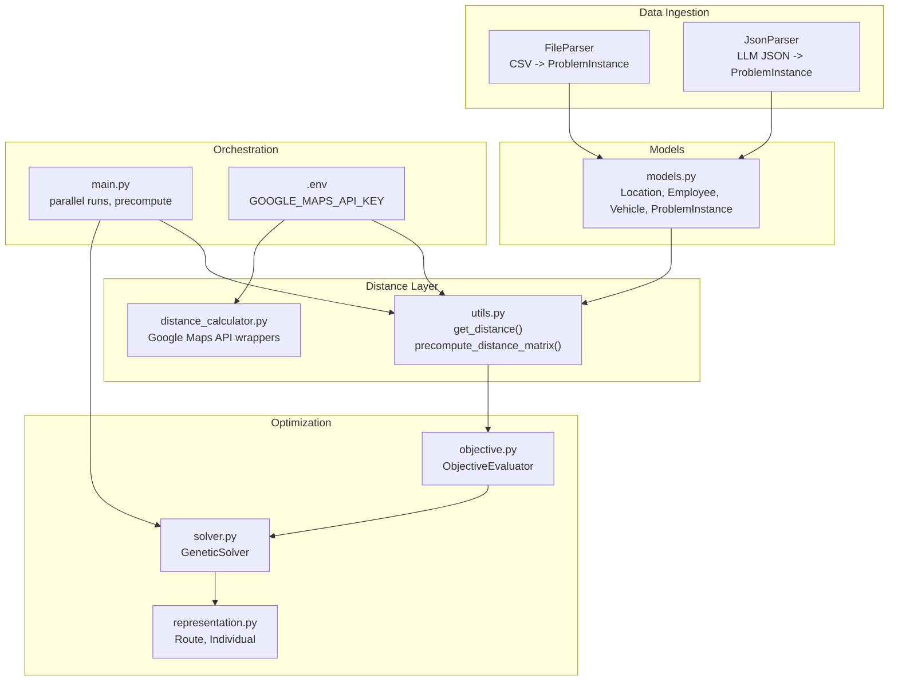
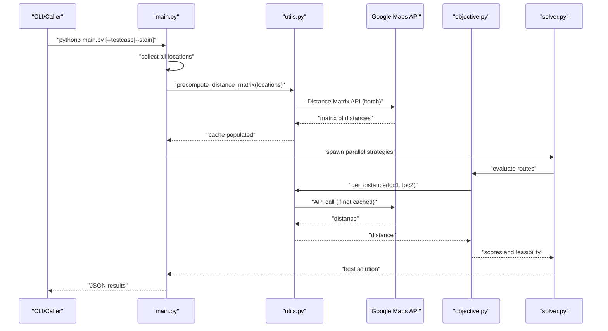
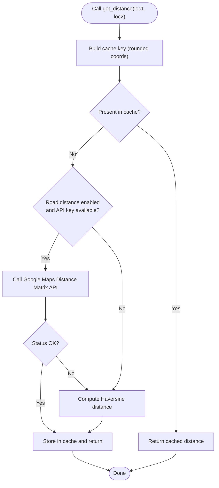
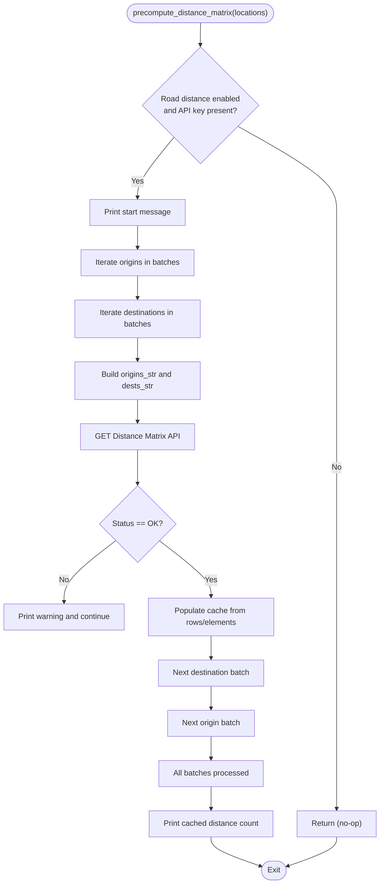
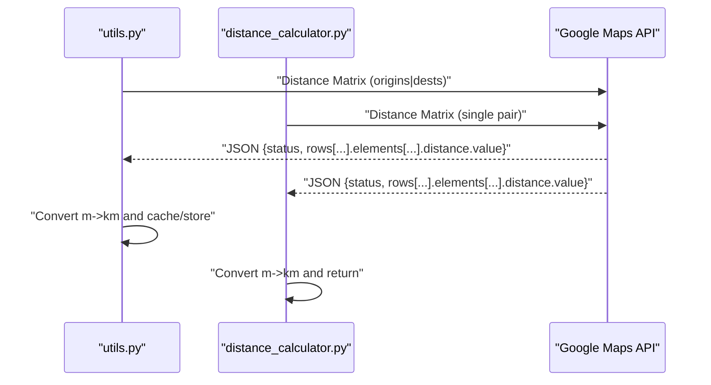
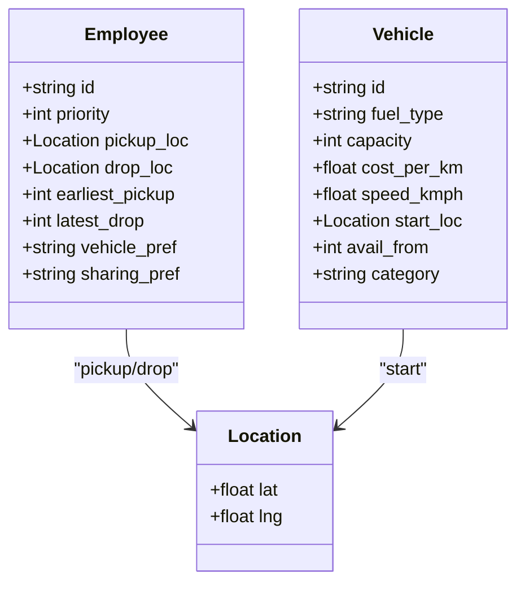
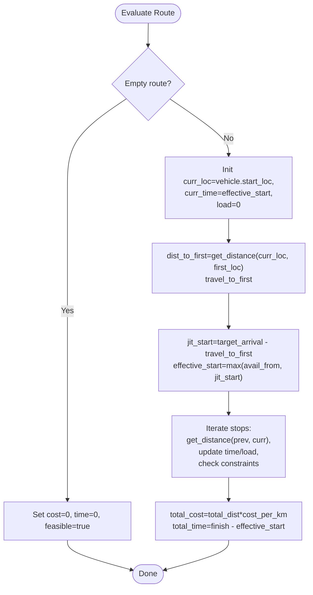
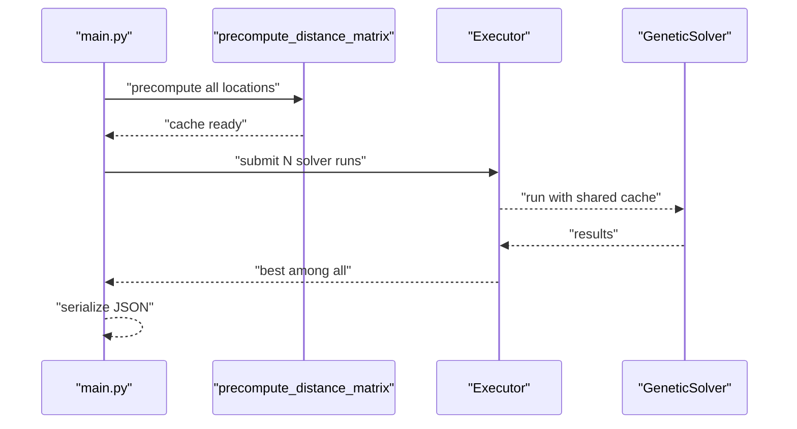
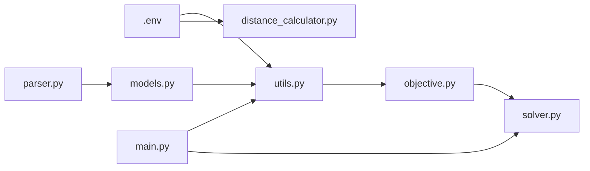

# Distance Calculation and Optimization

<cite>
**Referenced Files in This Document**
- [distance_calculator.py](file://backend/engine/distance_calculator.py)
- [utils.py](file://backend/engine/utils.py)
- [main.py](file://backend/engine/main.py)
- [objective.py](file://backend/engine/objective.py)
- [models.py](file://backend/engine/models.py)
- [parser.py](file://backend/engine/parser.py)
- [validate_distance.py](file://backend/engine/validate_distance.py)
- [.env](file://backend/.env)
- [PIPELINE_DOCUMENTATION.md](file://backend/engine/PIPELINE_DOCUMENTATION.md)
</cite>

## Table of Contents
1. [Introduction](#introduction)
2. [Project Structure](#project-structure)
3. [Core Components](#core-components)
4. [Architecture Overview](#architecture-overview)
5. [Detailed Component Analysis](#detailed-component-analysis)
6. [Dependency Analysis](#dependency-analysis)
7. [Performance Considerations](#performance-considerations)
8. [Troubleshooting Guide](#troubleshooting-guide)
9. [Conclusion](#conclusion)
10. [Appendices](#appendices)

## Introduction
This document explains the distance calculation and optimization system used in the route optimization engine. It covers:
- Distance matrix precomputation and caching for performance
- Integration with external distance calculation services (Google Maps Distance Matrix API)
- Geographic distance computations and coordinate handling
- Implementation details of the precompute_distance_matrix function
- Parallel distance calculation strategies and memory management for large datasets
- Examples of distance calculation workflows and integration with mapping services

## Project Structure
The distance and optimization pipeline spans several modules:
- Data ingestion and parsing (CSV or canonical JSON)
- Problem modeling (Location, Employee, Vehicle)
- Distance utilities (road vs. straight-line fallback)
- Precomputation and caching
- Objective evaluation and JIT timing
- Orchestration and parallel execution

**Diagram sources**
- [parser.py](file://backend/engine/parser.py#L1-L278)
- [models.py](file://backend/engine/models.py#L1-L56)
- [utils.py](file://backend/engine/utils.py#L1-L245)
- [distance_calculator.py](file://backend/engine/distance_calculator.py#L1-L228)
- [objective.py](file://backend/engine/objective.py#L1-L201)
- [solver.py](file://backend/engine/solver.py#L1-L107)
- [representation.py](file://backend/engine/representation.py#L1-L32)
- [main.py](file://backend/engine/main.py#L1-L193)
- [.env](file://backend/.env#L1-L9)

**Section sources**
- [parser.py](file://backend/engine/parser.py#L1-L278)
- [models.py](file://backend/engine/models.py#L1-L56)
- [utils.py](file://backend/engine/utils.py#L1-L245)
- [distance_calculator.py](file://backend/engine/distance_calculator.py#L1-L228)
- [objective.py](file://backend/engine/objective.py#L1-L201)
- [solver.py](file://backend/engine/solver.py#L1-L107)
- [representation.py](file://backend/engine/representation.py#L1-L32)
- [main.py](file://backend/engine/main.py#L1-L193)
- [.env](file://backend/.env#L1-L9)

## Core Components
- Location model: immutable coordinates used throughout the system.
- Distance utilities:
  - get_distance(): centralized accessor that prefers road distance via Google Maps API and falls back to Haversine.
  - precompute_distance_matrix(): batch-fetches road distances to warm the cache.
- Objective evaluator: computes route costs and times using get_distance() and JIT logic.
- Orchestration: main.py collects all locations, precomputes distances, and runs multiple solver strategies in parallel.

**Section sources**
- [models.py](file://backend/engine/models.py#L4-L8)
- [utils.py](file://backend/engine/utils.py#L86-L161)
- [objective.py](file://backend/engine/objective.py#L39-L201)
- [main.py](file://backend/engine/main.py#L145-L187)

## Architecture Overview
The distance system integrates with the optimization pipeline as follows:
- Data ingestion produces Location objects for employees’ pickup/drop locations and vehicles’ start locations.
- The orchestrator gathers all locations and invokes precompute_distance_matrix to batch-fetch road distances.
- During optimization, ObjectiveEvaluator uses get_distance() to compute travel distances and times.
- Google Maps API is used for road distances; Haversine serves as a fallback when API access is unavailable.

**Diagram sources**
- [main.py](file://backend/engine/main.py#L145-L187)
- [utils.py](file://backend/engine/utils.py#L112-L161)
- [distance_calculator.py](file://backend/engine/distance_calculator.py#L146-L206)
- [objective.py](file://backend/engine/objective.py#L39-L201)

## Detailed Component Analysis

### Distance Utilities and Caching
- get_distance():
  - Creates a cache key rounded to six decimals to normalize floating-point differences.
  - Checks cache first; if miss and road distance is enabled with a valid API key, queries Google Maps Distance Matrix API.
  - Falls back to Haversine straight-line distance if road distance is disabled or API fails.
- precompute_distance_matrix():
  - Iterates over locations in batches to respect API limits.
  - Issues batch Distance Matrix requests and populates the cache with results.
  - Prints progress and number of cached distances.

**Diagram sources**
- [utils.py](file://backend/engine/utils.py#L86-L110)
- [utils.py](file://backend/engine/utils.py#L27-L36)

**Section sources**
- [utils.py](file://backend/engine/utils.py#L23-L110)
- [utils.py](file://backend/engine/utils.py#L112-L161)
- [distance_calculator.py](file://backend/engine/distance_calculator.py#L23-L91)
- [distance_calculator.py](file://backend/engine/distance_calculator.py#L93-L144)

### Precompute Distance Matrix Implementation
- Input: list of location objects with .lat and .lng attributes.
- Strategy:
  - Batch loop over origins and destinations with a fixed BATCH_SIZE.
  - Build pipe-separated origin/destination strings and issue a single Distance Matrix API call.
  - On success, iterate rows and elements to populate cache with rounded keys.
  - Gracefully handles failures by printing warnings and continuing.
- Output: cache populated with pairwise road distances.

**Diagram sources**
- [utils.py](file://backend/engine/utils.py#L112-L161)

**Section sources**
- [utils.py](file://backend/engine/utils.py#L112-L161)

### Integration with External Distance Services
- Google Maps Distance Matrix API:
  - Single-origin/single-destination endpoints for per-pair queries.
  - Multi-origin/multi-destination endpoint for batch queries.
  - Returns distance in meters; conversion to kilometers performed by utilities.
- Environment configuration:
  - GOOGLE_MAPS_API_KEY loaded from backend/.env and used by both distance utilities and validation scripts.

**Diagram sources**
- [distance_calculator.py](file://backend/engine/distance_calculator.py#L146-L206)
- [distance_calculator.py](file://backend/engine/distance_calculator.py#L23-L91)
- [utils.py](file://backend/engine/utils.py#L136-L159)

**Section sources**
- [distance_calculator.py](file://backend/engine/distance_calculator.py#L146-L206)
- [distance_calculator.py](file://backend/engine/distance_calculator.py#L23-L91)
- [utils.py](file://backend/engine/utils.py#L136-L159)
- [.env](file://backend/.env#L7-L7)

### Location-Based Distance Computation and Coordinate Handling
- Location model:
  - Immutable latitude/longitude pair used consistently across models and utilities.
- Coordinate handling:
  - Coordinates are rounded to six decimals for cache keys to mitigate floating-point precision issues.
  - Straight-line fallback uses the Haversine formula for approximate distances.

**Diagram sources**
- [models.py](file://backend/engine/models.py#L4-L36)

**Section sources**
- [models.py](file://backend/engine/models.py#L4-L36)
- [utils.py](file://backend/engine/utils.py#L27-L36)

### Objective Evaluation and JIT Timing Using Distances
- ObjectiveEvaluator uses get_distance() to compute travel segments between stops.
- JIT logic determines effective start time to arrive exactly at the first stop’s earliest pickup, then simulates the entire route with capacity, precedence, and sharing constraints.
- Total cost is derived from total distance multiplied by vehicle cost_per_km; total time is finish time minus effective start time.

**Diagram sources**
- [objective.py](file://backend/engine/objective.py#L39-L201)
- [utils.py](file://backend/engine/utils.py#L86-L110)

**Section sources**
- [objective.py](file://backend/engine/objective.py#L39-L201)
- [utils.py](file://backend/engine/utils.py#L86-L110)

### Parallel Distance Calculation Strategies
- main.py orchestrates parallel runs using either ThreadPoolExecutor or ProcessPoolExecutor depending on stdin mode.
- Precomputation occurs once per run before spawning solvers, ensuring all workers share the same cached distances.
- Strategy diversity:
  - Eight distinct strategy configurations are tested in parallel, each evolving a population with simulated annealing and fine-tuning.

**Diagram sources**
- [main.py](file://backend/engine/main.py#L145-L187)

**Section sources**
- [main.py](file://backend/engine/main.py#L145-L187)

### Validation and Testing
- validate_distance.py validates road distances for all test cases using the distance calculator module.
- Demonstrates end-to-end usage of get_road_distance_with_duration and aggregates totals.

**Section sources**
- [validate_distance.py](file://backend/engine/validate_distance.py#L1-L73)

## Dependency Analysis
- Distance utilities depend on:
  - Environment configuration for the Google Maps API key.
  - Requests library for HTTP communication.
- Objective evaluation depends on:
  - get_distance() for segment distances.
  - Vehicle and Employee models for constraints.
- Orchestration depends on:
  - Parser outputs (ProblemInstance) to collect all locations.
  - Parallel execution framework to scale solver runs.

**Diagram sources**
- [.env](file://backend/.env#L7-L7)
- [utils.py](file://backend/engine/utils.py#L1-L245)
- [distance_calculator.py](file://backend/engine/distance_calculator.py#L1-L228)
- [parser.py](file://backend/engine/parser.py#L1-L278)
- [models.py](file://backend/engine/models.py#L1-L56)
- [objective.py](file://backend/engine/objective.py#L1-L201)
- [solver.py](file://backend/engine/solver.py#L1-L107)
- [main.py](file://backend/engine/main.py#L1-L193)

**Section sources**
- [utils.py](file://backend/engine/utils.py#L1-L245)
- [distance_calculator.py](file://backend/engine/distance_calculator.py#L1-L228)
- [parser.py](file://backend/engine/parser.py#L1-L278)
- [models.py](file://backend/engine/models.py#L1-L56)
- [objective.py](file://backend/engine/objective.py#L1-L201)
- [solver.py](file://backend/engine/solver.py#L1-L107)
- [main.py](file://backend/engine/main.py#L1-L193)
- [.env](file://backend/.env#L7-L7)

## Performance Considerations
- Caching:
  - get_distance() caches results under rounded coordinate keys to avoid redundant API calls.
  - precompute_distance_matrix() warms the cache with batch requests to minimize latency during optimization.
- Batch sizing:
  - Batch size chosen to balance API throughput and memory footprint; adjust based on dataset size and rate limits.
- Parallelism:
  - Parallel solver runs reduce wall-clock time; ensure shared cache is populated before launching workers.
- Fallback strategy:
  - Haversine fallback prevents hard failures when API access is unavailable; however, road distances are preferred for accuracy.
- Memory management:
  - Cache grows with O(n^2) for n locations; monitor memory usage for large datasets and consider periodic cache trimming if needed.
- Timeout tuning:
  - API timeouts configured per endpoint; increase for larger batches to accommodate network variability.

[No sources needed since this section provides general guidance]

## Troubleshooting Guide
- Missing API key:
  - Symptom: None returned from distance functions and warnings printed.
  - Resolution: Set GOOGLE_MAPS_API_KEY in backend/.env or via set_api_key().
- API errors:
  - Symptom: Error messages indicating status or error_message.
  - Resolution: Verify API key validity, quotas, and region support; retry with reduced batch sizes.
- Parsing failures:
  - Symptom: KeyError/IndexError when extracting distance/duration.
  - Resolution: Ensure response structure matches expected format; add defensive checks if extending API usage.
- Cache misses:
  - Symptom: Frequent API calls despite precomputation.
  - Resolution: Confirm precompute_distance_matrix ran before optimization; verify coordinate rounding and cache key generation.

**Section sources**
- [distance_calculator.py](file://backend/engine/distance_calculator.py#L49-L90)
- [utils.py](file://backend/engine/utils.py#L54-L84)
- [utils.py](file://backend/engine/utils.py#L136-L159)
- [.env](file://backend/.env#L7-L7)

## Conclusion
The distance calculation and optimization system combines robust caching, batched precomputation, and integration with Google Maps Distance Matrix API to deliver accurate and performant route optimization. By leveraging get_distance() and precompute_distance_matrix(), the engine minimizes API overhead while maintaining flexibility through Haversine fallback. Parallel orchestration further accelerates convergence across diverse strategies, enabling scalable solutions for large-scale problems.

[No sources needed since this section summarizes without analyzing specific files]

## Appendices

### Example Workflows
- Direct CSV mode:
  - Use main.py with --testcase to load CSV files, precompute distances, and run parallel strategies.
- LLM-driven canonical JSON mode:
  - The pipeline ingests an Excel file, parses it via LLM, validates the canonical schema, and runs the Python engine with precomputation and parallel solvers.

**Section sources**
- [main.py](file://backend/engine/main.py#L145-L187)
- [PIPELINE_DOCUMENTATION.md](file://backend/engine/PIPELINE_DOCUMENTATION.md#L117-L151)