# Genetic Algorithm Implementation

<cite>
**Referenced Files in This Document**
- [solver.py](file://backend/engine/solver.py)
- [initialization.py](file://backend/engine/initialization.py)
- [operators.py](file://backend/engine/operators.py)
- [objective.py](file://backend/engine/objective.py)
- [finetuner.py](file://backend/engine/finetuner.py)
- [main.py](file://backend/engine/main.py)
- [models.py](file://backend/engine/models.py)
- [representation.py](file://backend/engine/representation.py)
- [utils.py](file://backend/engine/utils.py)
- [parser.py](file://backend/engine/parser.py)
- [PIPELINE_DOCUMENTATION.md](file://backend/engine/PIPELINE_DOCUMENTATION.md)
- [engineRunner.js](file://backend/services/engineRunner.js)
</cite>

## Table of Contents
1. [Introduction](#introduction)
2. [Project Structure](#project-structure)
3. [Core Components](#core-components)
4. [Architecture Overview](#architecture-overview)
5. [Detailed Component Analysis](#detailed-component-analysis)
6. [Dependency Analysis](#dependency-analysis)
7. [Performance Considerations](#performance-considerations)
8. [Troubleshooting Guide](#troubleshooting-guide)
9. [Conclusion](#conclusion)
10. [Appendices](#appendices)

## Introduction
This document explains the genetic algorithm implementation in the optimization engine. It covers the solver architecture, population initialization, selection and reproduction operators, mutation and acceptance mechanisms, penalty scaling, and the multi-strategy configuration system. It also documents parallel execution, strategy distribution, and solution evaluation. Examples of strategy configurations and their impact on outcomes are included to help users tune performance and quality.

## Project Structure
The optimization engine is implemented in the backend Python engine module. Key files include the solver orchestrator, initialization utilities, genetic operators, objective evaluation, fine-tuning post-processing, and the main entry point that coordinates parallel runs and strategies.

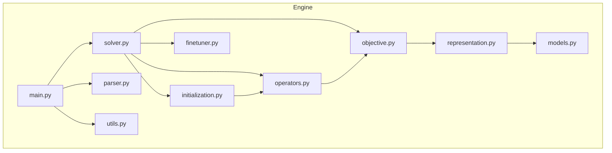

**Diagram sources**
- [main.py](file://backend/engine/main.py#L1-L193)
- [solver.py](file://backend/engine/solver.py#L1-L107)
- [initialization.py](file://backend/engine/initialization.py#L1-L63)
- [operators.py](file://backend/engine/operators.py#L1-L290)
- [objective.py](file://backend/engine/objective.py#L1-L201)
- [finetuner.py](file://backend/engine/finetuner.py#L1-L221)
- [representation.py](file://backend/engine/representation.py#L1-L32)
- [models.py](file://backend/engine/models.py#L1-L56)
- [utils.py](file://backend/engine/utils.py#L1-L245)
- [parser.py](file://backend/engine/parser.py#L1-L278)

**Section sources**
- [main.py](file://backend/engine/main.py#L1-L193)
- [PIPELINE_DOCUMENTATION.md](file://backend/engine/PIPELINE_DOCUMENTATION.md#L1-L252)

## Core Components
- GeneticSolver orchestrates the GA loop, managing initialization, selection, crossover, mutation, survival selection, and post-processing tuning.
- PopulationInitializer creates diverse initial individuals using GRASP-style construction with optional regret-based prioritization.
- GeneticOperators implements selection, crossover, ruin-and-recreate mutation, and local 2-opt improvements.
- ObjectiveEvaluator computes weighted scores and enforces hard constraints with penalties.
- FineTuner performs deterministic local search to refine GA solutions.
- main.py defines predefined strategies and runs multiple solver instances in parallel.

**Section sources**
- [solver.py](file://backend/engine/solver.py#L14-L107)
- [initialization.py](file://backend/engine/initialization.py#L8-L63)
- [operators.py](file://backend/engine/operators.py#L9-L290)
- [objective.py](file://backend/engine/objective.py#L12-L201)
- [finetuner.py](file://backend/engine/finetuner.py#L8-L221)
- [main.py](file://backend/engine/main.py#L12-L31)

## Architecture Overview
The engine is invoked either via stdin (canonical JSON from LLM) or CSV testcases. It precomputes distances, runs multiple solver runs in parallel with distinct strategies, selects the best solution, and returns a structured JSON result.

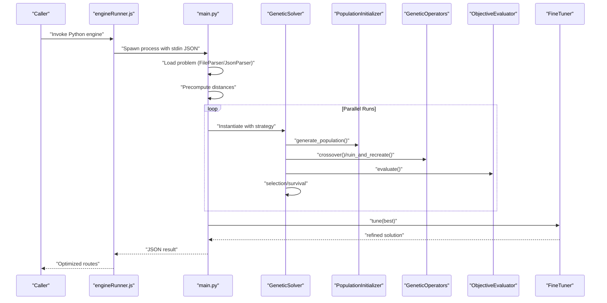

**Diagram sources**
- [engineRunner.js](file://backend/services/engineRunner.js#L21-L73)
- [main.py](file://backend/engine/main.py#L145-L193)
- [solver.py](file://backend/engine/solver.py#L38-L107)
- [initialization.py](file://backend/engine/initialization.py#L14-L30)
- [operators.py](file://backend/engine/operators.py#L242-L290)
- [objective.py](file://backend/engine/objective.py#L16-L38)
- [finetuner.py](file://backend/engine/finetuner.py#L14-L49)

## Detailed Component Analysis

### GeneticSolver: Core Evolution Loop
- Initialization: Builds an initial population using PopulationInitializer and evaluates the best before evolution.
- Evolution: Iterates for a configured number of generations. At each generation:
  - Scales penalties from low to high.
  - Selects parents via tournament selection.
  - Produces offspring via crossover.
  - Mutates with a fixed rate using ruin-and-recreate, accepting or rejecting based on simulated annealing acceptance.
  - Performs survival selection to maintain population diversity and uniqueness.
  - Tracks the best solution encountered.
- Post-processing: Applies FineTuner to further improve the best solution, then re-evaluates with strict penalties.

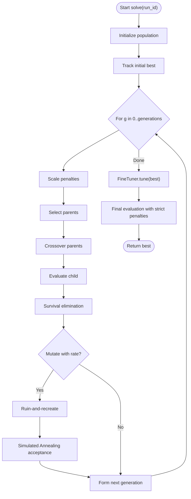

**Diagram sources**
- [solver.py](file://backend/engine/solver.py#L38-L107)
- [operators.py](file://backend/engine/operators.py#L42-L81)
- [operators.py](file://backend/engine/operators.py#L13-L19)
- [operators.py](file://backend/engine/operators.py#L21-L35)
- [objective.py](file://backend/engine/objective.py#L16-L38)

**Section sources**
- [solver.py](file://backend/engine/solver.py#L14-L107)

### Population Initialization
- Creates individuals using a hybrid approach:
  - 50% regret-based construction (prioritizing difficult assignments).
  - 50% randomized construction (diversity).
- Uses GRASP-style route construction with best insertion for each employee, then assigns remaining passengers to unassigned list.

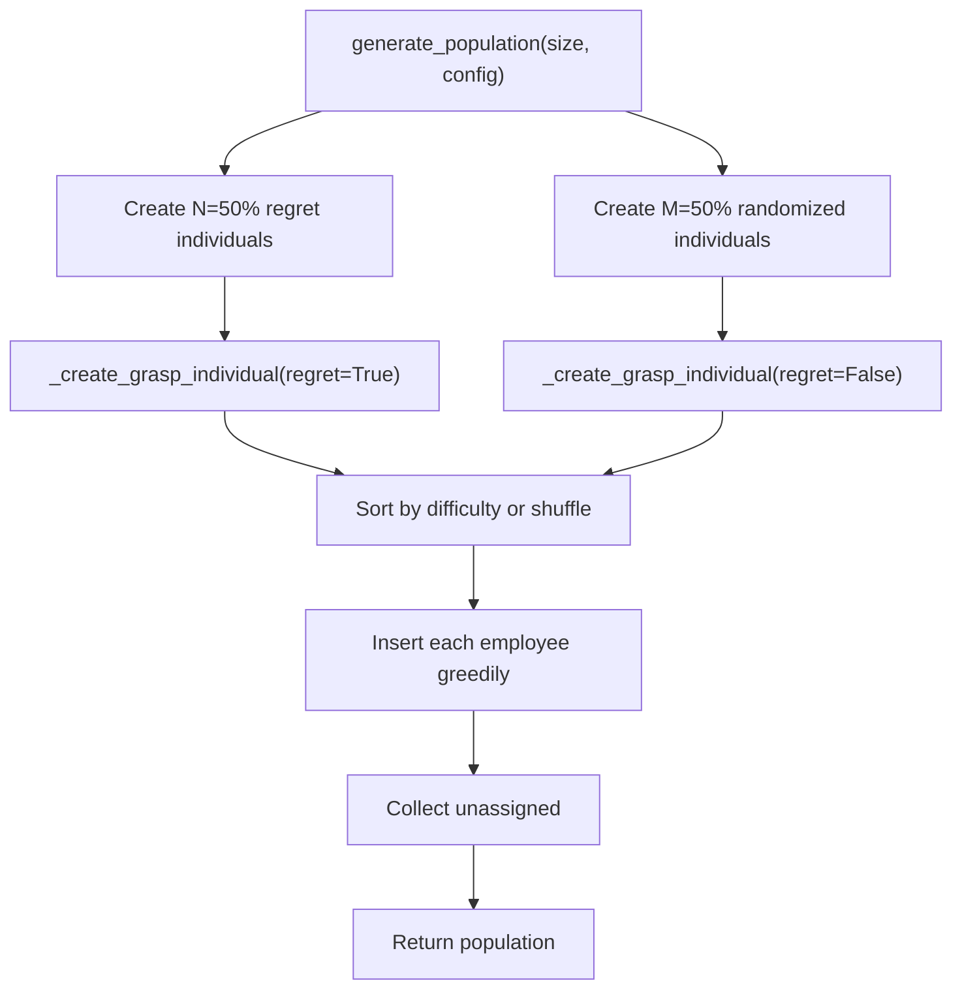

**Diagram sources**
- [initialization.py](file://backend/engine/initialization.py#L14-L30)
- [initialization.py](file://backend/engine/initialization.py#L32-L63)

**Section sources**
- [initialization.py](file://backend/engine/initialization.py#L8-L63)

### Selection Strategies
- Tournament selection chooses parents based on lowest objective score among small random samples.
- Survival elimination maintains population diversity by deduplicating solutions (rounded scores) and truncating to target size.

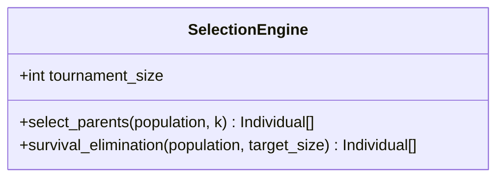

**Diagram sources**
- [operators.py](file://backend/engine/operators.py#L9-L36)

**Section sources**
- [operators.py](file://backend/engine/operators.py#L9-L36)

### Crossover and Mutation
- Crossover: Combines routes from two parents by splitting vehicles at a midpoint and ensuring no duplicate passenger assignments in the child.
- Mutation: Ruin-and-recreate removes a subset of passengers from random routes and reconstructs them using best insertion, followed by local 2-opt on the affected route.

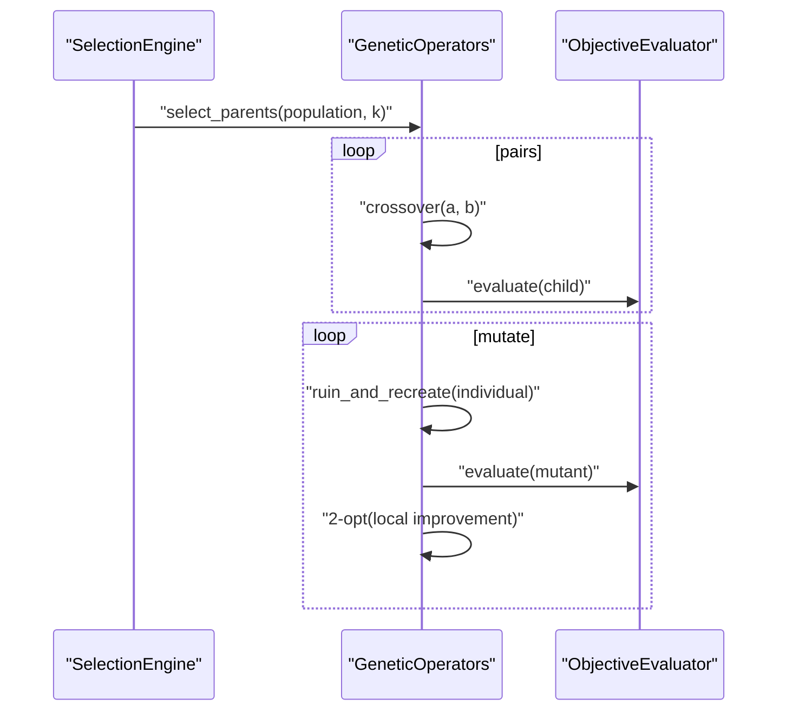

**Diagram sources**
- [operators.py](file://backend/engine/operators.py#L242-L290)
- [operators.py](file://backend/engine/operators.py#L42-L81)
- [operators.py](file://backend/engine/operators.py#L208-L241)

**Section sources**
- [operators.py](file://backend/engine/operators.py#L37-L290)

### Objective Evaluation and Constraints
- Computes a weighted objective combining route cost and time.
- Enforces hard constraints (capacity, precedence, sharing limits, premium vehicle compatibility, lateness) and applies penalties scaled by penalty_factor.
- Supports JIT timing to compute accurate delays and feasible schedules.

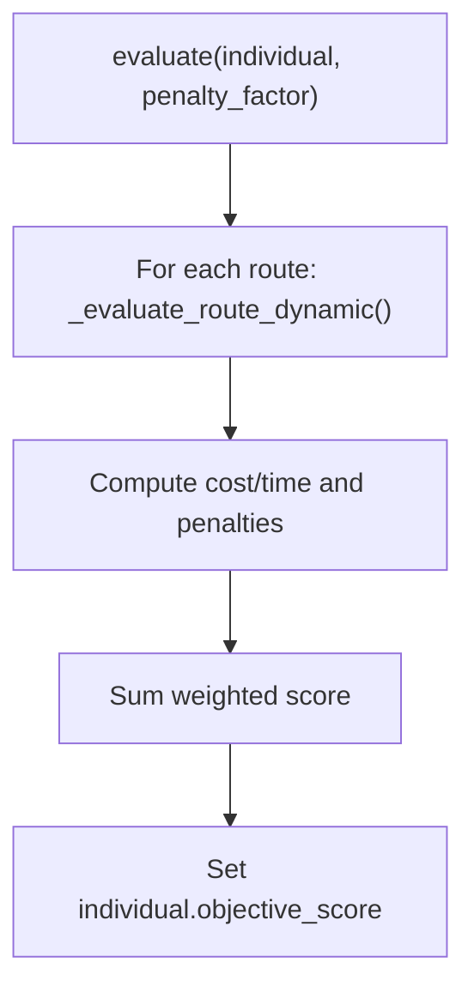

**Diagram sources**
- [objective.py](file://backend/engine/objective.py#L16-L38)
- [objective.py](file://backend/engine/objective.py#L39-L201)

**Section sources**
- [objective.py](file://backend/engine/objective.py#L12-L201)

### Fine-Tuning Post-Processing
- Iteratively improves the GA solution using deterministic moves:
  - Dismantle expensive routes by redistributing passengers to cheaper vehicles.
  - Relocate passengers between routes using best insertion.
  - Optimize sequences with 2-opt swaps.
- Stops when no improvement is observed for a bounded number of iterations.

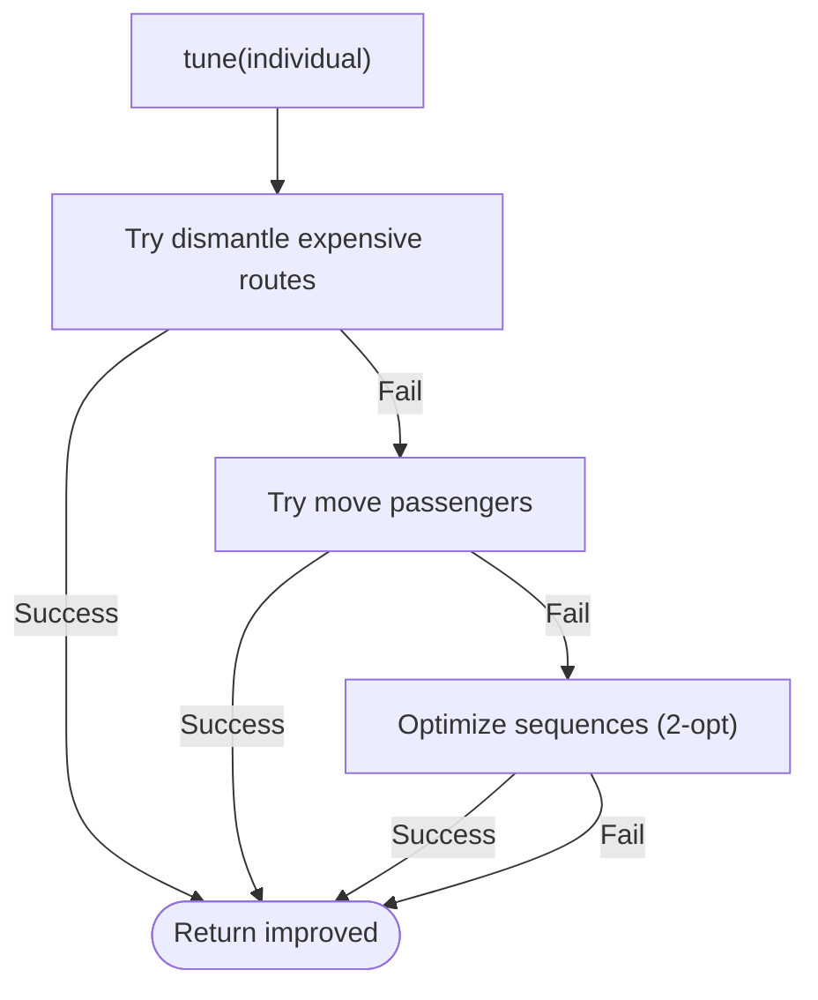

**Diagram sources**
- [finetuner.py](file://backend/engine/finetuner.py#L14-L49)
- [finetuner.py](file://backend/engine/finetuner.py#L51-L136)
- [finetuner.py](file://backend/engine/finetuner.py#L138-L189)
- [finetuner.py](file://backend/engine/finetuner.py#L191-L221)

**Section sources**
- [finetuner.py](file://backend/engine/finetuner.py#L8-L221)

### Parallel Execution and Strategy Distribution
- main.py defines eight predefined strategies with different mixes of regret-based, GRASP, and random construction.
- Parallel runs are executed using ProcessPoolExecutor (or ThreadPoolExecutor in stdin mode) with NUM_PARALLEL_RUNS.
- Each run receives a strategy configuration and returns a solution; the best is selected by minimum objective_score.

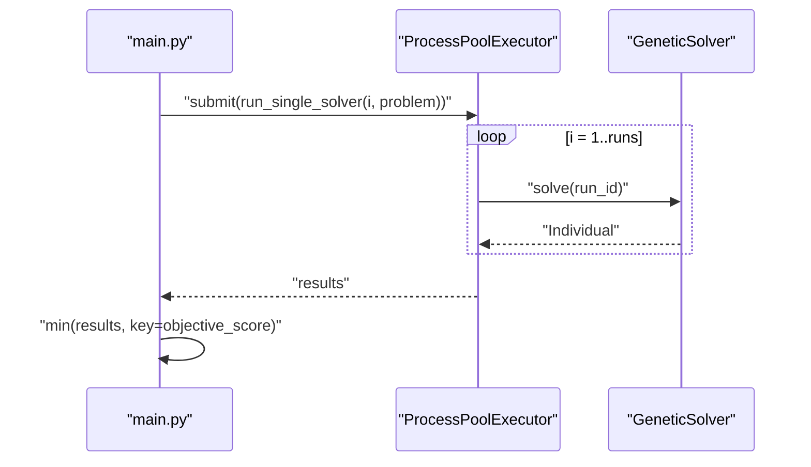

**Diagram sources**
- [main.py](file://backend/engine/main.py#L12-L31)
- [main.py](file://backend/engine/main.py#L170-L187)

**Section sources**
- [main.py](file://backend/engine/main.py#L12-L31)
- [main.py](file://backend/engine/main.py#L145-L193)

### Strategy Configurations and Impact
Predefined strategies distribute construction emphasis across regret-based, GRASP, and random approaches. Example configurations:
- Logic: Emphasizes regret-based construction with moderate GRASP and randomness.
- Chaos: Heavily favors random construction.
- Sniper: Strong GRASP focus.
- Explore: Balanced GRASP with randomness.
- Balance: Moderate mix across all three.
- Hybrid: Mixed regret and randomness.
- Spec-A: Balanced GRASP with modest regret and randomness.
- Spec-B: Pure GRASP.

Impact:
- More regret-based strategies tend to produce lower initial scores but may converge slower.
- Higher randomness increases exploration and diversity, potentially escaping local optima.
- GRASP-focused strategies often yield fast, greedy-feasible solutions.

**Section sources**
- [main.py](file://backend/engine/main.py#L12-L21)

## Dependency Analysis
The solver depends on initialization, operators, objective evaluation, and fine-tuning modules. The main orchestrator depends on parser and utility modules for data loading and distance computation.

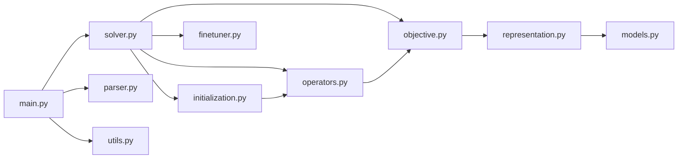

**Diagram sources**
- [solver.py](file://backend/engine/solver.py#L1-L13)
- [initialization.py](file://backend/engine/initialization.py#L1-L12)
- [operators.py](file://backend/engine/operators.py#L1-L8)
- [objective.py](file://backend/engine/objective.py#L1-L5)
- [finetuner.py](file://backend/engine/finetuner.py#L1-L7)
- [representation.py](file://backend/engine/representation.py#L1-L4)
- [models.py](file://backend/engine/models.py#L1-L56)
- [main.py](file://backend/engine/main.py#L8-L11)
- [parser.py](file://backend/engine/parser.py#L1-L4)
- [utils.py](file://backend/engine/utils.py#L1-L24)

**Section sources**
- [solver.py](file://backend/engine/solver.py#L1-L13)
- [main.py](file://backend/engine/main.py#L8-L11)

## Performance Considerations
- Population size and generations: Larger populations and more generations increase quality at the cost of runtime. The solver scales generations based on problem size.
- Mutation rate: Controlled constant; combined with simulated annealing acceptance to balance exploration and exploitation.
- Penalty scaling: Gradually increasing penalties emphasize feasibility as evolution proceeds.
- Distance precomputation: Using road distances (Google Maps) with caching reduces repeated API calls.
- Parallelism: Multiple runs exploit multi-core systems; choose max_workers according to CPU cores and I/O constraints.

[No sources needed since this section provides general guidance]

## Troubleshooting Guide
Common issues and remedies:
- No solutions produced: Verify that the solver returns a valid Individual and that objective evaluation is called consistently.
- Infeasible solutions persist: Review constraint penalties and ensure evaluator is invoked after mutations and crossovers.
- Slow performance: Reduce population size or generations; enable distance precomputation; adjust max_workers.
- Strategy-specific failures: Try different strategies; increase randomness or regret emphasis depending on problem characteristics.

**Section sources**
- [solver.py](file://backend/engine/solver.py#L58-L94)
- [objective.py](file://backend/engine/objective.py#L16-L38)
- [main.py](file://backend/engine/main.py#L170-L187)

## Conclusion
The genetic algorithm implementation integrates robust initialization, selection, crossover, and mutation with strong constraint enforcement and post-processing refinement. The multi-strategy, parallel execution framework enables efficient exploration of the solution space, yielding high-quality, feasible routes. Tuning parameters such as population size, generations, mutation rate, and strategy composition allows balancing solution quality and runtime.

[No sources needed since this section summarizes without analyzing specific files]

## Appendices

### Data Models Overview
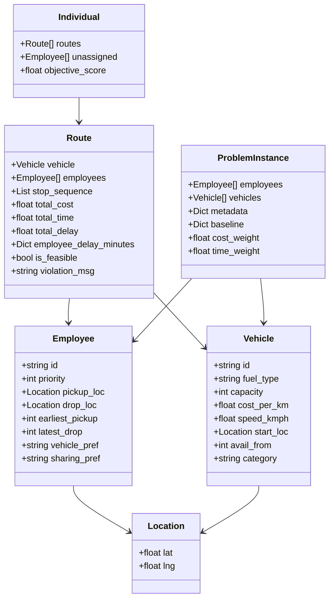

**Diagram sources**
- [models.py](file://backend/engine/models.py#L4-L56)
- [representation.py](file://backend/engine/representation.py#L5-L32)

**Section sources**
- [models.py](file://backend/engine/models.py#L1-L56)
- [representation.py](file://backend/engine/representation.py#L1-L32)

### Pipeline Integration Notes
- The backend server spawns the Python engine and streams results back to the client.
- Distance computation is prewarmed to minimize latency.
- Results include metrics, ride paths, and unassigned passengers.

**Section sources**
- [engineRunner.js](file://backend/services/engineRunner.js#L21-L73)
- [PIPELINE_DOCUMENTATION.md](file://backend/engine/PIPELINE_DOCUMENTATION.md#L139-L151)
- [utils.py](file://backend/engine/utils.py#L112-L162)