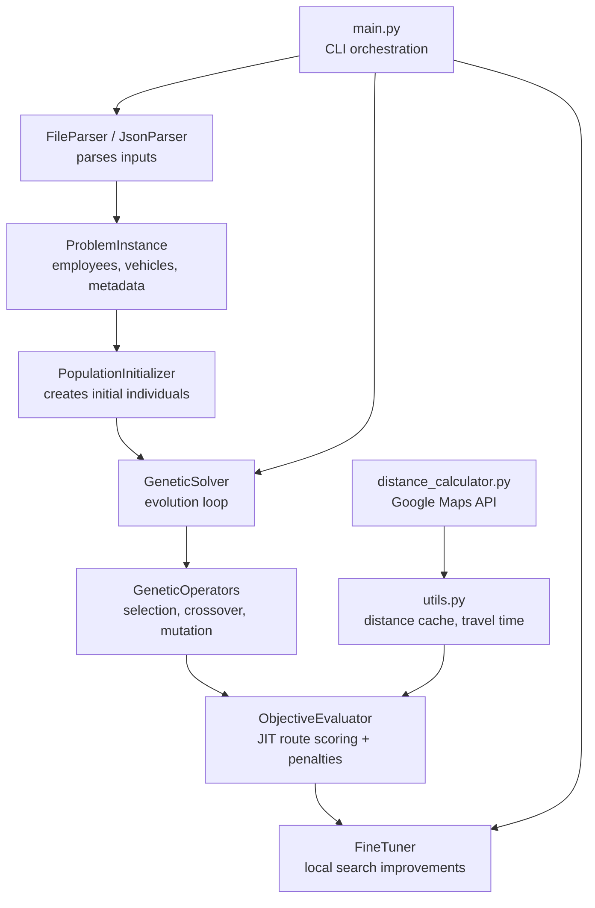
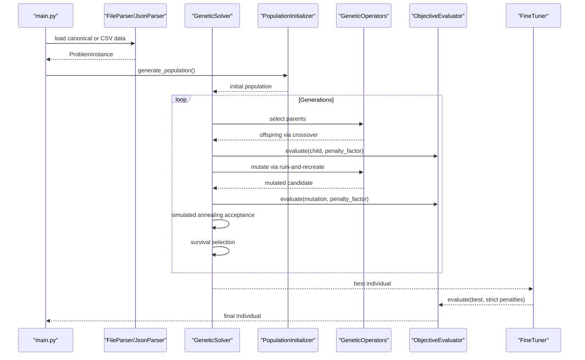
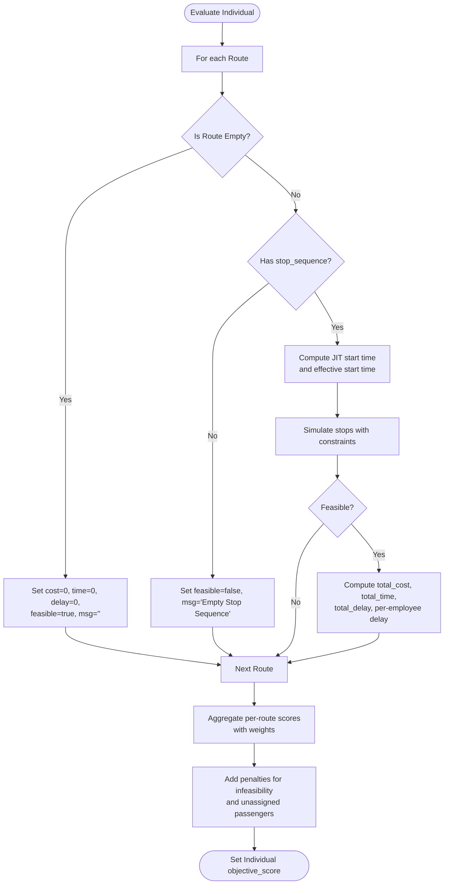
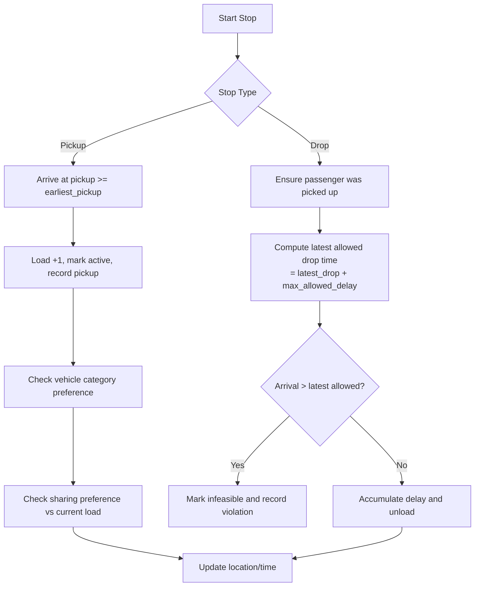
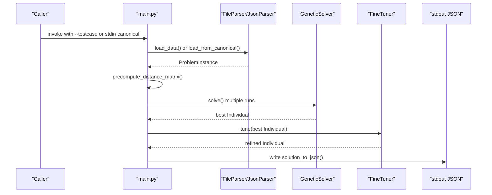
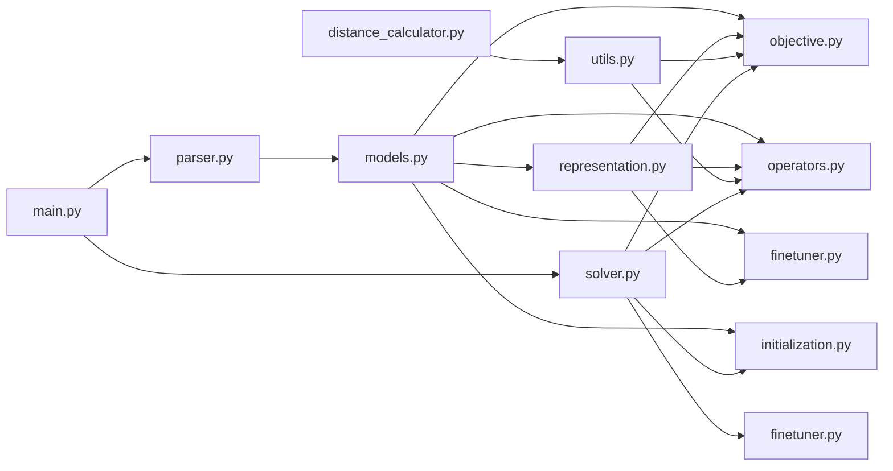

# Objective Functions and Constraints

<cite>
**Referenced Files in This Document**
- [objective.py](file://backend/engine/objective.py)
- [models.py](file://backend/engine/models.py)
- [solver.py](file://backend/engine/solver.py)
- [operators.py](file://backend/engine/operators.py)
- [initialization.py](file://backend/engine/initialization.py)
- [finetuner.py](file://backend/engine/finetuner.py)
- [representation.py](file://backend/engine/representation.py)
- [utils.py](file://backend/engine/utils.py)
- [parser.py](file://backend/engine/parser.py)
- [main.py](file://backend/engine/main.py)
- [distance_calculator.py](file://backend/engine/distance_calculator.py)
- [validate_distance.py](file://backend/engine/validate_distance.py)
</cite>

## Table of Contents
1. [Introduction](#introduction)
2. [Project Structure](#project-structure)
3. [Core Components](#core-components)
4. [Architecture Overview](#architecture-overview)
5. [Detailed Component Analysis](#detailed-component-analysis)
6. [Dependency Analysis](#dependency-analysis)
7. [Performance Considerations](#performance-considerations)
8. [Troubleshooting Guide](#troubleshooting-guide)
9. [Conclusion](#conclusion)

## Introduction
This document explains the objective function design and constraint handling system used by the genetic algorithm optimizer. It covers:
- Multi-objective optimization combining cost minimization, time optimization, and delay reduction
- Constraint enforcement mechanisms: vehicle capacity limits, employee assignment rules, pickup–dropoff sequencing, and time window restrictions
- Mathematical formulations of the objective function, penalty systems for constraint violations, and feasibility checking procedures
- Examples of constraint violation detection, penalty calculation, and solution quality assessment methods used in the genetic algorithm

## Project Structure
The optimization engine resides under backend/engine and orchestrates parsing, initialization, evolution, and fine-tuning:
- Data ingestion and normalization: parser.py
- Core data models: models.py
- Representation of solutions: representation.py
- Objective scoring and JIT route simulation: objective.py
- Evolutionary operators and local search: operators.py
- Population initialization strategies: initialization.py
- Deterministic fine-tuning: finetuner.py
- Distance computation utilities: utils.py and distance_calculator.py
- Orchestration and output: main.py

**Diagram sources**
- [parser.py](file://backend/engine/parser.py#L29-L77)
- [models.py](file://backend/engine/models.py#L44-L56)
- [initialization.py](file://backend/engine/initialization.py#L14-L30)
- [solver.py](file://backend/engine/solver.py#L38-L107)
- [operators.py](file://backend/engine/operators.py#L242-L290)
- [objective.py](file://backend/engine/objective.py#L16-L38)
- [finetuner.py](file://backend/engine/finetuner.py#L14-L49)
- [utils.py](file://backend/engine/utils.py#L86-L165)
- [distance_calculator.py](file://backend/engine/distance_calculator.py#L23-L90)
- [main.py](file://backend/engine/main.py#L107-L129)

**Section sources**
- [main.py](file://backend/engine/main.py#L145-L193)
- [parser.py](file://backend/engine/parser.py#L29-L77)
- [models.py](file://backend/engine/models.py#L44-L56)

## Core Components
- ProblemInstance: encapsulates employees, vehicles, metadata, and baseline costs/times; exposes weights for the multi-objective function
- Employee: includes time windows, priority, and preferences (vehicle category and sharing capacity)
- Vehicle: includes capacity, cost per km, speed, availability, and category
- Individual: collection of Routes plus unassigned employees and objective score
- Route: ordered stop sequence with pickup/dropoff markers, computed metrics, feasibility flag, and violation message

Key behaviors:
- ObjectiveEvaluator computes route metrics using Just-In-Time (JIT) departure logic and applies penalties for infeasibility and unassigned passengers
- GeneticOperators implement selection, crossover, and ruin-and-recreate mutation with hard-constraint-aware insertion and 2-opt local search
- FineTuner performs deterministic improvements after GA to downsize expensive routes, relocate passengers, and optimize sequences

**Section sources**
- [models.py](file://backend/engine/models.py#L9-L36)
- [representation.py](file://backend/engine/representation.py#L5-L32)
- [objective.py](file://backend/engine/objective.py#L12-L38)
- [operators.py](file://backend/engine/operators.py#L37-L81)
- [finetuner.py](file://backend/engine/finetuner.py#L8-L49)

## Architecture Overview
The system integrates parsing, initialization, evolution, and refinement into a single pipeline. The solver scales penalties over generations and applies simulated annealing-style acceptance for mutations. FineTuner then improves the best solution deterministically.

**Diagram sources**
- [main.py](file://backend/engine/main.py#L107-L129)
- [solver.py](file://backend/engine/solver.py#L38-L107)
- [initialization.py](file://backend/engine/initialization.py#L14-L30)
- [operators.py](file://backend/engine/operators.py#L242-L290)
- [objective.py](file://backend/engine/objective.py#L16-L38)
- [finetuner.py](file://backend/engine/finetuner.py#L14-L49)

## Detailed Component Analysis

### Objective Function Design and JIT Route Simulation
The objective evaluator computes:
- Route-level total cost as distance × vehicle cost_per_km
- Route-level total time as finish time minus JIT effective start time
- Route-level total delay as accumulated late drops beyond allowed tolerance
- Individual-level objective score as weighted sum of route costs and times, plus penalties for infeasibility and unassigned passengers

Penalty system:
- Unassigned passengers incur a fixed penalty scaled by penalty_factor
- Route infeasibility and violation messages incur fixed penalties scaled by penalty_factor
- Dynamic penalties are applied differently across generations to bias toward feasibility

JIT departure logic:
- Computes the earliest feasible start time to arrive exactly at the first stop’s target time
- Enforces vehicle availability and turn-around buffering between multi-trip segments
- Accumulates travel time and delays while enforcing precedence and capacity constraints

**Diagram sources**
- [objective.py](file://backend/engine/objective.py#L16-L38)
- [objective.py](file://backend/engine/objective.py#L39-L201)

**Section sources**
- [objective.py](file://backend/engine/objective.py#L6-L11)
- [objective.py](file://backend/engine/objective.py#L16-L38)
- [objective.py](file://backend/engine/objective.py#L39-L201)
- [models.py](file://backend/engine/models.py#L50-L56)

### Constraint Handling Mechanisms
Hard constraints enforced during route simulation and insertion checks:
- Vehicle capacity: current load must not exceed vehicle capacity
- Sharing preference: active passengers must respect per-passenger sharing limits
- Vehicle category preference: premium passengers require premium vehicles
- Pickup–dropoff precedence: a passenger must be picked up before being dropped off
- Time window constraints: pickups observed via earliest_pickup; drops validated against latest_drop plus per-priority allowed delay

Soft constraints and penalties:
- Infeasible routes incur fixed penalties
- Unassigned passengers incur a penalty proportional to the number of unassigned individuals

**Diagram sources**
- [objective.py](file://backend/engine/objective.py#L133-L192)
- [operators.py](file://backend/engine/operators.py#L148-L196)

**Section sources**
- [objective.py](file://backend/engine/objective.py#L133-L192)
- [operators.py](file://backend/engine/operators.py#L127-L196)
- [models.py](file://backend/engine/models.py#L20-L24)

### Multi-Objective Formulation and Penalty Systems
Mathematical formulation:
- For each route r:
  - cost(r) = total_distance(r) × vehicle.cost_per_km
  - time(r) = finish_time(r) − JIT_effective_start_time(r)
  - delay(r) = sum of late drops beyond allowed tolerance
- For the entire individual:
  - score = Σ_r (w_cost × cost(r) + w_time × time(r)) + penalty_infeasible + penalty_unassigned
- Penalty terms:
  - penalty_infeasible = large constant if route.is_feasible is false or violation_msg exists
  - penalty_unassigned = len(unassigned) × PENALTY_UNASSIGNED

Dynamic penalty scaling:
- Over generations, penalty_factor increases from 0.1 to 10.0 to progressively favor feasible solutions

**Section sources**
- [objective.py](file://backend/engine/objective.py#L22-L36)
- [objective.py](file://backend/engine/objective.py#L50-L59)
- [solver.py](file://backend/engine/solver.py#L50-L51)

### Initialization Strategies and Solution Quality Assessment
Initialization:
- GRASP-based construction with regret factor prioritizing difficult passengers (high priority and tight time windows)
- Random diversification to explore varied solutions

Solution quality assessment:
- After GA, FineTuner runs deterministic local search to:
  - Downsize expensive routes by relocating passengers to cheaper vehicles
  - Relocate single passengers between routes using best insertion
  - Optimize stop sequences via 2-opt swaps
- Final evaluation uses strict penalty factors to ensure feasibility

**Section sources**
- [initialization.py](file://backend/engine/initialization.py#L14-L30)
- [initialization.py](file://backend/engine/initialization.py#L32-L63)
- [finetuner.py](file://backend/engine/finetuner.py#L14-L49)
- [finetuner.py](file://backend/engine/finetuner.py#L51-L136)
- [finetuner.py](file://backend/engine/finetuner.py#L138-L189)
- [finetuner.py](file://backend/engine/finetuner.py#L191-L221)

### Distance Computation and Validation
Distance computation:
- Cached road distances via Google Maps Distance Matrix API with fallback to haversine
- Batch precomputation to warm caches and reduce latency
- Travel time derived from distance and vehicle speed

Validation:
- Standalone validator tests road distance and duration across test cases

**Section sources**
- [utils.py](file://backend/engine/utils.py#L86-L165)
- [utils.py](file://backend/engine/utils.py#L112-L161)
- [distance_calculator.py](file://backend/engine/distance_calculator.py#L23-L90)
- [validate_distance.py](file://backend/engine/validate_distance.py#L11-L43)

### API Workflow and Output Generation
The CLI loads data (CSV or canonical JSON), warms distance caches, runs multiple solver instances in parallel, selects the best solution, and emits structured output including per-route metrics and savings versus baseline.

**Diagram sources**
- [main.py](file://backend/engine/main.py#L145-L193)
- [main.py](file://backend/engine/main.py#L42-L104)
- [solver.py](file://backend/engine/solver.py#L38-L107)
- [finetuner.py](file://backend/engine/finetuner.py#L14-L49)

**Section sources**
- [main.py](file://backend/engine/main.py#L145-L193)
- [main.py](file://backend/engine/main.py#L42-L104)

## Dependency Analysis
The following diagram shows key dependencies among modules implementing objective scoring, constraints, and evolution.

**Diagram sources**
- [models.py](file://backend/engine/models.py#L4-L56)
- [representation.py](file://backend/engine/representation.py#L1-L32)
- [objective.py](file://backend/engine/objective.py#L1-L11)
- [operators.py](file://backend/engine/operators.py#L1-L8)
- [finetuner.py](file://backend/engine/finetuner.py#L1-L12)
- [utils.py](file://backend/engine/utils.py#L1-L25)
- [distance_calculator.py](file://backend/engine/distance_calculator.py#L1-L21)
- [parser.py](file://backend/engine/parser.py#L1-L11)
- [solver.py](file://backend/engine/solver.py#L1-L12)
- [main.py](file://backend/engine/main.py#L1-L11)

**Section sources**
- [solver.py](file://backend/engine/solver.py#L14-L36)
- [operators.py](file://backend/engine/operators.py#L37-L40)
- [finetuner.py](file://backend/engine/finetuner.py#L8-L12)
- [utils.py](file://backend/engine/utils.py#L19-L25)

## Performance Considerations
- Distance caching: precompute and batch road distances to minimize API calls and improve throughput
- JIT route simulation: compute effective start times to reward on-time departures and reduce unnecessary waiting
- Penalty scaling: increase penalties gradually to balance exploration and feasibility
- Local search: apply 2-opt and best-insertion steps to refine sequences and reduce total cost/time
- Parallel runs: execute multiple solver runs concurrently to find better baselines

[No sources needed since this section provides general guidance]

## Troubleshooting Guide
Common issues and remedies:
- Infeasible routes flagged with violation messages:
  - Verify vehicle category preferences and sharing limits
  - Ensure pickup–dropoff precedence and capacity constraints are met
- Excessive unassigned passengers:
  - Review vehicle capacity and distribution across routes
  - Adjust initialization strategies to prioritize difficult passengers
- High delay accumulation:
  - Inspect time window tightness and per-priority allowed delays
  - Use FineTuner to relocate passengers and optimize sequences
- Distance API failures:
  - Confirm API key presence and quota
  - Fall back to haversine distances when road API is unavailable

**Section sources**
- [objective.py](file://backend/engine/objective.py#L140-L158)
- [operators.py](file://backend/engine/operators.py#L154-L191)
- [utils.py](file://backend/engine/utils.py#L54-L84)
- [distance_calculator.py](file://backend/engine/distance_calculator.py#L49-L51)

## Conclusion
The system combines a multi-objective genetic algorithm with rigorous constraint enforcement and dynamic penalty scaling. ObjectiveEvaluator’s JIT route simulation ensures realistic time and delay metrics, while operators and FineTuner iteratively refine solutions. The design balances cost, time, and delay objectives with strong adherence to capacity, precedence, time windows, and preference constraints.