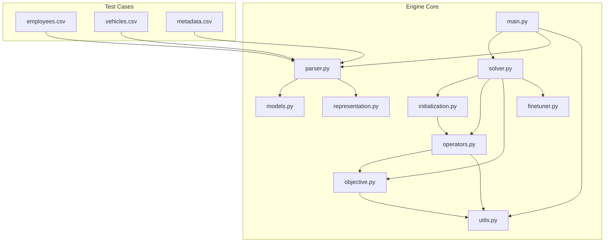
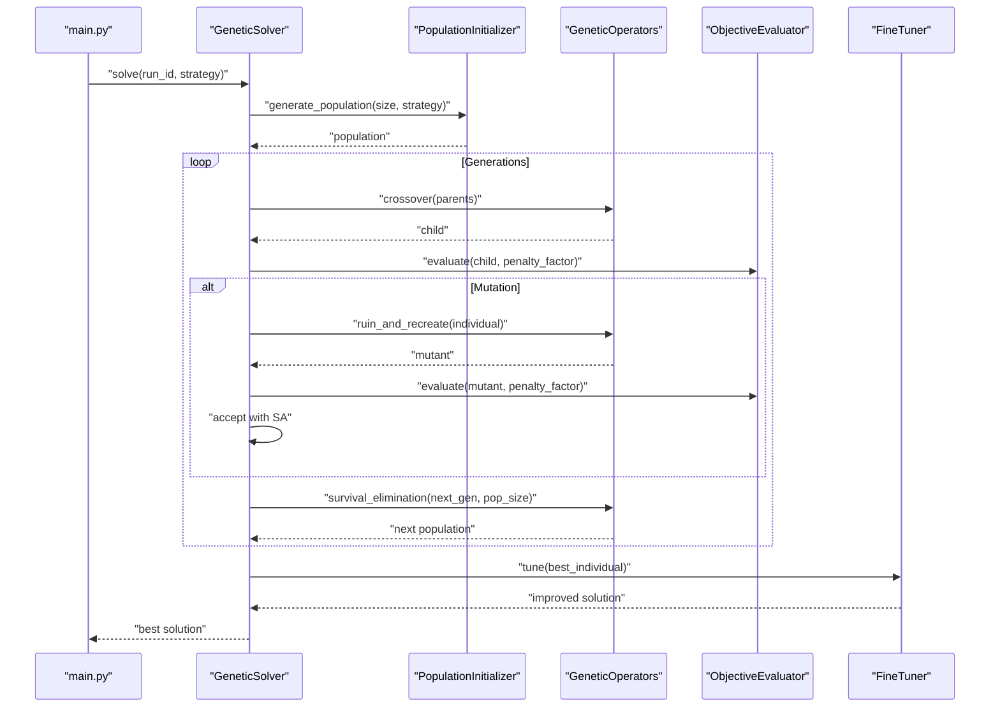
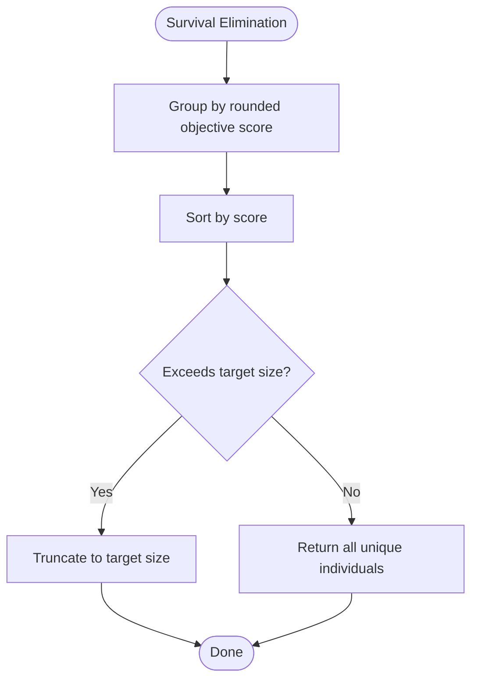
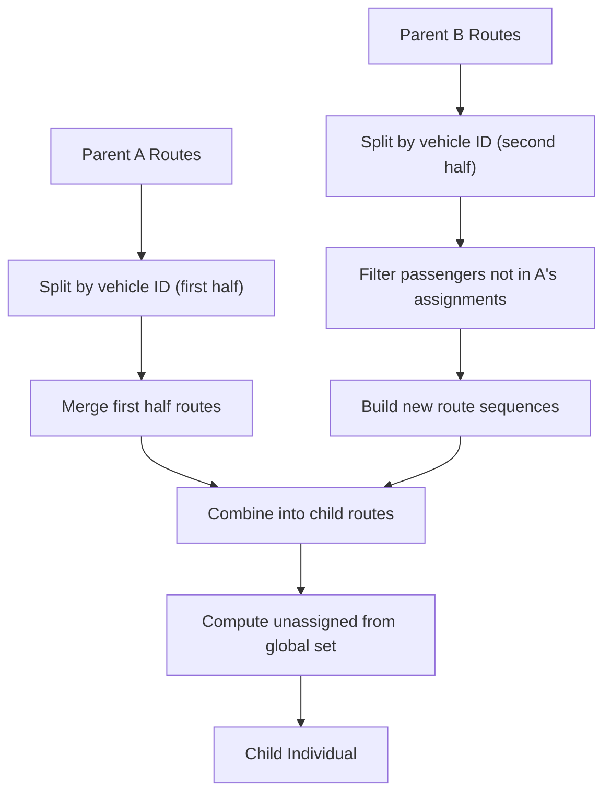
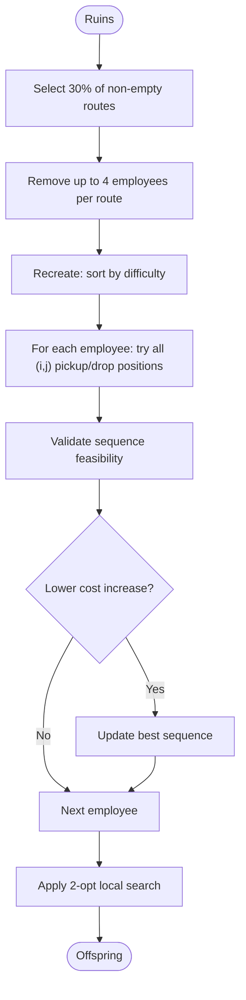
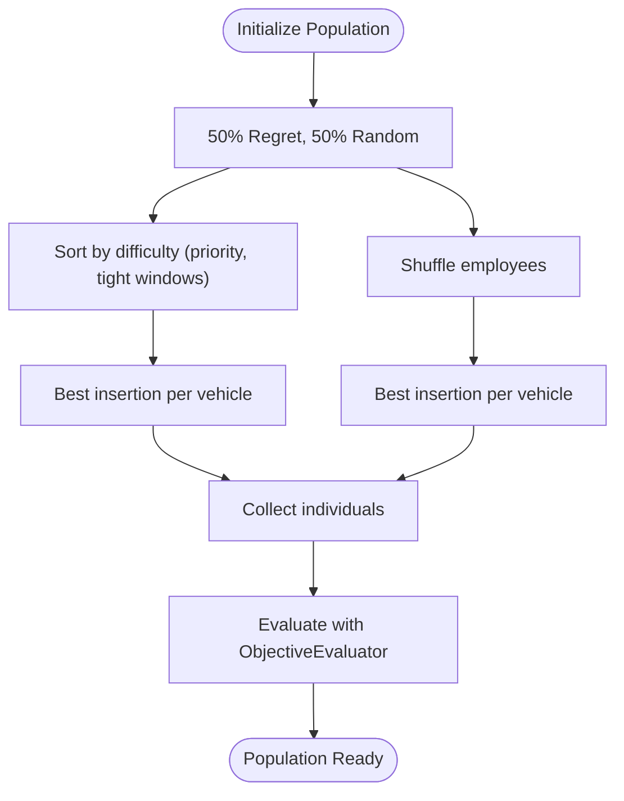
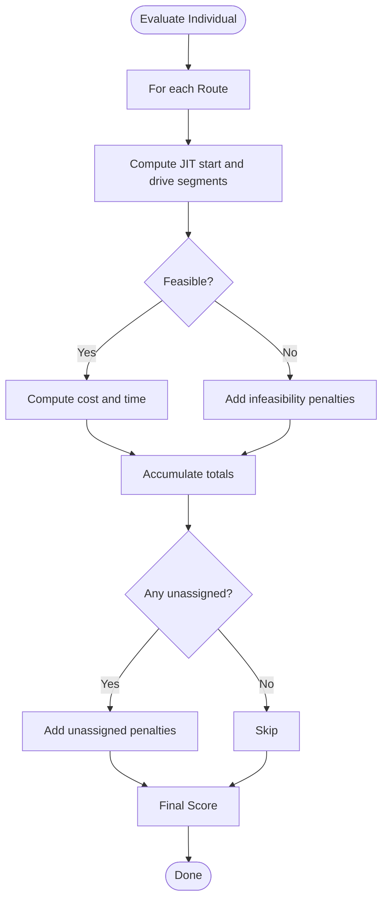
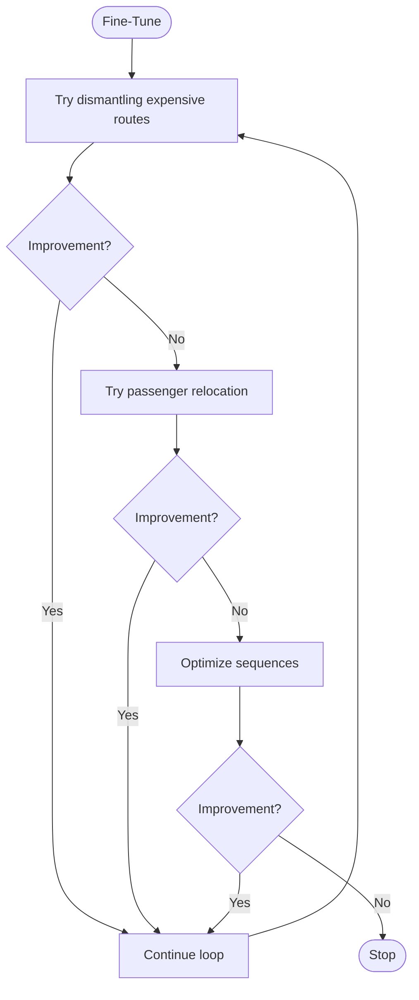
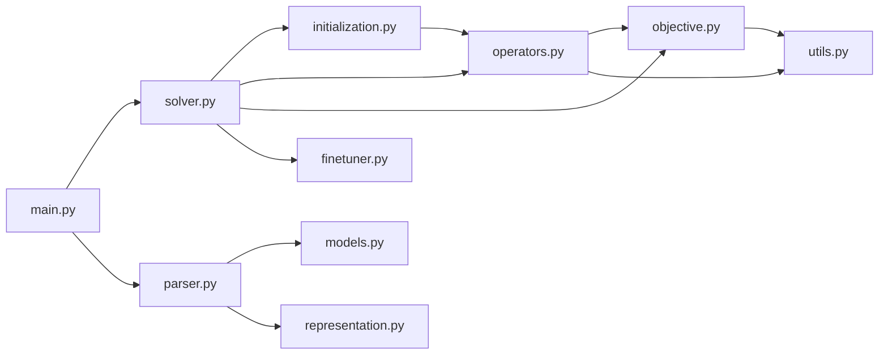

# Operators and Evolutionary Strategies

<cite>
**Referenced Files in This Document**
- [operators.py](file://backend/engine/operators.py)
- [solver.py](file://backend/engine/solver.py)
- [initialization.py](file://backend/engine/initialization.py)
- [representation.py](file://backend/engine/representation.py)
- [models.py](file://backend/engine/models.py)
- [objective.py](file://backend/engine/objective.py)
- [finetuner.py](file://backend/engine/finetuner.py)
- [utils.py](file://backend/engine/utils.py)
- [main.py](file://backend/engine/main.py)
- [parser.py](file://backend/engine/parser.py)
- [PIPELINE_DOCUMENTATION.md](file://backend/engine/PIPELINE_DOCUMENTATION.md)
- [metadata.csv](file://backend/engine/testcase1/metadata.csv)
- [employees.csv](file://backend/engine/testcase1/employees.csv)
- [vehicles.csv](file://backend/engine/testcase1/vehicles.csv)
</cite>

## Table of Contents
1. [Introduction](#introduction)
2. [Project Structure](#project-structure)
3. [Core Components](#core-components)
4. [Architecture Overview](#architecture-overview)
5. [Detailed Component Analysis](#detailed-component-analysis)
6. [Dependency Analysis](#dependency-analysis)
7. [Performance Considerations](#performance-considerations)
8. [Troubleshooting Guide](#troubleshooting-guide)
9. [Conclusion](#conclusion)
10. [Appendices](#appendices)

## Introduction
This document explains the evolutionary operators and strategies used in the route optimization engine. It covers selection methods, crossover techniques, mutation strategies, and local search improvements. It also documents the eight predefined optimization strategies (Logic, Chaos, Sniper, Explore, Balance, Hybrid, Spec-A, Spec-B) with their specific weight configurations for regret-based construction, GRASP-style insertion, and random exploration. Implementation details of route manipulation operators, employee assignment changes, and vehicle routing modifications are provided, along with examples of operator effectiveness under different problem scenarios and strategy selection mechanisms.

## Project Structure
The optimization engine resides in the backend/engine directory. Key modules include:
- Operators and evolutionary mechanics: operators.py
- Solver orchestration and strategy loop: solver.py
- Population initialization with strategy-aware construction: initialization.py
- Data models and representation: models.py, representation.py
- Objective scoring and constraint handling: objective.py
- Deterministic fine-tuning post-GA: finetuner.py
- Utilities for distance computation and logging: utils.py
- Strategy registry and parallel runs: main.py
- Data parsing from CSV and canonical JSON: parser.py
- Pipeline documentation and run details: PIPELINE_DOCUMENTATION.md
- Test case datasets: employees.csv, vehicles.csv, metadata.csv

**Diagram sources**
- [main.py](file://backend/engine/main.py#L1-L193)
- [solver.py](file://backend/engine/solver.py#L1-L107)
- [initialization.py](file://backend/engine/initialization.py#L1-L63)
- [operators.py](file://backend/engine/operators.py#L1-L290)
- [objective.py](file://backend/engine/objective.py#L1-L201)
- [finetuner.py](file://backend/engine/finetuner.py#L1-L221)
- [utils.py](file://backend/engine/utils.py#L1-L245)
- [parser.py](file://backend/engine/parser.py#L1-L278)
- [representation.py](file://backend/engine/representation.py#L1-L32)
- [models.py](file://backend/engine/models.py#L1-L56)
- [employees.csv](file://backend/engine/testcase1/employees.csv#L1-L9)
- [vehicles.csv](file://backend/engine/testcase1/vehicles.csv#L1-L4)
- [metadata.csv](file://backend/engine/testcase1/metadata.csv#L1-L12)

**Section sources**
- [main.py](file://backend/engine/main.py#L1-L193)
- [PIPELINE_DOCUMENTATION.md](file://backend/engine/PIPELINE_DOCUMENTATION.md#L1-L252)

## Core Components
- SelectionEngine: Tournament selection for parent selection and survival elimination to deduplicate and truncate populations.
- GeneticOperators: Ruin-and-recreate mutation, best-insertion GRASP-style recreation, route 2-opt local search, and constraint validation.
- PopulationInitializer: Creates initial population using a mix of regret-based and random GRASP constructions.
- ObjectiveEvaluator: Computes weighted objective scores with penalties for infeasibility and unassigned passengers.
- FineTuner: Post-GA deterministic improvement via aggressive downsizing, passenger relocation, and sequence optimization.
- Strategy Registry: Eight predefined strategies with explicit weights for regret-based construction, GRASP, and random exploration.

**Section sources**
- [operators.py](file://backend/engine/operators.py#L9-L290)
- [initialization.py](file://backend/engine/initialization.py#L8-L63)
- [objective.py](file://backend/engine/objective.py#L12-L201)
- [finetuner.py](file://backend/engine/finetuner.py#L8-L221)
- [main.py](file://backend/engine/main.py#L12-L21)

## Architecture Overview
The engine runs a steady-state genetic algorithm with simulated annealing acceptance for mutations. After each generation, a deterministic fine-tuner refines the best solution. Parallel runs execute all eight strategies concurrently, selecting the best among them.

**Diagram sources**
- [main.py](file://backend/engine/main.py#L27-L30)
- [solver.py](file://backend/engine/solver.py#L38-L107)
- [initialization.py](file://backend/engine/initialization.py#L14-L30)
- [operators.py](file://backend/engine/operators.py#L242-L290)
- [objective.py](file://backend/engine/objective.py#L16-L38)
- [finetuner.py](file://backend/engine/finetuner.py#L14-L49)

## Detailed Component Analysis

### Selection and Survival
SelectionEngine performs tournament selection to pick parents and survival elimination to deduplicate and truncate the population. Deduplication rounds objective scores to four decimals to treat numerically identical solutions as the same.

**Diagram sources**
- [operators.py](file://backend/engine/operators.py#L21-L36)

**Section sources**
- [operators.py](file://backend/engine/operators.py#L9-L36)

### Crossover: Route-Mapping with Best-Insertion Filtering
Crossover combines routes from two parents by splitting vehicles by ID and ensuring no duplicate passenger assignments. The second half filters out passengers already assigned in the first half, preserving feasibility and reducing wasted computation.

**Diagram sources**
- [operators.py](file://backend/engine/operators.py#L242-L290)

**Section sources**
- [operators.py](file://backend/engine/operators.py#L242-L290)

### Mutation: Ruin-and-Recreate with Local 2-opt
Mutation applies a ruin phase that randomly removes a subset of employees from random routes, followed by a recreate phase that inserts each removed employee into the best valid position using best-insertion logic. A local 2-opt improvement is applied to each route afterward.

**Diagram sources**
- [operators.py](file://backend/engine/operators.py#L42-L100)
- [operators.py](file://backend/engine/operators.py#L102-L125)
- [operators.py](file://backend/engine/operators.py#L208-L240)

**Section sources**
- [operators.py](file://backend/engine/operators.py#L42-L100)
- [operators.py](file://backend/engine/operators.py#L102-L125)
- [operators.py](file://backend/engine/operators.py#L208-L240)

### Route Construction Heuristics: Initialization
Initialization builds individuals using a mixture of:
- Regret-based construction: sorts employees by difficulty (priority and tight time windows) then inserts greedily with best insertion.
- Random construction: shuffles employees and inserts greedily with best insertion.
Each construction type contributes half of the initial population.

**Diagram sources**
- [initialization.py](file://backend/engine/initialization.py#L17-L28)
- [initialization.py](file://backend/engine/initialization.py#L32-L63)
- [operators.py](file://backend/engine/operators.py#L102-L125)

**Section sources**
- [initialization.py](file://backend/engine/initialization.py#L8-L63)

### Objective Scoring and Constraints
ObjectiveEvaluator computes:
- Route-level cost as distance × cost_per_km.
- Route-level time as JIT finish time minus JIT start time.
- Total system score as weighted sum of cost and time across routes.
- Penalties for infeasibility, violations, and unassigned passengers.

**Diagram sources**
- [objective.py](file://backend/engine/objective.py#L16-L38)
- [objective.py](file://backend/engine/objective.py#L39-L201)

**Section sources**
- [objective.py](file://backend/engine/objective.py#L12-L201)

### Deterministic Fine-Tuner
The fine-tuner iteratively attempts:
- Aggressive downsizing: remove passengers from expensive vehicles and reinsert into cheaper ones using best insertion.
- Passenger relocation: move single passengers between routes to reduce cost/time.
- Sequence optimization: apply 2-opt swaps to smooth routes.

**Diagram sources**
- [finetuner.py](file://backend/engine/finetuner.py#L14-L49)
- [finetuner.py](file://backend/engine/finetuner.py#L51-L136)
- [finetuner.py](file://backend/engine/finetuner.py#L138-L189)
- [finetuner.py](file://backend/engine/finetuner.py#L191-L221)

**Section sources**
- [finetuner.py](file://backend/engine/finetuner.py#L8-L221)

### Strategy Registry and Configuration
Eight strategies define the composition of the initial population:
- Logic: high regret-based construction, low GRASP, low random exploration
- Chaos: no regret-based construction, low GRASP, high random exploration
- Sniper: low regret-based construction, high GRASP, no random exploration
- Explore: no regret-based construction, high GRASP, low random exploration
- Balance: low regret-based construction, moderate GRASP, moderate random exploration
- Hybrid: moderate regret-based construction, no GRASP, high random exploration
- Spec-A: low-to-moderate regret-based construction, moderate GRASP, low random exploration
- Spec-B: no regret-based construction, pure GRASP, no random exploration

These weights are consumed by the initializer to allocate individuals between regret-based and random GRASP construction.

**Section sources**
- [main.py](file://backend/engine/main.py#L12-L21)
- [initialization.py](file://backend/engine/initialization.py#L17-L28)

### Route Manipulation Operators
- Employee removal from routes: selects random non-empty routes and removes a small random number of employees, updating both the stop sequence and employee list.
- Best insertion: enumerates all legal pickup/drop positions for an employee and selects the minimum cost increase.
- Precedence enforcement: ensures pickup occurs before drop for the same employee.
- Capacity and sharing constraints: enforces vehicle capacity and passenger sharing limits.
- Turnaround handling: adds buffer time between multi-trip runs.

**Section sources**
- [operators.py](file://backend/engine/operators.py#L83-L100)
- [operators.py](file://backend/engine/operators.py#L102-L125)
- [operators.py](file://backend/engine/operators.py#L127-L196)
- [operators.py](file://backend/engine/operators.py#L208-L240)

### Employee Assignment Changes
- During ruin, employees are removed from their current routes and added to the unassigned list.
- During recreation, each removed employee is inserted into the best valid route using best insertion.
- During fine-tuning, passengers may be relocated between routes to improve the objective.

**Section sources**
- [operators.py](file://backend/engine/operators.py#L42-L81)
- [operators.py](file://backend/engine/operators.py#L102-L125)
- [finetuner.py](file://backend/engine/finetuner.py#L138-L189)

### Vehicle Routing Modifications
- Route sequences are represented as ordered lists of stops with pickup and drop types.
- Vehicles are mapped by ID; crossover preserves vehicle identity and best-insertion feasibility.
- 2-opt swaps are applied to improve route order and reduce travel time.

**Section sources**
- [representation.py](file://backend/engine/representation.py#L5-L17)
- [operators.py](file://backend/engine/operators.py#L242-L290)
- [operators.py](file://backend/engine/operators.py#L208-L240)

### Operator Effectiveness Examples
- High-priority passengers with tight windows: regret-based construction prioritizes difficult requests, improving feasibility and reducing delays.
- Mixed sharing preferences: best insertion respects capacity and sharing limits, preventing violations.
- Multi-trip scenarios: turnaround buffers and precedence checks ensure smooth transitions between runs.
- Large-scale problems: simulated annealing acceptance helps escape local optima; fine-tuner further reduces cost/time.

[No sources needed since this section provides general guidance]

## Dependency Analysis
The solver orchestrates initialization, operators, objective evaluation, and fine-tuning. Operators depend on models, representation, objective evaluation, and utilities for distance/time computations. The strategy registry is injected into the solver via the initializer.

**Diagram sources**
- [solver.py](file://backend/engine/solver.py#L14-L36)
- [initialization.py](file://backend/engine/initialization.py#L8-L12)
- [operators.py](file://backend/engine/operators.py#L3-L7)
- [objective.py](file://backend/engine/objective.py#L1-L4)
- [finetuner.py](file://backend/engine/finetuner.py#L1-L6)
- [main.py](file://backend/engine/main.py#L8-L11)
- [parser.py](file://backend/engine/parser.py#L1-L3)
- [models.py](file://backend/engine/models.py#L1-L56)
- [representation.py](file://backend/engine/representation.py#L1-L32)
- [utils.py](file://backend/engine/utils.py#L1-L245)

**Section sources**
- [solver.py](file://backend/engine/solver.py#L14-L36)
- [main.py](file://backend/engine/main.py#L8-L11)

## Performance Considerations
- Distance caching: precompute road distances to minimize API calls and latency.
- Penalty scaling: increase penalties gradually during evolution to tighten constraints.
- Deduplication: round objective scores to avoid redundant evaluations.
- Local search: 2-opt and best insertion reduce travel time and improve feasibility.
- Parallel runs: execute multiple strategies concurrently to explore diverse solutions.

[No sources needed since this section provides general guidance]

## Troubleshooting Guide
- Infeasible solutions: check constraint violations reported by the objective evaluator and ensure vehicle categories and sharing preferences are respected.
- Unassigned passengers: verify that all employees were inserted during construction or recreation; confirm capacity and preference checks.
- Slow performance: enable distance precomputation and consider reducing population size or generations for large datasets.
- API errors: ensure the Google Maps API key is configured and valid; fallback to haversine distance if needed.

**Section sources**
- [objective.py](file://backend/engine/objective.py#L16-L38)
- [objective.py](file://backend/engine/objective.py#L138-L191)
- [utils.py](file://backend/engine/utils.py#L54-L84)
- [utils.py](file://backend/engine/utils.py#L112-L161)

## Conclusion
The engine combines tournament selection, crossover with best-insertion filtering, ruin-and-recreate mutation, and a deterministic fine-tuner to produce high-quality, feasible routes. The eight strategies offer varied balances between regret-based construction, GRASP-style insertion, and random exploration, enabling robust performance across diverse problem instances.

[No sources needed since this section summarizes without analyzing specific files]

## Appendices

### Strategy Weight Configurations
- Logic: regret-based construction weight high, GRASP weight low, random exploration weight low
- Chaos: regret-based construction weight low, GRASP weight low, random exploration weight high
- Sniper: regret-based construction weight low, GRASP weight high, random exploration weight low
- Explore: regret-based construction weight low, GRASP weight high, random exploration weight low
- Balance: regret-based construction weight moderate, GRASP weight moderate, random exploration weight moderate
- Hybrid: regret-based construction weight moderate, GRASP weight low, random exploration weight high
- Spec-A: regret-based construction weight moderate, GRASP weight moderate, random exploration weight low
- Spec-B: regret-based construction weight low, GRASP weight high, random exploration weight low

**Section sources**
- [main.py](file://backend/engine/main.py#L12-L21)

### Data Model Definitions
- Employee: identifiers, priority, pickup/drop locations, time windows, vehicle preference, sharing preference
- Vehicle: identifiers, capacity, cost per km, speed, start location, availability, category
- ProblemInstance: collections of employees, vehicles, metadata, baseline costs/times
- Route: vehicle, employees, stop sequence, metrics, feasibility
- Individual: routes, unassigned employees, objective score

**Section sources**
- [models.py](file://backend/engine/models.py#L4-L56)
- [representation.py](file://backend/engine/representation.py#L5-L32)

### Example Datasets
- employees.csv: employee records with time windows and preferences
- vehicles.csv: vehicle records with capacity, cost, speed, and category
- metadata.csv: objective weights and operational parameters

**Section sources**
- [employees.csv](file://backend/engine/testcase1/employees.csv#L1-L9)
- [vehicles.csv](file://backend/engine/testcase1/vehicles.csv#L1-L4)
- [metadata.csv](file://backend/engine/testcase1/metadata.csv#L1-L12)