# Optimization Engine (Python)

<cite>
**Referenced Files in This Document**
- [main.py](file://backend/engine/main.py)
- [solver.py](file://backend/engine/solver.py)
- [models.py](file://backend/engine/models.py)
- [representation.py](file://backend/engine/representation.py)
- [objective.py](file://backend/engine/objective.py)
- [operators.py](file://backend/engine/operators.py)
- [initialization.py](file://backend/engine/initialization.py)
- [utils.py](file://backend/engine/utils.py)
- [finetuner.py](file://backend/engine/finetuner.py)
- [parser.py](file://backend/engine/parser.py)
- [distance_calculator.py](file://backend/engine/distance_calculator.py)
- [validate_distance.py](file://backend/engine/validate_distance.py)
- [employees.csv](file://backend/engine/testcase1/employees.csv)
- [vehicles.csv](file://backend/engine/testcase1/vehicles.csv)
- [metadata.csv](file://backend/engine/testcase1/metadata.csv)
- [baseline.csv](file://backend/engine/testcase1/baseline.csv)
</cite>

## Table of Contents
1. [Introduction](#introduction)
2. [Project Structure](#project-structure)
3. [Core Components](#core-components)
4. [Architecture Overview](#architecture-overview)
5. [Detailed Component Analysis](#detailed-component-analysis)
6. [Dependency Analysis](#dependency-analysis)
7. [Performance Considerations](#performance-considerations)
8. [Troubleshooting Guide](#troubleshooting-guide)
9. [Conclusion](#conclusion)
10. [Appendices](#appendices)

## Introduction
This document explains the Python optimization engine that solves a capacitated vehicle routing problem with time windows, precedence constraints (pickup before drop-off), vehicle category preferences, and passenger sharing limits. The engine uses a genetic algorithm with a hybrid initialization strategy, ruin-and-recreate mutation, and a deterministic fine-tuner to refine solutions. It integrates with external road distance services and supports parallel runs to explore diverse strategies efficiently.

## Project Structure
The engine resides under backend/engine and includes modules for data parsing, model definitions, representation of solutions, objective evaluation, genetic operators, initialization, utilities (distance computation), and a fine-tuning post-optimizer. Test datasets are provided under backend/engine/testcase1 and similar folders.

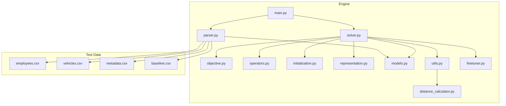

**Diagram sources**
- [main.py](file://backend/engine/main.py#L1-L193)
- [solver.py](file://backend/engine/solver.py#L1-L107)
- [objective.py](file://backend/engine/objective.py#L1-L201)
- [operators.py](file://backend/engine/operators.py#L1-L290)
- [initialization.py](file://backend/engine/initialization.py#L1-L63)
- [representation.py](file://backend/engine/representation.py#L1-L32)
- [models.py](file://backend/engine/models.py#L1-L56)
- [utils.py](file://backend/engine/utils.py#L1-L245)
- [finetuner.py](file://backend/engine/finetuner.py#L1-L221)
- [parser.py](file://backend/engine/parser.py#L1-L278)
- [distance_calculator.py](file://backend/engine/distance_calculator.py#L1-L228)
- [employees.csv](file://backend/engine/testcase1/employees.csv#L1-L9)
- [vehicles.csv](file://backend/engine/testcase1/vehicles.csv)
- [metadata.csv](file://backend/engine/testcase1/metadata.csv)
- [baseline.csv](file://backend/engine/testcase1/baseline.csv#L1-L9)

**Section sources**
- [main.py](file://backend/engine/main.py#L1-L193)
- [parser.py](file://backend/engine/parser.py#L1-L278)

## Core Components
- Problem representation: Location, Employee, Vehicle, Baseline, ProblemInstance.
- Solution representation: Route (vehicle, ordered stops with pickups and drops, metrics, feasibility) and Individual (collection of Routes plus unassigned passengers and objective score).
- Objective evaluator: Computes weighted cost/time and applies hard and soft penalties.
- Operators: Selection, crossover, ruin-and-recreate mutation, and local 2-opt improvement.
- Initialization: GRASP-style construction with regret-based and random strategies.
- Solver: Evolution loop with penalty scaling, simulated annealing acceptance, and fine-tuning.
- Utilities: Distance caching, road distance API integration, travel time calculation, and solution logging.
- Parser: Loads CSV testcases or canonical JSON and normalizes inputs.
- Fine-tuner: Deterministic post-processing to improve solution quality.

**Section sources**
- [models.py](file://backend/engine/models.py#L1-L56)
- [representation.py](file://backend/engine/representation.py#L1-L32)
- [objective.py](file://backend/engine/objective.py#L1-L201)
- [operators.py](file://backend/engine/operators.py#L1-L290)
- [initialization.py](file://backend/engine/initialization.py#L1-L63)
- [solver.py](file://backend/engine/solver.py#L1-L107)
- [utils.py](file://backend/engine/utils.py#L1-L245)
- [parser.py](file://backend/engine/parser.py#L1-L278)
- [finetuner.py](file://backend/engine/finetuner.py#L1-L221)

## Architecture Overview
The engine orchestrates a genetic algorithm with a deterministic refinement stage. It accepts either a canonical JSON payload or CSV testcases, computes distances, evolves solutions in parallel, and produces a structured JSON result.

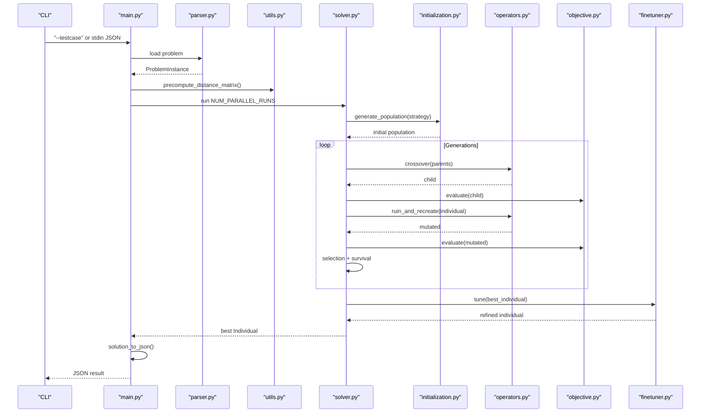

**Diagram sources**
- [main.py](file://backend/engine/main.py#L145-L193)
- [solver.py](file://backend/engine/solver.py#L38-L107)
- [initialization.py](file://backend/engine/initialization.py#L14-L30)
- [operators.py](file://backend/engine/operators.py#L242-L290)
- [objective.py](file://backend/engine/objective.py#L16-L38)
- [finetuner.py](file://backend/engine/finetuner.py#L14-L49)
- [utils.py](file://backend/engine/utils.py#L112-L161)
- [parser.py](file://backend/engine/parser.py#L29-L77)

## Detailed Component Analysis

### Problem Representation and Data Model
- Location: immutable coordinates.
- Employee: identity, priority, pickup/drop locations, time windows, vehicle/sharing preferences.
- Vehicle: capacity, cost per km, speed, start location, availability time, category.
- Baseline: per-employee baseline cost/time for savings computation.
- ProblemInstance: aggregates employees, vehicles, metadata, and baseline.

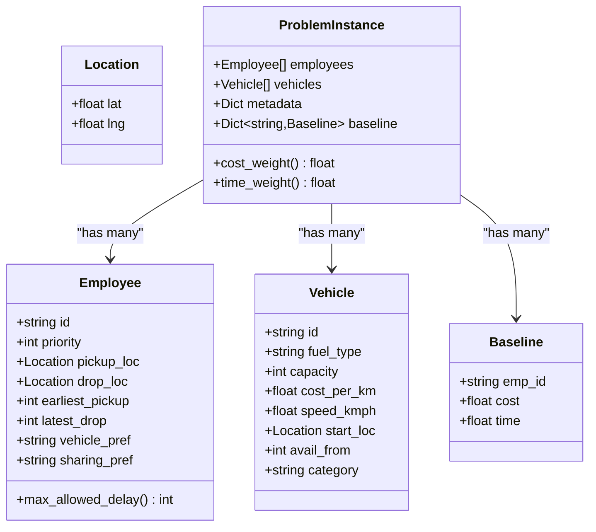

**Diagram sources**
- [models.py](file://backend/engine/models.py#L4-L56)

**Section sources**
- [models.py](file://backend/engine/models.py#L1-L56)

### Solution Representation
- Route: vehicle, ordered stop_sequence (pickups and drops), computed metrics, feasibility flag, and violation message.
- Individual: collection of Routes, unassigned passengers, and objective_score.

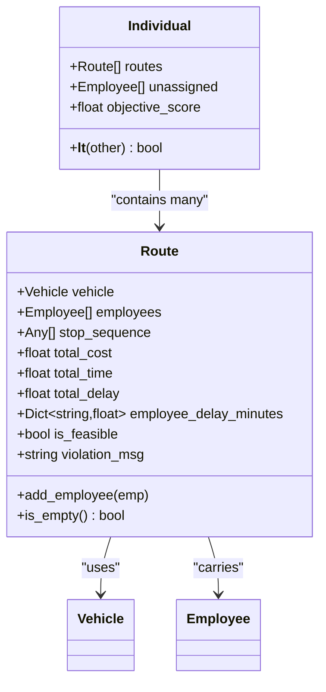

**Diagram sources**
- [representation.py](file://backend/engine/representation.py#L5-L32)

**Section sources**
- [representation.py](file://backend/engine/representation.py#L1-L32)

### Objective Function and Constraint Handling
- Dynamic route evaluation computes JIT departure time, cumulative travel time, and total cost.
- Hard constraints: vehicle category preference, precedence (pickup before drop), capacity, sharing limits, and lateness windows.
- Soft constraints: penalties scaled by penalty_factor; unassigned passengers incur large penalties.
- Objective is a weighted combination of cost and time across routes.

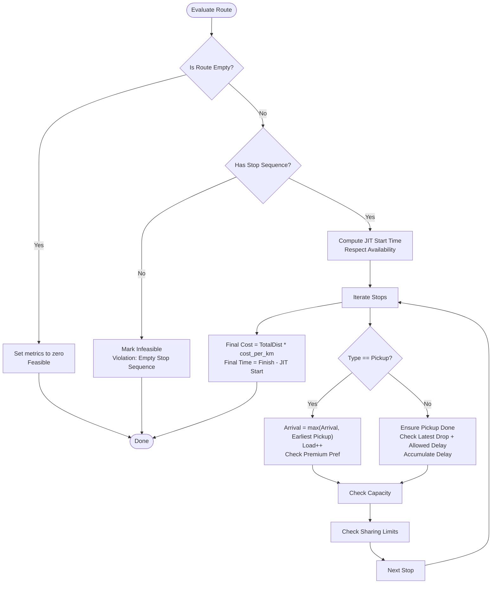

**Diagram sources**
- [objective.py](file://backend/engine/objective.py#L39-L201)

**Section sources**
- [objective.py](file://backend/engine/objective.py#L1-L201)

### Initialization Strategies
- Mixed initialization: 50% regret-based (sort by difficulty) and 50% random.
- GRASP-style insertion selects best route for each passenger based on minimal cost increase.

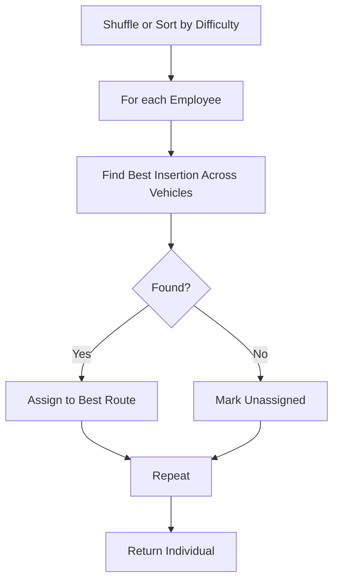

**Diagram sources**
- [initialization.py](file://backend/engine/initialization.py#L14-L30)
- [initialization.py](file://backend/engine/initialization.py#L32-L63)

**Section sources**
- [initialization.py](file://backend/engine/initialization.py#L1-L63)

### Genetic Operators
- Selection: Tournament selection.
- Survival: Unique individuals by rounded objective score, retaining best subset.
- Crossover: Order-based split by vehicle ID; ensure no duplication and filter invalid stops.
- Mutation: Ruin-and-recreate with selective destruction and best-insertion recreation; followed by 2-opt local search.

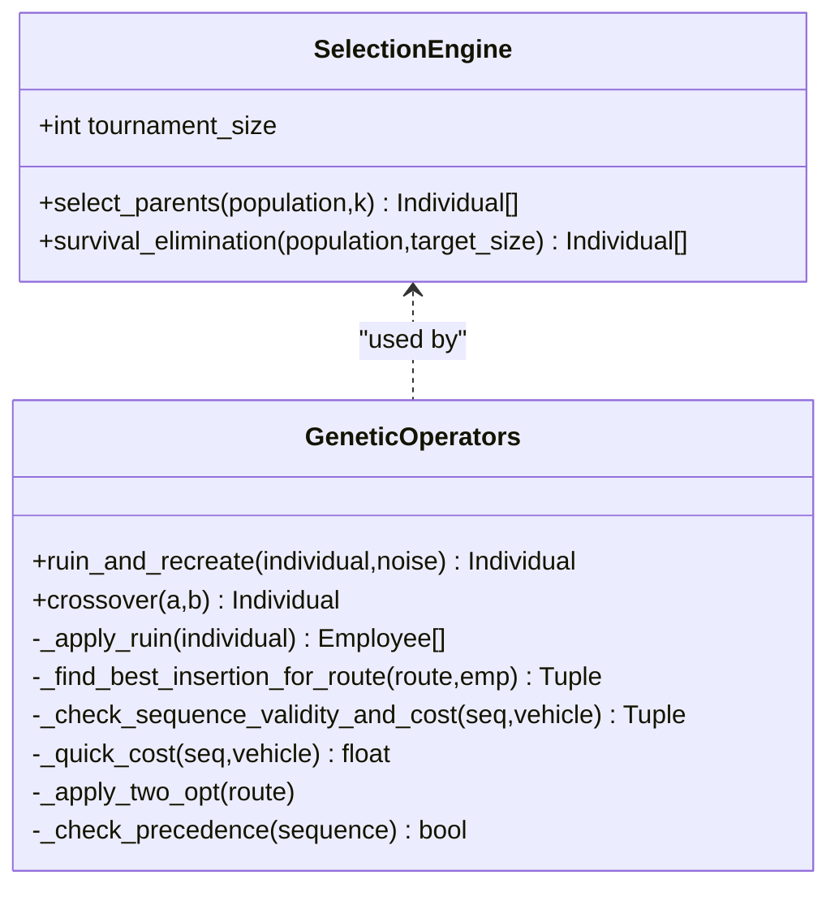

**Diagram sources**
- [operators.py](file://backend/engine/operators.py#L9-L36)
- [operators.py](file://backend/engine/operators.py#L37-L290)

**Section sources**
- [operators.py](file://backend/engine/operators.py#L1-L290)

### Solver Workflow and Parallel Execution
- Loads problem from stdin JSON or CSV testcases.
- Precomputes road distances to warm caches.
- Runs multiple runs in parallel (ProcessPool or ThreadPool depending on input mode).
- Each run initializes population, evolves with scaled penalties and simulated annealing, then fine-tunes deterministically.
- Aggregates results and returns the best Individual as JSON.

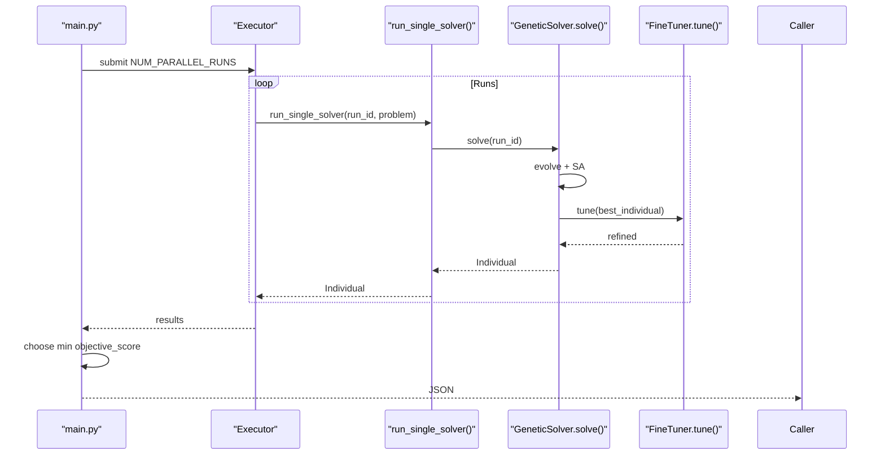

**Diagram sources**
- [main.py](file://backend/engine/main.py#L27-L31)
- [main.py](file://backend/engine/main.py#L170-L187)
- [solver.py](file://backend/engine/solver.py#L38-L107)
- [finetuner.py](file://backend/engine/finetuner.py#L14-L49)

**Section sources**
- [main.py](file://backend/engine/main.py#L1-L193)
- [solver.py](file://backend/engine/solver.py#L1-L107)

### Distance Calculation and Integration
- Distance caching minimizes API calls; falls back to haversine if road distance unavailable.
- Batch precomputation supported for warm caches.
- Road distance service integration via Google Maps Distance Matrix API with environment-based key.

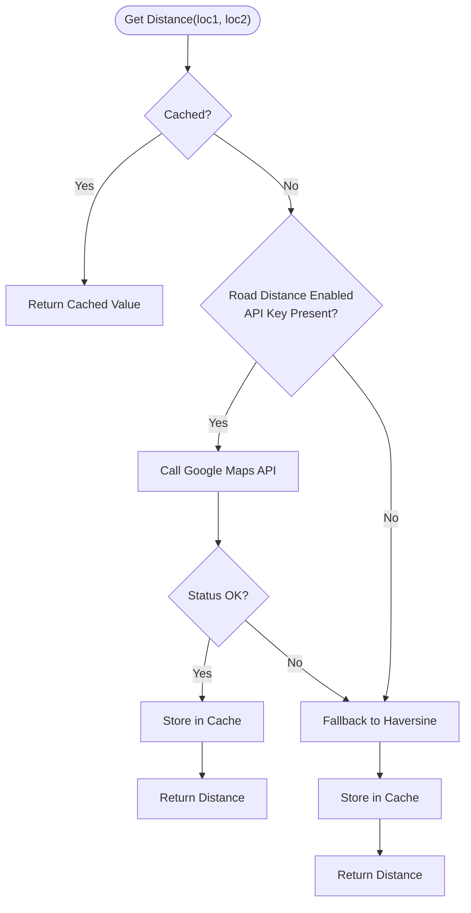

**Diagram sources**
- [utils.py](file://backend/engine/utils.py#L86-L111)
- [utils.py](file://backend/engine/utils.py#L112-L161)
- [distance_calculator.py](file://backend/engine/distance_calculator.py#L23-L91)

**Section sources**
- [utils.py](file://backend/engine/utils.py#L1-L245)
- [distance_calculator.py](file://backend/engine/distance_calculator.py#L1-L228)
- [validate_distance.py](file://backend/engine/validate_distance.py#L1-L73)

### Data Input Pipeline
- CSV loader: employees.csv, vehicles.csv, metadata.csv, baseline.csv.
- Canonical JSON loader: flexible schema with normalization for priorities, time windows, and optional baseline formats.

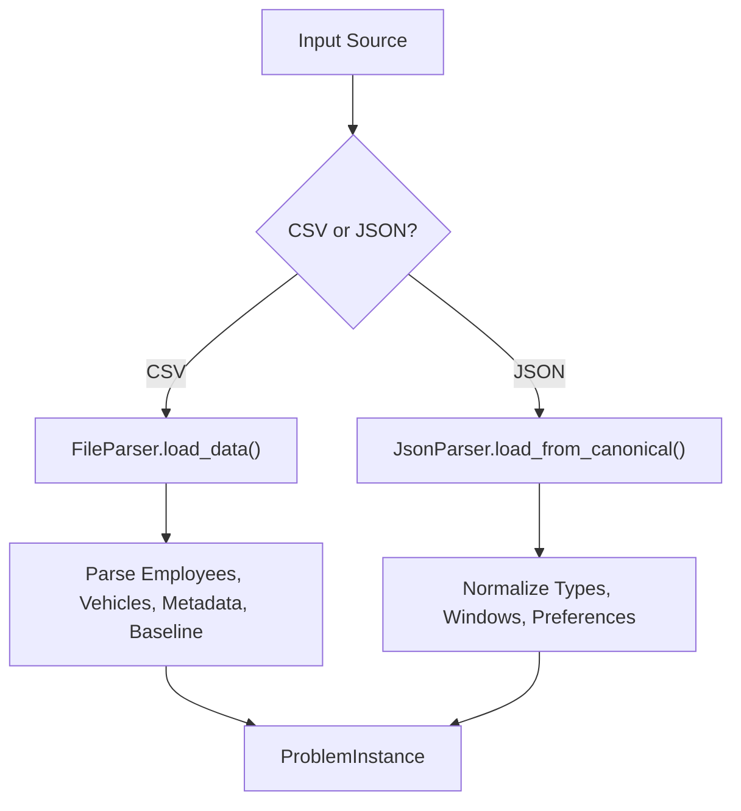

**Diagram sources**
- [parser.py](file://backend/engine/parser.py#L29-L77)
- [parser.py](file://backend/engine/parser.py#L159-L278)
- [employees.csv](file://backend/engine/testcase1/employees.csv#L1-L9)

**Section sources**
- [parser.py](file://backend/engine/parser.py#L1-L278)
- [employees.csv](file://backend/engine/testcase1/employees.csv#L1-L9)

## Dependency Analysis
- Cohesion: Modules encapsulate distinct concerns (parsing, modeling, representation, operators, evaluation, tuning).
- Coupling: Solver depends on initializer, operators, evaluator, and fine-tuner; operators depend on evaluator and utils; objective depends on utils for distance/time; main depends on parser and solver.
- External dependencies: requests for distance API, pandas for CSV parsing, concurrent.futures for parallelism.

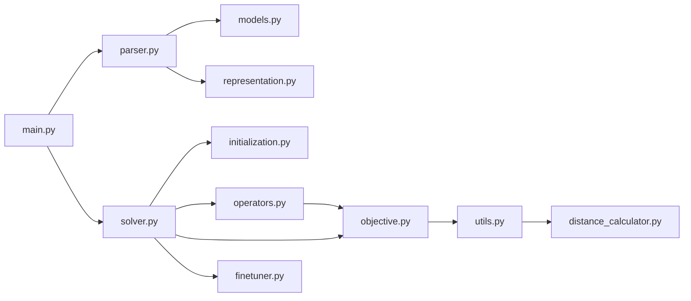

**Diagram sources**
- [main.py](file://backend/engine/main.py#L8-L10)
- [solver.py](file://backend/engine/solver.py#L6-L12)
- [operators.py](file://backend/engine/operators.py#L3-L7)
- [objective.py](file://backend/engine/objective.py#L1-L4)
- [utils.py](file://backend/engine/utils.py#L1-L7)
- [distance_calculator.py](file://backend/engine/distance_calculator.py#L1-L11)
- [parser.py](file://backend/engine/parser.py#L1-L3)
- [models.py](file://backend/engine/models.py#L1-L3)
- [representation.py](file://backend/engine/representation.py#L1-L3)

**Section sources**
- [main.py](file://backend/engine/main.py#L1-L193)
- [solver.py](file://backend/engine/solver.py#L1-L107)
- [operators.py](file://backend/engine/operators.py#L1-L290)
- [objective.py](file://backend/engine/objective.py#L1-L201)
- [utils.py](file://backend/engine/utils.py#L1-L245)
- [parser.py](file://backend/engine/parser.py#L1-L278)

## Performance Considerations
- Parallelism: Use multiple runs to explore diverse strategies; choose ProcessPool for CSV mode and ThreadPool for stdin to avoid stdout interference.
- Distance computation: Warm caches with precompute_distance_matrix; batch requests to reduce API latency.
- Population and generations: Tune pop_size and generations based on problem size; larger problems may need higher generations.
- Penalty scaling: Increasing penalty factor steers evolution toward feasibility; combined with simulated annealing acceptance helps escape local optima.
- Ruin-and-recreate: Controls diversity; adjust noise level and ruin intensity for balancing exploration vs exploitation.
- Fine-tuning: Post-optimization improves solution quality deterministically; iterative steps include downsizing expensive routes, passenger relocation, and sequence optimization.

[No sources needed since this section provides general guidance]

## Troubleshooting Guide
- No solutions produced: Verify inputs (CSV or stdin JSON), ensure API keys are set for road distance, and confirm precomputation succeeds.
- Infeasible routes: Review violation messages and constraints (capacity, sharing, premium vehicle, precedence, lateness).
- Slow performance: Enable distance caching, reduce runs or generations, and consider smaller pop_size for quick iterations.
- API errors: Check GOOGLE_MAPS_API_KEY presence and quota; fallback to haversine if road distance disabled.
- Unexpected stdout pollution in stdin mode: The engine redirects stdout to stderr during preprocessing to keep JSON clean.

**Section sources**
- [main.py](file://backend/engine/main.py#L132-L143)
- [main.py](file://backend/engine/main.py#L167-L187)
- [utils.py](file://backend/engine/utils.py#L54-L84)
- [objective.py](file://backend/engine/objective.py#L140-L158)

## Conclusion
The engine combines a robust genetic algorithm with strong constraint handling, dynamic route evaluation, and deterministic fine-tuning to produce high-quality routing plans. Its modular design enables easy extension, parallel execution for strategy exploration, and integration with real-world road distance services.

[No sources needed since this section summarizes without analyzing specific files]

## Appendices

### Optimization Strategies and Parameter Tuning
- Strategy presets: Multiple named strategies distribute weights among regret-based, GRASP, and random initialization to diversify starting points.
- Parameters to tune:
  - pop_size and generations
  - mutation_rate and ruin intensity
  - penalty_factor scaling and simulated annealing temperature schedule
  - runs and max_workers for parallelism
- Strategy selection: Use different presets to balance exploration (Chaos, Hybrid, Explore) versus exploitation (Sniper, Spec-B).

**Section sources**
- [main.py](file://backend/engine/main.py#L12-L21)
- [main.py](file://backend/engine/main.py#L23-L25)
- [solver.py](file://backend/engine/solver.py#L15-L29)
- [solver.py](file://backend/engine/solver.py#L69-L81)

### Input Formats and Examples
- CSV testcases: employees.csv, vehicles.csv, metadata.csv, baseline.csv.
- Canonical JSON: flexible schema supporting time windows, priorities, and optional baseline formats.

**Section sources**
- [parser.py](file://backend/engine/parser.py#L29-L77)
- [parser.py](file://backend/engine/parser.py#L159-L278)
- [employees.csv](file://backend/engine/testcase1/employees.csv#L1-L9)

### Output JSON Schema Highlights
- rides: per-route details including vehicleId, assignedEmployees, path segments, metrics, feasibility, and violations.
- metrics: totalSystemCost, totalTimeMinutes, baselineCost, baselineTimeMinutes, savings, savingsPercent.
- unassigned: list of employee IDs not assigned to any route.

**Section sources**
- [main.py](file://backend/engine/main.py#L42-L104)