# Problem Modeling and Representation

<cite>
**Referenced Files in This Document**
- [models.py](file://backend/engine/models.py)
- [parser.py](file://backend/engine/parser.py)
- [representation.py](file://backend/engine/representation.py)
- [canonicalSchema.js](file://backend/validation/canonicalSchema.js)
- [validateCanonical.js](file://backend/validation/validateCanonical.js)
- [main.py](file://backend/engine/main.py)
- [objective.py](file://backend/engine/objective.py)
- [operators.py](file://backend/engine/operators.py)
- [utils.py](file://backend/engine/utils.py)
- [llmParser.js](file://backend/services/llmParser.js)
- [employees.csv](file://backend/engine/testcase1/employees.csv)
- [vehicles.csv](file://backend/engine/testcase1/vehicles.csv)
- [metadata.csv](file://backend/engine/testcase1/metadata.csv)
- [baseline.csv](file://backend/engine/testcase1/baseline.csv)
</cite>

## Table of Contents
1. [Introduction](#introduction)
2. [Project Structure](#project-structure)
3. [Core Components](#core-components)
4. [Architecture Overview](#architecture-overview)
5. [Detailed Component Analysis](#detailed-component-analysis)
6. [Dependency Analysis](#dependency-analysis)
7. [Performance Considerations](#performance-considerations)
8. [Troubleshooting Guide](#troubleshooting-guide)
9. [Conclusion](#conclusion)
10. [Appendices](#appendices)

## Introduction
This document explains the problem modeling and data representation system used by the optimization engine. It covers the core data structures (Employee, Vehicle, Location, ProblemInstance, Baseline), canonical schema for JSON payloads, and the transformation pipeline from raw CSV and JSON inputs to internal problem representation. It also documents baseline cost/time computation, location handling, employee assignment constraints, and vehicle capacity limitations, along with validation and parsing workflows.

## Project Structure
The engine resides under backend/engine and orchestrates parsing, representation, objective evaluation, and genetic solving. Validation of canonical JSON is performed by backend/validation. LLM-based ingestion of artifacts is handled by backend/services.

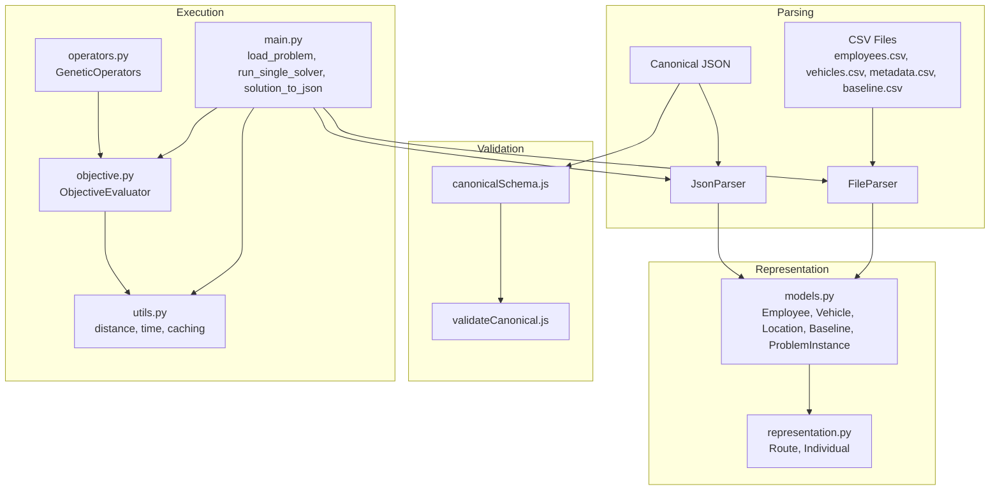

**Diagram sources**
- [main.py](file://backend/engine/main.py#L107-L129)
- [parser.py](file://backend/engine/parser.py#L29-L77)
- [models.py](file://backend/engine/models.py#L4-L49)
- [representation.py](file://backend/engine/representation.py#L5-L31)
- [objective.py](file://backend/engine/objective.py#L12-L38)
- [operators.py](file://backend/engine/operators.py#L37-L81)
- [utils.py](file://backend/engine/utils.py#L86-L165)
- [canonicalSchema.js](file://backend/validation/canonicalSchema.js#L1-L105)
- [validateCanonical.js](file://backend/validation/validateCanonical.js#L10-L16)

**Section sources**
- [main.py](file://backend/engine/main.py#L107-L129)
- [parser.py](file://backend/engine/parser.py#L29-L77)
- [models.py](file://backend/engine/models.py#L4-L49)
- [representation.py](file://backend/engine/representation.py#L5-L31)
- [canonicalSchema.js](file://backend/validation/canonicalSchema.js#L1-L105)
- [validateCanonical.js](file://backend/validation/validateCanonical.js#L10-L16)

## Core Components
- Location: Immutable pair of latitude and longitude used by Employee and Vehicle.
- Employee: Encapsulates pickup/drop locations, time windows, priority, preferences, and derived delay allowance.
- Vehicle: Encapsulates capacity, cost per km, speed, start location, availability, and category.
- Baseline: Per-employee baseline cost and time used for savings computation.
- ProblemInstance: Aggregates lists of Employees and Vehicles, metadata, and baseline mapping.
- Route: A vehicle’s planned sequence of stops with computed metrics and feasibility.
- Individual: A candidate solution composed of Routes, Unassigned Employees, and an objective score.

Key relationships:
- Employee and Vehicle both reference Location.
- ProblemInstance holds lists of Employee and Vehicle and a baseline dictionary keyed by employee id.
- Route references a Vehicle and maintains a stop sequence and per-employee delay mapping.
- Individual aggregates Routes and Unassigned Employees.

Validation rules and constraints:
- Priority determines maximum allowed delay per employee.
- Vehicle category must match premium preference when requested.
- Capacity and sharing preferences are enforced.
- Time windows (earliest pickup, latest drop) are respected with allowances based on priority.

**Section sources**
- [models.py](file://backend/engine/models.py#L4-L49)
- [representation.py](file://backend/engine/representation.py#L5-L31)

## Architecture Overview
End-to-end pipeline from raw inputs to optimized solution:

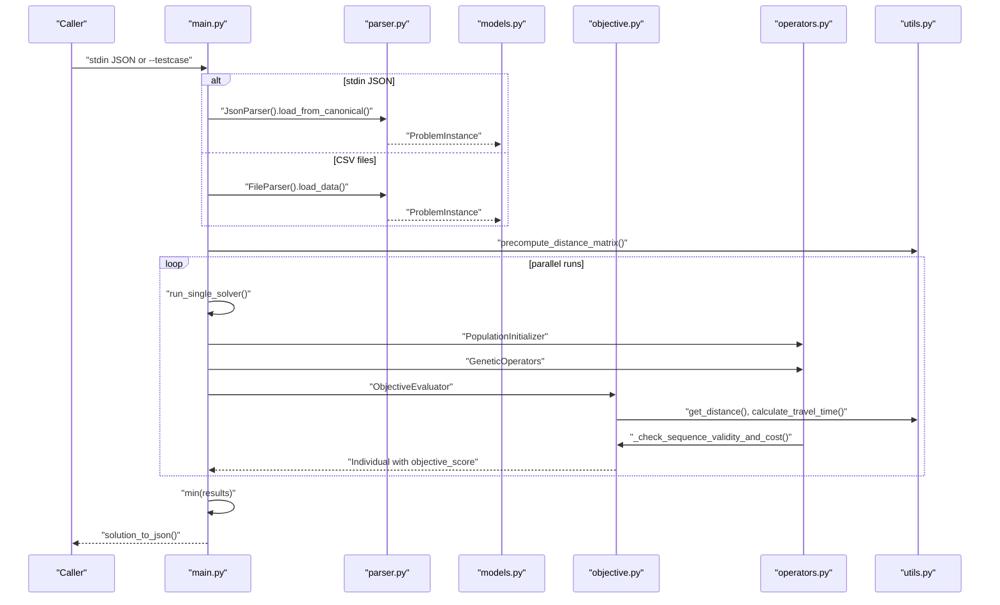

**Diagram sources**
- [main.py](file://backend/engine/main.py#L107-L129)
- [parser.py](file://backend/engine/parser.py#L29-L77)
- [models.py](file://backend/engine/models.py#L4-L49)
- [objective.py](file://backend/engine/objective.py#L12-L38)
- [operators.py](file://backend/engine/operators.py#L37-L81)
- [utils.py](file://backend/engine/utils.py#L86-L165)

## Detailed Component Analysis

### Data Structures and Canonical Schema
- Employee fields: id, priority, pickup_loc, drop_loc, earliest_pickup, latest_drop, vehicle_pref, sharing_pref.
- Vehicle fields: id, fuel_type, capacity, cost_per_km, speed_kmph, start_loc, avail_from, category.
- Location fields: lat, lng.
- Baseline fields: emp_id, cost, time.
- ProblemInstance fields: employees, vehicles, metadata, baseline.
- Route fields: vehicle, employees, stop_sequence, totals, feasibility flags.
- Individual fields: routes, unassigned, objective_score.

Canonical JSON schema enforces:
- Required fields: schema_version, problem_type, employees, vehicles.
- Employees must include id, pickup, dropoff; optional time_window with start/end.
- Vehicles must include id, capacity, start_location; optional mode/category and cost_per_km.
- Metadata supports project_name, date, avg_speed_kmph, distance_metric.
- Optional depot with lat/lng.

Validation uses AJV with formats to ensure types and presence of required fields.

**Section sources**
- [models.py](file://backend/engine/models.py#L4-L49)
- [representation.py](file://backend/engine/representation.py#L5-L31)
- [canonicalSchema.js](file://backend/validation/canonicalSchema.js#L1-L105)
- [validateCanonical.js](file://backend/validation/validateCanonical.js#L10-L16)

### Parsing Workflows

#### CSV Parsing (FileParser)
- Loads metadata.csv into a key-value dictionary.
- Loads employees.csv into Employee instances with robust time parsing supporting HH:MM and HH:MM:SS.
- Loads vehicles.csv into Vehicle instances with defaults and normalized categories.
- Loads baseline.csv into a dictionary keyed by employee id.

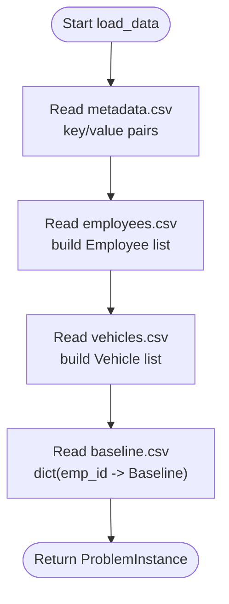

**Diagram sources**
- [parser.py](file://backend/engine/parser.py#L29-L77)
- [employees.csv](file://backend/engine/testcase1/employees.csv#L1-L9)
- [vehicles.csv](file://backend/engine/testcase1/vehicles.csv#L1-L4)
- [metadata.csv](file://backend/engine/testcase1/metadata.csv#L1-L12)
- [baseline.csv](file://backend/engine/testcase1/baseline.csv#L1-L9)

**Section sources**
- [parser.py](file://backend/engine/parser.py#L29-L77)

#### JSON Parsing (JsonParser)
- Accepts canonical JSON and normalizes fields:
  - Priority normalization to 1, 2, 3 with fallbacks.
  - Time parsing via shared helper supporting multiple keys/time_window variants.
  - Defaults for missing numeric fields (capacity, cost_per_km, speed).
  - Flexible baseline support: dict keyed by emp_id or list-like entries.
- Produces the same ProblemInstance representation as CSV parsing.

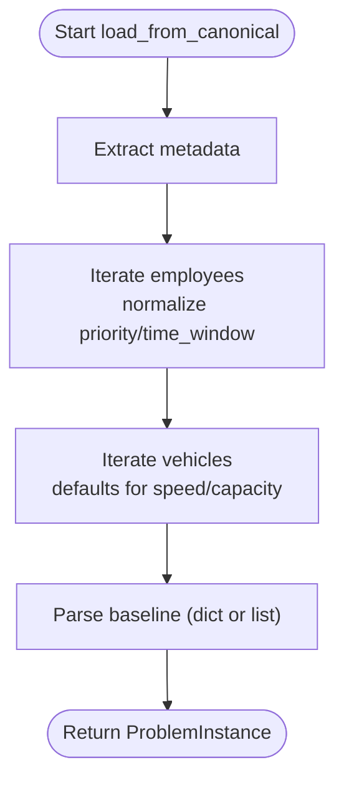

**Diagram sources**
- [parser.py](file://backend/engine/parser.py#L159-L277)

**Section sources**
- [parser.py](file://backend/engine/parser.py#L80-L277)

### Canonical Schema and Validation
- Schema defines required and optional fields, nested objects, and arrays.
- Validation compiles the schema and returns structured errors with instance paths.

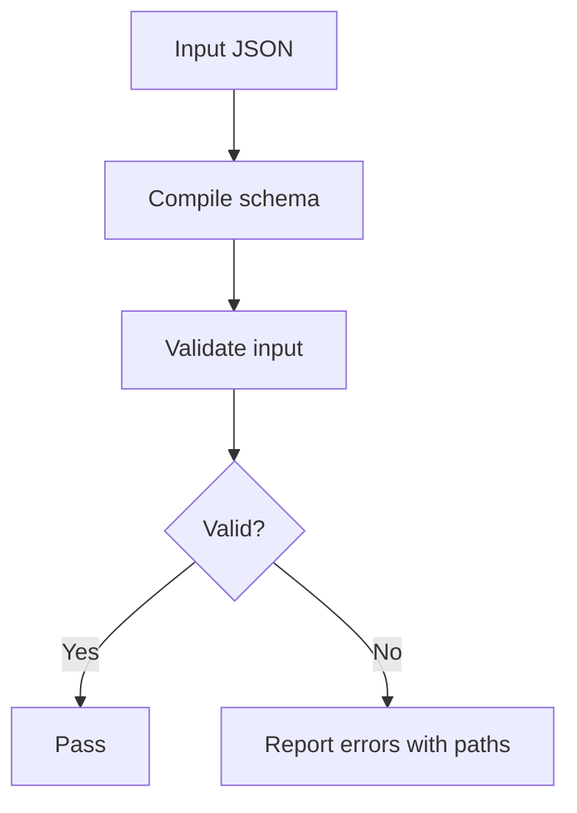

**Diagram sources**
- [canonicalSchema.js](file://backend/validation/canonicalSchema.js#L1-L105)
- [validateCanonical.js](file://backend/validation/validateCanonical.js#L10-L16)

**Section sources**
- [canonicalSchema.js](file://backend/validation/canonicalSchema.js#L1-L105)
- [validateCanonical.js](file://backend/validation/validateCanonical.js#L10-L16)

### Transformation Pipeline
- Preprocessing: Distance matrix precomputation for road or haversine depending on configuration and API key.
- Optimization: Multiple runs with genetic operators, ruin-and-recreate, and two-opt local search.
- Post-processing: Fine-tuning and final objective evaluation with strict penalties.
- Output: Aggregated metrics, per-route paths, and unassigned employees.

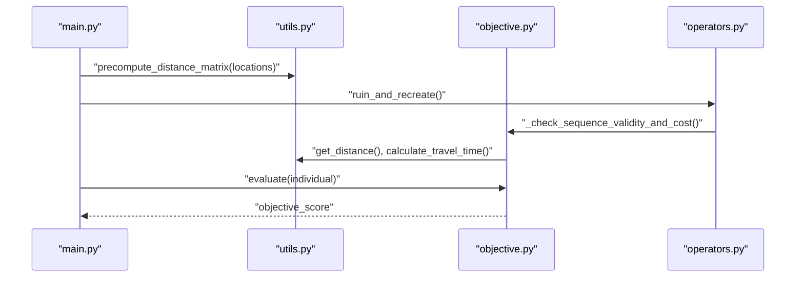

**Diagram sources**
- [main.py](file://backend/engine/main.py#L155-L187)
- [utils.py](file://backend/engine/utils.py#L112-L165)
- [objective.py](file://backend/engine/objective.py#L12-L38)
- [operators.py](file://backend/engine/operators.py#L42-L81)

**Section sources**
- [main.py](file://backend/engine/main.py#L155-L187)
- [utils.py](file://backend/engine/utils.py#L112-L165)
- [objective.py](file://backend/engine/objective.py#L12-L38)
- [operators.py](file://backend/engine/operators.py#L42-L81)

### Baseline Cost and Time Computation
- Baseline aggregation sums per-employee baseline cost and time.
- Solution metrics include total system cost, total time, baseline cost/time, savings, and savings percentage.

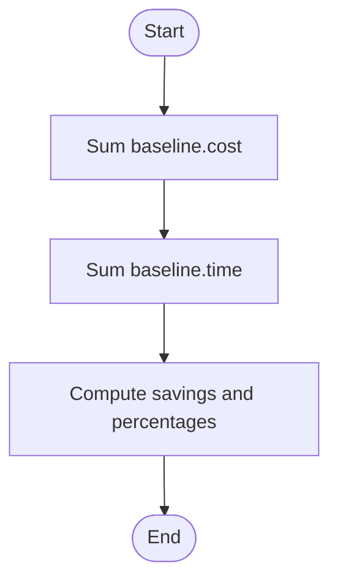

**Diagram sources**
- [main.py](file://backend/engine/main.py#L33-L40)

**Section sources**
- [main.py](file://backend/engine/main.py#L33-L40)

### Location Handling and Distance Calculation
- Distance cache maps rounded (lat, lng, lat, lng) tuples to kilometers.
- Road distance fallback to haversine when API key unavailable.
- Precompute batch requests for large location sets.

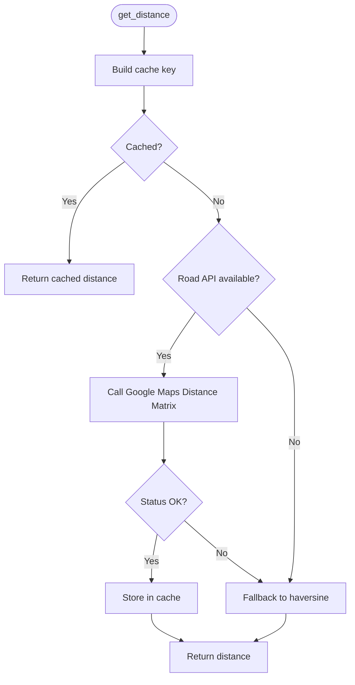

**Diagram sources**
- [utils.py](file://backend/engine/utils.py#L86-L110)
- [utils.py](file://backend/engine/utils.py#L112-L161)

**Section sources**
- [utils.py](file://backend/engine/utils.py#L86-L110)
- [utils.py](file://backend/engine/utils.py#L112-L161)

### Employee Assignment Constraints and Vehicle Capacity
- Hard constraints enforced during route evaluation:
  - Premium passenger requires premium vehicle.
  - Capacity must not exceed vehicle capacity.
  - Sharing preference limits active passengers per stop.
  - Precedence: drop cannot occur before pickup.
  - Time windows: wait until earliest pickup; late drop penalized within allowed delay window.
- Dynamic JIT timing computes effective start time and accumulates delays.

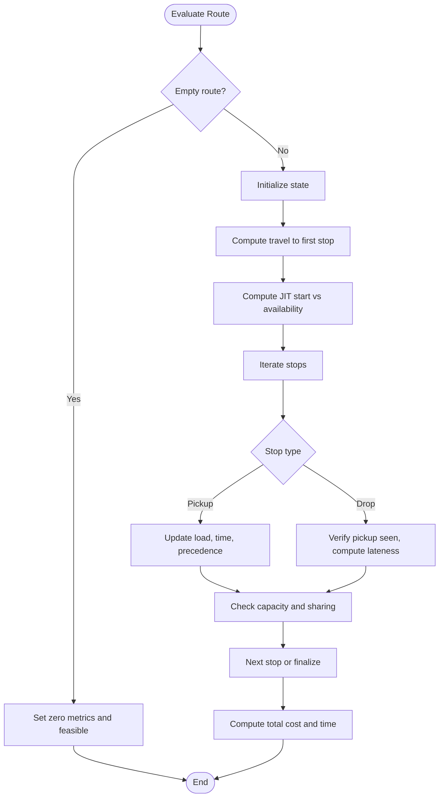

**Diagram sources**
- [objective.py](file://backend/engine/objective.py#L39-L201)
- [operators.py](file://backend/engine/operators.py#L127-L196)

**Section sources**
- [objective.py](file://backend/engine/objective.py#L39-L201)
- [operators.py](file://backend/engine/operators.py#L127-L196)

### Genetic Operators and Selection
- SelectionEngine uses tournament selection.
- Ruin-and-Recreate destroys a fraction of routes and reinserts employees considering capacity and sharing.
- Two-opt improves stop sequences locally.
- Crossover combines parent routes while avoiding duplicate assignments.

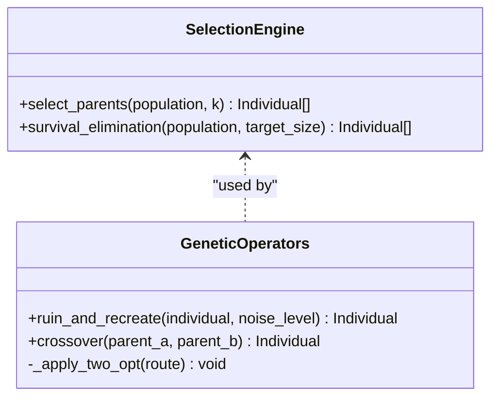

**Diagram sources**
- [operators.py](file://backend/engine/operators.py#L9-L36)
- [operators.py](file://backend/engine/operators.py#L37-L81)
- [operators.py](file://backend/engine/operators.py#L242-L290)

**Section sources**
- [operators.py](file://backend/engine/operators.py#L9-L36)
- [operators.py](file://backend/engine/operators.py#L37-L81)
- [operators.py](file://backend/engine/operators.py#L242-L290)

### LLM-Based Canonical JSON Ingestion
- Services extract text from various artifact types (Excel, PDF, images, text).
- Prompt instructs Gemini to produce canonical JSON matching the schema.
- Validation ensures correctness before passing to the engine.

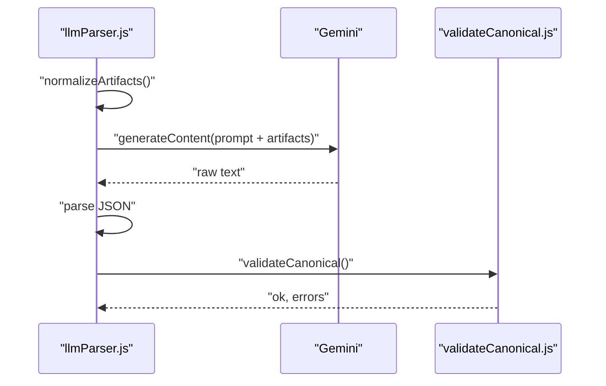

**Diagram sources**
- [llmParser.js](file://backend/services/llmParser.js#L103-L136)
- [llmParser.js](file://backend/services/llmParser.js#L138-L168)
- [validateCanonical.js](file://backend/validation/validateCanonical.js#L10-L16)

**Section sources**
- [llmParser.js](file://backend/services/llmParser.js#L103-L136)
- [llmParser.js](file://backend/services/llmParser.js#L138-L168)
- [validateCanonical.js](file://backend/validation/validateCanonical.js#L10-L16)

## Dependency Analysis
- main.py depends on parser.py for data loading, utils.py for distance precomputation, and solver components for optimization.
- objective.py depends on utils.py for distance/time computations.
- operators.py depends on objective.py for validity checks and on utils.py for distance/time.
- parser.py depends on pandas for CSV parsing and models.py for dataclasses.
- canonicalSchema.js and validateCanonical.js depend on AJV for validation.

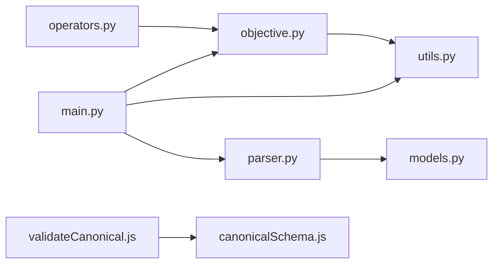

**Diagram sources**
- [main.py](file://backend/engine/main.py#L8-L10)
- [parser.py](file://backend/engine/parser.py#L1-L3)
- [objective.py](file://backend/engine/objective.py#L1-L4)
- [operators.py](file://backend/engine/operators.py#L1-L7)
- [utils.py](file://backend/engine/utils.py#L1-L5)
- [canonicalSchema.js](file://backend/validation/canonicalSchema.js#L1-L3)
- [validateCanonical.js](file://backend/validation/validateCanonical.js#L1-L3)

**Section sources**
- [main.py](file://backend/engine/main.py#L8-L10)
- [parser.py](file://backend/engine/parser.py#L1-L3)
- [objective.py](file://backend/engine/objective.py#L1-L4)
- [operators.py](file://backend/engine/operators.py#L1-L7)
- [utils.py](file://backend/engine/utils.py#L1-L5)
- [canonicalSchema.js](file://backend/validation/canonicalSchema.js#L1-L3)
- [validateCanonical.js](file://backend/validation/validateCanonical.js#L1-L3)

## Performance Considerations
- Distance caching: Precompute and cache road distances to reduce API calls and latency.
- Parallel execution: Use ProcessPool for CSV runs and ThreadPool for stdin mode to avoid stdout pollution.
- Penalty scaling: Increase penalties over generations to enforce feasibility.
- Local search: Two-opt reduces route costs locally; ruin-and-recreate diversifies solutions.
- Early termination checks: Capacity and precedence checks short-circuit invalid sequences.

[No sources needed since this section provides general guidance]

## Troubleshooting Guide
Common issues and resolutions:
- Missing or invalid canonical JSON: Validate against canonicalSchema; check required fields and types.
- API key problems: Ensure GOOGLE_MAPS_API_KEY is set; fallback to haversine when unavailable.
- Infeasible routes: Review premium vehicle preferences, capacity limits, sharing constraints, and time windows.
- Empty stop sequences: Routes without stop sequences are treated as infeasible; ensure operators populate sequences.
- Time parsing failures: Verify time formats and handle nulls gracefully.

**Section sources**
- [validateCanonical.js](file://backend/validation/validateCanonical.js#L10-L16)
- [utils.py](file://backend/engine/utils.py#L54-L84)
- [objective.py](file://backend/engine/objective.py#L53-L59)
- [operators.py](file://backend/engine/operators.py#L127-L196)

## Conclusion
The system provides a robust, validated pipeline from raw data to optimized routing plans. Core dataclasses encapsulate domain entities with clear constraints. Canonical schema validation ensures consistent JSON inputs. The genetic solver integrates dynamic route evaluation, hard constraints enforcement, and local search to produce feasible, near-optimal solutions.

[No sources needed since this section summarizes without analyzing specific files]

## Appendices

### Example Data Structures and Fields
- Employee: id, priority, pickup_loc(lat, lng), drop_loc(lat, lng), earliest_pickup, latest_drop, vehicle_pref, sharing_pref.
- Vehicle: id, fuel_type, capacity, cost_per_km, speed_kmph, start_loc(lat, lng), avail_from, category.
- Location: lat, lng.
- Baseline: emp_id, cost, time.
- ProblemInstance: employees[], vehicles[], metadata{}, baseline{emp_id: Baseline}.
- Route: vehicle, employees[], stop_sequence[{type, emp}], totals, feasibility flags.
- Individual: routes[], unassigned[], objective_score.

**Section sources**
- [models.py](file://backend/engine/models.py#L4-L49)
- [representation.py](file://backend/engine/representation.py#L5-L31)

### Example Parsing Workflows
- CSV parsing reads employees.csv, vehicles.csv, metadata.csv, baseline.csv and constructs ProblemInstance.
- JSON parsing normalizes priority, time_window, and baseline formats into ProblemInstance.

**Section sources**
- [parser.py](file://backend/engine/parser.py#L29-L77)
- [parser.py](file://backend/engine/parser.py#L159-L277)

### Example Validation Processes
- AJV-based validation of canonical JSON against canonicalSchema.js.
- Error reporting with instance paths for debugging.

**Section sources**
- [validateCanonical.js](file://backend/validation/validateCanonical.js#L10-L16)
- [canonicalSchema.js](file://backend/validation/canonicalSchema.js#L1-L105)