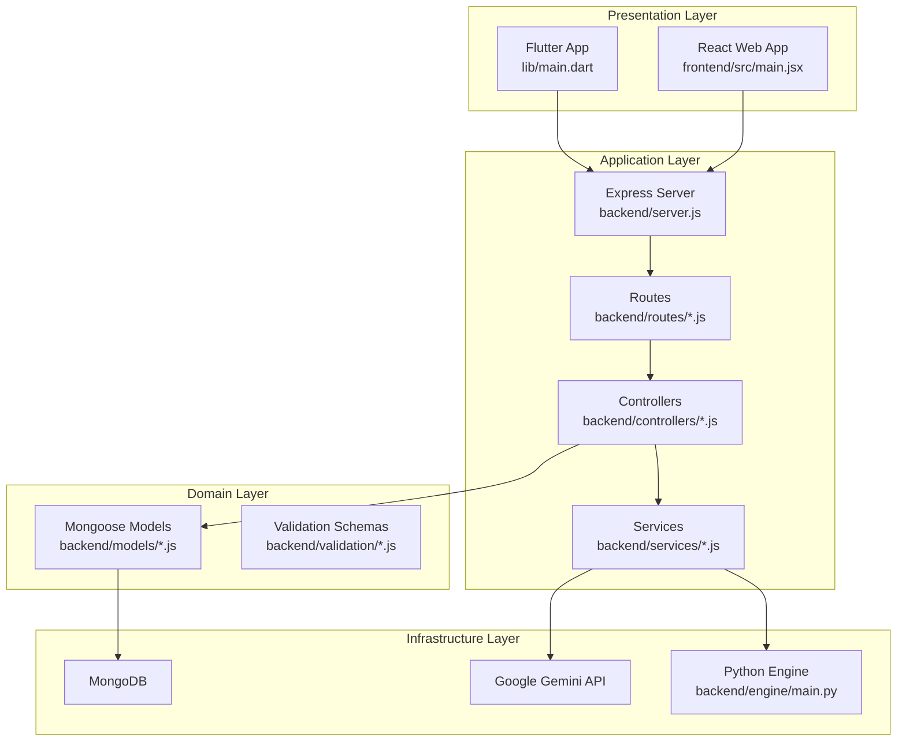
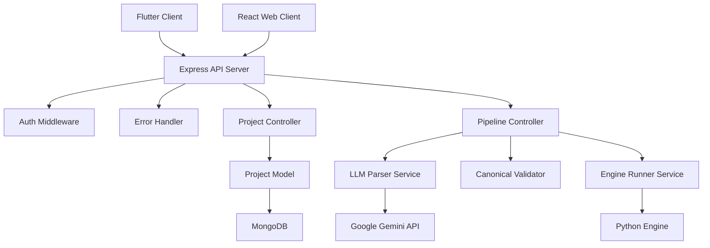
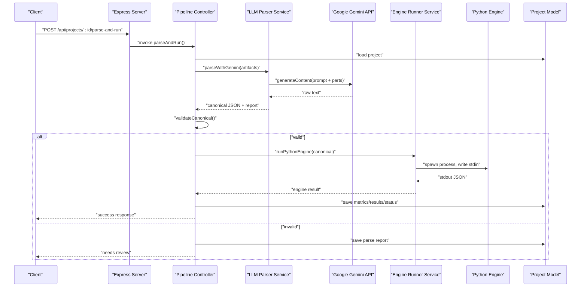
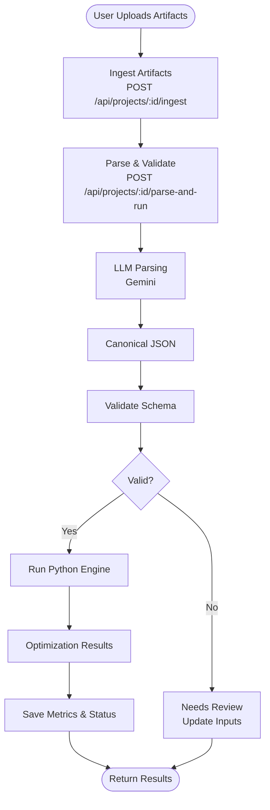
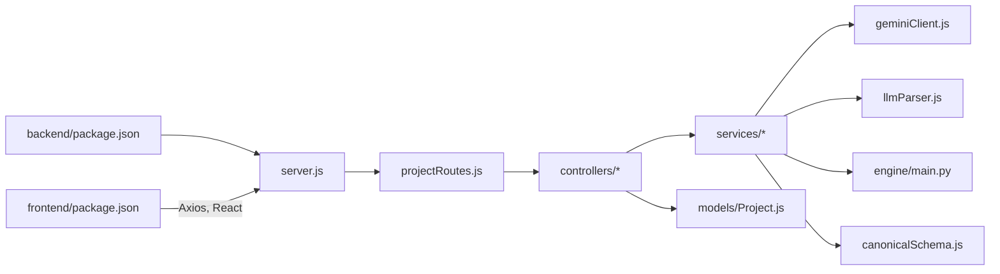

# Architecture Overview

<cite>
**Referenced Files in This Document**
- [server.js](file://backend/server.js)
- [package.json](file://backend/package.json)
- [projectRoutes.js](file://backend/routes/projectRoutes.js)
- [projectController.js](file://backend/controllers/projectController.js)
- [projectPipelineController.js](file://backend/controllers/projectPipelineController.js)
- [Project.js](file://backend/models/Project.js)
- [llmParser.js](file://backend/services/llmParser.js)
- [geminiClient.js](file://backend/services/geminiClient.js)
- [engineRunner.js](file://backend/services/engineRunner.js)
- [canonicalSchema.js](file://backend/validation/canonicalSchema.js)
- [main.py](file://backend/engine/main.py)
- [parser.py](file://backend/engine/parser.py)
- [main.jsx](file://frontend/src/main.jsx)
- [package.json](file://frontend/package.json)
- [main.dart](file://lib/main.dart)
</cite>

## Table of Contents
1. [Introduction](#introduction)
2. [Project Structure](#project-structure)
3. [Core Components](#core-components)
4. [Architecture Overview](#architecture-overview)
5. [Detailed Component Analysis](#detailed-component-analysis)
6. [Dependency Analysis](#dependency-analysis)
7. [Performance Considerations](#performance-considerations)
8. [Troubleshooting Guide](#troubleshooting-guide)
9. [Conclusion](#conclusion)

## Introduction
This document describes the high-level architecture of the Route Optimization system. It covers the multi-layered architecture across presentation (Flutter mobile + React web), application (Node.js controllers/services), domain (business logic), and infrastructure (database and external AI APIs). It also documents the end-to-end data flow from user input through AI parsing to optimization results, integration patterns (API communication, real-time updates, cross-platform synchronization), system boundaries, component responsibilities, and deployment considerations that enable scalability and maintainability.

## Project Structure
The system is organized into three primary areas:
- Backend (Node.js): Express server, controllers, services, models, routes, validation, and Python engine integration
- Frontend (React web): Vite-powered SPA with routing and UI components
- Mobile (Flutter): Cross-platform mobile app with Riverpod state management

**Diagram sources**
- [server.js](file://backend/server.js#L1-L56)
- [projectRoutes.js](file://backend/routes/projectRoutes.js#L1-L11)
- [projectController.js](file://backend/controllers/projectController.js#L1-L117)
- [projectPipelineController.js](file://backend/controllers/projectPipelineController.js#L1-L216)
- [Project.js](file://backend/models/Project.js#L1-L96)
- [llmParser.js](file://backend/services/llmParser.js#L1-L170)
- [geminiClient.js](file://backend/services/geminiClient.js#L1-L12)
- [engineRunner.js](file://backend/services/engineRunner.js#L1-L73)
- [main.py](file://backend/engine/main.py#L1-L193)
- [main.jsx](file://frontend/src/main.jsx#L1-L14)
- [main.dart](file://lib/main.dart#L1-L220)

**Section sources**
- [server.js](file://backend/server.js#L1-L56)
- [projectRoutes.js](file://backend/routes/projectRoutes.js#L1-L11)
- [main.jsx](file://frontend/src/main.jsx#L1-L14)
- [main.dart](file://lib/main.dart#L1-L220)

## Core Components
- Presentation Layer
  - Flutter mobile app initializes environment, sets up theme, and navigates screens with Riverpod state management
  - React web app bootstraps routing and renders UI components
- Application Layer
  - Express server configures CORS, middleware, routes, and error handling
  - Controllers manage CRUD and pipeline operations for Projects
  - Services encapsulate AI parsing (Gemini), canonical validation, and Python engine orchestration
- Domain Layer
  - Mongoose models define Project, Vehicle, Ride, and User entities and their schemas
  - Canonical JSON schema validates parsed inputs
- Infrastructure Layer
  - MongoDB stores projects and related artifacts
  - Google Gemini API parses unstructured inputs into canonical JSON
  - Python engine executes genetic optimization and returns structured results

**Section sources**
- [main.dart](file://lib/main.dart#L1-L220)
- [main.jsx](file://frontend/src/main.jsx#L1-L14)
- [server.js](file://backend/server.js#L1-L56)
- [projectController.js](file://backend/controllers/projectController.js#L1-L117)
- [projectPipelineController.js](file://backend/controllers/projectPipelineController.js#L1-L216)
- [Project.js](file://backend/models/Project.js#L1-L96)
- [canonicalSchema.js](file://backend/validation/canonicalSchema.js#L1-L105)
- [llmParser.js](file://backend/services/llmParser.js#L1-L170)
- [geminiClient.js](file://backend/services/geminiClient.js#L1-L12)
- [engineRunner.js](file://backend/services/engineRunner.js#L1-L73)
- [main.py](file://backend/engine/main.py#L1-L193)

## Architecture Overview
The system follows a layered architecture:
- Presentation Layer: Flutter mobile and React web consume the same backend APIs
- Application Layer: RESTful controllers expose endpoints for project lifecycle and pipeline execution
- Domain Layer: Mongoose models and validation schemas enforce business rules
- Infrastructure Layer: MongoDB persists data; Google Gemini parses inputs; Python engine computes optimized routes

Key integration patterns:
- API Communication: REST endpoints for CRUD and pipeline actions
- Real-time Updates: Not implemented in the current code; results are fetched via polling
- Cross-platform Synchronization: Shared backend ensures consistent data and pipeline behavior across Flutter and React clients

**Diagram sources**
- [server.js](file://backend/server.js#L1-L56)
- [projectController.js](file://backend/controllers/projectController.js#L1-L117)
- [projectPipelineController.js](file://backend/controllers/projectPipelineController.js#L1-L216)
- [llmParser.js](file://backend/services/llmParser.js#L1-L170)
- [engineRunner.js](file://backend/services/engineRunner.js#L1-L73)
- [Project.js](file://backend/models/Project.js#L1-L96)
- [main.py](file://backend/engine/main.py#L1-L193)

## Detailed Component Analysis

### Presentation Layer
- Flutter
  - Loads environment variables, sets dark theme, and orchestrates navigation and bottom bar
  - Uses Riverpod for state management and authentication flow
- React Web
  - Bootstraps routing and renders pages/components

Responsibilities:
- Present data and collect user input
- Call backend endpoints for CRUD and pipeline operations
- Render results and analytics

**Section sources**
- [main.dart](file://lib/main.dart#L1-L220)
- [main.jsx](file://frontend/src/main.jsx#L1-L14)

### Application Layer
- Express Server
  - Initializes environment, connects to database, sets CORS for multiple origins, mounts routes, and applies error handling
- Controllers
  - Project controller: create/list/get/delete projects
  - Pipeline controller: ingest artifacts, parse with LLM, validate canonical JSON, run Python engine, and fetch results
- Services
  - LLM Parser: normalizes artifacts (files/text/images/PDF), builds prompts, and calls Gemini
  - Engine Runner: spawns Python process, streams input, captures output, and extracts JSON
- Routes
  - Mounts project CRUD and pipeline routes

**Diagram sources**
- [server.js](file://backend/server.js#L1-L56)
- [projectPipelineController.js](file://backend/controllers/projectPipelineController.js#L65-L171)
- [llmParser.js](file://backend/services/llmParser.js#L138-L168)
- [engineRunner.js](file://backend/services/engineRunner.js#L21-L71)
- [main.py](file://backend/engine/main.py#L145-L193)
- [Project.js](file://backend/models/Project.js#L1-L96)

**Section sources**
- [server.js](file://backend/server.js#L1-L56)
- [projectController.js](file://backend/controllers/projectController.js#L1-L117)
- [projectPipelineController.js](file://backend/controllers/projectPipelineController.js#L1-L216)
- [llmParser.js](file://backend/services/llmParser.js#L1-L170)
- [engineRunner.js](file://backend/services/engineRunner.js#L1-L73)

### Domain Layer
- Project Model
  - Stores user ownership, project metadata, status, input artifacts, parsed input, parse report, run state, and results
- Canonical Schema
  - Defines required fields and shapes for validated canonical JSON

Responsibilities:
- Enforce business rules and data integrity
- Persist and retrieve project state consistently across clients

**Section sources**
- [Project.js](file://backend/models/Project.js#L1-L96)
- [canonicalSchema.js](file://backend/validation/canonicalSchema.js#L1-L105)

### Infrastructure Layer
- MongoDB
  - Hosts Project, Vehicle, Ride, and User collections
- Google Gemini
  - Provides multimodal content generation for parsing artifacts into canonical JSON
- Python Engine
  - Executes genetic optimization with parallel runs and produces structured results

Integration patterns:
- Gemini client creation guarded by environment variable
- Engine runner spawns Python process and handles timeouts and JSON extraction
- Distance matrix precomputation improves solver performance

**Section sources**
- [geminiClient.js](file://backend/services/geminiClient.js#L1-L12)
- [engineRunner.js](file://backend/services/engineRunner.js#L1-L73)
- [main.py](file://backend/engine/main.py#L1-L193)
- [parser.py](file://backend/engine/parser.py#L1-L278)

### Data Flow: From User Input to Optimization Results

**Diagram sources**
- [projectPipelineController.js](file://backend/controllers/projectPipelineController.js#L27-L171)
- [llmParser.js](file://backend/services/llmParser.js#L138-L168)
- [canonicalSchema.js](file://backend/validation/canonicalSchema.js#L1-L105)
- [engineRunner.js](file://backend/services/engineRunner.js#L21-L71)
- [main.py](file://backend/engine/main.py#L145-L193)

## Dependency Analysis
- Backend dependencies include Express, CORS, Mongoose, Multer, PDF parsing, XLSX, and @google/genai
- Frontend dependencies include React, React Router, Axios, Tailwind, and Leaflet for maps
- Internal module dependencies:
  - Routes depend on controllers
  - Controllers depend on services and models
  - Services depend on external APIs and the Python engine

**Diagram sources**
- [package.json](file://backend/package.json#L1-L28)
- [package.json](file://frontend/package.json#L1-L48)
- [server.js](file://backend/server.js#L1-L56)
- [projectRoutes.js](file://backend/routes/projectRoutes.js#L1-L11)
- [projectController.js](file://backend/controllers/projectController.js#L1-L117)
- [projectPipelineController.js](file://backend/controllers/projectPipelineController.js#L1-L216)
- [llmParser.js](file://backend/services/llmParser.js#L1-L170)
- [geminiClient.js](file://backend/services/geminiClient.js#L1-L12)
- [engineRunner.js](file://backend/services/engineRunner.js#L1-L73)
- [main.py](file://backend/engine/main.py#L1-L193)
- [Project.js](file://backend/models/Project.js#L1-L96)
- [canonicalSchema.js](file://backend/validation/canonicalSchema.js#L1-L105)

**Section sources**
- [package.json](file://backend/package.json#L1-L28)
- [package.json](file://frontend/package.json#L1-L48)

## Performance Considerations
- Python Engine Parallelism: The engine uses parallel workers to evaluate multiple strategies concurrently, reducing optimization time
- Precomputation: Distance matrix precomputation minimizes repeated distance calculations
- Streaming and Timeout: Engine runner writes canonical JSON to Python stdin and reads stdout with a timeout to prevent hanging
- Payload Limits: Express JSON/URL-encoded limits configured to support larger payloads
- Scalability: Horizontal scaling of the Node.js server behind a load balancer; Python engine can be scaled independently or containerized

[No sources needed since this section provides general guidance]

## Troubleshooting Guide
Common issues and diagnostics:
- Missing GEMINI_API_KEY: Gemini client throws an error if the key is not set
- Empty or invalid JSON from Python: Engine runner extracts the last JSON object/array from stdout and rejects otherwise
- CORS Errors: Ensure the origin is whitelisted in development and production environments
- Forbidden Access: Controllers enforce ownership checks before mutating projects
- Validation Failures: Canonical schema validation returns errors; pipeline controller surfaces them in parse reports

**Section sources**
- [geminiClient.js](file://backend/services/geminiClient.js#L1-L12)
- [engineRunner.js](file://backend/services/engineRunner.js#L4-L19)
- [server.js](file://backend/server.js#L26-L41)
- [projectPipelineController.js](file://backend/controllers/projectPipelineController.js#L9-L15)
- [projectPipelineController.js](file://backend/controllers/projectPipelineController.js#L118-L127)

## Conclusion
The Route Optimization system employs a clean, layered architecture enabling consistent behavior across Flutter and React clients. The backend orchestrates ingestion, AI-driven parsing, canonical validation, and Python-based optimization while persisting state in MongoDB. The design supports scalability through modular services, explicit validation, and clear separation of concerns. While real-time updates are not currently implemented, the shared backend and standardized data models facilitate future enhancements such as WebSocket-based synchronization.