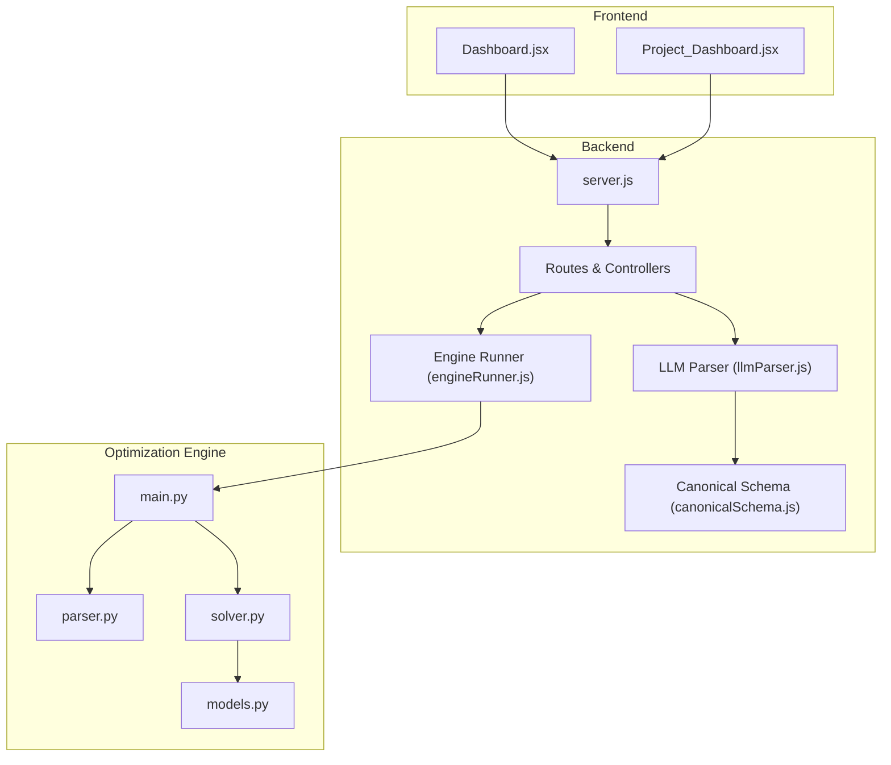
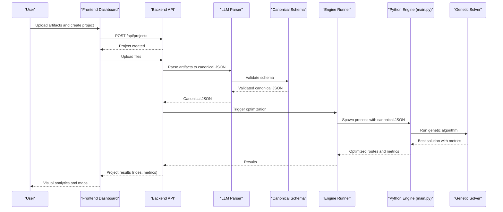
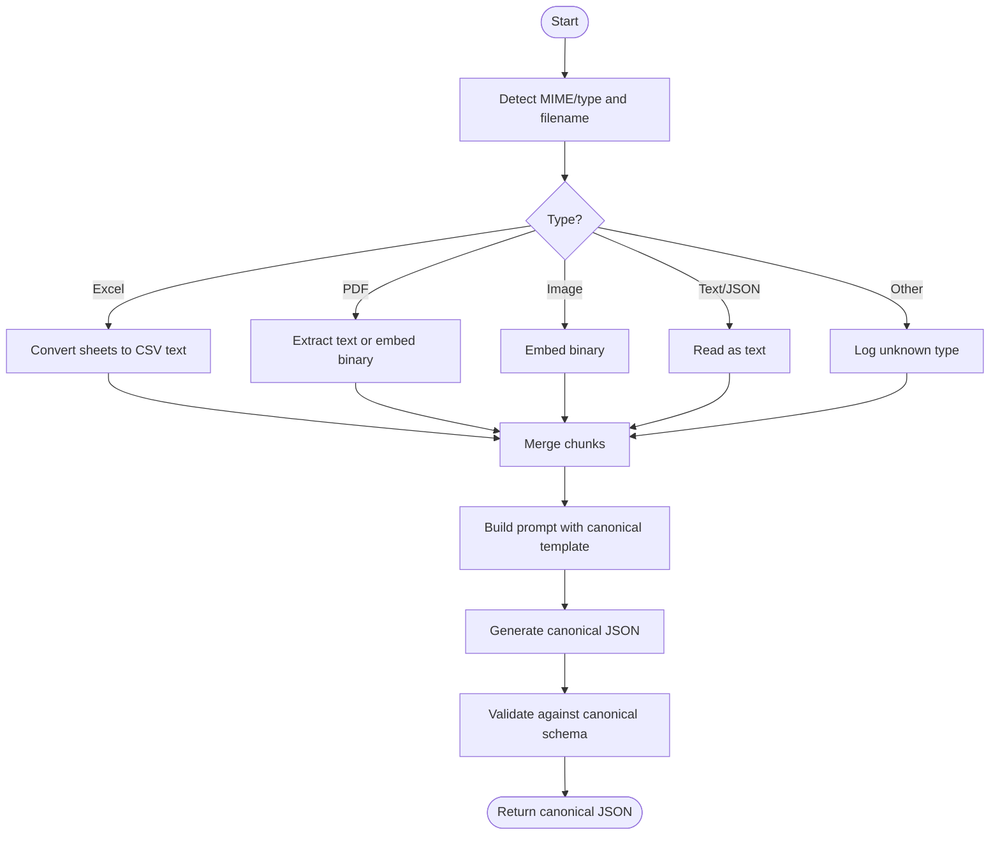
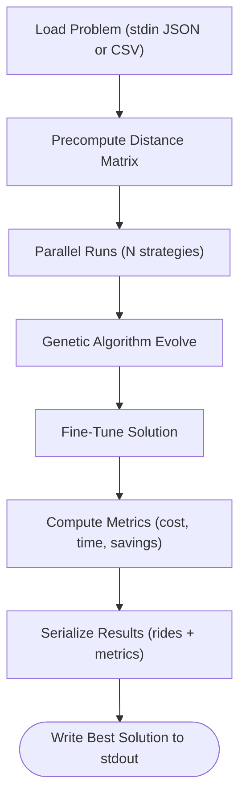
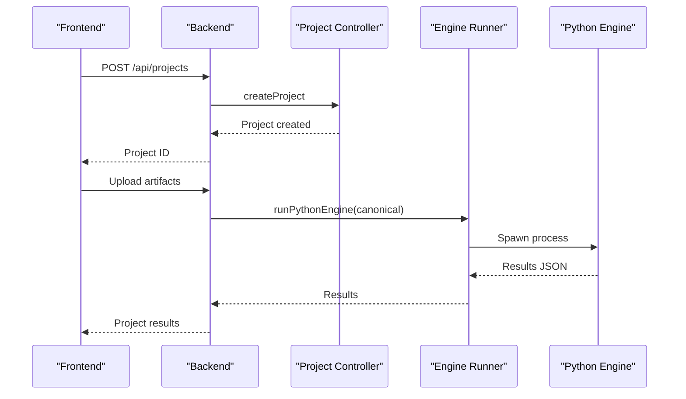
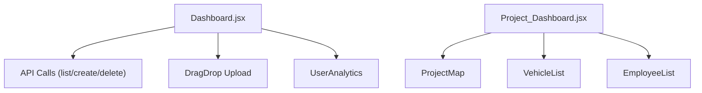
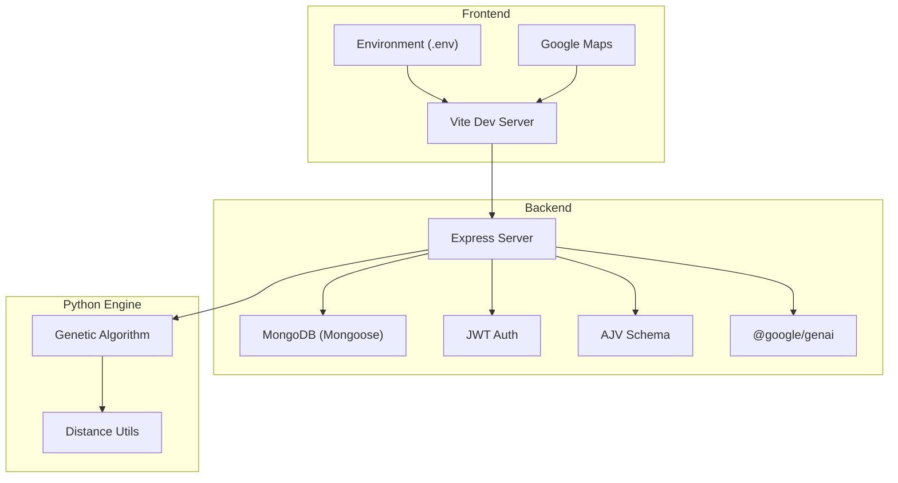

# Introduction and Purpose

<cite>
**Referenced Files in This Document**
- [README.md](file://README.md)
- [backend/engine/main.py](file://backend/engine/main.py)
- [backend/engine/parser.py](file://backend/engine/parser.py)
- [backend/engine/solver.py](file://backend/engine/solver.py)
- [backend/engine/models.py](file://backend/engine/models.py)
- [backend/services/llmParser.js](file://backend/services/llmParser.js)
- [backend/validation/canonicalSchema.js](file://backend/validation/canonicalSchema.js)
- [backend/services/engineRunner.js](file://backend/services/engineRunner.js)
- [backend/controllers/projectController.js](file://backend/controllers/projectController.js)
- [frontend/src/pages/dashboard/Dashboard.jsx](file://frontend/src/pages/dashboard/Dashboard.jsx)
- [frontend/src/pages/projects/Project_Dashboard.jsx](file://frontend/src/pages/projects/Project_Dashboard.jsx)
- [backend/server.js](file://backend/server.js)
- [backend/package.json](file://backend/package.json)
- [assets/.env.example](file://assets/.env.example)
- [frontend/vite.config.js](file://frontend/vite.config.js)
- [pubspec.yaml](file://pubspec.yaml)
</cite>

## Table of Contents
1. [Introduction](#introduction)
2. [Project Structure](#project-structure)
3. [Core Components](#core-components)
4. [Architecture Overview](#architecture-overview)
5. [Detailed Component Analysis](#detailed-component-analysis)
6. [Dependency Analysis](#dependency-analysis)
7. [Performance Considerations](#performance-considerations)
8. [Troubleshooting Guide](#troubleshooting-guide)
9. [Conclusion](#conclusion)

## Introduction
Route Optimization is a technology platform designed to solve complex vehicle routing problems using AI-powered data parsing and advanced optimization algorithms. Its mission is to transform logistics operations by turning raw, often unstructured data into actionable, optimized routes that reduce costs, improve efficiency, and enable real-time visibility for fleet managers, logistics coordinators, and supply chain analysts.

At its core, the platform automates the entire workflow:
- Accepts diverse input formats (CSV, Excel, PDF, images, and free-form text)
- Uses an AI model to extract and normalize structured data into a canonical format
- Feeds the normalized data into a high-performance optimization engine powered by a genetic algorithm
- Produces optimized routes with detailed metrics, including cost, time, and savings compared to baselines
- Delivers insights via a modern dashboard for planning, monitoring, and decision-making

The value proposition is clear:
- Reduce operational costs through smarter routing and lower fuel consumption
- Improve delivery efficiency by minimizing travel time and enhancing driver productivity
- Provide real-time analytics and dashboards for continuous performance monitoring

Target audience:
- Fleet managers who oversee daily operations and need reliable, repeatable routing plans
- Logistics coordinators who plan routes and monitor KPIs across shifts and regions
- Supply chain analysts who require accurate metrics and trend analysis to drive strategic decisions

Problem statements addressed:
- Inefficient route planning leading to unnecessary miles, traffic delays, and missed time windows
- High fuel consumption due to suboptimal stops and lack of consolidation strategies
- Poor customer satisfaction caused by late deliveries, lack of transparency, and inconsistent service

Use case scenarios:
- Scenario A: A company with 120 daily pickups and drops reduces average round-trip time by 22% and fuel costs by 18% after adopting the platform. Before optimization, drivers averaged 120 minutes per route; after optimization, the average dropped to 94 minutes. Customer complaints decreased by 30% within the first quarter.
- Scenario B: A logistics provider consolidates shared rides using preference-aware algorithms, increasing vehicle occupancy by 35% and cutting per-ride emissions by 25%. Real-time dashboards show live updates to dispatchers and customers, improving trust and on-time performance.

## Project Structure
Route Optimization is organized as a full-stack system:
- Frontend (React/Vite) for the web dashboard and project visualization
- Backend (Node.js/Express) for APIs, AI parsing, and orchestration of the Python optimization engine
- Python optimization engine implementing AI parsing, data normalization, and genetic algorithm-based routing
- Shared environment configuration for API endpoints and cross-platform connectivity

**Diagram sources**
- [backend/server.js](file://backend/server.js#L1-L56)
- [frontend/src/pages/dashboard/Dashboard.jsx](file://frontend/src/pages/dashboard/Dashboard.jsx#L1-L394)
- [frontend/src/pages/projects/Project_Dashboard.jsx](file://frontend/src/pages/projects/Project_Dashboard.jsx#L1-L252)
- [backend/services/llmParser.js](file://backend/services/llmParser.js#L1-L170)
- [backend/validation/canonicalSchema.js](file://backend/validation/canonicalSchema.js#L1-L105)
- [backend/services/engineRunner.js](file://backend/services/engineRunner.js#L1-L73)
- [backend/engine/main.py](file://backend/engine/main.py#L1-L193)
- [backend/engine/parser.py](file://backend/engine/parser.py#L1-L278)
- [backend/engine/solver.py](file://backend/engine/solver.py#L1-L107)
- [backend/engine/models.py](file://backend/engine/models.py#L1-L56)

**Section sources**
- [backend/server.js](file://backend/server.js#L1-L56)
- [frontend/vite.config.js](file://frontend/vite.config.js#L1-L17)
- [assets/.env.example](file://assets/.env.example#L1-L10)
- [backend/package.json](file://backend/package.json#L1-L28)
- [pubspec.yaml](file://pubspec.yaml#L1-L117)

## Core Components
- AI-Powered Data Parsing: Converts unstructured inputs (CSV, Excel, PDF, images, text) into a canonical JSON schema using an LLM. It normalizes artifacts, extracts tabular data, and validates structure against a canonical schema.
- Canonical Schema Validation: Ensures the parsed data conforms to required fields and types, enabling reliable downstream optimization.
- Optimization Engine: Loads the canonical data, precomputes distances, runs multiple genetic algorithm strategies in parallel, selects the best solution, and produces metrics and route details.
- Web Dashboard: Provides a project-centric interface for creating, managing, and visualizing optimization results with analytics and route maps.
- Backend Orchestration: Exposes REST endpoints for project lifecycle, integrates the LLM parser, and spawns the Python engine to compute optimized routes.

Key capabilities:
- Multi-format ingestion and robust normalization
- Structured canonical schema enforcement
- Parallel genetic algorithm runs with configurable strategies
- Comprehensive metrics (cost, time, savings, feasibility)
- Real-time dashboards and route visualization

**Section sources**
- [backend/services/llmParser.js](file://backend/services/llmParser.js#L1-L170)
- [backend/validation/canonicalSchema.js](file://backend/validation/canonicalSchema.js#L1-L105)
- [backend/engine/main.py](file://backend/engine/main.py#L1-L193)
- [backend/engine/parser.py](file://backend/engine/parser.py#L1-L278)
- [backend/engine/solver.py](file://backend/engine/solver.py#L1-L107)
- [frontend/src/pages/dashboard/Dashboard.jsx](file://frontend/src/pages/dashboard/Dashboard.jsx#L1-L394)
- [frontend/src/pages/projects/Project_Dashboard.jsx](file://frontend/src/pages/projects/Project_Dashboard.jsx#L1-L252)

## Architecture Overview
The system follows a clean separation of concerns:
- Frontend handles user interactions, drag-and-drop uploads, and visualization
- Backend manages authentication, project lifecycle, AI parsing, and orchestration
- Python engine encapsulates data parsing, representation, and optimization

**Diagram sources**
- [frontend/src/pages/dashboard/Dashboard.jsx](file://frontend/src/pages/dashboard/Dashboard.jsx#L1-L394)
- [backend/controllers/projectController.js](file://backend/controllers/projectController.js#L1-L117)
- [backend/services/llmParser.js](file://backend/services/llmParser.js#L1-L170)
- [backend/validation/canonicalSchema.js](file://backend/validation/canonicalSchema.js#L1-L105)
- [backend/services/engineRunner.js](file://backend/services/engineRunner.js#L1-L73)
- [backend/engine/main.py](file://backend/engine/main.py#L1-L193)
- [backend/engine/solver.py](file://backend/engine/solver.py#L1-L107)

## Detailed Component Analysis

### AI-Powered Data Parsing and Normalization
The LLM parser ingests heterogeneous inputs, normalizes them into a stable canonical JSON, and validates against a schema. It supports spreadsheets, PDFs, images, and plain text, extracting tabular data and embedding binary content as needed.

**Diagram sources**
- [backend/services/llmParser.js](file://backend/services/llmParser.js#L1-L170)
- [backend/validation/canonicalSchema.js](file://backend/validation/canonicalSchema.js#L1-L105)

**Section sources**
- [backend/services/llmParser.js](file://backend/services/llmParser.js#L1-L170)
- [backend/validation/canonicalSchema.js](file://backend/validation/canonicalSchema.js#L1-L105)

### Optimization Pipeline: From Data to Routes
The Python engine orchestrates data loading, distance precomputation, parallel runs of genetic strategies, and deterministic fine-tuning to produce the best feasible solution.

**Diagram sources**
- [backend/engine/main.py](file://backend/engine/main.py#L1-L193)
- [backend/engine/parser.py](file://backend/engine/parser.py#L1-L278)
- [backend/engine/solver.py](file://backend/engine/solver.py#L1-L107)
- [backend/engine/models.py](file://backend/engine/models.py#L1-L56)

**Section sources**
- [backend/engine/main.py](file://backend/engine/main.py#L1-L193)
- [backend/engine/parser.py](file://backend/engine/parser.py#L1-L278)
- [backend/engine/solver.py](file://backend/engine/solver.py#L1-L107)
- [backend/engine/models.py](file://backend/engine/models.py#L1-L56)

### Backend Orchestration and Project Lifecycle
The backend exposes REST endpoints for project creation, listing, retrieval, and deletion. It integrates with the LLM parser and the Python engine runner to deliver optimized results to the frontend.

**Diagram sources**
- [backend/controllers/projectController.js](file://backend/controllers/projectController.js#L1-L117)
- [backend/services/engineRunner.js](file://backend/services/engineRunner.js#L1-L73)
- [backend/engine/main.py](file://backend/engine/main.py#L1-L193)

**Section sources**
- [backend/controllers/projectController.js](file://backend/controllers/projectController.js#L1-L117)
- [backend/services/engineRunner.js](file://backend/services/engineRunner.js#L1-L73)
- [backend/server.js](file://backend/server.js#L1-L56)

### Frontend Dashboards and Analytics
The frontend provides two primary views:
- Dashboard: Project listing, status indicators, drag-and-drop upload area, and summary analytics
- Project Dashboard: Route visualization, vehicle lists, employee status, and key metrics (cost, time, savings)

**Diagram sources**
- [frontend/src/pages/dashboard/Dashboard.jsx](file://frontend/src/pages/dashboard/Dashboard.jsx#L1-L394)
- [frontend/src/pages/projects/Project_Dashboard.jsx](file://frontend/src/pages/projects/Project_Dashboard.jsx#L1-L252)

**Section sources**
- [frontend/src/pages/dashboard/Dashboard.jsx](file://frontend/src/pages/dashboard/Dashboard.jsx#L1-L394)
- [frontend/src/pages/projects/Project_Dashboard.jsx](file://frontend/src/pages/projects/Project_Dashboard.jsx#L1-L252)

## Dependency Analysis
Technology stack and integration points:
- Frontend: React, Vite, Google Maps, file picker, and environment configuration
- Backend: Express, Mongoose, JWT, CORS, AJV schema validation, Gemini AI, and child process orchestration
- Python Engine: Genetic algorithm, distance matrix utilities, and parallel execution

**Diagram sources**
- [backend/server.js](file://backend/server.js#L1-L56)
- [backend/package.json](file://backend/package.json#L1-L28)
- [frontend/vite.config.js](file://frontend/vite.config.js#L1-L17)
- [assets/.env.example](file://assets/.env.example#L1-L10)
- [pubspec.yaml](file://pubspec.yaml#L1-L117)

**Section sources**
- [backend/package.json](file://backend/package.json#L1-L28)
- [backend/server.js](file://backend/server.js#L1-L56)
- [frontend/vite.config.js](file://frontend/vite.config.js#L1-L17)
- [assets/.env.example](file://assets/.env.example#L1-L10)
- [pubspec.yaml](file://pubspec.yaml#L1-L117)

## Performance Considerations
- Parallel execution: The engine runs multiple genetic algorithm strategies concurrently to increase the chance of finding better solutions faster.
- Distance precomputation: Precomputing distances reduces runtime overhead during evolution loops.
- Deterministic fine-tuning: Post-processing with a deterministic tuner improves solution quality after genetic optimization.
- Scalability: The system is designed to handle larger datasets by adjusting population sizes, generations, and worker counts.

## Troubleshooting Guide
Common issues and resolutions:
- Empty or invalid JSON from Python engine: The backend extracts the last JSON object from stdout; ensure the engine writes valid JSON and avoid extraneous logs.
- CORS errors: Verify allowed origins in the backend and proxy configuration in the frontend.
- Environment configuration: Confirm API base URL matches the backend endpoint and adjust for local, emulator, or LAN environments.
- Timeout during optimization: Increase the timeout for the Python engine run if dealing with large datasets.

**Section sources**
- [backend/services/engineRunner.js](file://backend/services/engineRunner.js#L1-L73)
- [backend/server.js](file://backend/server.js#L1-L56)
- [assets/.env.example](file://assets/.env.example#L1-L10)
- [frontend/vite.config.js](file://frontend/vite.config.js#L1-L17)

## Conclusion
Route Optimization delivers a complete solution for modern logistics challenges. By combining AI-driven data parsing, robust canonical validation, and high-performance genetic algorithm optimization, it enables organizations to cut costs, reduce emissions, and improve customer satisfaction. The intuitive dashboards and real-time analytics make it accessible to fleet managers, logistics coordinators, and analysts alike, helping them turn raw data into smart, scalable routing strategies.