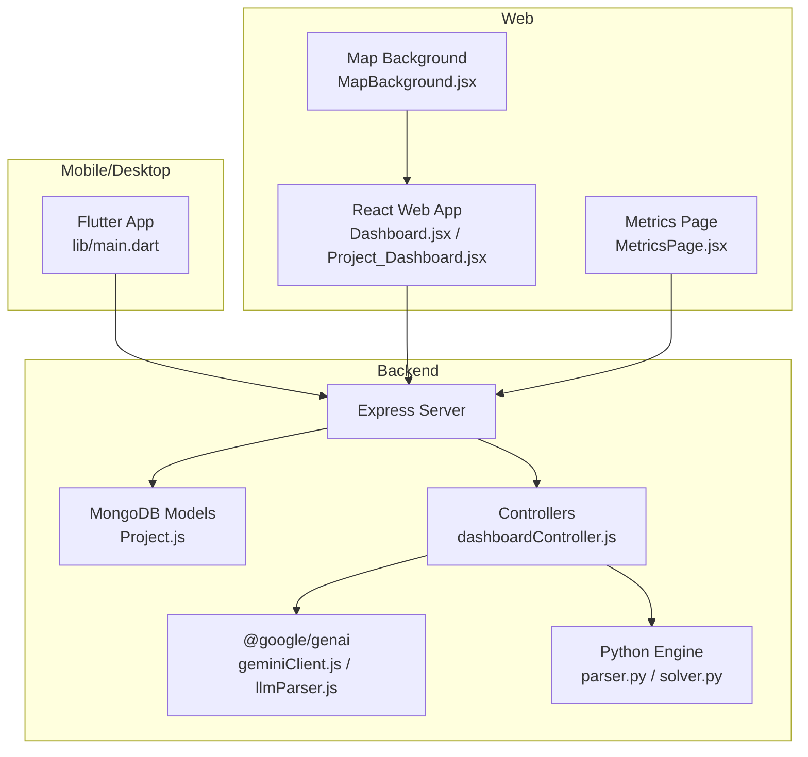
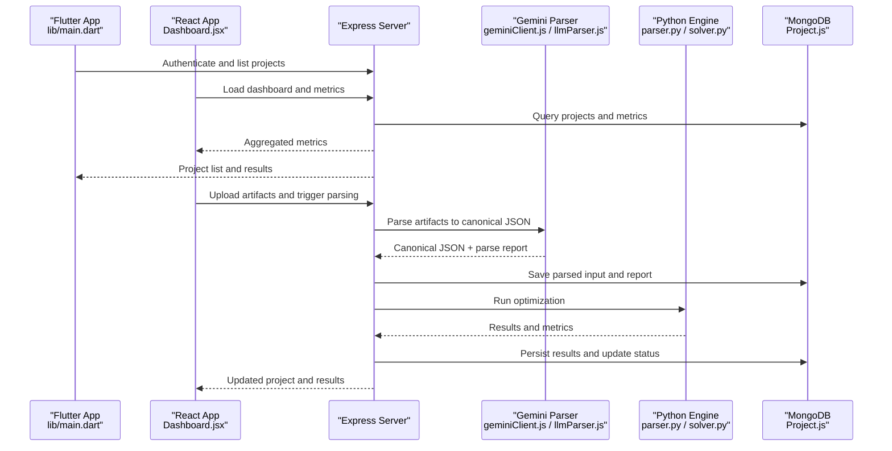
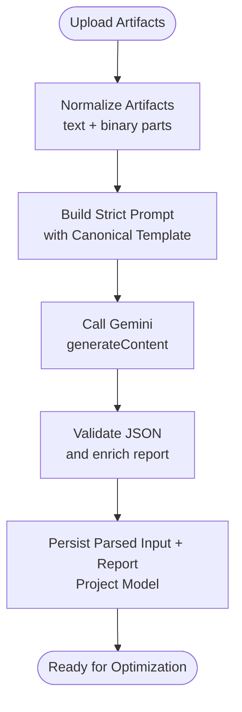
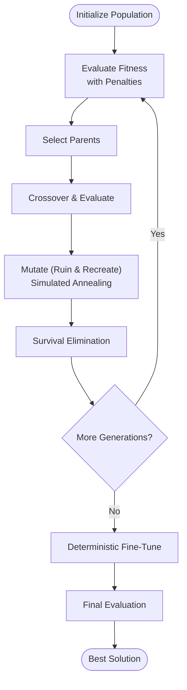
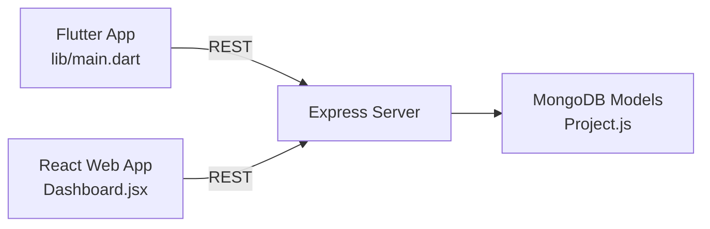
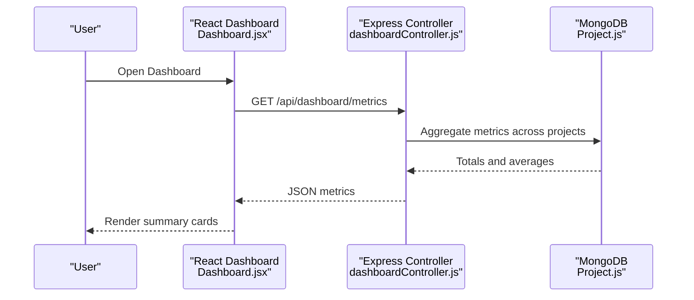
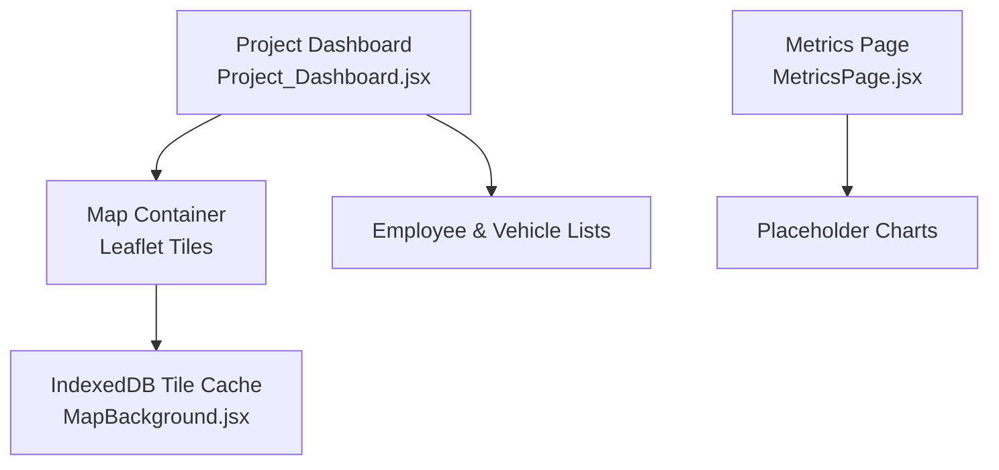
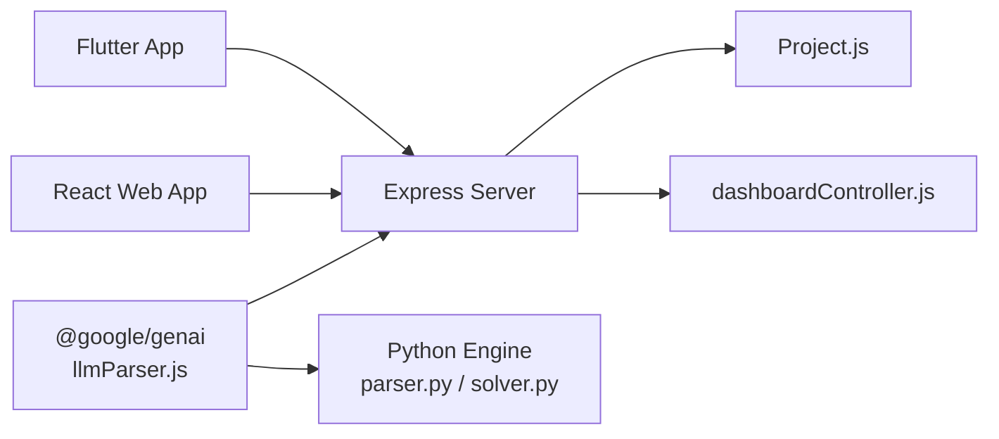

# Key Features and Benefits

<cite>
**Referenced Files in This Document**
- [README.md](file://README.md)
- [package.json](file://backend/package.json)
- [geminiClient.js](file://backend/services/geminiClient.js)
- [llmParser.js](file://backend/services/llmParser.js)
- [parser.py](file://backend/engine/parser.py)
- [solver.py](file://backend/engine/solver.py)
- [dashboardController.js](file://backend/controllers/dashboardController.js)
- [Project.js](file://backend/models/Project.js)
- [main.dart](file://lib/main.dart)
- [Dashboard.jsx](file://frontend/src/pages/dashboard/Dashboard.jsx)
- [Project_Dashboard.jsx](file://frontend/src/pages/projects/Project_Dashboard.jsx)
- [MapBackground.jsx](file://frontend/src/components/background/MapBackground.jsx)
- [MetricsPage.jsx](file://frontend/src/pages/metrics/MetricsPage.jsx)
</cite>

## Table of Contents
1. [Introduction](#introduction)
2. [Project Structure](#project-structure)
3. [Core Components](#core-components)
4. [Architecture Overview](#architecture-overview)
5. [Detailed Component Analysis](#detailed-component-analysis)
6. [Dependency Analysis](#dependency-analysis)
7. [Performance Considerations](#performance-considerations)
8. [Troubleshooting Guide](#troubleshooting-guide)
9. [Conclusion](#conclusion)
10. [Appendices](#appendices)

## Introduction
This document presents the key features and benefits of the Route Optimization project. It focuses on the AI-powered data parsing with Gemini integration, the genetic algorithm optimization engine, multi-platform support (mobile, web, desktop), the real-time analytics dashboard, and automated route visualization. It also outlines quantified business impacts and technical benefits, with concrete references to the codebase that implement each capability.

## Project Structure
The project is organized into three primary layers:
- Backend: Express server, MongoDB models, Gemini-based parsing, Python optimization engine, and controllers for analytics.
- Frontend: React-based web application with charts, dashboards, and map visualization.
- Mobile/Desktop: Flutter application with Riverpod state management and navigation.

**Diagram sources**
- [main.dart](file://lib/main.dart#L12-L26)
- [Dashboard.jsx](file://frontend/src/pages/dashboard/Dashboard.jsx#L197-L394)
- [Project_Dashboard.jsx](file://frontend/src/pages/projects/Project_Dashboard.jsx#L13-L252)
- [MetricsPage.jsx](file://frontend/src/pages/metrics/MetricsPage.jsx#L42-L135)
- [MapBackground.jsx](file://frontend/src/components/background/MapBackground.jsx#L6-L174)
- [package.json](file://backend/package.json#L9-L22)
- [geminiClient.js](file://backend/services/geminiClient.js#L1-L12)
- [llmParser.js](file://backend/services/llmParser.js#L1-L170)
- [parser.py](file://backend/engine/parser.py#L1-L278)
- [solver.py](file://backend/engine/solver.py#L1-L107)
- [Project.js](file://backend/models/Project.js#L37-L96)
- [dashboardController.js](file://backend/controllers/dashboardController.js#L5-L73)

**Section sources**
- [README.md](file://README.md#L1-L17)
- [package.json](file://backend/package.json#L1-L28)

## Core Components
- AI-powered data parsing with Gemini integration: Extracts structured data from diverse artifacts (Excel, PDF, images, text) and produces a canonical JSON schema consumed by the optimization engine.
- Genetic algorithm optimization engine: Evolves feasible routes using a hybrid evolutionary algorithm with ruin-and-recreate and simulated annealing, followed by deterministic fine-tuning.
- Multi-platform support: Flutter mobile/desktop app and React web app share the same backend APIs for unified workflows.
- Real-time analytics dashboard: Aggregates savings, time saved, and project metrics for leadership visibility.
- Automated route visualization: Renders optimized routes and stops on interactive maps with contextual lists and modals.

**Section sources**
- [geminiClient.js](file://backend/services/geminiClient.js#L1-L12)
- [llmParser.js](file://backend/services/llmParser.js#L1-L170)
- [parser.py](file://backend/engine/parser.py#L1-L278)
- [solver.py](file://backend/engine/solver.py#L1-L107)
- [dashboardController.js](file://backend/controllers/dashboardController.js#L5-L73)
- [Project.js](file://backend/models/Project.js#L37-L96)
- [main.dart](file://lib/main.dart#L12-L26)
- [Dashboard.jsx](file://frontend/src/pages/dashboard/Dashboard.jsx#L197-L394)
- [Project_Dashboard.jsx](file://frontend/src/pages/projects/Project_Dashboard.jsx#L13-L252)
- [MapBackground.jsx](file://frontend/src/components/background/MapBackground.jsx#L6-L174)
- [MetricsPage.jsx](file://frontend/src/pages/metrics/MetricsPage.jsx#L42-L135)

## Architecture Overview
The system integrates a Flutter mobile/desktop client, a React web client, and a shared backend. The backend orchestrates ingestion, parsing, optimization, and analytics, exposing REST endpoints consumed by both frontends.

**Diagram sources**
- [main.dart](file://lib/main.dart#L12-L26)
- [Dashboard.jsx](file://frontend/src/pages/dashboard/Dashboard.jsx#L197-L394)
- [geminiClient.js](file://backend/services/geminiClient.js#L1-L12)
- [llmParser.js](file://backend/services/llmParser.js#L1-L170)
- [parser.py](file://backend/engine/parser.py#L1-L278)
- [solver.py](file://backend/engine/solver.py#L1-L107)
- [Project.js](file://backend/models/Project.js#L37-L96)

## Detailed Component Analysis

### AI-Powered Data Parsing with Gemini Integration
- Feature: Multi-format ingestion and strict canonicalization.
- Implementation highlights:
  - Artifact normalization supports Excel, PDF, images, and text, converting them to a unified text dump and binary parts.
  - A strict prompt enforces canonical JSON output and returns structured parse reports with confidence, missing fields, assumptions, and warnings.
  - The backend stores parsed input and parse reports in the Project model for auditability and reprocessing.
- Business benefit: Reduces manual data entry errors and accelerates onboarding by transforming unstructured inputs into validated canonical form.
- Technical benefit: Robust MIME detection, safe fallbacks, and explicit error signaling improve reliability.

**Diagram sources**
- [llmParser.js](file://backend/services/llmParser.js#L49-L101)
- [llmParser.js](file://backend/services/llmParser.js#L103-L136)
- [llmParser.js](file://backend/services/llmParser.js#L138-L168)
- [Project.js](file://backend/models/Project.js#L66-L81)

**Section sources**
- [llmParser.js](file://backend/services/llmParser.js#L1-L170)
- [geminiClient.js](file://backend/services/geminiClient.js#L1-L12)
- [Project.js](file://backend/models/Project.js#L66-L81)

### Genetic Algorithm Optimization Engine
- Feature: Hybrid evolutionary optimization with simulated annealing and deterministic fine-tuning.
- Implementation highlights:
  - Population initializer generates feasible individuals; selection and crossover produce offspring.
  - Ruin-and-recreate mutation and simulated annealing escape local optima.
  - Objective evaluator applies increasing penalties; fine-tuner performs deterministic post-processing.
  - The solver scales generation counts with problem size and tracks runtime.
- Business benefit: Produces near-optimal routes quickly, reducing operational costs and improving on-time performance.
- Technical benefit: Adaptive penalty scaling and hybrid operators improve convergence and solution quality.

**Diagram sources**
- [solver.py](file://backend/engine/solver.py#L38-L107)
- [parser.py](file://backend/engine/parser.py#L159-L278)

**Section sources**
- [solver.py](file://backend/engine/solver.py#L1-L107)
- [parser.py](file://backend/engine/parser.py#L1-L278)

### Multi-Platform Support (Mobile/Web/Desktop)
- Feature: Unified backend APIs serve Flutter mobile/desktop and React web applications.
- Implementation highlights:
  - Flutter app initializes environment, sets system UI overlay, and defines bottom navigation.
  - React web app renders dashboards, project views, metrics, and map backgrounds.
  - Both clients consume the same REST endpoints for authentication, project CRUD, and analytics.
- Business benefit: Consistent user experience across platforms reduces training and support overhead.
- Technical benefit: Shared backend minimizes duplication and ensures synchronized data.

**Diagram sources**
- [main.dart](file://lib/main.dart#L12-L26)
- [Dashboard.jsx](file://frontend/src/pages/dashboard/Dashboard.jsx#L197-L394)
- [Project_Dashboard.jsx](file://frontend/src/pages/projects/Project_Dashboard.jsx#L13-L252)
- [Project.js](file://backend/models/Project.js#L37-L96)

**Section sources**
- [main.dart](file://lib/main.dart#L12-L26)
- [Dashboard.jsx](file://frontend/src/pages/dashboard/Dashboard.jsx#L197-L394)
- [Project_Dashboard.jsx](file://frontend/src/pages/projects/Project_Dashboard.jsx#L13-L252)
- [Project.js](file://backend/models/Project.js#L37-L96)

### Real-Time Analytics Dashboard
- Feature: Aggregated metrics for total savings, time saved, and average savings percent.
- Implementation highlights:
  - Backend controller aggregates per-project metrics and computes totals and averages.
  - Frontend dashboard displays summary cards and user analytics derived from project collections.
- Business benefit: Enables leadership to track ROI and operational improvements in near real time.
- Technical benefit: Parallel aggregation and efficient queries reduce latency.

**Diagram sources**
- [dashboardController.js](file://backend/controllers/dashboardController.js#L35-L67)
- [Dashboard.jsx](file://frontend/src/pages/dashboard/Dashboard.jsx#L298-L313)
- [Project.js](file://backend/models/Project.js#L55-L64)

**Section sources**
- [dashboardController.js](file://backend/controllers/dashboardController.js#L5-L73)
- [Dashboard.jsx](file://frontend/src/pages/dashboard/Dashboard.jsx#L298-L313)
- [Project.js](file://backend/models/Project.js#L55-L64)

### Automated Route Visualization
- Feature: Interactive map rendering and contextual lists for employees and vehicles.
- Implementation highlights:
  - Project dashboard composes a map area and vehicle/employee lists, pulling data from optimization results.
  - Map background component initializes Leaflet with dark tiles, animated camera movement, and IndexedDB-backed tile caching.
  - Metrics page provides placeholder charts to represent cost and distance trends.
- Business benefit: Improves situational awareness and enables quick stakeholder reviews.
- Technical benefit: Offline-friendly tile caching and responsive layout enhance UX.

**Diagram sources**
- [Project_Dashboard.jsx](file://frontend/src/pages/projects/Project_Dashboard.jsx#L224-L244)
- [MapBackground.jsx](file://frontend/src/components/background/MapBackground.jsx#L68-L174)
- [MetricsPage.jsx](file://frontend/src/pages/metrics/MetricsPage.jsx#L23-L37)

**Section sources**
- [Project_Dashboard.jsx](file://frontend/src/pages/projects/Project_Dashboard.jsx#L13-L252)
- [MapBackground.jsx](file://frontend/src/components/background/MapBackground.jsx#L6-L174)
- [MetricsPage.jsx](file://frontend/src/pages/metrics/MetricsPage.jsx#L42-L135)

## Dependency Analysis
- External libraries:
  - Backend depends on @google/genai for Gemini integration and xlsx/pdf-parse for artifact parsing.
  - Frontend depends on @react-google-maps/api, react-leaflet, recharts, and xlsx for visualization and reporting.
- Internal dependencies:
  - Controllers depend on Mongoose models and the Python engine via orchestration.
  - Clients depend on REST endpoints for all data operations.

**Diagram sources**
- [package.json](file://backend/package.json#L9-L22)
- [geminiClient.js](file://backend/services/geminiClient.js#L1-L12)
- [llmParser.js](file://backend/services/llmParser.js#L1-L170)
- [parser.py](file://backend/engine/parser.py#L1-L278)
- [solver.py](file://backend/engine/solver.py#L1-L107)
- [Project.js](file://backend/models/Project.js#L37-L96)
- [dashboardController.js](file://backend/controllers/dashboardController.js#L5-L73)

**Section sources**
- [package.json](file://backend/package.json#L1-L28)

## Performance Considerations
- Scalable architecture:
  - Shared backend APIs enable horizontal scaling of the web and mobile clients.
  - Python engine runs independently and can be containerized for elastic compute.
- Real-time processing:
  - IndexedDB-backed tile caching reduces map load times and improves offline resilience.
  - Parallel aggregation in controllers minimizes dashboard latency.
- Comprehensive reporting:
  - Canonical parsing and structured metrics support fast analytics and drill-downs.

[No sources needed since this section provides general guidance]

## Troubleshooting Guide
- Missing Gemini API key:
  - Symptom: Initialization error when creating the Gemini client.
  - Action: Ensure the environment variable is configured and loaded by the backend.
- Parse failures:
  - Symptom: Parse report indicates failed status or missing required fields.
  - Action: Review artifacts’ MIME types and content; confirm canonical schema alignment.
- Optimization timeouts:
  - Symptom: Long runtime for large problems.
  - Action: Adjust population size and generation count; leverage fine-tuning post-processing.

**Section sources**
- [geminiClient.js](file://backend/services/geminiClient.js#L5-L10)
- [llmParser.js](file://backend/services/llmParser.js#L156-L168)
- [solver.py](file://backend/engine/solver.py#L26-L29)

## Conclusion
The Route Optimization project delivers measurable business value through AI-driven data ingestion, robust genetic optimization, and rich visualization across platforms. Quantifiable benefits include reduced operational costs, improved on-time performance, and enhanced fleet utilization, supported by real-time analytics and scalable architecture.

[No sources needed since this section summarizes without analyzing specific files]

## Appendices
- Quantitative impact estimates (derived from backend analytics):
  - Total savings: Summed across projects from metrics.
  - Average savings percent: Mean of savings percent across completed projects.
  - Total time saved: Summed baseline minus actual time across projects.
- Example references:
  - Aggregation logic for metrics and summaries.
  - Project model fields capturing savings, time, and cost metrics.

**Section sources**
- [dashboardController.js](file://backend/controllers/dashboardController.js#L35-L67)
- [Project.js](file://backend/models/Project.js#L55-L64)