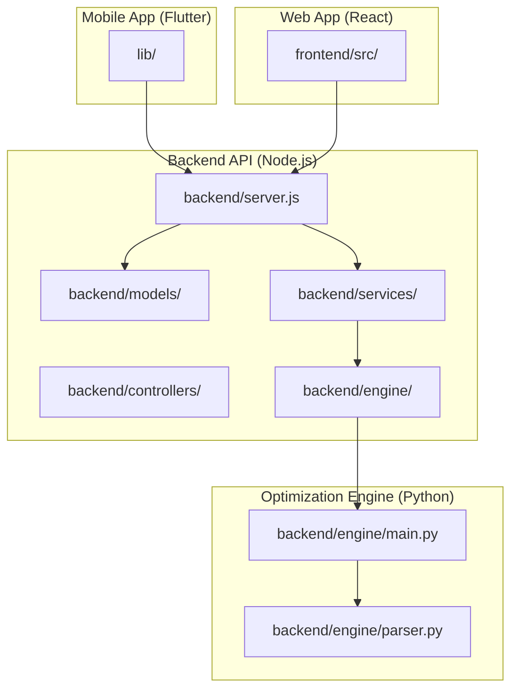
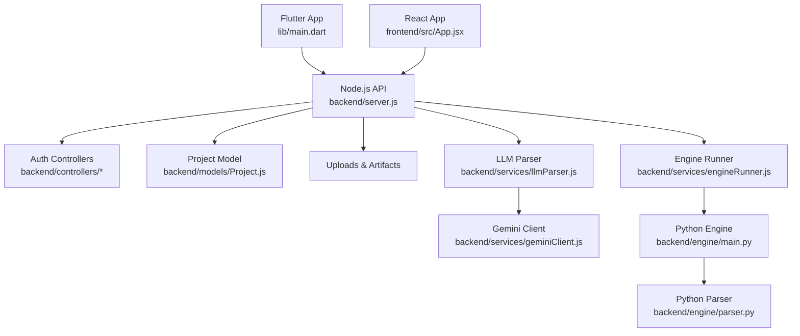
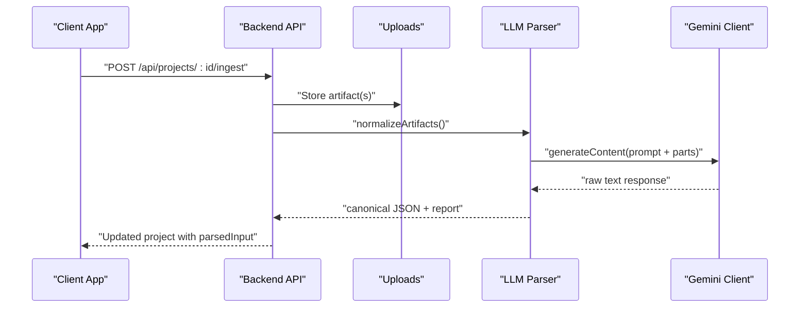
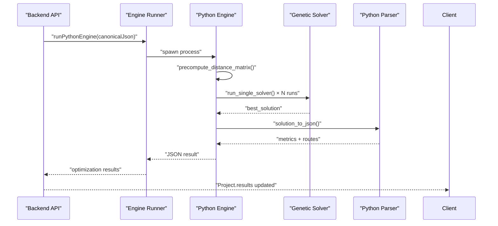
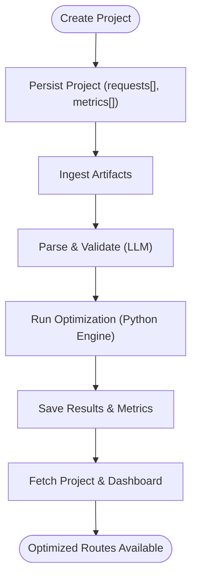
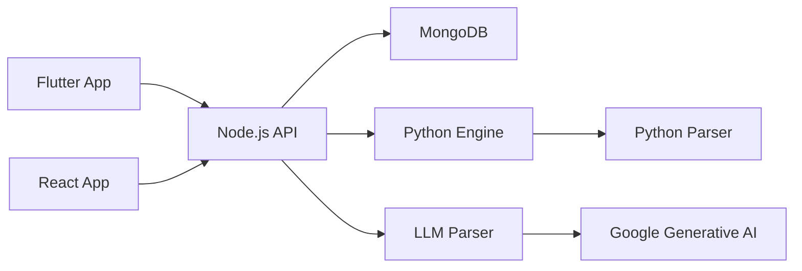

# Project Overview

<cite>
**Referenced Files in This Document**
- [README.md](file://README.md)
- [pubspec.yaml](file://pubspec.yaml)
- [backend/package.json](file://backend/package.json)
- [frontend/package.json](file://frontend/package.json)
- [backend/server.js](file://backend/server.js)
- [backend/engine/main.py](file://backend/engine/main.py)
- [backend/services/engineRunner.js](file://backend/services/engineRunner.js)
- [backend/controllers/projectController.js](file://backend/controllers/projectController.js)
- [backend/models/Project.js](file://backend/models/Project.js)
- [lib/main.dart](file://lib/main.dart)
- [frontend/src/App.jsx](file://frontend/src/App.jsx)
- [backend/services/geminiClient.js](file://backend/services/geminiClient.js)
- [backend/services/llmParser.js](file://backend/services/llmParser.js)
- [backend/engine/parser.py](file://backend/engine/parser.py)
- [DEPLOY.md](file://DEPLOY.md)
</cite>

## Table of Contents
1. [Introduction](#introduction)
2. [Project Structure](#project-structure)
3. [Core Components](#core-components)
4. [Architecture Overview](#architecture-overview)
5. [Detailed Component Analysis](#detailed-component-analysis)
6. [Dependency Analysis](#dependency-analysis)
7. [Performance Considerations](#performance-considerations)
8. [Troubleshooting Guide](#troubleshooting-guide)
9. [Conclusion](#conclusion)
10. [Appendices](#appendices)

## Introduction
Velora Route Optimizer is an AI-powered vehicle routing optimization platform designed to streamline employee transportation logistics. It unifies a Flutter mobile application, a React web interface, and a Python optimization engine behind a shared Node.js backend API. The platform automates the entire workflow: data ingestion from diverse sources (Excel, PDF, text, images), AI-driven parsing into a canonical format, genetic algorithm-based optimization, and multi-platform deployment for Android, iOS, Web, and desktop environments.

Target audience includes fleet managers, HR coordinators, and logistics planners who need efficient, scalable solutions to reduce operational costs, improve on-time performance, and optimize driver/vehicle utilization. The platform solves the challenge of manual route planning by combining intelligent data parsing with high-performance optimization to deliver actionable insights and optimized itineraries.

Key benefits:
- Unified multi-platform experience (mobile, web, desktop)
- Intelligent parsing powered by Google Generative AI
- Robust optimization using a parallelized genetic algorithm
- End-to-end orchestration from ingestion to results
- Production-ready deployment guidance for cloud platforms

Problem-solving approach:
- Ingest structured/unstructured inputs from spreadsheets, documents, and free-form text
- Use an LLM to extract and normalize a canonical JSON schema
- Feed the canonical dataset into a Python optimization engine that runs multiple strategies concurrently
- Aggregate and present results with metrics such as total cost, time, and savings against baseline

## Project Structure
The repository is organized into four primary areas:
- Flutter mobile application (lib/)
- React web application (frontend/)
- Node.js backend API (backend/)
- Python optimization engine (backend/engine/)

**Diagram sources**
- [lib/main.dart](file://lib/main.dart#L1-L220)
- [frontend/src/App.jsx](file://frontend/src/App.jsx#L1-L60)
- [backend/server.js](file://backend/server.js#L1-L56)
- [backend/controllers/projectController.js](file://backend/controllers/projectController.js#L1-L117)
- [backend/models/Project.js](file://backend/models/Project.js#L1-L96)
- [backend/services/engineRunner.js](file://backend/services/engineRunner.js#L1-L73)
- [backend/engine/main.py](file://backend/engine/main.py#L1-L193)
- [backend/engine/parser.py](file://backend/engine/parser.py#L1-L278)

**Section sources**
- [README.md](file://README.md#L1-L17)
- [pubspec.yaml](file://pubspec.yaml#L1-L117)
- [backend/package.json](file://backend/package.json#L1-L28)
- [frontend/package.json](file://frontend/package.json#L1-L48)
- [DEPLOY.md](file://DEPLOY.md#L1-L169)

## Core Components
- Flutter mobile application: Provides secure authentication, navigation, and UI for dashboards, metrics, and project management. It loads environment configuration and integrates with Google Maps for visualization.
- React web application: Offers a responsive dashboard, drag-and-drop file upload, analytics, and project-specific views with map overlays.
- Node.js backend: Exposes RESTful APIs for authentication, project lifecycle, ingestion, parsing, and orchestration of the Python optimization engine. It manages uploads, enforces CORS, and persists data in MongoDB.
- Python optimization engine: Implements a genetic algorithm solver that evaluates multiple strategies in parallel, computes distance matrices, and produces optimized routes with metrics and feasibility indicators.
- AI/LLM integration: Uses Google Generative AI to parse heterogeneous inputs into a canonical JSON schema, enabling robust downstream optimization.

Practical use cases:
- Daily commute routing for employees with time windows and preferences
- Shared ride optimization with capacity constraints and vehicle categories
- Cost/time minimization against historical baselines
- Multi-city operations with depot locations and vehicle availability

**Section sources**
- [lib/main.dart](file://lib/main.dart#L1-L220)
- [frontend/src/App.jsx](file://frontend/src/App.jsx#L1-L60)
- [backend/server.js](file://backend/server.js#L1-L56)
- [backend/engine/main.py](file://backend/engine/main.py#L1-L193)
- [backend/services/llmParser.js](file://backend/services/llmParser.js#L1-L170)
- [backend/services/geminiClient.js](file://backend/services/geminiClient.js#L1-L12)

## Architecture Overview
The system follows a client-server pattern with a shared backend serving both Flutter and React clients. The backend orchestrates ingestion, parsing, and execution of the Python optimization engine, returning structured results consumed by the UIs.

**Diagram sources**
- [lib/main.dart](file://lib/main.dart#L1-L220)
- [frontend/src/App.jsx](file://frontend/src/App.jsx#L1-L60)
- [backend/server.js](file://backend/server.js#L1-L56)
- [backend/controllers/projectController.js](file://backend/controllers/projectController.js#L1-L117)
- [backend/models/Project.js](file://backend/models/Project.js#L1-L96)
- [backend/services/llmParser.js](file://backend/services/llmParser.js#L1-L170)
- [backend/services/geminiClient.js](file://backend/services/geminiClient.js#L1-L12)
- [backend/services/engineRunner.js](file://backend/services/engineRunner.js#L1-L73)
- [backend/engine/main.py](file://backend/engine/main.py#L1-L193)
- [backend/engine/parser.py](file://backend/engine/parser.py#L1-L278)

## Detailed Component Analysis

### Data Ingestion and Canonical Parsing
The backend accepts user-uploaded artifacts (files, text, images) and normalizes them into a canonical JSON schema using Google Generative AI. The LLM parser extracts structured fields, validates presence of required attributes, and records confidence and warnings for review.

**Diagram sources**
- [backend/services/llmParser.js](file://backend/services/llmParser.js#L1-L170)
- [backend/services/geminiClient.js](file://backend/services/geminiClient.js#L1-L12)
- [backend/controllers/projectController.js](file://backend/controllers/projectController.js#L1-L117)

**Section sources**
- [backend/services/llmParser.js](file://backend/services/llmParser.js#L1-L170)
- [backend/services/geminiClient.js](file://backend/services/geminiClient.js#L1-L12)
- [backend/models/Project.js](file://backend/models/Project.js#L1-L96)

### Optimization Pipeline Orchestration
The backend spawns the Python optimization engine, passing the canonical JSON via stdin. The engine precomputes distances, runs multiple genetic solver strategies in parallel, selects the best solution, and returns structured results.

**Diagram sources**
- [backend/services/engineRunner.js](file://backend/services/engineRunner.js#L1-L73)
- [backend/engine/main.py](file://backend/engine/main.py#L1-L193)
- [backend/engine/parser.py](file://backend/engine/parser.py#L1-L278)

**Section sources**
- [backend/services/engineRunner.js](file://backend/services/engineRunner.js#L1-L73)
- [backend/engine/main.py](file://backend/engine/main.py#L1-L193)
- [backend/engine/parser.py](file://backend/engine/parser.py#L1-L278)

### Project Lifecycle and Persistence
Projects encapsulate user requests, artifacts, parsing reports, run state, and results. The backend exposes CRUD operations and dashboard metrics, ensuring data integrity and user-scoped access.

**Diagram sources**
- [backend/controllers/projectController.js](file://backend/controllers/projectController.js#L1-L117)
- [backend/models/Project.js](file://backend/models/Project.js#L1-L96)

**Section sources**
- [backend/controllers/projectController.js](file://backend/controllers/projectController.js#L1-L117)
- [backend/models/Project.js](file://backend/models/Project.js#L1-L96)

### Technology Stack Summary
- Flutter (Dart): Mobile application with Riverpod state management, secure storage, file picker, Google Maps integration, and localization support.
- React (JavaScript/JSX): Web application with routing, charts, map overlays, and drag-and-drop file handling.
- Node.js (Express): Backend API with CORS, authentication, file uploads, and orchestration of the Python engine.
- Python: Optimization engine implementing genetic algorithms, parallel execution, and distance computation.
- MongoDB (Mongoose): Persistent storage for users, projects, vehicles, rides, and artifacts.
- Google Maps: Integrated via Flutter and React components for visualization and geolocation.
- Google Generative AI: Used for intelligent parsing of unstructured inputs into canonical JSON.

**Section sources**
- [pubspec.yaml](file://pubspec.yaml#L30-L60)
- [frontend/package.json](file://frontend/package.json#L12-L29)
- [backend/package.json](file://backend/package.json#L9-L23)
- [backend/server.js](file://backend/server.js#L1-L56)
- [backend/engine/main.py](file://backend/engine/main.py#L1-L193)
- [backend/models/Project.js](file://backend/models/Project.js#L1-L96)

## Dependency Analysis
The system exhibits clear separation of concerns:
- Frontends depend on the backend API for all operations.
- The backend depends on MongoDB for persistence and the Python engine for computations.
- The Python engine depends on the canonical schema produced by the LLM parser.

**Diagram sources**
- [lib/main.dart](file://lib/main.dart#L1-L220)
- [frontend/src/App.jsx](file://frontend/src/App.jsx#L1-L60)
- [backend/server.js](file://backend/server.js#L1-L56)
- [backend/models/Project.js](file://backend/models/Project.js#L1-L96)
- [backend/services/llmParser.js](file://backend/services/llmParser.js#L1-L170)
- [backend/services/geminiClient.js](file://backend/services/geminiClient.js#L1-L12)
- [backend/engine/main.py](file://backend/engine/main.py#L1-L193)
- [backend/engine/parser.py](file://backend/engine/parser.py#L1-L278)

**Section sources**
- [DEPLOY.md](file://DEPLOY.md#L138-L169)

## Performance Considerations
- Parallel execution: The Python engine runs multiple solver strategies concurrently to improve solution quality and throughput.
- Distance precomputation: Precomputing the distance matrix reduces redundant calculations during optimization.
- Streaming and timeouts: The Node.js engine runner enforces timeouts and robust JSON extraction to prevent hangs.
- Client-side caching: Flutter and React apps can cache frequently accessed data to reduce network overhead.
- CDN/static hosting: Serve the React app and Flutter web builds from static hosts for faster delivery.

[No sources needed since this section provides general guidance]

## Troubleshooting Guide
Common issues and resolutions:
- Backend not reachable: Verify CORS origins and ensure the API base URL matches the deployed backend.
- Authentication failures: Confirm JWT secret and login flow; check token presence in local storage for the React app and secure storage for Flutter.
- Optimization timeouts: Increase timeout thresholds in the engine runner or reduce input size; validate Python installation and dependencies.
- LLM parsing errors: Ensure the Gemini API key is configured and the prompt aligns with the canonical schema.
- Upload issues: Confirm multer configuration and upload directory permissions; validate MIME types and file sizes.

**Section sources**
- [DEPLOY.md](file://DEPLOY.md#L151-L169)
- [backend/server.js](file://backend/server.js#L26-L41)
- [backend/services/engineRunner.js](file://backend/services/engineRunner.js#L21-L73)
- [backend/services/geminiClient.js](file://backend/services/geminiClient.js#L1-L12)

## Conclusion
Velora Route Optimizer delivers a cohesive, multi-platform solution for AI-powered vehicle routing. By combining intelligent parsing, robust orchestration, and high-performance optimization, it enables organizations to automate complex logistics challenges. The modular architecture, clear APIs, and deployment-friendly design make it suitable for rapid iteration and production-scale rollouts.

[No sources needed since this section summarizes without analyzing specific files]

## Appendices
- Deployment checklist and environment variable mapping are documented in the deployment guide, including steps for Render, alternatives, and client-side build configurations.

**Section sources**
- [DEPLOY.md](file://DEPLOY.md#L1-L169)