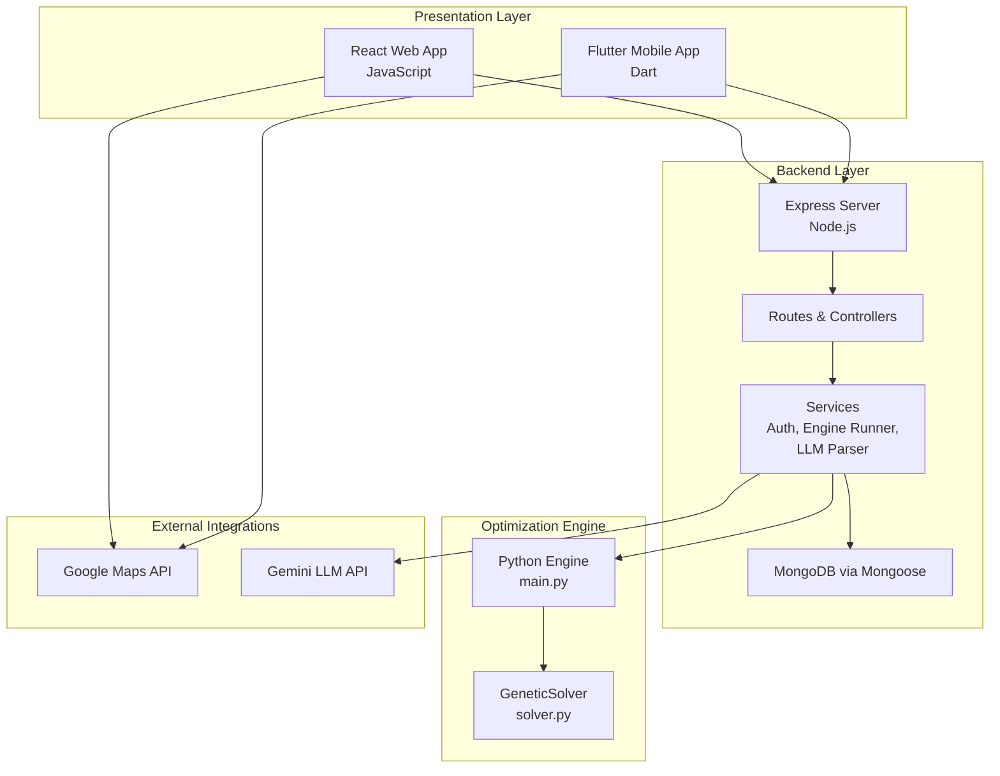
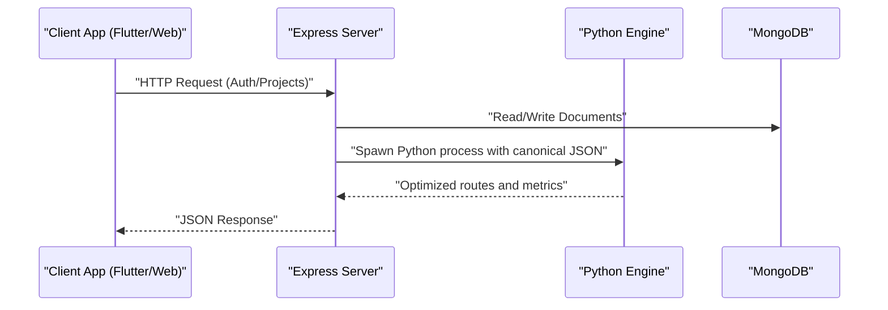
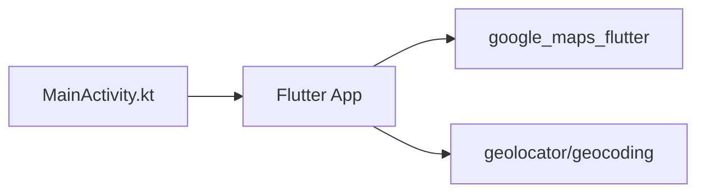
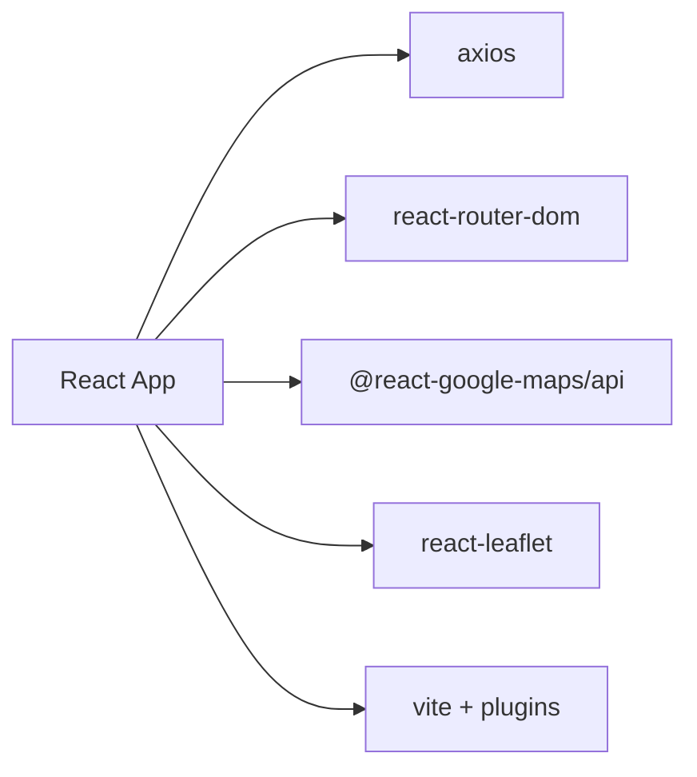
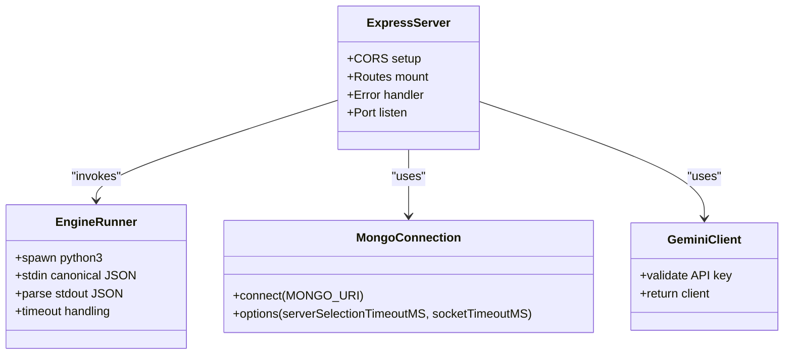
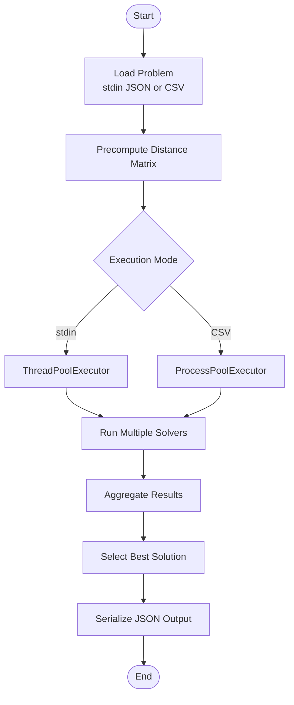
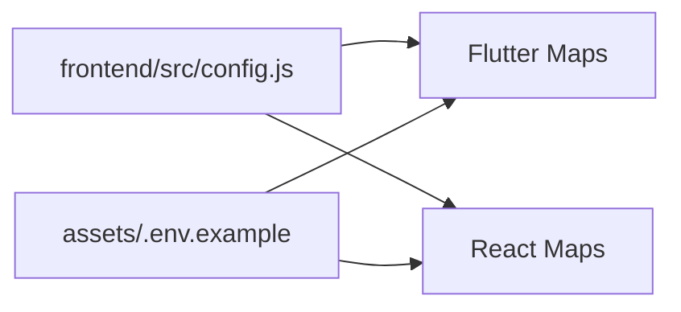
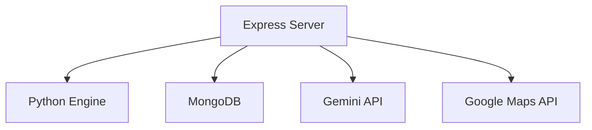

# Technology Stack Summary

<cite>
**Referenced Files in This Document**
- [pubspec.yaml](file://pubspec.yaml)
- [frontend/package.json](file://frontend/package.json)
- [backend/package.json](file://backend/package.json)
- [backend/server.js](file://backend/server.js)
- [backend/config/db.js](file://backend/config/db.js)
- [backend/services/engineRunner.js](file://backend/services/engineRunner.js)
- [backend/services/geminiClient.js](file://backend/services/geminiClient.js)
- [backend/engine/main.py](file://backend/engine/main.py)
- [backend/engine/solver.py](file://backend/engine/solver.py)
- [frontend/src/config.js](file://frontend/src/config.js)
- [frontend/src/api/client.js](file://frontend/src/api/client.js)
- [assets/.env.example](file://assets/.env.example)
- [backend/.env.example](file://backend/.env.example)
- [android/app/src/main/kotlin/com/example/kritiopti/MainActivity.kt](file://android/app/src/main/kotlin/com/example/kritiopti/MainActivity.kt)
- [ios/Runner/AppDelegate.swift](file://ios/Runner/AppDelegate.swift)
</cite>

## Table of Contents
1. [Introduction](#introduction)
2. [Project Structure](#project-structure)
3. [Core Components](#core-components)
4. [Architecture Overview](#architecture-overview)
5. [Detailed Component Analysis](#detailed-component-analysis)
6. [Dependency Analysis](#dependency-analysis)
7. [Performance Considerations](#performance-considerations)
8. [Troubleshooting Guide](#troubleshooting-guide)
9. [Conclusion](#conclusion)

## Introduction
This document presents a comprehensive technology stack summary for the Route Optimization project. It explains the rationale for choosing Flutter/Dart for cross-platform mobile development, React/JavaScript for the web interface, Node.js/Express for backend API services, Python for the optimization engine, MongoDB for data persistence, and Google Maps API integration. It also documents key dependencies, versions, integration points, architectural decisions, version compatibility, and critical dependencies requiring special attention during setup or updates.

## Project Structure
The project follows a clear layered architecture:
- Presentation Layer: Flutter mobile app and React web app
- Backend Layer: Node.js/Express REST API with routing, middleware, and services
- Data Access Layer: MongoDB via Mongoose ODM
- Optimization Engine: Python-based genetic algorithm and supporting modules
- Integration: Express spawns Python engine, passes canonical JSON, receives optimized routes

**Diagram sources**
- [backend/server.js](file://backend/server.js#L1-L56)
- [backend/services/engineRunner.js](file://backend/services/engineRunner.js#L1-L73)
- [backend/engine/main.py](file://backend/engine/main.py#L1-L193)
- [backend/engine/solver.py](file://backend/engine/solver.py#L1-L107)
- [frontend/src/config.js](file://frontend/src/config.js#L1-L7)
- [backend/services/geminiClient.js](file://backend/services/geminiClient.js#L1-L12)

**Section sources**
- [backend/server.js](file://backend/server.js#L1-L56)
- [backend/config/db.js](file://backend/config/db.js#L1-L18)
- [backend/services/engineRunner.js](file://backend/services/engineRunner.js#L1-L73)
- [backend/engine/main.py](file://backend/engine/main.py#L1-L193)
- [frontend/src/config.js](file://frontend/src/config.js#L1-L7)

## Core Components
- Flutter/Dart (Mobile)
  - Cross-platform UI framework with native performance
  - Uses Riverpod for state management, Dio for networking, Google Maps Flutter and Geolocator for mapping and location
  - **Modern glassmorphism design system** (February 2026):
    - Frosted glass components with backdrop blur
    - Smooth animations and transitions (200-500ms)
    - Website-matching color system and gradients
    - Enhanced visual hierarchy across all screens
  - Custom widgets: GlassContainer, WebBackground, ProjectCard, StatCard
  - Supports Android and iOS deployment
- React/JavaScript (Web)
  - Modern web interface with Vite build toolchain
  - Uses Axios for HTTP requests, React Router for navigation, TailwindCSS for styling, and @react-google-maps/api for map rendering
- Node.js/Express (Backend)
  - REST API server with CORS support for multiple origins (Vite dev, Flutter web, Android emulator)
  - Mongoose for MongoDB connectivity, JWT-based authentication, Multer for file uploads, and custom middleware
- Python (Optimization Engine)
  - Genetic algorithm solver with configurable strategies, parallel execution, and deterministic fine-tuning
  - Accepts canonical JSON via stdin or CSV test cases, outputs structured route metrics
- MongoDB (Data Persistence)
  - Schema-less document storage for users, projects, rides, and vehicles
  - Robust connection with timeout and selection options
- Google Maps API Integration
  - Flutter uses google_maps_flutter and geolocator
  - React uses @react-google-maps/api and react-leaflet
  - API keys configured per platform and environment

**Section sources**
- [pubspec.yaml](file://pubspec.yaml#L30-L60)
- [frontend/package.json](file://frontend/package.json#L12-L29)
- [backend/package.json](file://backend/package.json#L9-L23)
- [backend/server.js](file://backend/server.js#L26-L41)
- [backend/config/db.js](file://backend/config/db.js#L3-L16)
- [backend/engine/main.py](file://backend/engine/main.py#L107-L129)
- [backend/engine/solver.py](file://backend/engine/solver.py#L14-L37)
- [frontend/src/config.js](file://frontend/src/config.js#L1-L7)

## Architecture Overview
The system is designed around a microservice-like separation:
- Frontends (Flutter and React) communicate with the Express API
- The Express API orchestrates authentication, data modeling, file uploads, and invokes the Python optimization engine
- The Python engine performs heavy computation and returns optimized routes and metrics
- MongoDB stores all application data

**Diagram sources**
- [backend/server.js](file://backend/server.js#L1-L56)
- [backend/services/engineRunner.js](file://backend/services/engineRunner.js#L21-L71)
- [backend/engine/main.py](file://backend/engine/main.py#L145-L193)
- [backend/config/db.js](file://backend/config/db.js#L3-L16)

## Detailed Component Analysis

### Flutter/Dart Mobile App
- Purpose: Cross-platform mobile UI for route optimization tasks
- Key dependencies:
  - State management: flutter_riverpod
  - Networking: dio
  - Storage: flutter_secure_storage, shared_preferences
  - Maps and location: google_maps_flutter, geolocator, geocoding
  - UI: google_fonts, flutter_launcher_icons, flutter_dotenv
- Deployment: MainActivity extends FlutterActivity; supports Android and iOS

**Diagram sources**
- [android/app/src/main/kotlin/com/example/kritiopti/MainActivity.kt](file://android/app/src/main/kotlin/com/example/kritiopti/MainActivity.kt#L1-L6)
- [pubspec.yaml](file://pubspec.yaml#L38-L60)

**Section sources**
- [pubspec.yaml](file://pubspec.yaml#L30-L60)
- [android/app/src/main/kotlin/com/example/kritiopti/MainActivity.kt](file://android/app/src/main/kotlin/com/example/kritiopti/MainActivity.kt#L1-L6)
- [ios/Runner/AppDelegate.swift](file://ios/Runner/AppDelegate.swift#L1-L14)

### React/JavaScript Web App
- Purpose: Browser-based interface for project management and analytics
- Key dependencies:
  - Core: react, react-dom, react-router-dom
  - UI: framer-motion, lucide-react, recharts
  - Maps: @react-google-maps/api, leaflet, react-leaflet
  - Utilities: axios, clsx, tailwind-merge, pdf-parse, xlsx
  - Build: vite, @vitejs/plugin-react, tailwindcss
- Configuration: API base URL loaded from environment; Google Maps API key configured

**Diagram sources**
- [frontend/package.json](file://frontend/package.json#L12-L29)
- [frontend/src/config.js](file://frontend/src/config.js#L1-L7)
- [frontend/src/api/client.js](file://frontend/src/api/client.js#L1-L14)

**Section sources**
- [frontend/package.json](file://frontend/package.json#L1-L48)
- [frontend/src/config.js](file://frontend/src/config.js#L1-L7)
- [frontend/src/api/client.js](file://frontend/src/api/client.js#L1-L14)

### Node.js/Express Backend Services
- Purpose: REST API for authentication, project CRUD, dashboards, and orchestration
- Core services:
  - Authentication and authorization
  - Project management and pipeline execution
  - Upload handling and normalization
  - Gemini LLM integration for parsing
  - Engine runner: spawns Python process, streams JSON, captures output
- Middleware: CORS, error handling, upload handling
- Database: MongoDB via Mongoose with robust connection options

**Diagram sources**
- [backend/server.js](file://backend/server.js#L1-L56)
- [backend/services/engineRunner.js](file://backend/services/engineRunner.js#L1-L73)
- [backend/services/geminiClient.js](file://backend/services/geminiClient.js#L1-L12)
- [backend/config/db.js](file://backend/config/db.js#L3-L16)

**Section sources**
- [backend/server.js](file://backend/server.js#L1-L56)
- [backend/services/engineRunner.js](file://backend/services/engineRunner.js#L1-L73)
- [backend/services/geminiClient.js](file://backend/services/geminiClient.js#L1-L12)
- [backend/config/db.js](file://backend/config/db.js#L1-L18)

### Python Optimization Engine
- Purpose: Compute optimal routes using a genetic algorithm with multiple strategies
- Execution model:
  - Accepts canonical JSON via stdin or CSV test cases
  - Precomputes distance matrices for locations
  - Runs multiple solver instances in parallel (ThreadPool for stdin, ProcessPool for files)
  - Aggregates results and selects the best solution
- Solver characteristics:
  - Generational evolution with dynamic penalty scaling
  - Tournament selection, crossover, ruin-and-recreate mutation
  - Post-processing with deterministic fine-tuner
  - Outputs metrics, ride paths, and unassigned employees

**Diagram sources**
- [backend/engine/main.py](file://backend/engine/main.py#L145-L193)
- [backend/engine/solver.py](file://backend/engine/solver.py#L38-L107)

**Section sources**
- [backend/engine/main.py](file://backend/engine/main.py#L1-L193)
- [backend/engine/solver.py](file://backend/engine/solver.py#L1-L107)

### Google Maps API Integration
- Flutter: google_maps_flutter and geolocator for interactive maps and location services
- React: @react-google-maps/api and react-leaflet for map rendering
- Configuration: API key and default map center/zomm defined in frontend config
- Environment: API base URL configured for local development and emulator scenarios

**Diagram sources**
- [frontend/src/config.js](file://frontend/src/config.js#L1-L7)
- [assets/.env.example](file://assets/.env.example#L1-L10)

**Section sources**
- [frontend/src/config.js](file://frontend/src/config.js#L1-L7)
- [assets/.env.example](file://assets/.env.example#L1-L10)

## Dependency Analysis
- Version and Compatibility Highlights
  - Flutter SDK: ^3.9.0
  - React: ^19.2.0
  - Express: ^5.2.1
  - Mongoose: ^9.1.4
  - Python Engine: main.py orchestrates solver execution
- Integration Points
  - Express spawns Python engine with PYTHONUNBUFFERED=1 and streams canonical JSON via stdin
  - Python writes JSON to stdout; Express parses and returns to clients
  - Gemini client validates presence of GEMINI_API_KEY before initialization
  - CORS allows multiple origins for local development and emulator connectivity
- Critical Dependencies Requiring Attention
  - MongoDB connection string (MONGO_URI) must be reachable from backend host
  - Google Maps API key must be valid and enabled for the respective platforms
  - Gemini API key must be configured for LLM-based parsing features
  - Python executable availability (python3) and virtual environment isolation if used
  - CORS_ORIGINS environment variable for production deployments

**Diagram sources**
- [backend/server.js](file://backend/server.js#L26-L41)
- [backend/services/engineRunner.js](file://backend/services/engineRunner.js#L21-L71)
- [backend/config/db.js](file://backend/config/db.js#L3-L16)
- [backend/services/geminiClient.js](file://backend/services/geminiClient.js#L4-L10)
- [frontend/src/config.js](file://frontend/src/config.js#L1-L7)

**Section sources**
- [backend/package.json](file://backend/package.json#L9-L23)
- [frontend/package.json](file://frontend/package.json#L12-L29)
- [pubspec.yaml](file://pubspec.yaml#L21-L22)
- [backend/server.js](file://backend/server.js#L26-L41)
- [backend/services/engineRunner.js](file://backend/services/engineRunner.js#L21-L71)
- [backend/services/geminiClient.js](file://backend/services/geminiClient.js#L1-L12)
- [backend/config/db.js](file://backend/config/db.js#L1-L18)
- [backend/.env.example](file://backend/.env.example#L1-L12)
- [assets/.env.example](file://assets/.env.example#L1-L10)

## Performance Considerations
- Parallel Execution: Python engine uses ProcessPoolExecutor for file-based runs and ThreadPoolExecutor for stdin to avoid stdout pollution
- Timeout Handling: Engine runner enforces a 10-minute timeout for Python execution to prevent hanging
- Payload Size: Express JSON limits increased to 50MB to accommodate large datasets
- Network Efficiency: Axios interceptors attach Authorization tokens automatically for authenticated requests
- Map Rendering: React uses efficient map libraries; Flutter leverages native Google Maps integration

[No sources needed since this section provides general guidance]

## Troubleshooting Guide
- Backend fails to start or cannot connect to MongoDB
  - Verify MONGO_URI and network accessibility
  - Check server timeouts and socket options
- Python engine not found or fails to start
  - Ensure python3 is installed and on PATH
  - Confirm PYTHONUNBUFFERED=1 is set for clean JSON streaming
- CORS errors in development
  - Confirm origins in CORS configuration match local ports and emulator IP
  - Set CORS_ORIGINS for production environments
- Missing API keys
  - Provide GOOGLE_MAPS_API_KEY and GEMINI_API_KEY in environment
  - Ensure API quotas and restrictions are configured appropriately
- Large file uploads fail
  - Confirm Express JSON and URL-encoded limits are sufficient
  - Validate multer configuration for file handling

**Section sources**
- [backend/config/db.js](file://backend/config/db.js#L3-L16)
- [backend/services/engineRunner.js](file://backend/services/engineRunner.js#L21-L71)
- [backend/server.js](file://backend/server.js#L26-L41)
- [backend/.env.example](file://backend/.env.example#L5-L7)
- [backend/services/geminiClient.js](file://backend/services/geminiClient.js#L4-L10)

## Conclusion
The Route Optimization project employs a cohesive technology stack tailored to cross-platform delivery, scalable backend services, and computationally intensive route optimization. Flutter and React enable broad reach across devices and browsers, while Node.js/Express provides a robust API foundation. MongoDB offers flexible data modeling, and the Python engine delivers high-performance optimization routines. Google Maps integration enhances user experience across platforms. Proper environment configuration and attention to CORS, API keys, and timeouts are essential for reliable operation.