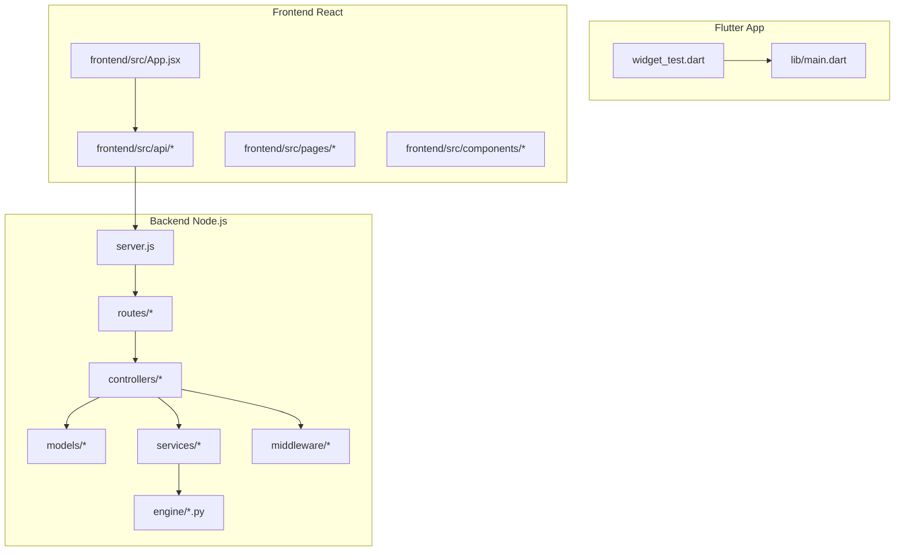
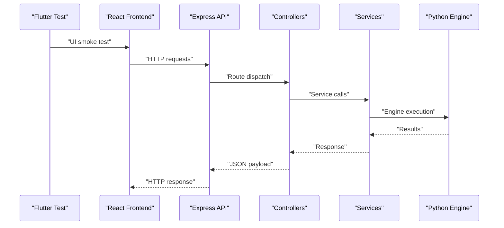
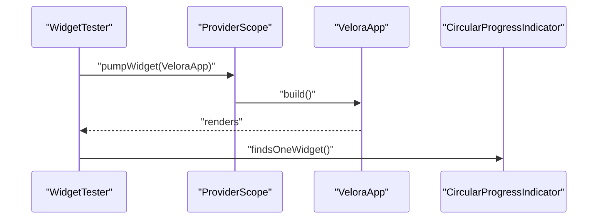
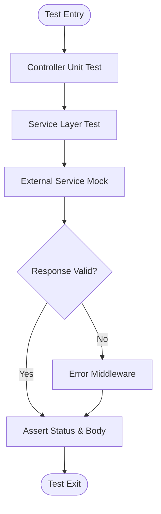
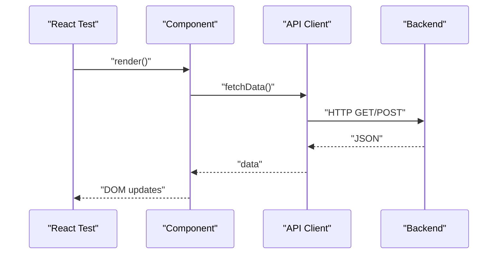
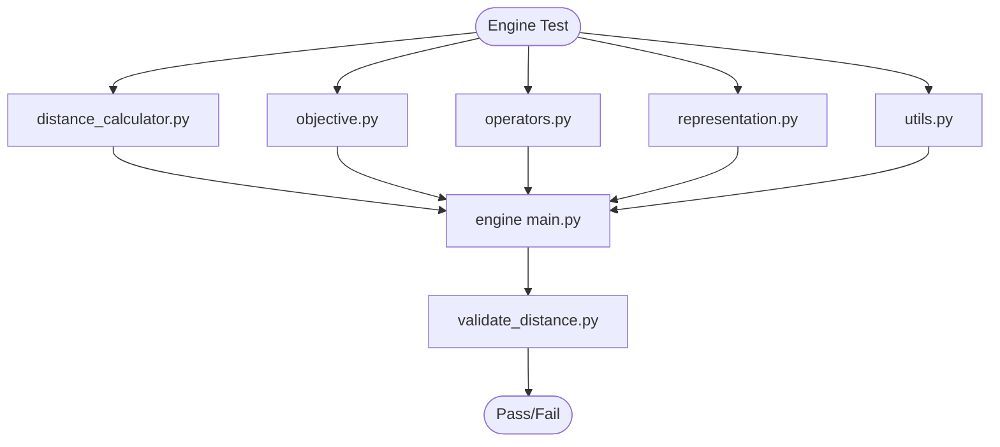
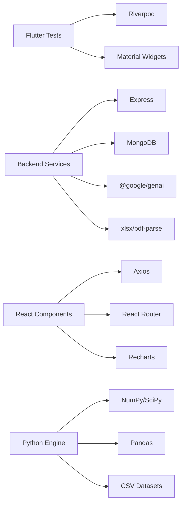

# Testing Strategy

<cite>
**Referenced Files in This Document**
- [widget_test.dart](file://test/widget_test.dart)
- [pubspec.yaml](file://pubspec.yaml)
- [server.js](file://backend/server.js)
- [package.json](file://backend/package.json)
- [geminiClient.js](file://backend/services/geminiClient.js)
- [engineRunner.js](file://backend/services/engineRunner.js)
- [solver.js](file://backend/services/solver.js)
- [main.py](file://backend/engine/main.py)
- [distance_calculator.py](file://backend/engine/distance_calculator.py)
- [objective.py](file://backend/engine/objective.py)
- [operators.py](file://backend/engine/operators.py)
- [representation.py](file://backend/engine/representation.py)
- [utils.py](file://backend/engine/utils.py)
- [validate_distance.py](file://backend/engine/validate_distance.py)
- [check_project.py](file://backend/check_project.py)
- [authController.js](file://backend/controllers/authController.js)
- [projectController.js](file://backend/controllers/projectController.js)
- [dashboardController.js](file://backend/controllers/dashboardController.js)
- [authRoutes.js](file://backend/routes/authRoutes.js)
- [projectRoutes.js](file://backend/routes/projectRoutes.js)
- [dashboardRoutes.js](file://backend/routes/dashboardRoutes.js)
- [authMiddleware.js](file://backend/middleware/authMiddleware.js)
- [errorMiddleware.js](file://backend/middleware/errorMiddleware.js)
- [uploadMiddleware.js](file://backend/middleware/uploadMiddleware.js)
- [db.js](file://backend/config/db.js)
- [User.js](file://backend/models/User.js)
- [Project.js](file://backend/models/Project.js)
- [Ride.js](file://backend/models/Ride.js)
- [Vehicle.js](file://backend/models/Vehicle.js)
- [llmParser.js](file://backend/services/llmParser.js)
- [artifactNormalizer.js](file://backend/services/artifactNormalizer.js)
- [api.js](file://frontend/src/api/api.js)
- [client.js](file://frontend/src/api/client.js)
- [App.jsx](file://frontend/src/App.jsx)
- [login.jsx](file://frontend/src/pages/auth/login.jsx)
- [Dashboard.jsx](file://frontend/src/pages/dashboard/Dashboard.jsx)
- [Project_Dashboard.jsx](file://frontend/src/pages/projects/Project_Dashboard.jsx)
- [MapBackground.jsx](file://frontend/src/components/background/MapBackground.jsx)
- [SideBar.jsx](file://frontend/src/components/sidebar/SideBar.jsx)
- [Logo.jsx](file://frontend/src/components/topbar/Logo.jsx)
</cite>

## Table of Contents
1. [Introduction](#introduction)
2. [Project Structure](#project-structure)
3. [Core Components](#core-components)
4. [Architecture Overview](#architecture-overview)
5. [Detailed Component Analysis](#detailed-component-analysis)
6. [Dependency Analysis](#dependency-analysis)
7. [Performance Considerations](#performance-considerations)
8. [Troubleshooting Guide](#troubleshooting-guide)
9. [Conclusion](#conclusion)
10. [Appendices](#appendices)

## Introduction
This document outlines a comprehensive testing strategy for the Route Optimization project, covering unit testing, integration testing, and performance testing across Flutter widgets, React components, Node.js backend services, and the Python optimization engine. It also documents testing frameworks, test organization patterns, continuous integration considerations, mock strategies for external services (Google Maps and Gemini AI), test data management, and automated testing workflows. The goal is to maintain robust test coverage and reliable behavior across all components.

## Project Structure
The project follows a multi-module layout:
- Flutter mobile application under the root lib/ and test/ directories
- Backend Node.js services under backend/
- Frontend React application under frontend/
- Shared models and engines under backend/engine/ and models/

**Diagram sources**
- [widget_test.dart](file://test/widget_test.dart#L1-L16)
- [server.js](file://backend/server.js#L1-L56)
- [authRoutes.js](file://backend/routes/authRoutes.js)
- [projectRoutes.js](file://backend/routes/projectRoutes.js)
- [dashboardRoutes.js](file://backend/routes/dashboardRoutes.js)
- [authController.js](file://backend/controllers/authController.js)
- [projectController.js](file://backend/controllers/projectController.js)
- [dashboardController.js](file://backend/controllers/dashboardController.js)
- [authMiddleware.js](file://backend/middleware/authMiddleware.js)
- [errorMiddleware.js](file://backend/middleware/errorMiddleware.js)
- [User.js](file://backend/models/User.js)
- [Project.js](file://backend/models/Project.js)
- [Ride.js](file://backend/models/Ride.js)
- [Vehicle.js](file://backend/models/Vehicle.js)
- [geminiClient.js](file://backend/services/geminiClient.js)
- [engineRunner.js](file://backend/services/engineRunner.js)
- [solver.js](file://backend/services/solver.js)
- [main.py](file://backend/engine/main.py)
- [distance_calculator.py](file://backend/engine/distance_calculator.py)
- [api.js](file://frontend/src/api/api.js)
- [client.js](file://frontend/src/api/client.js)
- [App.jsx](file://frontend/src/App.jsx)

**Section sources**
- [widget_test.dart](file://test/widget_test.dart#L1-L16)
- [pubspec.yaml](file://pubspec.yaml#L70-L80)
- [server.js](file://backend/server.js#L1-L56)
- [frontend/package.json](file://frontend/package.json#L1-L48)
- [backend/package.json](file://backend/package.json#L1-L28)

## Core Components
- Flutter widget tests use flutter_test and Riverpod ProviderScope to initialize the app and assert initial UI state.
- Backend services include route handlers, controllers, middleware, and specialized services for Gemini AI and the optimization engine.
- Frontend React components integrate with API clients and expose pages and UI components for testing.
- Python engine provides core optimization logic and utilities for distance calculation, objective evaluation, operators, representation, and validation.

**Section sources**
- [widget_test.dart](file://test/widget_test.dart#L6-L14)
- [pubspec.yaml](file://pubspec.yaml#L38-L60)
- [server.js](file://backend/server.js#L17-L51)
- [frontend/package.json](file://frontend/package.json#L12-L29)

## Architecture Overview
The testing architecture spans:
- Flutter: Widget tests for UI initialization and rendering
- Backend: Unit/integration tests for controllers, services, and routes; middleware validation
- Frontend: Component and integration tests via API clients
- Engine: Unit tests for Python modules and end-to-end pipeline runs

**Diagram sources**
- [widget_test.dart](file://test/widget_test.dart#L6-L14)
- [server.js](file://backend/server.js#L46-L48)
- [authController.js](file://backend/controllers/authController.js)
- [projectController.js](file://backend/controllers/projectController.js)
- [dashboardController.js](file://backend/controllers/dashboardController.js)
- [geminiClient.js](file://backend/services/geminiClient.js)
- [engineRunner.js](file://backend/services/engineRunner.js)
- [main.py](file://backend/engine/main.py)

## Detailed Component Analysis

### Flutter Widget Testing
- Purpose: Smoke test app initialization and verify initial UI state.
- Strategy: Use ProviderScope to wrap the app under test; pump the widget tree; assert presence of a loading indicator during initial auth state.
- Mocking: No external service mocking required for this smoke test; focus on UI rendering and provider setup.

**Diagram sources**
- [widget_test.dart](file://test/widget_test.dart#L6-L14)

**Section sources**
- [widget_test.dart](file://test/widget_test.dart#L6-L14)
- [pubspec.yaml](file://pubspec.yaml#L70-L80)

### Backend Node.js Services Testing
- Controllers: Unit test request handling, parameter validation, and response construction.
- Services: Isolate business logic (Gemini client, engine runner, LLM parser, artifact normalizer) and test with mocks for external APIs.
- Middleware: Validate auth and error middleware behavior under various scenarios.
- Routes: Integration test endpoint reachability and CORS configuration.

**Diagram sources**
- [authController.js](file://backend/controllers/authController.js)
- [projectController.js](file://backend/controllers/projectController.js)
- [dashboardController.js](file://backend/controllers/dashboardController.js)
- [geminiClient.js](file://backend/services/geminiClient.js)
- [engineRunner.js](file://backend/services/engineRunner.js)
- [llmParser.js](file://backend/services/llmParser.js)
- [artifactNormalizer.js](file://backend/services/artifactNormalizer.js)
- [authMiddleware.js](file://backend/middleware/authMiddleware.js)
- [errorMiddleware.js](file://backend/middleware/errorMiddleware.js)

**Section sources**
- [server.js](file://backend/server.js#L26-L41)
- [authRoutes.js](file://backend/routes/authRoutes.js)
- [projectRoutes.js](file://backend/routes/projectRoutes.js)
- [dashboardRoutes.js](file://backend/routes/dashboardRoutes.js)
- [authMiddleware.js](file://backend/middleware/authMiddleware.js)
- [errorMiddleware.js](file://backend/middleware/errorMiddleware.js)
- [uploadMiddleware.js](file://backend/middleware/uploadMiddleware.js)

### Frontend React Components Testing
- Component tests: Render components in isolation and assert DOM structure and props.
- Page tests: Simulate navigation and user interactions; verify data fetching via API client.
- API client tests: Validate request construction, headers, and response parsing.

**Diagram sources**
- [login.jsx](file://frontend/src/pages/auth/login.jsx)
- [Dashboard.jsx](file://frontend/src/pages/dashboard/Dashboard.jsx)
- [Project_Dashboard.jsx](file://frontend/src/pages/projects/Project_Dashboard.jsx)
- [MapBackground.jsx](file://frontend/src/components/background/MapBackground.jsx)
- [SideBar.jsx](file://frontend/src/components/sidebar/SideBar.jsx)
- [Logo.jsx](file://frontend/src/components/topbar/Logo.jsx)
- [api.js](file://frontend/src/api/api.js)
- [client.js](file://frontend/src/api/client.js)
- [App.jsx](file://frontend/src/App.jsx)

**Section sources**
- [frontend/package.json](file://frontend/package.json#L12-L29)
- [App.jsx](file://frontend/src/App.jsx)
- [login.jsx](file://frontend/src/pages/auth/login.jsx)
- [Dashboard.jsx](file://frontend/src/pages/dashboard/Dashboard.jsx)
- [Project_Dashboard.jsx](file://frontend/src/pages/projects/Project_Dashboard.jsx)

### Python Optimization Engine Testing
- Module-level unit tests: Validate distance calculator, objective computation, operators, representation, and utilities.
- Pipeline integration tests: Run end-to-end engine with provided test cases and compare outputs against expected baselines.
- Validation tests: Ensure distance constraints and feasibility checks pass.

**Diagram sources**
- [main.py](file://backend/engine/main.py)
- [distance_calculator.py](file://backend/engine/distance_calculator.py)
- [objective.py](file://backend/engine/objective.py)
- [operators.py](file://backend/engine/operators.py)
- [representation.py](file://backend/engine/representation.py)
- [utils.py](file://backend/engine/utils.py)
- [validate_distance.py](file://backend/engine/validate_distance.py)

**Section sources**
- [main.py](file://backend/engine/main.py)
- [distance_calculator.py](file://backend/engine/distance_calculator.py)
- [objective.py](file://backend/engine/objective.py)
- [operators.py](file://backend/engine/operators.py)
- [representation.py](file://backend/engine/representation.py)
- [utils.py](file://backend/engine/utils.py)
- [validate_distance.py](file://backend/engine/validate_distance.py)
- [check_project.py](file://backend/check_project.py)

## Dependency Analysis
- Flutter depends on Riverpod for state management and uses flutter_test for widget tests.
- Backend depends on Express, middleware stack, and MongoDB connection; routes depend on controllers and services.
- Frontend depends on Axios and React ecosystem; API client encapsulates HTTP interactions.
- Engine depends on Python modules and CSV datasets for test cases.

**Diagram sources**
- [pubspec.yaml](file://pubspec.yaml#L38-L60)
- [backend/package.json](file://backend/package.json#L9-L23)
- [frontend/package.json](file://frontend/package.json#L12-L29)

**Section sources**
- [pubspec.yaml](file://pubspec.yaml#L38-L60)
- [backend/package.json](file://backend/package.json#L9-L23)
- [frontend/package.json](file://frontend/package.json#L12-L29)

## Performance Considerations
- Backend API performance:
  - Enable compression and limit payload sizes as configured.
  - Use database indexing and aggregation pipelines for analytics endpoints.
  - Monitor slow queries and cache frequent reads.
- Flutter performance:
  - Avoid heavy computations in build methods; precompute where possible.
  - Use virtualized lists and lazy loading for large datasets.
- Python engine performance:
  - Optimize distance calculations and objective evaluations.
  - Use vectorized operations and efficient data structures.
  - Profile memory usage and avoid unnecessary copies.

[No sources needed since this section provides general guidance]

## Troubleshooting Guide
- CORS errors: Verify allowed origins and credentials configuration in the server.
- Authentication failures: Check JWT middleware and token validity.
- Upload issues: Confirm upload directory existence and permissions.
- Database connectivity: Validate connection string and environment variables.
- External service failures: Implement retries and circuit breakers for Gemini and Google Maps.

**Section sources**
- [server.js](file://backend/server.js#L26-L41)
- [authMiddleware.js](file://backend/middleware/authMiddleware.js)
- [errorMiddleware.js](file://backend/middleware/errorMiddleware.js)
- [uploadMiddleware.js](file://backend/middleware/uploadMiddleware.js)
- [db.js](file://backend/config/db.js)

## Conclusion
This testing strategy establishes a layered approach across Flutter, React, Node.js, and Python components. By combining widget tests, controller/service tests, API integration tests, and engine unit/integration tests, the project can maintain high reliability and performance. Mock strategies for external services, structured test data management, and CI-ready scripts will ensure consistent automated testing across environments.

[No sources needed since this section summarizes without analyzing specific files]

## Appendices

### Testing Frameworks and Organization
- Flutter: flutter_test with ProviderScope for stateful widget tests.
- Backend: Jest or Mocha/Chai for Node.js tests; Supertest for HTTP assertions.
- Frontend: React Testing Library with Jest for component and integration tests.
- Engine: pytest for Python modules; unittest for validation scripts.

**Section sources**
- [widget_test.dart](file://test/widget_test.dart#L1-L16)
- [pubspec.yaml](file://pubspec.yaml#L70-L80)
- [frontend/package.json](file://frontend/package.json#L30-L47)
- [backend/package.json](file://backend/package.json#L24-L26)

### Mock Strategies for External Services
- Google Maps:
  - Frontend: Mock map libraries and tile providers in tests.
  - Backend: Stub geocoding and distance matrix endpoints with static responses.
- Gemini AI:
  - Backend: Mock @google/genai client to return predefined responses and simulate rate limits.

**Section sources**
- [frontend/package.json](file://frontend/package.json#L13-L14)
- [backend/package.json](file://backend/package.json#L10)
- [geminiClient.js](file://backend/services/geminiClient.js)

### Test Data Management
- Backend engine test cases are organized under engine/testcase*/ with CSV datasets.
- Use fixtures for authentication tokens and project artifacts.
- Normalize test data using artifactNormalizer service.

**Section sources**
- [main.py](file://backend/engine/main.py)
- [artifactNormalizer.js](file://backend/services/artifactNormalizer.js)

### Automated Testing Workflows
- CI setup:
  - Backend: Install dependencies, run lint, unit tests, and integration tests.
  - Frontend: Install dependencies, lint, build, and run component tests.
  - Flutter: Install dependencies, run widget tests.
  - Engine: Install Python dependencies, run pytest and validation scripts.
- Environment variables:
  - Use .env files for backend and Flutter dotenv configuration.

**Section sources**
- [backend/package.json](file://backend/package.json#L5-L8)
- [frontend/package.json](file://frontend/package.json#L6-L11)
- [pubspec.yaml](file://pubspec.yaml#L60-L61)
- [.env](file://backend/.env)
- [.env](file://assets/.env)