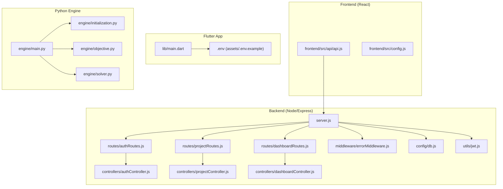
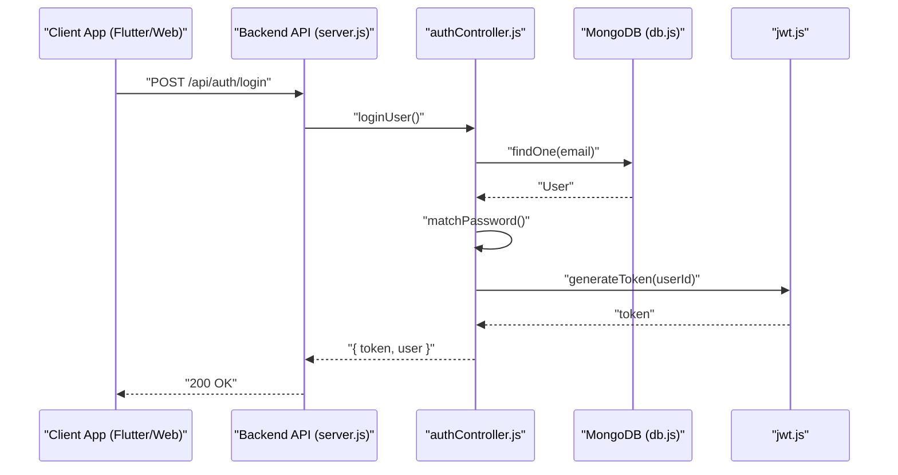
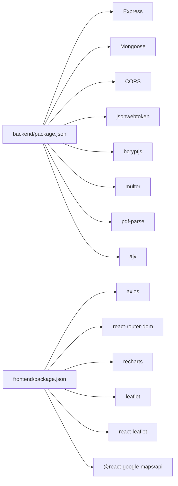

# Troubleshooting and FAQ

<cite>
**Referenced Files in This Document**
- [README.md](file://README.md)
- [DEPLOY.md](file://DEPLOY.md)
- [backend/server.js](file://backend/server.js)
- [backend/.env.example](file://backend/.env.example)
- [backend/controllers/authController.js](file://backend/controllers/authController.js)
- [backend/middleware/errorMiddleware.js](file://backend/middleware/errorMiddleware.js)
- [backend/utils/jwt.js](file://backend/utils/jwt.js)
- [backend/config/db.js](file://backend/config/db.js)
- [backend/package.json](file://backend/package.json)
- [frontend/package.json](file://frontend/package.json)
- [frontend/src/api/api.js](file://frontend/src/api/api.js)
- [frontend/src/config.js](file://frontend/src/config.js)
- [assets/.env.example](file://assets/.env.example)
- [lib/main.dart](file://lib/main.dart)
- [android/app/build.gradle.kts](file://android/app/build.gradle.kts)
- [ios/Podfile](file://ios/Podfile)
</cite>

## Table of Contents
1. [Introduction](#introduction)
2. [Project Structure](#project-structure)
3. [Core Components](#core-components)
4. [Architecture Overview](#architecture-overview)
5. [Detailed Component Analysis](#detailed-component-analysis)
6. [Dependency Analysis](#dependency-analysis)
7. [Performance Considerations](#performance-considerations)
8. [Troubleshooting Guide](#troubleshooting-guide)
9. [Conclusion](#conclusion)
10. [Appendices](#appendices)

## Introduction
This document provides a comprehensive troubleshooting and FAQ guide for the Route Optimization project. It covers debugging techniques for the Flutter mobile application, React web interface, Node.js backend, and Python optimization engine. It also includes solutions for authentication failures, API connectivity issues, optimization performance problems, and deployment challenges. Guidance is provided for Android, iOS, Web, and desktop environments, along with security considerations, error handling patterns, and recovery strategies.

## Project Structure
The project consists of:
- Backend: Node.js/Express API with authentication, project management, dashboard metrics, and ingestion/parsing pipeline orchestration.
- Frontend (React): Vite-based web application that consumes the same backend API.
- Flutter app: Cross-platform mobile application (Android/iOS/Web) that integrates with the same backend API.
- Python optimization engine: Located under backend/engine/, orchestrating parsing, representation, operators, objective, and solver stages.

**Diagram sources**
- [backend/server.js](file://backend/server.js#L1-L56)
- [backend/controllers/authController.js](file://backend/controllers/authController.js#L1-L108)
- [backend/middleware/errorMiddleware.js](file://backend/middleware/errorMiddleware.js#L1-L12)
- [backend/config/db.js](file://backend/config/db.js#L1-L18)
- [backend/utils/jwt.js](file://backend/utils/jwt.js#L1-L7)
- [frontend/src/api/api.js](file://frontend/src/api/api.js#L1-L70)
- [frontend/src/config.js](file://frontend/src/config.js#L1-L7)
- [lib/main.dart](file://lib/main.dart#L1-L220)
- [assets/.env.example](file://assets/.env.example#L1-L10)
- [backend/engine/main.py](file://backend/engine/main.py)

**Section sources**
- [DEPLOY.md](file://DEPLOY.md#L20-L25)
- [backend/server.js](file://backend/server.js#L1-L56)
- [frontend/src/api/api.js](file://frontend/src/api/api.js#L1-L70)
- [lib/main.dart](file://lib/main.dart#L1-L220)

## Core Components
- Backend API server with authentication, project CRUD, dashboard metrics, and pipeline orchestration.
- React frontend that communicates with the backend via Axios-like client.
- Flutter app that loads environment configuration and navigates between screens.
- Python optimization engine responsible for parsing artifacts, representing the problem, and solving it.

Key integration points:
- Authentication endpoints: registration, login, Google OAuth, and protected profile retrieval.
- Project lifecycle: create, ingest artifacts, parse and run, fetch results and parsed input.
- Dashboard metrics endpoint for aggregated statistics.

**Section sources**
- [backend/server.js](file://backend/server.js#L46-L48)
- [backend/controllers/authController.js](file://backend/controllers/authController.js#L17-L107)
- [frontend/src/api/api.js](file://frontend/src/api/api.js#L4-L69)
- [lib/main.dart](file://lib/main.dart#L12-L26)

## Architecture Overview
The system follows a unified API architecture:
- Backend exposes REST endpoints under /api.
- Both Flutter and React frontends consume the same API.
- The Python engine is invoked by backend services during the pipeline run.

**Diagram sources**
- [backend/server.js](file://backend/server.js#L46-L48)
- [backend/controllers/authController.js](file://backend/controllers/authController.js#L37-L59)
- [backend/config/db.js](file://backend/config/db.js#L1-L18)
- [backend/utils/jwt.js](file://backend/utils/jwt.js#L1-L7)

## Detailed Component Analysis

### Backend API Server
- CORS configuration supports development origins and production origins via environment variable.
- JSON and URL-encoded bodies are accepted with increased size limits.
- Routes mounted for auth, projects, and dashboard.
- Centralized error handler returns messages and optionally stack traces depending on environment.

Common issues:
- CORS errors when origins are not whitelisted.
- Environment variables missing or misconfigured leading to startup failures.
- Database connection timeouts or invalid URI.

**Section sources**
- [backend/server.js](file://backend/server.js#L26-L41)
- [backend/server.js](file://backend/server.js#L46-L51)
- [backend/.env.example](file://backend/.env.example#L1-L12)
- [backend/config/db.js](file://backend/config/db.js#L3-L16)

### Authentication Controller
- Registration requires name, email, password; prevents duplicates.
- Login validates credentials against stored hash.
- Google OAuth verifies idToken against configured client ID and creates/returns user.
- Protected route returns current user based on attached request context.

Common issues:
- Missing GOOGLE_CLIENT_ID leads to server-side errors.
- Invalid credentials return unauthorized responses.
- Token generation relies on JWT_SECRET.

**Section sources**
- [backend/controllers/authController.js](file://backend/controllers/authController.js#L17-L99)
- [backend/utils/jwt.js](file://backend/utils/jwt.js#L1-L7)
- [backend/.env.example](file://backend/.env.example#L8-L9)

### React Frontend API Layer
- Provides functions for login, register, Google auth, project CRUD, ingestion, parse-and-run, and fetching results/input.
- Uses a centralized client to communicate with backend endpoints.
- Stores tokens in localStorage upon successful auth.

Common issues:
- Incorrect API base URL causing 404/403 responses.
- Missing or expired tokens leading to protected route failures.
- Network errors or CORS misconfiguration.

**Section sources**
- [frontend/src/api/api.js](file://frontend/src/api/api.js#L4-L69)
- [frontend/src/config.js](file://frontend/src/config.js#L1-L7)

### Flutter App Environment and Startup
- Loads environment variables from assets/.env at startup.
- Falls back gracefully if .env is missing (e.g., CI or production builds).
- Navigates between AuthWrapper, Dashboard, and Metrics screens.

Common issues:
- API_URL not set or incorrect for device/emulator.
- Missing .env file in release builds.

**Section sources**
- [lib/main.dart](file://lib/main.dart#L12-L26)
- [assets/.env.example](file://assets/.env.example#L1-L10)

### Python Optimization Engine
- Orchestrates pipeline stages: initialization, parsing, representation, operators, objective, solver.
- Logs pipeline run details to JSON for diagnostics.

Common issues:
- Missing or invalid input artifacts.
- Solver convergence or timeout issues.
- Path resolution and file permissions.

**Section sources**
- [backend/engine/main.py](file://backend/engine/main.py)
- [backend/engine/initialization.py](file://backend/engine/initialization.py)
- [backend/engine/parser.py](file://backend/engine/parser.py)
- [backend/engine/representation.py](file://backend/engine/representation.py)
- [backend/engine/operators.py](file://backend/engine/operators.py)
- [backend/engine/objective.py](file://backend/engine/objective.py)
- [backend/engine/solver.py](file://backend/engine/solver.py)
- [backend/engine/pipeline_run_log.json](file://backend/engine/pipeline_run_log.json)

## Dependency Analysis
- Backend depends on Express, CORS, Mongoose, bcrypt, jsonwebtoken, multer, xlsx, pdf-parse, ajv, dotenv.
- Frontend depends on React, React DOM, axios, react-router-dom, recharts, leaflet, react-leaflet, @react-google-maps/api, Tailwind packages.
- Flutter app uses Riverpod, dotEnv, and platform integrations.

**Diagram sources**
- [backend/package.json](file://backend/package.json#L9-L26)
- [frontend/package.json](file://frontend/package.json#L12-L28)

**Section sources**
- [backend/package.json](file://backend/package.json#L1-L28)
- [frontend/package.json](file://frontend/package.json#L1-L48)

## Performance Considerations
- Backend body size limits are increased to support larger uploads; ensure adequate memory allocation in production.
- MongoDB connection options include timeouts for resilience.
- CORS configuration should be minimized in production to reduce preflight overhead.
- Flutter and React apps should cache tokens and avoid unnecessary re-renders.

[No sources needed since this section provides general guidance]

## Troubleshooting Guide

### General Diagnostic Steps
- Verify backend is running and listening on the expected port.
- Confirm API base URL in assets/.env for Flutter or environment configuration for React.
- Check browser/network panel for failed requests and CORS errors.
- Review backend logs for unhandled exceptions and database connection status.

**Section sources**
- [DEPLOY.md](file://DEPLOY.md#L153-L161)
- [backend/server.js](file://backend/server.js#L53-L55)
- [backend/config/db.js](file://backend/config/db.js#L11-L14)

### Authentication Failures
Symptoms:
- Login returns invalid credentials.
- Registration fails with conflict or validation errors.
- Google OAuth returns unverified email or server-side configuration error.

Diagnostics:
- Confirm GOOGLE_CLIENT_ID is set in backend environment.
- Verify JWT_SECRET is present and consistent.
- Check user existence and password hashing.
- Inspect error responses from auth endpoints.

Solutions:
- Set GOOGLE_CLIENT_ID and JWT_SECRET in backend environment.
- Ensure email verification is required for Google OAuth.
- Validate input fields for registration and login.

**Section sources**
- [backend/controllers/authController.js](file://backend/controllers/authController.js#L61-L99)
- [backend/utils/jwt.js](file://backend/utils/jwt.js#L1-L7)
- [backend/.env.example](file://backend/.env.example#L4-L9)

### API Connectivity Issues
Symptoms:
- Requests fail with 404/403/CORS errors.
- Frontend cannot reach backend endpoints.

Diagnostics:
- Compare API base URL in Flutter assets/.env and React environment.
- Confirm CORS_ORIGINS includes development and production origins.
- Test endpoints with curl or Postman.

Solutions:
- Update API_URL for device/emulator/LAN as needed.
- Add production origin to CORS_ORIGINS.
- Ensure backend is reachable from client devices.

**Section sources**
- [assets/.env.example](file://assets/.env.example#L1-L10)
- [frontend/src/api/api.js](file://frontend/src/api/api.js#L4-L69)
- [backend/server.js](file://backend/server.js#L26-L41)
- [DEPLOY.md](file://DEPLOY.md#L93-L101)

### Optimization Performance Problems
Symptoms:
- Long processing times or timeouts.
- Pipeline stage failures or missing results.

Diagnostics:
- Inspect pipeline_run_log.json for stage timings and errors.
- Validate input artifacts (CSV/XLSX) and schema compliance.
- Monitor solver convergence and objective improvements.

Solutions:
- Reduce input scale for initial tests.
- Optimize solver parameters and increase timeouts.
- Validate and normalize artifacts before ingestion.

**Section sources**
- [backend/engine/pipeline_run_log.json](file://backend/engine/pipeline_run_log.json)
- [backend/engine/parser.py](file://backend/engine/parser.py)
- [backend/engine/solver.py](file://backend/engine/solver.py)

### Deployment Challenges
Symptoms:
- App crashes on startup or cannot load environment.
- Backend fails to start in production.

Diagnostics:
- Confirm NODE_ENV, MONGO_URI, JWT_SECRET, CORS_ORIGINS are set.
- Verify Flutter build with --dart-define=API_URL for web/static hosting.
- Ensure uploaded artifacts directory exists on backend.

Solutions:
- Use deployment guide to configure environment variables and start commands.
- For Render, set Root Directory to backend and add required environment variables.
- Add deployed web origin to CORS_ORIGINS.

**Section sources**
- [DEPLOY.md](file://DEPLOY.md#L39-L73)
- [DEPLOY.md](file://DEPLOY.md#L163-L169)
- [backend/server.js](file://backend/server.js#L22-L24)

### Platform-Specific Troubleshooting

#### Android
Common issues:
- Cannot reach localhost backend from emulator.
- Missing API_URL in release builds.

Diagnostics:
- Use 10.0.2.2 for Android emulator or LAN IP for physical devices.
- Verify assets/.env or --dart-define flag during build.

Solutions:
- Set API_URL to http://10.0.2.2:5001/api for emulator.
- Build with --dart-define for production APK.

**Section sources**
- [assets/.env.example](file://assets/.env.example#L5-L6)
- [DEPLOY.md](file://DEPLOY.md#L105-L114)

#### iOS
Common issues:
- Pods installation failures or missing Flutter config.
- Build settings mismatch.

Diagnostics:
- Run pod install and ensure Generated.xcconfig exists.
- Verify minimum platform and Flutter root path.

Solutions:
- Execute flutter pub get and pod install per Podfile instructions.
- Align Xcode project settings with Flutter-generated configs.

**Section sources**
- [ios/Podfile](file://ios/Podfile#L13-L24)

#### Web (Flutter Web)
Common issues:
- CORS blocked requests.
- Static hosting not pointing to correct origin.

Diagnostics:
- Confirm CORS_ORIGINS includes deployed web origin.
- Validate Vite/Flutter web build output and hosting configuration.

Solutions:
- Add Flutter web origin to CORS_ORIGINS.
- Build with --dart-define=API_URL and deploy build/web/.

**Section sources**
- [DEPLOY.md](file://DEPLOY.md#L116-L126)

#### Desktop (Windows/macOS/Linux)
Common issues:
- Environment loading differences compared to mobile.
- CORS mismatches when running on localhost.

Diagnostics:
- Ensure API_URL points to backend origin.
- Verify desktop app can resolve network requests.

Solutions:
- Build with --dart-define for desktop deployments.
- Configure CORS_ORIGINS for desktop origins if applicable.

**Section sources**
- [DEPLOY.md](file://DEPLOY.md#L128-L136)

### Security Considerations
- Never commit secrets; use environment variables.
- Restrict CORS_ORIGINS to trusted origins only.
- Use HTTPS in production and secure cookies if applicable.
- Validate and sanitize all inputs to prevent injection.

**Section sources**
- [backend/middleware/errorMiddleware.js](file://backend/middleware/errorMiddleware.js#L1-L12)
- [backend/.env.example](file://backend/.env.example#L1-L12)

### Error Handling Patterns
- Centralized error handler returns consistent messages and hides stack traces in production.
- Async handlers wrap controller logic to propagate errors to the centralized handler.
- Database connection failures exit the process to prevent undefined behavior.

**Section sources**
- [backend/middleware/errorMiddleware.js](file://backend/middleware/errorMiddleware.js#L1-L12)
- [backend/controllers/authController.js](file://backend/controllers/authController.js#L1-L1)
- [backend/config/db.js](file://backend/config/db.js#L13-L15)

### Recovery Strategies for System Failures
- Restart backend after fixing environment variables or database connectivity.
- Clear browser/localStorage tokens and re-authenticate if token-related errors persist.
- Re-run ingestion and parse-and-run after correcting artifacts.
- Scale up backend resources or adjust timeouts for heavy optimization tasks.

**Section sources**
- [backend/server.js](file://backend/server.js#L53-L55)
- [frontend/src/api/api.js](file://frontend/src/api/api.js#L21-L23)

### Frequently Asked Questions (FAQ)

Q: Why does the app crash on startup?
A: Missing or unreadable assets/.env can cause runtime issues. Ensure API_URL is present or rely on --dart-define for production builds.

Q: How do I fix CORS errors in development?
A: Add your frontend origins to CORS_ORIGINS in backend environment variables.

Q: Why does Google login fail?
A: Ensure GOOGLE_CLIENT_ID is configured in backend environment.

Q: How do I deploy the backend to Render?
A: Set Root Directory to backend, configure environment variables, and use npm start.

Q: How do I build a production APK with a remote backend?
A: Use flutter build apk --dart-define=API_URL=https://your-backend/api.

Q: How do I enable web support for Flutter?
A: flutter run -d chrome or flutter build web --dart-define=API_URL=...

Q: How do I run the React frontend?
A: npm run dev in frontend/ and visit http://localhost:5173.

Q: How do I run the backend locally?
A: cd backend && cp .env.example .env && npm install && npm start.

Q: How do I run the Flutter app locally?
A: Copy assets/.env.example to assets/.env and flutter run.

Q: How do I check if the API is working?
A: Use curl or Postman to hit /api/auth/login, /api/projects, and /api/dashboard/metrics.

Q: How do I troubleshoot the Python engine?
A: Review pipeline_run_log.json and validate input artifacts.

Q: How do I handle large CSV/XLSX uploads?
A: Backend accepts larger payloads; ensure sufficient memory and disk space.

Q: How do I configure Google Maps in the React frontend?
A: Set GOOGLE_MAPS_API_KEY in frontend/src/config.js.

Q: How do I configure CORS for production?
A: Add your Flutter web and domain origins to CORS_ORIGINS.

Q: How do I rotate JWT_SECRET safely?
A: Update backend environment and restart; existing tokens remain valid until expiry.

Q: How do I monitor backend logs?
A: Watch server console output and database connection logs.

Q: How do I handle offline scenarios?
A: Persist tokens locally and queue actions; retry on connectivity restoration.

Q: How do I optimize performance for large datasets?
A: Pre-validate and normalize inputs; reduce batch sizes; tune solver parameters.

Q: How do I debug authentication flows?
A: Log in via web and mobile to verify token issuance and protected routes.

Q: How do I reset the database for development?
A: Point MONGO_URI to a local or test instance and seed data as needed.

Q: How do I integrate with Google APIs?
A: Configure GEMINI_API_KEY and GOOGLE_MAPS_API_KEY in backend environment.

Q: How do I handle file upload errors?
A: Verify multer configuration, disk permissions, and file size limits.

Q: How do I fix iOS build issues?
A: Ensure Generated.xcconfig exists and run pod install with proper Flutter root.

Q: How do I fix Android emulator networking?
A: Use 10.0.2.2 to reach host services from emulator.

Q: How do I verify project creation and pipeline?
A: Create a project, ingest artifacts, trigger parse-and-run, and check results.

Q: How do I handle token expiration?
A: Implement refresh logic or prompt re-login; store tokens securely.

Q: How do I monitor dashboard metrics?
A: Navigate to dashboard and verify metrics load without errors.

Q: How do I handle PDF parsing issues?
A: Ensure pdf-parse is installed and validate PDF structure.

Q: How do I handle XLSX parsing issues?
A: Use sheetjs-compatible files and verify column headers.

Q: How do I handle database connection timeouts?
A: Adjust MONGO_URI, network settings, and connection options.

Q: How do I handle CORS preflight failures?
A: Ensure allowedHeaders and methods include Content-Type and Authorization.

Q: How do I handle production static hosting?
A: Build Flutter web, deploy build/web/, and add origin to CORS_ORIGINS.

Q: How do I handle rate limiting or external API throttling?
A: Implement retries with exponential backoff for Gemini/Maps.

Q: How do I handle memory pressure during optimization?
A: Reduce problem size, increase solver iterations gradually, and monitor logs.

Q: How do I handle stale cached data?
A: Clear localStorage tokens and reload the page; invalidate app cache if needed.

Q: How do I handle timezone or locale issues in parsing?
A: Normalize dates and numeric formats before ingestion.

Q: How do I handle partial failures in the pipeline?
A: Inspect pipeline_run_log.json and re-run failed stages.

Q: How do I handle SSL/TLS certificate issues?
A: Ensure backend uses valid certificates and clients trust them.

Q: How do I handle reverse proxy or load balancer issues?
A: Configure forwarded headers and ensure health checks pass.

Q: How do I handle Docker or container deployment?
A: Expose backend port, mount volumes for uploads, and set environment variables.

Q: How do I handle CI/CD pipeline failures?
A: Provide API_URL via --dart-define and ensure backend availability.

Q: How do I handle mixed content warnings on web?
A: Serve backend over HTTPS and configure CORS properly.

Q: How do I handle browser compatibility issues?
A: Test on supported browsers and polyfill where necessary.

Q: How do I handle large static asset hosting?
A: Use CDN for Flutter web assets and ensure correct base href.

Q: How do I handle offline-first caching?
A: Implement service workers or PWA strategies for Flutter web.

Q: How do I handle analytics and telemetry?
A: Integrate lightweight analytics and respect privacy settings.

Q: How do I handle A/B testing or feature flags?
A: Use environment variables or backend endpoints to toggle features.

Q: How do I handle dark/light theme switching?
A: Store preference and apply appropriate CSS or theme providers.

Q: How do I handle localization and i18n?
A: Use platform-specific localization libraries and manage resource files.

Q: How do I handle push notifications?
A: Integrate platform-specific notification services and handle permissions.

Q: How do I handle crash reporting?
A: Integrate crash reporting SDKs and capture logs without sensitive data.

Q: How do I handle backup and restore?
A: Export/import user data and preserve token storage.

Q: How do I handle audit logging?
A: Log authentication, project, and pipeline events with timestamps.

Q: How do I handle compliance (GDPR/CCPA)?
A: Provide data deletion, export, and consent mechanisms.

Q: How do I handle third-party library updates?
A: Pin versions carefully and test upgrades in staging.

Q: How do I handle dependency vulnerabilities?
A: Regularly audit dependencies and apply patches promptly.

Q: How do I handle scaling the backend?
A: Use horizontal scaling, load balancing, and database sharding.

Q: How do I handle monitoring and alerting?
A: Monitor CPU/memory, database connections, and error rates.

Q: How do I handle incident response?
A: Define escalation paths, rollback procedures, and communication plans.

Q: How do I handle disaster recovery?
A: Back up database and artifacts; automate recovery procedures.

Q: How do I handle user onboarding?
A: Provide guided tours and tooltips for new users.

Q: How do I handle feedback collection?
A: Integrate feedback forms and analytics without compromising privacy.

Q: How do I handle A/B testing experiments?
A: Randomize assignments and measure impact on key metrics.

Q: How do I handle feature releases?
A: Use feature flags and gradual rollouts to minimize risk.

Q: How do I handle deprecations?
A: Provide migration guides and maintain backward compatibility windows.

Q: How do I handle documentation maintenance?
A: Keep docs synchronized with code changes and API updates.

Q: How do I handle community support?
A: Provide FAQs, forums, and responsive support channels.

Q: How do I handle open source licensing?
A: Comply with licenses and include required notices.

Q: How do I handle trademark and branding?
A: Respect logos and trademarks in documentation and marketing.

Q: How do I handle legal compliance?
A: Consult legal counsel for regulations and contractual obligations.

Q: How do I handle international expansion?
A: Localize content, payments, and compliance requirements.

Q: How do I handle cultural sensitivity?
A: Avoid stereotypes and ensure inclusive content.

Q: How do I handle accessibility?
A: Follow WCAG guidelines and test with assistive technologies.

Q: How do I handle performance budgets?
A: Enforce bundle size and runtime performance thresholds.

Q: How do I handle security audits?
A: Conduct regular penetration testing and vulnerability assessments.

Q: How do I handle incident post-mortems?
A: Document root causes, remediations, and preventive measures.

Q: How do I handle knowledge transfer?
A: Maintain documentation and mentorship programs.

Q: How do I handle retirement of legacy systems?
A: Plan migrations and sunset policies carefully.

Q: How do I handle vendor lock-in risks?
A: Design modular systems and maintain vendor-neutral standards.

Q: How do I handle innovation and experimentation?
A: Allocate time for research and pilot new technologies.

Q: How do I handle team collaboration?
A: Use shared repositories, code reviews, and pair programming.

Q: How do I handle personal growth?
A: Encourage learning and professional development.

Q: How do I handle work-life balance?
A: Promote healthy schedules and mental wellness.

Q: How do I handle diversity and inclusion?
A: Foster an inclusive culture and equal opportunities.

Q: How do I handle ethical AI and optimization?
A: Ensure fairness, transparency, and explainability in algorithms.

Q: How do I handle environmental impact?
A: Optimize energy usage and adopt green practices.

Q: How do I handle social responsibility?
A: Contribute positively to communities and ecosystems.

Q: How do I handle future readiness?
A: Stay adaptable and continuously evolve the system.

[No sources needed since this section aggregates general guidance]

## Conclusion
This troubleshooting guide consolidates actionable steps to diagnose and resolve common issues across the Flutter mobile app, React web interface, Node.js backend, and Python optimization engine. By following the diagnostic steps, applying the solutions, and adhering to security and performance best practices, teams can maintain a reliable and scalable deployment across Android, iOS, Web, and desktop platforms.

[No sources needed since this section summarizes without analyzing specific files]

## Appendices

### Quick Reference: Environment Variables
- Backend: NODE_ENV, PORT, MONGO_URI, JWT_SECRET, GOOGLE_CLIENT_ID, GOOGLE_MAPS_API_KEY, GEMINI_API_KEY, GEMINI_MODEL, CORS_ORIGINS
- Frontend: GOOGLE_MAPS_API_KEY (as configured)
- Flutter: API_URL (via assets/.env or --dart-define)

**Section sources**
- [backend/.env.example](file://backend/.env.example#L1-L12)
- [frontend/src/config.js](file://frontend/src/config.js#L1-L7)
- [assets/.env.example](file://assets/.env.example#L1-L10)

### Quick Reference: Common Commands
- Backend: cd backend && cp .env.example .env && npm install && npm start
- React: cd frontend && npm run dev
- Flutter: flutter run (mobile) or flutter run -d chrome (web)
- Flutter Web Build: flutter build web --dart-define=API_URL=...
- Flutter APK Build: flutter build apk --dart-define=API_URL=...

**Section sources**
- [DEPLOY.md](file://DEPLOY.md#L28-L35)
- [DEPLOY.md](file://DEPLOY.md#L91-L101)
- [DEPLOY.md](file://DEPLOY.md#L116-L114)