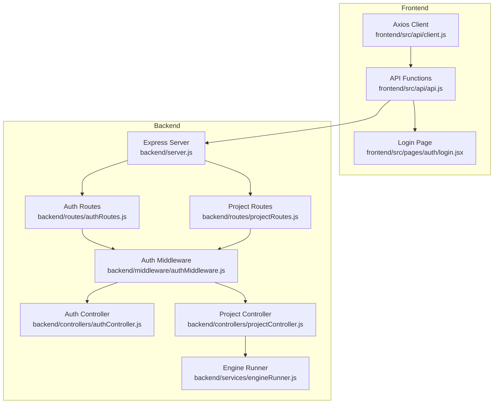
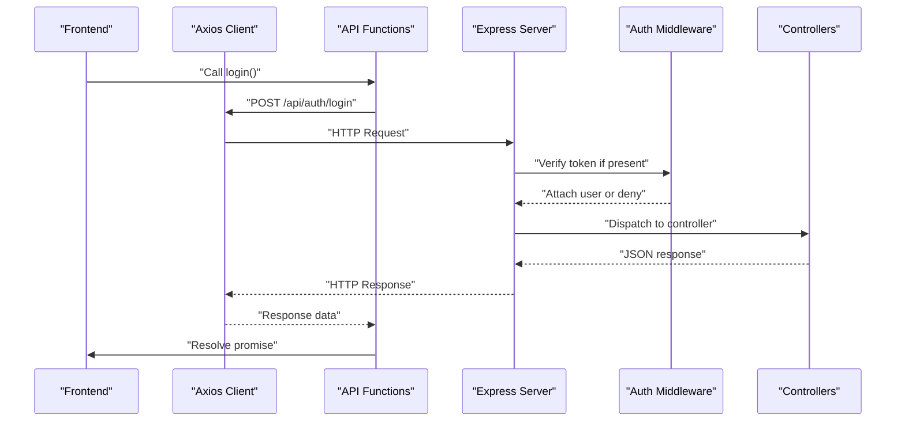
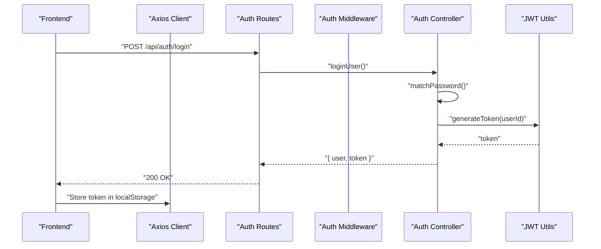
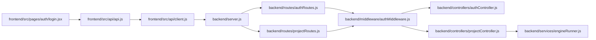

# API Integration

<cite>
**Referenced Files in This Document**
- [frontend/src/api/client.js](file://frontend/src/api/client.js)
- [frontend/src/api/api.js](file://frontend/src/api/api.js)
- [frontend/src/pages/auth/login.jsx](file://frontend/src/pages/auth/login.jsx)
- [backend/server.js](file://backend/server.js)
- [backend/routes/authRoutes.js](file://backend/routes/authRoutes.js)
- [backend/routes/projectRoutes.js](file://backend/routes/projectRoutes.js)
- [backend/routes/projectCrudRoutes.js](file://backend/routes/projectCrudRoutes.js)
- [backend/routes/projectPipelineRoutes.js](file://backend/routes/projectPipelineRoutes.js)
- [backend/controllers/authController.js](file://backend/controllers/authController.js)
- [backend/controllers/projectController.js](file://backend/controllers/projectController.js)
- [backend/controllers/projectPipelineController.js](file://backend/controllers/projectPipelineController.js)
- [backend/middleware/authMiddleware.js](file://backend/middleware/authMiddleware.js)
- [backend/middleware/errorMiddleware.js](file://backend/middleware/errorMiddleware.js)
- [backend/utils/jwt.js](file://backend/utils/jwt.js)
- [backend/services/engineRunner.js](file://backend/services/engineRunner.js)
</cite>

## Table of Contents
1. [Introduction](#introduction)
2. [Project Structure](#project-structure)
3. [Core Components](#core-components)
4. [Architecture Overview](#architecture-overview)
5. [Detailed Component Analysis](#detailed-component-analysis)
6. [Dependency Analysis](#dependency-analysis)
7. [Performance Considerations](#performance-considerations)
8. [Troubleshooting Guide](#troubleshooting-guide)
9. [Conclusion](#conclusion)

## Introduction
This document explains the API integration for the Route Optimization application. It covers the centralized API client configuration, HTTP request patterns, authentication and authorization flows, data fetching mechanisms, error handling, and the relationship between the frontend and backend services. It also documents token management, CORS configuration, and practical patterns for robust API communication.

## Project Structure
The API integration spans two primary areas:
- Frontend (React/Vite): Centralized HTTP client and domain-specific API functions for authentication, projects, and pipeline operations.
- Backend (Node.js/Express): REST endpoints organized under routes, protected by middleware, and implemented by controllers. A Python engine is invoked for computation.

**Diagram sources**
- [frontend/src/api/client.js](file://frontend/src/api/client.js#L1-L14)
- [frontend/src/api/api.js](file://frontend/src/api/api.js#L1-L70)
- [frontend/src/pages/auth/login.jsx](file://frontend/src/pages/auth/login.jsx#L1-L372)
- [backend/server.js](file://backend/server.js#L1-L56)
- [backend/routes/authRoutes.js](file://backend/routes/authRoutes.js#L1-L13)
- [backend/routes/projectRoutes.js](file://backend/routes/projectRoutes.js#L1-L11)
- [backend/middleware/authMiddleware.js](file://backend/middleware/authMiddleware.js#L1-L34)
- [backend/controllers/authController.js](file://backend/controllers/authController.js#L1-L108)
- [backend/controllers/projectController.js](file://backend/controllers/projectController.js)
- [backend/services/engineRunner.js](file://backend/services/engineRunner.js#L1-L73)

**Section sources**
- [frontend/src/api/client.js](file://frontend/src/api/client.js#L1-L14)
- [frontend/src/api/api.js](file://frontend/src/api/api.js#L1-L70)
- [backend/server.js](file://backend/server.js#L1-L56)

## Core Components
- Centralized HTTP client
  - Creates an Axios instance with a base URL and credentials support.
  - Automatically injects Authorization headers using a Bearer token stored in local storage.
  - Reference: [frontend/src/api/client.js](file://frontend/src/api/client.js#L1-L14)

- Domain-specific API functions
  - Authentication: login, register, Google auth, logout.
  - Projects: create, list, get, delete.
  - Pipeline: ingest artifacts (multipart/form-data), parse-and-run, get parsed input, get results.
  - Reference: [frontend/src/api/api.js](file://frontend/src/api/api.js#L1-L70)

- Frontend usage example
  - Login page integrates API functions, handles loading states, and displays errors.
  - Reference: [frontend/src/pages/auth/login.jsx](file://frontend/src/pages/auth/login.jsx#L1-L372)

- Backend server and routing
  - Express server initializes CORS, JSON parsing, mounts routes, and applies error handling.
  - References:
    - [backend/server.js](file://backend/server.js#L1-L56)
    - [backend/routes/authRoutes.js](file://backend/routes/authRoutes.js#L1-L13)
    - [backend/routes/projectRoutes.js](file://backend/routes/projectRoutes.js#L1-L11)

**Section sources**
- [frontend/src/api/client.js](file://frontend/src/api/client.js#L1-L14)
- [frontend/src/api/api.js](file://frontend/src/api/api.js#L1-L70)
- [frontend/src/pages/auth/login.jsx](file://frontend/src/pages/auth/login.jsx#L1-L372)
- [backend/server.js](file://backend/server.js#L1-L56)
- [backend/routes/authRoutes.js](file://backend/routes/authRoutes.js#L1-L13)
- [backend/routes/projectRoutes.js](file://backend/routes/projectRoutes.js#L1-L11)

## Architecture Overview
The frontend communicates with the backend via REST endpoints. Requests are authenticated using JWT tokens managed by the frontend and validated by backend middleware. The backend enforces protection on routes and delegates to controllers. Some operations trigger a Python engine for computation.

**Diagram sources**
- [frontend/src/api/api.js](file://frontend/src/api/api.js#L1-L70)
- [frontend/src/api/client.js](file://frontend/src/api/client.js#L1-L14)
- [backend/server.js](file://backend/server.js#L1-L56)
- [backend/middleware/authMiddleware.js](file://backend/middleware/authMiddleware.js#L1-L34)
- [backend/controllers/authController.js](file://backend/controllers/authController.js#L1-L108)

## Detailed Component Analysis

### Centralized API Client
- Purpose: Provide a single Axios instance with shared configuration and automatic token injection.
- Key behaviors:
  - Base URL from environment variable; supports Vite proxy.
  - Credentials enabled for cross-origin requests.
  - Request interceptor reads the token from local storage and sets Authorization header.
- References:
  - [frontend/src/api/client.js](file://frontend/src/api/client.js#L1-L14)

**Section sources**
- [frontend/src/api/client.js](file://frontend/src/api/client.js#L1-L14)

### API Function Layer
- Authentication endpoints:
  - login(email, password) → stores returned token.
  - register(name, email, password) → creates user.
  - googleAuth(idToken) → exchanges Google ID token for a session token.
  - logout() → removes token from local storage.
- Project endpoints:
  - createProject(name), listProjects(), getProject(id), deleteProject(id).
- Pipeline endpoints:
  - ingestArtifacts(projectId, files[], notes?)
  - parseAndRun(projectId)
  - getParsedInput(projectId)
  - getResults(projectId)
- References:
  - [frontend/src/api/api.js](file://frontend/src/api/api.js#L1-L70)

**Section sources**
- [frontend/src/api/api.js](file://frontend/src/api/api.js#L1-L70)

### Frontend Usage Pattern (Login Page)
- Handles form submission, validation, loading states, and error display.
- Calls API functions for registration and login; navigates on success.
- Integrates Google Sign-In SDK, obtains credential, and calls googleAuth.
- References:
  - [frontend/src/pages/auth/login.jsx](file://frontend/src/pages/auth/login.jsx#L1-L372)

**Section sources**
- [frontend/src/pages/auth/login.jsx](file://frontend/src/pages/auth/login.jsx#L1-L372)

### Backend Server and Routing
- Server configuration:
  - CORS allows multiple origins and credentials.
  - JSON and URL-encoded body parsing with large payload support.
  - Mounts routes for auth, projects, and dashboard.
  - Global error handler.
- References:
  - [backend/server.js](file://backend/server.js#L1-L56)

**Section sources**
- [backend/server.js](file://backend/server.js#L1-L56)

### Authentication Flow (JWT)
- Token generation:
  - Utility signs a JWT with a server secret and expiration.
  - Reference: [backend/utils/jwt.js](file://backend/utils/jwt.js#L1-L7)
- Middleware:
  - Extracts Bearer token from Authorization header.
  - Verifies token and attaches user to request.
  - Returns 401 for missing or invalid tokens.
  - Reference: [backend/middleware/authMiddleware.js](file://backend/middleware/authMiddleware.js#L1-L34)
- Controllers:
  - registerUser: validates input, checks uniqueness, creates user, returns token payload.
  - loginUser: verifies credentials, returns token payload.
  - googleAuth: validates Google ID token, ensures email verification, creates/returns user with token.
  - getMe: returns current user from middleware.
  - References:
    - [backend/controllers/authController.js](file://backend/controllers/authController.js#L1-L108)

**Diagram sources**
- [backend/controllers/authController.js](file://backend/controllers/authController.js#L1-L108)
- [backend/utils/jwt.js](file://backend/utils/jwt.js#L1-L7)
- [backend/middleware/authMiddleware.js](file://backend/middleware/authMiddleware.js#L1-L34)
- [frontend/src/api/api.js](file://frontend/src/api/api.js#L1-L70)

**Section sources**
- [backend/utils/jwt.js](file://backend/utils/jwt.js#L1-L7)
- [backend/middleware/authMiddleware.js](file://backend/middleware/authMiddleware.js#L1-L34)
- [backend/controllers/authController.js](file://backend/controllers/authController.js#L1-L108)

### Project CRUD and Pipeline Endpoints
- Project CRUD:
  - Routes mounted under /api/projects; protected by auth middleware.
  - Endpoints: POST /, GET /, GET /:id, DELETE /:id.
  - References:
    - [backend/routes/projectCrudRoutes.js](file://backend/routes/projectCrudRoutes.js#L1-L18)
    - [backend/controllers/projectController.js](file://backend/controllers/projectController.js)
- Pipeline:
  - POST /:id/ingest (multipart/form-data), POST /:id/parse-and-run, GET /:id/input, GET /:id/results.
  - References:
    - [backend/routes/projectPipelineRoutes.js](file://backend/routes/projectPipelineRoutes.js#L1-L31)
    - [backend/controllers/projectPipelineController.js](file://backend/controllers/projectPipelineController.js)

**Section sources**
- [backend/routes/projectCrudRoutes.js](file://backend/routes/projectCrudRoutes.js#L1-L18)
- [backend/routes/projectPipelineRoutes.js](file://backend/routes/projectPipelineRoutes.js#L1-L31)
- [backend/controllers/projectController.js](file://backend/controllers/projectController.js)
- [backend/controllers/projectPipelineController.js](file://backend/controllers/projectPipelineController.js)

### Data Fetching Mechanisms and Request Patterns
- Authentication:
  - Frontend sends Authorization: Bearer <token> automatically.
  - Backend verifies token and rejects unauthorized requests.
  - References:
    - [frontend/src/api/client.js](file://frontend/src/api/client.js#L1-L14)
    - [backend/middleware/authMiddleware.js](file://backend/middleware/authMiddleware.js#L1-L34)
- Project operations:
  - JSON payloads for create/list/get/delete.
  - References:
    - [frontend/src/api/api.js](file://frontend/src/api/api.js#L25-L44)
    - [backend/routes/projectCrudRoutes.js](file://backend/routes/projectCrudRoutes.js#L1-L18)
- Pipeline ingestion:
  - Multipart/form-data upload with optional notes.
  - References:
    - [frontend/src/api/api.js](file://frontend/src/api/api.js#L47-L54)
    - [backend/routes/projectPipelineRoutes.js](file://backend/routes/projectPipelineRoutes.js#L14-L20)

**Section sources**
- [frontend/src/api/client.js](file://frontend/src/api/client.js#L1-L14)
- [backend/middleware/authMiddleware.js](file://backend/middleware/authMiddleware.js#L1-L34)
- [frontend/src/api/api.js](file://frontend/src/api/api.js#L25-L54)
- [backend/routes/projectCrudRoutes.js](file://backend/routes/projectCrudRoutes.js#L1-L18)
- [backend/routes/projectPipelineRoutes.js](file://backend/routes/projectPipelineRoutes.js#L14-L20)

### Relationship with Backend Services and Engine Execution
- Pipeline operations may trigger a Python engine to compute results.
- The engine runner spawns a child process, streams output, extracts JSON, and enforces timeouts.
- References:
  - [backend/services/engineRunner.js](file://backend/services/engineRunner.js#L1-L73)
  - [backend/controllers/projectPipelineController.js](file://backend/controllers/projectPipelineController.js)

**Section sources**
- [backend/services/engineRunner.js](file://backend/services/engineRunner.js#L1-L73)
- [backend/controllers/projectPipelineController.js](file://backend/controllers/projectPipelineController.js)

### Error Handling Patterns
- Backend error middleware:
  - Normalizes status codes and returns JSON with message and stack (in non-production).
  - Reference: [backend/middleware/errorMiddleware.js](file://backend/middleware/errorMiddleware.js#L1-L12)
- Frontend error handling:
  - Displays user-friendly messages derived from response data or generic error.
  - Reference: [frontend/src/pages/auth/login.jsx](file://frontend/src/pages/auth/login.jsx#L1-L372)

**Section sources**
- [backend/middleware/errorMiddleware.js](file://backend/middleware/errorMiddleware.js#L1-L12)
- [frontend/src/pages/auth/login.jsx](file://frontend/src/pages/auth/login.jsx#L1-L372)

### Loading States and Retry Mechanisms
- Frontend loading state:
  - Disabled submit buttons and adjusted opacity during network requests.
  - Reference: [frontend/src/pages/auth/login.jsx](file://frontend/src/pages/auth/login.jsx#L1-L372)
- Retry mechanisms:
  - No built-in retry logic in the current codebase. Consider adding exponential backoff and retry-on-failure for transient network errors.

**Section sources**
- [frontend/src/pages/auth/login.jsx](file://frontend/src/pages/auth/login.jsx#L1-L372)

### Authentication Token Management
- Storage:
  - Tokens are stored in local storage after successful auth.
  - Logout clears the token.
  - References:
    - [frontend/src/api/api.js](file://frontend/src/api/api.js#L1-L70)
    - [frontend/src/pages/auth/login.jsx](file://frontend/src/pages/auth/login.jsx#L1-L372)
- Propagation:
  - Axios interceptor automatically adds Authorization header for all requests.
  - Reference: [frontend/src/api/client.js](file://frontend/src/api/client.js#L1-L14)

**Section sources**
- [frontend/src/api/api.js](file://frontend/src/api/api.js#L1-L70)
- [frontend/src/pages/auth/login.jsx](file://frontend/src/pages/auth/login.jsx#L1-L372)
- [frontend/src/api/client.js](file://frontend/src/api/client.js#L1-L14)

### API Versioning and Rate Limiting
- Versioning:
  - No explicit version prefix in current endpoints (e.g., /api/...).
- Rate limiting:
  - Not implemented in the current codebase.
- Recommendations:
  - Add version prefixes (e.g., /api/v1) and integrate a rate-limiting middleware for production.

**Section sources**
- [backend/server.js](file://backend/server.js#L1-L56)
- [frontend/src/api/api.js](file://frontend/src/api/api.js#L1-L70)

## Dependency Analysis
- Frontend depends on:
  - Axios client for HTTP transport.
  - API functions for domain operations.
  - Local storage for token persistence.
- Backend depends on:
  - Express for routing and middleware.
  - MongoDB connection (via config/db).
  - Auth middleware for protecting routes.
  - Controllers for business logic.
  - Engine runner for external computation.

**Diagram sources**
- [frontend/src/api/api.js](file://frontend/src/api/api.js#L1-L70)
- [frontend/src/api/client.js](file://frontend/src/api/client.js#L1-L14)
- [frontend/src/pages/auth/login.jsx](file://frontend/src/pages/auth/login.jsx#L1-L372)
- [backend/server.js](file://backend/server.js#L1-L56)
- [backend/routes/authRoutes.js](file://backend/routes/authRoutes.js#L1-L13)
- [backend/routes/projectRoutes.js](file://backend/routes/projectRoutes.js#L1-L11)
- [backend/middleware/authMiddleware.js](file://backend/middleware/authMiddleware.js#L1-L34)
- [backend/controllers/authController.js](file://backend/controllers/authController.js#L1-L108)
- [backend/controllers/projectController.js](file://backend/controllers/projectController.js)
- [backend/services/engineRunner.js](file://backend/services/engineRunner.js#L1-L73)

**Section sources**
- [frontend/src/api/api.js](file://frontend/src/api/api.js#L1-L70)
- [frontend/src/api/client.js](file://frontend/src/api/client.js#L1-L14)
- [frontend/src/pages/auth/login.jsx](file://frontend/src/pages/auth/login.jsx#L1-L372)
- [backend/server.js](file://backend/server.js#L1-L56)
- [backend/routes/authRoutes.js](file://backend/routes/authRoutes.js#L1-L13)
- [backend/routes/projectRoutes.js](file://backend/routes/projectRoutes.js#L1-L11)
- [backend/middleware/authMiddleware.js](file://backend/middleware/authMiddleware.js#L1-L34)
- [backend/controllers/authController.js](file://backend/controllers/authController.js#L1-L108)
- [backend/controllers/projectController.js](file://backend/controllers/projectController.js)
- [backend/services/engineRunner.js](file://backend/services/engineRunner.js#L1-L73)

## Performance Considerations
- Payload sizes:
  - Large JSON bodies and multipart uploads are supported by the server.
  - References:
    - [backend/server.js](file://backend/server.js#L42-L43)
    - [backend/routes/projectPipelineRoutes.js](file://backend/routes/projectPipelineRoutes.js#L14-L20)
- Timeout handling:
  - Engine runner enforces a timeout for long-running computations.
  - Reference: [backend/services/engineRunner.js](file://backend/services/engineRunner.js#L21-L71)
- Network retries:
  - Not implemented; consider adding retry logic for transient failures.

**Section sources**
- [backend/server.js](file://backend/server.js#L42-L43)
- [backend/routes/projectPipelineRoutes.js](file://backend/routes/projectPipelineRoutes.js#L14-L20)
- [backend/services/engineRunner.js](file://backend/services/engineRunner.js#L21-L71)

## Troubleshooting Guide
- Common issues and resolutions:
  - Missing Authorization header: ensure token is present in local storage and interceptor is active.
    - References:
      - [frontend/src/api/client.js](file://frontend/src/api/client.js#L1-L14)
      - [frontend/src/api/api.js](file://frontend/src/api/api.js#L1-L70)
  - Unauthorized access: verify token validity and user existence on backend.
    - References:
      - [backend/middleware/authMiddleware.js](file://backend/middleware/authMiddleware.js#L1-L34)
      - [backend/controllers/authController.js](file://backend/controllers/authController.js#L1-L108)
  - CORS errors: confirm allowed origins and credentials configuration.
    - Reference: [backend/server.js](file://backend/server.js#L26-L41)
  - Engine timeouts or invalid JSON: adjust timeout and ensure the Python process emits valid JSON.
    - Reference: [backend/services/engineRunner.js](file://backend/services/engineRunner.js#L1-L73)
  - Frontend error display: inspect response data and propagate user-friendly messages.
    - Reference: [frontend/src/pages/auth/login.jsx](file://frontend/src/pages/auth/login.jsx#L1-L372)

**Section sources**
- [frontend/src/api/client.js](file://frontend/src/api/client.js#L1-L14)
- [frontend/src/api/api.js](file://frontend/src/api/api.js#L1-L70)
- [backend/middleware/authMiddleware.js](file://backend/middleware/authMiddleware.js#L1-L34)
- [backend/controllers/authController.js](file://backend/controllers/authController.js#L1-L108)
- [backend/server.js](file://backend/server.js#L26-L41)
- [backend/services/engineRunner.js](file://backend/services/engineRunner.js#L1-L73)
- [frontend/src/pages/auth/login.jsx](file://frontend/src/pages/auth/login.jsx#L1-L372)

## Conclusion
The API integration combines a centralized Axios client, domain-specific API functions, and robust backend routes protected by JWT middleware. The system supports authentication, project management, and pipeline operations with optional engine execution. To enhance reliability, consider implementing API versioning, rate limiting, and retry mechanisms on the frontend.