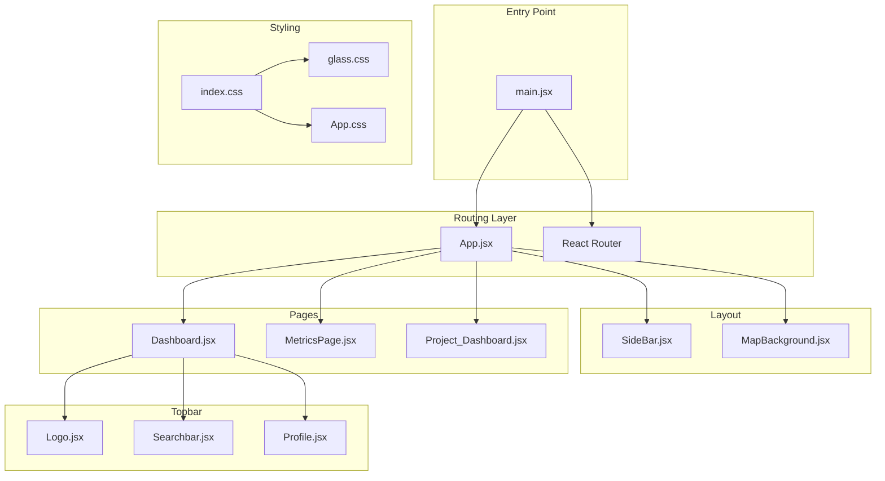
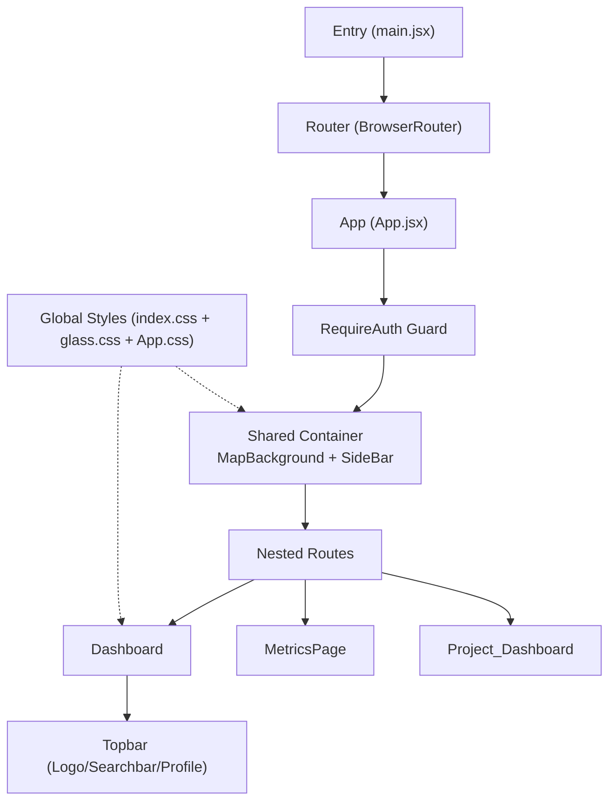
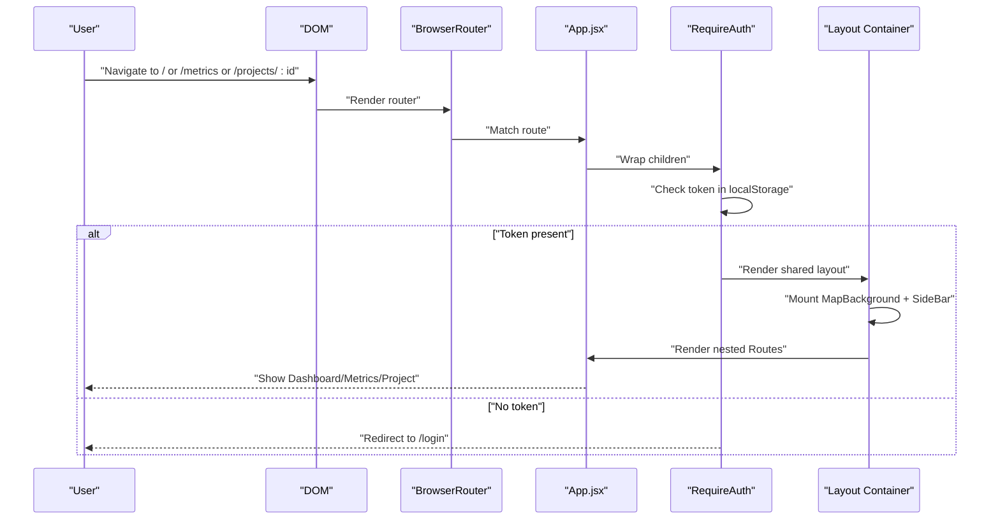
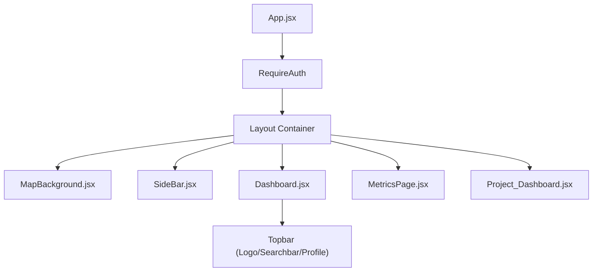
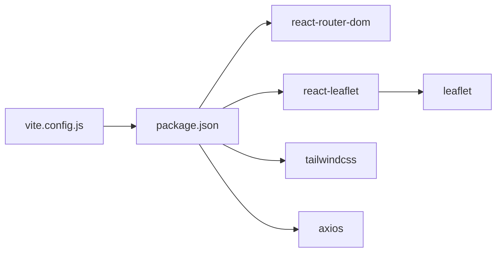

# Application Architecture

<cite>
**Referenced Files in This Document**
- [main.jsx](file://frontend/src/main.jsx)
- [App.jsx](file://frontend/src/App.jsx)
- [index.css](file://frontend/src/index.css)
- [glass.css](file://frontend/src/glass.css)
- [App.css](file://frontend/src/App.css)
- [MapBackground.jsx](file://frontend/src/components/background/MapBackground.jsx)
- [SideBar.jsx](file://frontend/src/components/sidebar/SideBar.jsx)
- [Logo.jsx](file://frontend/src/components/topbar/Logo.jsx)
- [Searchbar.jsx](file://frontend/src/components/topbar/Searchbar.jsx)
- [Profile.jsx](file://frontend/src/components/topbar/Profile.jsx)
- [Dashboard.jsx](file://frontend/src/pages/dashboard/Dashboard.jsx)
- [MetricsPage.jsx](file://frontend/src/pages/metrics/MetricsPage.jsx)
- [Project_Dashboard.jsx](file://frontend/src/pages/projects/Project_Dashboard.jsx)
- [package.json](file://frontend/package.json)
- [vite.config.js](file://frontend/vite.config.js)
</cite>

## Table of Contents
1. [Introduction](#introduction)
2. [Project Structure](#project-structure)
3. [Core Components](#core-components)
4. [Architecture Overview](#architecture-overview)
5. [Detailed Component Analysis](#detailed-component-analysis)
6. [Dependency Analysis](#dependency-analysis)
7. [Performance Considerations](#performance-considerations)
8. [Troubleshooting Guide](#troubleshooting-guide)
9. [Conclusion](#conclusion)

## Introduction
This document explains the React application architecture for the Route Optimization frontend. It covers the bootstrapping process, routing configuration with React Router, component hierarchy, styling architecture with glass morphism, and responsive design. It also highlights practical composition patterns, state management integration, and performance optimization techniques used across the application.

## Project Structure
The frontend is organized by feature and responsibility:
- Entry point initializes the React app with StrictMode and React Router.
- App defines nested routes and wraps authenticated views with shared layout components.
- Pages implement domain-specific views (dashboard, metrics, project dashboards).
- Components encapsulate UI building blocks (sidebar, topbar, background map).
- Styling leverages Tailwind via PostCSS and a dedicated glass morphism stylesheet.

**Diagram sources**
- [main.jsx](file://frontend/src/main.jsx#L1-L14)
- [App.jsx](file://frontend/src/App.jsx#L1-L60)
- [SideBar.jsx](file://frontend/src/components/sidebar/SideBar.jsx#L1-L185)
- [MapBackground.jsx](file://frontend/src/components/background/MapBackground.jsx#L1-L174)
- [Dashboard.jsx](file://frontend/src/pages/dashboard/Dashboard.jsx#L1-L394)
- [MetricsPage.jsx](file://frontend/src/pages/metrics/MetricsPage.jsx#L1-L135)
- [Project_Dashboard.jsx](file://frontend/src/pages/projects/Project_Dashboard.jsx#L1-L252)
- [Logo.jsx](file://frontend/src/components/topbar/Logo.jsx#L1-L45)
- [Searchbar.jsx](file://frontend/src/components/topbar/Searchbar.jsx#L1-L133)
- [Profile.jsx](file://frontend/src/components/topbar/Profile.jsx#L1-L186)
- [index.css](file://frontend/src/index.css#L1-L23)
- [glass.css](file://frontend/src/glass.css#L1-L79)
- [App.css](file://frontend/src/App.css#L1-L63)

**Section sources**
- [main.jsx](file://frontend/src/main.jsx#L1-L14)
- [App.jsx](file://frontend/src/App.jsx#L1-L60)
- [index.css](file://frontend/src/index.css#L1-L23)
- [glass.css](file://frontend/src/glass.css#L1-L79)
- [App.css](file://frontend/src/App.css#L1-L63)

## Core Components
- main.jsx: Bootstraps the app with StrictMode, React Router, and global CSS.
- App.jsx: Central route configuration with a RequireAuth wrapper for protected routes and a shared layout container.
- Layout components: SideBar and MapBackground provide persistent navigation and animated background.
- Pages: Dashboard, MetricsPage, and Project_Dashboard implement domain views.
- Topbar: Logo, Searchbar, and Profile compose the header area.

Key responsibilities:
- Routing: Nested routes under App.jsx with a catch-all layout for authenticated areas.
- Authentication: RequireAuth checks token presence and redirects unauthenticated users to login.
- Layout: Shared container applies background gradients and sidebar placement.
- Styling: Global Tailwind imports plus glass morphism classes for UI consistency.

**Section sources**
- [main.jsx](file://frontend/src/main.jsx#L1-L14)
- [App.jsx](file://frontend/src/App.jsx#L14-L58)
- [SideBar.jsx](file://frontend/src/components/sidebar/SideBar.jsx#L1-L185)
- [MapBackground.jsx](file://frontend/src/components/background/MapBackground.jsx#L1-L174)
- [Dashboard.jsx](file://frontend/src/pages/dashboard/Dashboard.jsx#L1-L394)
- [MetricsPage.jsx](file://frontend/src/pages/metrics/MetricsPage.jsx#L1-L135)
- [Project_Dashboard.jsx](file://frontend/src/pages/projects/Project_Dashboard.jsx#L1-L252)
- [Logo.jsx](file://frontend/src/components/topbar/Logo.jsx#L1-L45)
- [Searchbar.jsx](file://frontend/src/components/topbar/Searchbar.jsx#L1-L133)
- [Profile.jsx](file://frontend/src/components/topbar/Profile.jsx#L1-L186)

## Architecture Overview
The application follows a layered architecture:
- Entry layer: main.jsx sets up StrictMode and wraps the app in BrowserRouter.
- Routing layer: App.jsx defines top-level routes and a nested layout for authenticated views.
- Presentation layer: Pages render domain views; shared components provide UI scaffolding.
- Styling layer: index.css imports Tailwind and glass morphism; App.css defines global gradients and scrollbars.

**Diagram sources**
- [main.jsx](file://frontend/src/main.jsx#L7-L13)
- [App.jsx](file://frontend/src/App.jsx#L21-L58)
- [Dashboard.jsx](file://frontend/src/pages/dashboard/Dashboard.jsx#L327-L336)
- [index.css](file://frontend/src/index.css#L1-L23)
- [glass.css](file://frontend/src/glass.css#L1-L79)
- [App.css](file://frontend/src/App.css#L1-L63)

## Detailed Component Analysis

### Routing and Authentication Flow
The routing layer uses a two-tier structure:
- Standalone route for login.
- Protected routes rendered inside a RequireAuth wrapper that enforces token presence and redirects to login when absent.
- Inside RequireAuth, a shared container hosts MapBackground, SideBar, and a nested Routes block for dashboard, metrics, and project views.

**Diagram sources**
- [App.jsx](file://frontend/src/App.jsx#L14-L58)
- [main.jsx](file://frontend/src/main.jsx#L3-L12)

**Section sources**
- [App.jsx](file://frontend/src/App.jsx#L14-L58)

### Component Composition Patterns
- Page-level composition: Dashboard composes Topbar (Logo, Searchbar, Profile), analytics cards, and project grids. MetricsPage composes a reusable GlassCard wrapper and placeholder charts. Project_Dashboard composes modals, lists, and a map.
- Shared layout: RequireAuth’s container composes MapBackground and SideBar, then renders nested routes.
- Reusable UI: Topbar items (Logo, Searchbar, Profile) are self-contained and styled with glass classes.

Practical patterns:
- Composition via props and children.
- Event-driven interactions (e.g., opening modals via window events).
- Conditional rendering based on state and URL params.

**Section sources**
- [Dashboard.jsx](file://frontend/src/pages/dashboard/Dashboard.jsx#L315-L391)
- [MetricsPage.jsx](file://frontend/src/pages/metrics/MetricsPage.jsx#L9-L135)
- [Project_Dashboard.jsx](file://frontend/src/pages/projects/Project_Dashboard.jsx#L145-L249)
- [Logo.jsx](file://frontend/src/components/topbar/Logo.jsx#L1-L45)
- [Searchbar.jsx](file://frontend/src/components/topbar/Searchbar.jsx#L1-L133)
- [Profile.jsx](file://frontend/src/components/topbar/Profile.jsx#L1-L186)

### State Management Integration
- Local component state: Pages and components manage UI state (loading, selection, visibility) using React hooks.
- Cross-component communication: Project_Dashboard listens for a window event to open the Employee modal, decoupling sidebar actions from page logic.
- API integration: Pages call centralized API functions to fetch and mutate data.

Recommendations:
- For complex shared state, consider integrating a lightweight state library or context providers.
- Normalize and cache API responses to reduce redundant requests.

**Section sources**
- [Project_Dashboard.jsx](file://frontend/src/pages/projects/Project_Dashboard.jsx#L103-L108)
- [Dashboard.jsx](file://frontend/src/pages/dashboard/Dashboard.jsx#L208-L227)

### Performance Optimization Techniques
- Lazy map initialization and cleanup: MapBackground initializes Leaflet only when mounted and cleans up timers and instances on unmount.
- IndexedDB tile caching: Tiles are cached and retrieved via IndexedDB to reduce network usage.
- Controlled animations: Random scroll sequences are scheduled with timeouts and canceled on unmount.
- Efficient re-renders: Pages use minimal state updates and avoid unnecessary re-renders by passing memoized callbacks.

**Section sources**
- [MapBackground.jsx](file://frontend/src/components/background/MapBackground.jsx#L68-L169)
- [MapBackground.jsx](file://frontend/src/components/background/MapBackground.jsx#L21-L66)
- [MapBackground.jsx](file://frontend/src/components/background/MapBackground.jsx#L105-L141)

### Styling Architecture and Responsive Design
- Global imports: index.css imports Tailwind directives and glass.css, ensuring consistent glass classes across components.
- Glass morphism: glass.css defines a reusable glass-morphism class with backdrop blur, borders, shadows, and interactive states.
- Global gradients: App.css defines a dynamic radial gradient background and scrollbars for the entire app.
- Component-level styling: Pages and components apply Tailwind utilities and inline styles for layout and responsiveness.

Responsive principles:
- Flexbox and grid layouts adapt to available space.
- Relative units and viewport-based sizing maintain readability.
- Scrollable regions are constrained to prevent layout shifts.

**Section sources**
- [index.css](file://frontend/src/index.css#L1-L23)
- [glass.css](file://frontend/src/glass.css#L1-L79)
- [App.css](file://frontend/src/App.css#L1-L63)
- [Dashboard.jsx](file://frontend/src/pages/dashboard/Dashboard.jsx#L316-L391)
- [MetricsPage.jsx](file://frontend/src/pages/metrics/MetricsPage.jsx#L42-L131)
- [Project_Dashboard.jsx](file://frontend/src/pages/projects/Project_Dashboard.jsx#L207-L246)

### Component Hierarchy and Relationships

**Diagram sources**
- [App.jsx](file://frontend/src/App.jsx#L21-L58)
- [SideBar.jsx](file://frontend/src/components/sidebar/SideBar.jsx#L1-L185)
- [MapBackground.jsx](file://frontend/src/components/background/MapBackground.jsx#L1-L174)
- [Dashboard.jsx](file://frontend/src/pages/dashboard/Dashboard.jsx#L327-L336)
- [MetricsPage.jsx](file://frontend/src/pages/metrics/MetricsPage.jsx#L42-L56)
- [Project_Dashboard.jsx](file://frontend/src/pages/projects/Project_Dashboard.jsx#L162-L204)

## Dependency Analysis
External dependencies relevant to architecture:
- react and react-dom: Core framework.
- react-router-dom: Routing and navigation.
- leaflet and react-leaflet: Interactive map rendering.
- tailwindcss and related tooling: Utility-first CSS framework.
- axios: HTTP client for API calls.

Build and dev tooling:
- vite with react plugin.
- proxy configuration for API traffic.

**Diagram sources**
- [package.json](file://frontend/package.json#L12-L29)
- [vite.config.js](file://frontend/vite.config.js#L1-L17)

**Section sources**
- [package.json](file://frontend/package.json#L12-L29)
- [vite.config.js](file://frontend/vite.config.js#L1-L17)

## Performance Considerations
- Prefer lazy loading for heavy components and images.
- Debounce search input handlers to limit API calls.
- Virtualize long lists to reduce DOM nodes.
- Memoize derived data computations.
- Use CSS containment and isolation for heavy components.
- Minimize reflows by batching DOM updates.

## Troubleshooting Guide
Common issues and remedies:
- Blank screen after login: Verify token presence in localStorage and ensure RequireAuth redirect logic executes.
- Map not rendering: Confirm map container has explicit dimensions and Leaflet CSS is imported.
- Excessive network usage: Check tile caching logic and IndexedDB availability.
- Scrollbar visibility: Ensure global scrollbar styles are applied and not overridden by page-specific styles.

**Section sources**
- [App.jsx](file://frontend/src/App.jsx#L14-L19)
- [MapBackground.jsx](file://frontend/src/components/background/MapBackground.jsx#L78-L103)
- [index.css](file://frontend/src/index.css#L9-L23)

## Conclusion
The application employs a clean, layered architecture with React Router for routing, a shared authenticated layout, and a cohesive styling system centered on glass morphism and Tailwind utilities. Component composition emphasizes reusability and separation of concerns, while performance techniques like map lifecycle management and tile caching improve user experience. The structure supports scalability and maintainability across dashboard, metrics, and project-centric views.