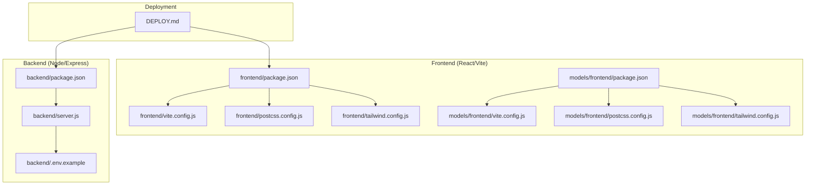
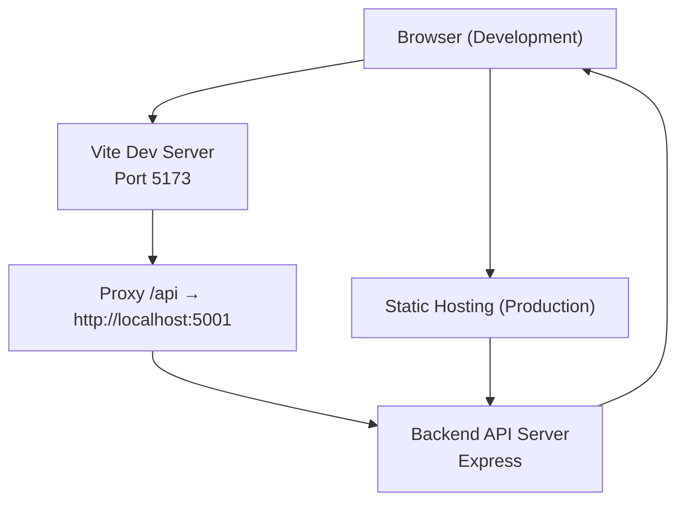
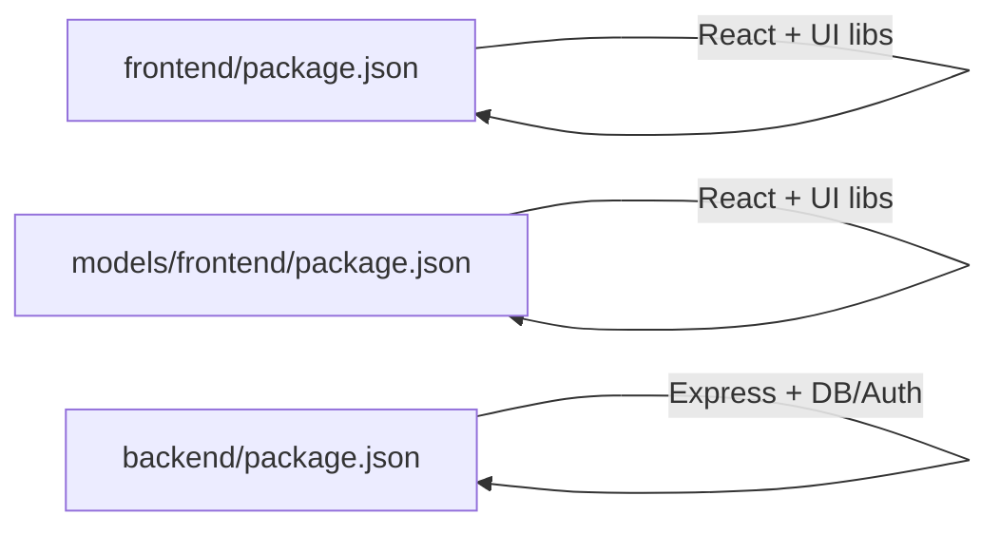

# Build and Deployment Configuration

<cite>
**Referenced Files in This Document**
- [frontend/package.json](file://frontend/package.json)
- [frontend/vite.config.js](file://frontend/vite.config.js)
- [frontend/postcss.config.js](file://frontend/postcss.config.js)
- [frontend/tailwind.config.js](file://frontend/tailwind.config.js)
- [models/frontend/package.json](file://models/frontend/package.json)
- [models/frontend/vite.config.js](file://models/frontend/vite.config.js)
- [models/frontend/postcss.config.js](file://models/frontend/postcss.config.js)
- [models/frontend/tailwind.config.js](file://models/frontend/tailwind.config.js)
- [backend/package.json](file://backend/package.json)
- [backend/server.js](file://backend/server.js)
- [backend/.env.example](file://backend/.env.example)
- [DEPLOY.md](file://DEPLOY.md)
</cite>

## Table of Contents
1. [Introduction](#introduction)
2. [Project Structure](#project-structure)
3. [Core Components](#core-components)
4. [Architecture Overview](#architecture-overview)
5. [Detailed Component Analysis](#detailed-component-analysis)
6. [Dependency Analysis](#dependency-analysis)
7. [Performance Considerations](#performance-considerations)
8. [Troubleshooting Guide](#troubleshooting-guide)
9. [Conclusion](#conclusion)
10. [Appendices](#appendices)

## Introduction
This document explains the build and deployment configuration for the frontend (React/Vite) and backend (Node/Express) components. It covers the Vite build system setup, development server configuration, production optimization settings, package scripts, dependency management, and the build pipeline. It also documents Tailwind CSS and PostCSS integration, asset optimization strategies, development versus production differences, and how build configuration relates to deployment targets such as static hosting and backend APIs.

## Project Structure
The project includes two distinct frontend implementations:
- A React/Vite frontend under frontend/
- A React/Vite frontend under models/frontend/ (duplicate setup)
Additionally, there is a Node/Express backend under backend/, and a Flutter app at the repository root that consumes the same backend API.

Key build-related directories and files:
- Frontend (React/Vite): package.json, vite.config.js, postcss.config.js, tailwind.config.js
- Backend (Node/Express): package.json, server.js, .env.example
- Deployment guide: DEPLOY.md

**Diagram sources**
- [frontend/package.json](file://frontend/package.json#L1-L48)
- [frontend/vite.config.js](file://frontend/vite.config.js#L1-L17)
- [frontend/postcss.config.js](file://frontend/postcss.config.js#L1-L6)
- [frontend/tailwind.config.js](file://frontend/tailwind.config.js#L1-L20)
- [models/frontend/package.json](file://models/frontend/package.json#L1-L43)
- [models/frontend/vite.config.js](file://models/frontend/vite.config.js#L1-L10)
- [models/frontend/postcss.config.js](file://models/frontend/postcss.config.js#L1-L6)
- [models/frontend/tailwind.config.js](file://models/frontend/tailwind.config.js#L1-L20)
- [backend/package.json](file://backend/package.json#L1-L28)
- [backend/server.js](file://backend/server.js#L1-L56)
- [backend/.env.example](file://backend/.env.example#L1-L12)
- [DEPLOY.md](file://DEPLOY.md#L1-L169)

**Section sources**
- [frontend/package.json](file://frontend/package.json#L1-L48)
- [models/frontend/package.json](file://models/frontend/package.json#L1-L43)
- [backend/package.json](file://backend/package.json#L1-L28)
- [DEPLOY.md](file://DEPLOY.md#L1-L169)

## Core Components
- Vite build system: Provides development server, hot module replacement, and production bundling.
- React plugin: Enables JSX and React Fast Refresh.
- PostCSS and Tailwind CSS: Styles processing and utility-first CSS framework.
- Backend API server: Exposes REST endpoints consumed by both the React website and Flutter app.

Key responsibilities:
- frontend/package.json: Defines scripts (dev, build, lint, preview), runtime and dev dependencies.
- frontend/vite.config.js: Configures the dev server, port, and proxy for API requests.
- frontend/postcss.config.js and frontend/tailwind.config.js: Configure PostCSS plugins and Tailwind scanning/content.
- backend/server.js: Starts the Express server, loads environment variables, mounts routes, and configures CORS.

**Section sources**
- [frontend/package.json](file://frontend/package.json#L6-L11)
- [frontend/vite.config.js](file://frontend/vite.config.js#L4-L16)
- [frontend/postcss.config.js](file://frontend/postcss.config.js#L1-L6)
- [frontend/tailwind.config.js](file://frontend/tailwind.config.js#L3-L6)
- [backend/server.js](file://backend/server.js#L17-L55)

## Architecture Overview
The build and deployment pipeline connects the frontend website (React/Vite) and the backend (Node/Express). The frontend communicates with the backend via HTTP requests proxied during development and served from a static build in production. The Flutter app consumes the same backend API and can be built for multiple platforms, including web.

**Diagram sources**
- [frontend/vite.config.js](file://frontend/vite.config.js#L6-L15)
- [backend/server.js](file://backend/server.js#L26-L41)

## Detailed Component Analysis

### Vite Build System Setup
- Scripts:
  - dev: Starts the Vite development server.
  - build: Produces a production-ready static build.
  - lint: Runs ESLint across the project.
  - preview: Serves the production build locally for testing.
- Plugin stack:
  - @vitejs/plugin-react: Enables React JSX transform and Fast Refresh.
- Overrides:
  - Vite is pinned via overrides to a specific version to ensure reproducible builds.

Practical commands:
- Development: npm run dev
- Production build: npm run build
- Preview production build: npm run preview

Notes:
- The models/frontend/ directory mirrors the same script definitions and plugin configuration.

**Section sources**
- [frontend/package.json](file://frontend/package.json#L6-L11)
- [frontend/package.json](file://frontend/package.json#L30-L42)
- [models/frontend/package.json](file://models/frontend/package.json#L6-L11)
- [models/frontend/package.json](file://models/frontend/package.json#L25-L38)

### Development Server Configuration
- Port: The dev server listens on port 5173.
- Proxy:
  - All requests prefixed with /api are proxied to http://localhost:5001.
  - changeOrigin and secure flags are configured for cross-origin behavior during development.

Why this matters:
- Ensures frontend and backend can run on separate ports locally while avoiding CORS issues during development.
- Matches the backend default port and API base used by the Flutter app.

**Section sources**
- [frontend/vite.config.js](file://frontend/vite.config.js#L6-L15)
- [models/frontend/vite.config.js](file://models/frontend/vite.config.js#L6-L8)
- [backend/server.js](file://backend/server.js#L18-L34)

### Production Optimization Settings
- The repository does not include explicit production optimization configurations (e.g., minification, chunk splitting, code splitting tuning, or asset hashing). The current setup relies on Vite defaults.
- Recommendations for production optimization (conceptual):
  - Enable minification and asset hashing in the Vite build.
  - Split vendor and application bundles.
  - Use dynamic imports for lazy loading.
  - Configure CDN and cache headers for static assets.
  - Analyze bundle size with a Vite plugin or external tools.

[No sources needed since this section provides general guidance]

### Package.json Scripts and Dependency Management
- Frontend (frontend/):
  - Dependencies include React, routing, charting, mapping, and utility libraries.
  - Dev dependencies include Vite, React plugin, PostCSS, Tailwind CSS, and ESLint tooling.
- Frontend (models/frontend/):
  - Mirrors the same dependency structure with slightly different versions.
- Backend:
  - Dependencies include Express, database, authentication, file upload, and PDF parsing.
  - Dev dependency includes nodemon for development.

Best practices:
- Keep dependency versions aligned across similar environments.
- Prefer semantic version ranges for stability.
- Pin major versions for build tools to avoid breaking changes.

**Section sources**
- [frontend/package.json](file://frontend/package.json#L12-L29)
- [frontend/package.json](file://frontend/package.json#L30-L42)
- [models/frontend/package.json](file://models/frontend/package.json#L12-L24)
- [models/frontend/package.json](file://models/frontend/package.json#L25-L38)
- [backend/package.json](file://backend/package.json#L9-L23)
- [backend/package.json](file://backend/package.json#L24-L26)

### Build Pipeline Configuration
- React plugin: JSX transform and Fast Refresh enabled.
- PostCSS and Tailwind:
  - Tailwind scans HTML and components for class usage.
  - Autoprefixer adds vendor prefixes.
- Environment handling:
  - Frontend does not define compile-time environment variables in the provided configs.
  - Backend loads environment variables from .env.example and uses them at runtime.

Recommendations:
- For environment-specific builds, consider defining environment variables in the Vite config or using .env files with Vite’s convention.
- For the backend, ensure production deployments set NODE_ENV=production and configure CORS_ORIGINS for the deployed frontend origin.

**Section sources**
- [frontend/vite.config.js](file://frontend/vite.config.js#L5)
- [frontend/postcss.config.js](file://frontend/postcss.config.js#L2-L5)
- [frontend/tailwind.config.js](file://frontend/tailwind.config.js#L3-L6)
- [models/frontend/vite.config.js](file://models/frontend/vite.config.js#L5)
- [models/frontend/postcss.config.js](file://models/frontend/postcss.config.js#L2-L5)
- [models/frontend/tailwind.config.js](file://models/frontend/tailwind.config.js#L3-L6)
- [backend/.env.example](file://backend/.env.example#L1-L12)

### Tailwind CSS Integration
- Content scanning includes index.html and all React component files.
- Theme extension defines a custom color palette named velora.
- No plugins are enabled in the Tailwind configuration.

Usage:
- Import Tailwind directives in CSS entry files to enable utility classes.
- Tailwind purges unused styles in production builds by default.

**Section sources**
- [frontend/tailwind.config.js](file://frontend/tailwind.config.js#L3-L18)
- [models/frontend/tailwind.config.js](file://models/frontend/tailwind.config.js#L3-L18)

### PostCSS Configuration
- Plugins:
  - tailwindcss: Processes Tailwind directives.
  - autoprefixer: Adds vendor prefixes based on browser support.
- No custom PostCSS plugins are configured.

**Section sources**
- [frontend/postcss.config.js](file://frontend/postcss.config.js#L1-L6)
- [models/frontend/postcss.config.js](file://models/frontend/postcss.config.js#L1-L6)

### Asset Optimization Strategies
- Current configuration does not specify asset optimization (e.g., image compression, font optimization, or CSS/JS minification).
- Recommended strategies (conceptual):
  - Use Vite plugins for asset optimization.
  - Pre-compress assets and serve gzip/Brotli.
  - Lazy-load images and non-critical resources.
  - Optimize vector graphics and icons.

**Section sources**
- [frontend/vite.config.js](file://frontend/vite.config.js#L1-L17)
- [models/frontend/vite.config.js](file://models/frontend/vite.config.js#L1-L10)

### Development vs Production Builds
- Development:
  - Vite dev server runs on port 5173 with hot reload.
  - Proxy routes /api to the backend for seamless development.
- Production:
  - Vite build generates optimized static assets.
  - The Flutter app can be built for web using a production API URL.

[No sources needed since this section provides general guidance]

### Bundle Analysis and Performance Optimization Techniques
- The repository does not include bundle analysis configuration.
- Techniques (conceptual):
  - Use a Vite plugin for bundle analysis.
  - Monitor bundle sizes and split large dependencies.
  - Enable tree-shaking and modern output formats.
  - Leverage caching and CDN distribution.

**Section sources**
- [frontend/package.json](file://frontend/package.json#L6-L11)
- [models/frontend/package.json](file://models/frontend/package.json#L6-L11)

### Relationship Between Build Configuration and Deployment Targets
- Static site generation:
  - The React website is a single-page application. For static hosting, build with Vite and deploy the dist/ directory.
- Hosting requirements:
  - Backend CORS must allow the deployed frontend origin.
  - The Flutter web app requires the same API base URL during build.

**Section sources**
- [DEPLOY.md](file://DEPLOY.md#L116-L127)
- [backend/server.js](file://backend/server.js#L26-L41)

## Dependency Analysis
The frontend depends on React and related ecosystem packages, while the backend depends on Express and supporting libraries. Both environments rely on Vite and PostCSS/Tailwind for frontend asset processing.

**Diagram sources**
- [frontend/package.json](file://frontend/package.json#L12-L29)
- [models/frontend/package.json](file://models/frontend/package.json#L12-L24)
- [backend/package.json](file://backend/package.json#L9-L23)

**Section sources**
- [frontend/package.json](file://frontend/package.json#L12-L29)
- [models/frontend/package.json](file://models/frontend/package.json#L12-L24)
- [backend/package.json](file://backend/package.json#L9-L23)

## Performance Considerations
- Minification and asset hashing should be enabled in production builds.
- Consider enabling code splitting and dynamic imports to reduce initial bundle size.
- Use CDN and appropriate cache headers for static assets.
- Monitor bundle composition and remove unused dependencies.

[No sources needed since this section provides general guidance]

## Troubleshooting Guide
Common issues and resolutions:
- Development proxy not working:
  - Verify the proxy target matches the backend port and origin.
  - Ensure the backend is running before starting the frontend dev server.
- CORS errors in development or production:
  - Confirm the backend CORS configuration includes the frontend origin(s).
  - For production, set CORS_ORIGINS to include the deployed frontend URL.
- Backend environment variables:
  - Ensure NODE_ENV, PORT, and secrets are set appropriately.
  - For production, set NODE_ENV=production and configure CORS_ORIGINS.

**Section sources**
- [frontend/vite.config.js](file://frontend/vite.config.js#L8-L14)
- [backend/server.js](file://backend/server.js#L26-L41)
- [backend/.env.example](file://backend/.env.example#L1-L12)

## Conclusion
The project’s build and deployment configuration centers around a React/Vite frontend and a Node/Express backend. The Vite setup provides a streamlined development experience with a proxy for API requests, while Tailwind CSS and PostCSS handle styling. For production, ensure the backend CORS is configured for the deployed frontend origin, and consider adding production optimizations such as minification, asset hashing, and bundle analysis. The Flutter app aligns with the same backend API and can be built for multiple platforms using a consistent API base URL.

[No sources needed since this section summarizes without analyzing specific files]

## Appendices

### Practical Build Commands
- Frontend development: npm run dev
- Frontend production build: npm run build
- Frontend preview: npm run preview
- Backend development: npm run dev (from backend/)
- Backend production: npm start (from backend/)

**Section sources**
- [frontend/package.json](file://frontend/package.json#L6-L11)
- [backend/package.json](file://backend/package.json#L5-L8)

### Environment Variable Handling
- Backend:
  - Load environment variables from .env.example and set production values in deployment.
  - Configure CORS_ORIGINS for production origins.
- Frontend:
  - No explicit environment variable configuration is present in the provided Vite config. Consider adding environment variables for API base URLs or feature flags.

**Section sources**
- [backend/.env.example](file://backend/.env.example#L1-L12)
- [backend/server.js](file://backend/server.js#L26-L41)
- [frontend/vite.config.js](file://frontend/vite.config.js#L1-L17)

### Deployment Preparation
- Backend:
  - Set NODE_ENV=production, PORT, and CORS_ORIGINS.
  - Choose a platform (e.g., Render) and configure environment variables accordingly.
- Frontend (React website):
  - Build with Vite and deploy the dist/ directory to a static host.
  - Ensure CORS_ORIGINS includes the deployed frontend origin.

**Section sources**
- [DEPLOY.md](file://DEPLOY.md#L37-L38)
- [DEPLOY.md](file://DEPLOY.md#L116-L127)