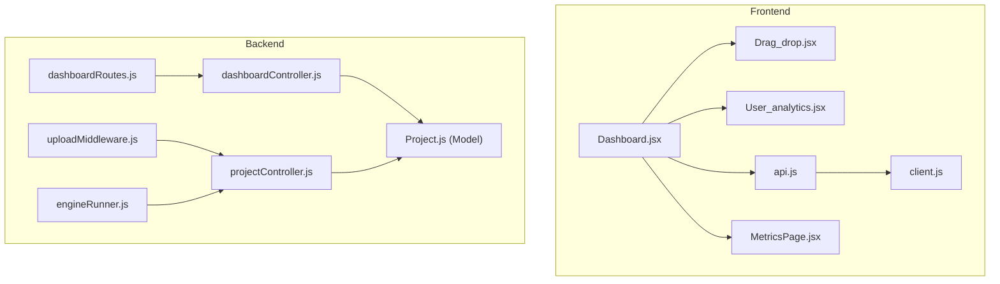
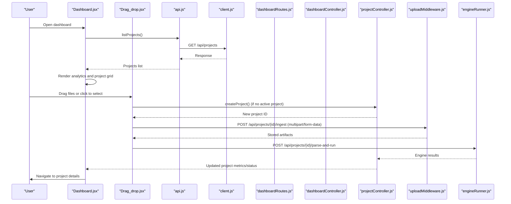
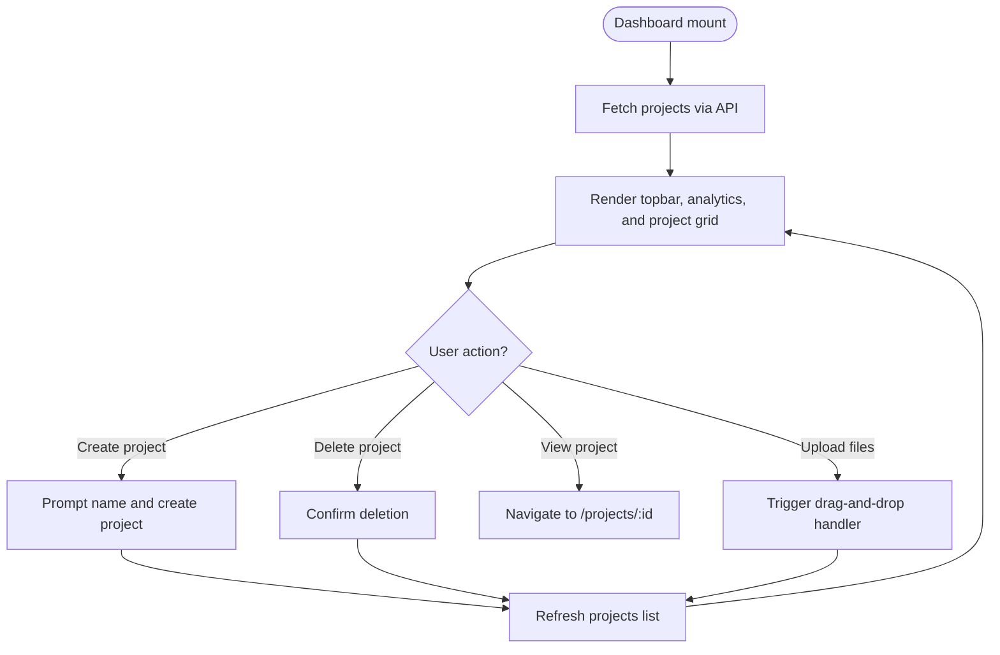
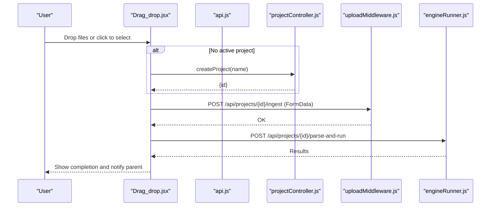
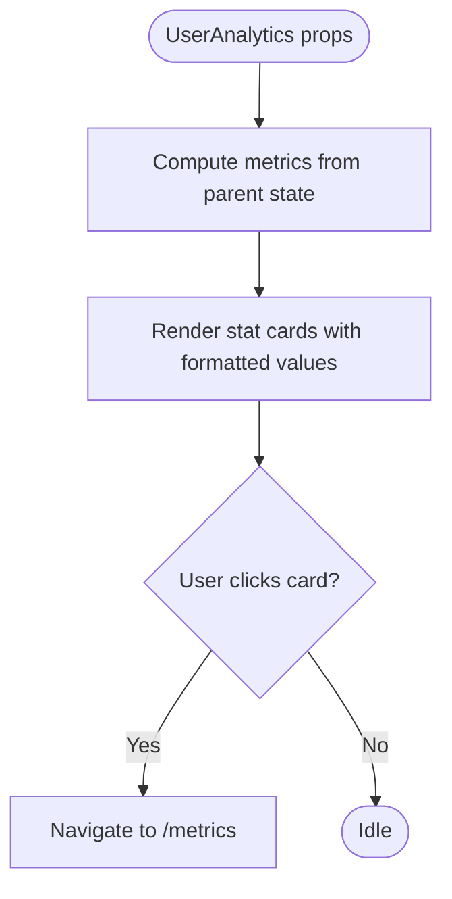
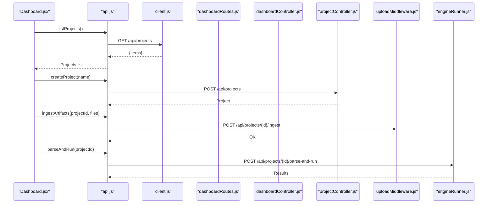
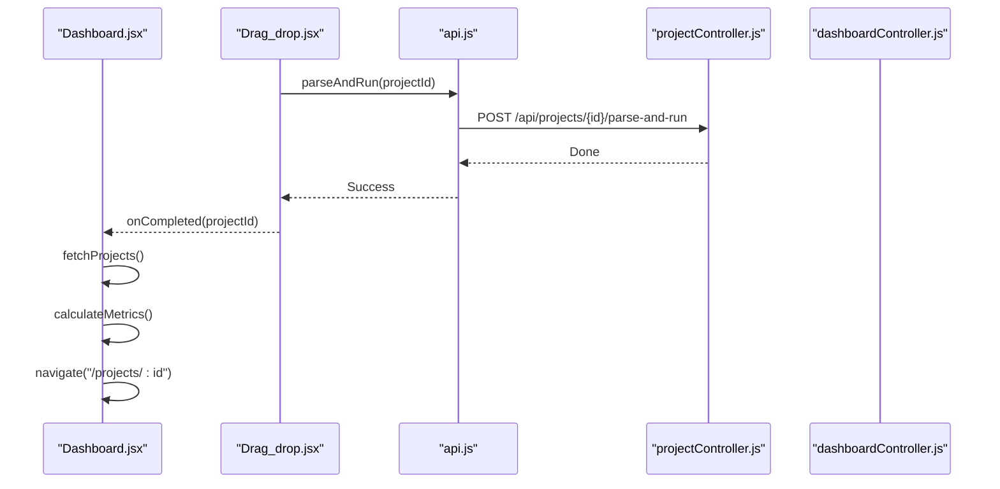
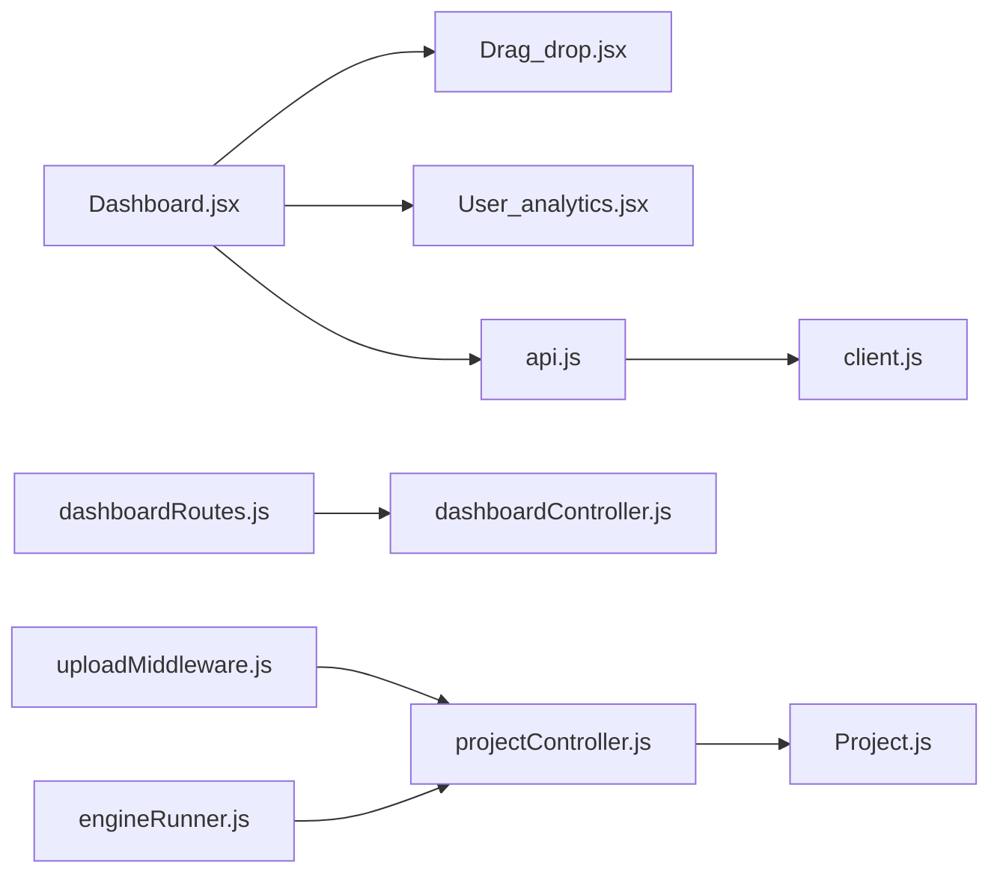

# Dashboard Components

<cite>
**Referenced Files in This Document**
- [Dashboard.jsx](file://frontend/src/pages/dashboard/Dashboard.jsx)
- [Drag_drop.jsx](file://frontend/src/pages/dashboard/components/Drag_drop.jsx)
- [User_analytics.jsx](file://frontend/src/pages/dashboard/components/User_analytics.jsx)
- [api.js](file://frontend/src/api/api.js)
- [client.js](file://frontend/src/api/client.js)
- [dashboardController.js](file://backend/controllers/dashboardController.js)
- [dashboardRoutes.js](file://backend/routes/dashboardRoutes.js)
- [uploadMiddleware.js](file://backend/middleware/uploadMiddleware.js)
- [engineRunner.js](file://backend/services/engineRunner.js)
- [projectController.js](file://backend/controllers/projectController.js)
- [Project.js](file://backend/models/Project.js)
- [MetricsPage.jsx](file://frontend/src/pages/metrics/MetricsPage.jsx)
- [MetricsPage.css](file://frontend/src/pages/metrics/MetricsPage.css)
- [App.jsx](file://frontend/src/App.jsx)
</cite>

## Table of Contents
1. [Introduction](#introduction)
2. [Project Structure](#project-structure)
3. [Core Components](#core-components)
4. [Architecture Overview](#architecture-overview)
5. [Detailed Component Analysis](#detailed-component-analysis)
6. [Dependency Analysis](#dependency-analysis)
7. [Performance Considerations](#performance-considerations)
8. [Troubleshooting Guide](#troubleshooting-guide)
9. [Conclusion](#conclusion)
10. [Appendices](#appendices)

## Introduction
This document explains the dashboard components for the Route Optimization project. It covers the dashboard page layout, drag-and-drop file upload workflow, and user analytics visualization. It documents component composition patterns, state management, interactive features, backend API integration, data fetching, and real-time-like updates. It also addresses responsive design, component reusability, and performance optimization strategies for dashboard rendering.

## Project Structure
The dashboard is implemented in the frontend under the pages/dashboard directory. It composes reusable UI components and integrates with the backend via an API client. The backend exposes routes for dashboard metrics and project management, and the Python engine is invoked for optimization runs.

**Diagram sources**
- [Dashboard.jsx](file://frontend/src/pages/dashboard/Dashboard.jsx#L197-L394)
- [Drag_drop.jsx](file://frontend/src/pages/dashboard/components/Drag_drop.jsx#L1-L90)
- [User_analytics.jsx](file://frontend/src/pages/dashboard/components/User_analytics.jsx#L1-L132)
- [api.js](file://frontend/src/api/api.js#L1-L70)
- [client.js](file://frontend/src/api/client.js#L1-L14)
- [dashboardRoutes.js](file://backend/routes/dashboardRoutes.js#L1-L9)
- [dashboardController.js](file://backend/controllers/dashboardController.js#L1-L73)
- [projectController.js](file://backend/controllers/projectController.js#L1-L117)
- [Project.js](file://backend/models/Project.js#L1-L96)
- [uploadMiddleware.js](file://backend/middleware/uploadMiddleware.js#L1-L35)
- [engineRunner.js](file://backend/services/engineRunner.js#L1-L73)
- [MetricsPage.jsx](file://frontend/src/pages/metrics/MetricsPage.jsx#L1-L135)

**Section sources**
- [Dashboard.jsx](file://frontend/src/pages/dashboard/Dashboard.jsx#L197-L394)
- [App.jsx](file://frontend/src/App.jsx#L21-L58)

## Core Components
- Dashboard page orchestrates topbar, drag-and-drop upload area, analytics summary, and project grid. It manages search, context menus, project creation, deletion, and navigation.
- Drag-and-drop component handles file selection via click or drag-and-drop, auto-creates a project if none selected, uploads artifacts, triggers parsing and optimization, and notifies completion.
- User analytics component renders summary statistics cards for savings, optimized projects, total time saved, and average savings percentage.

Key responsibilities and interactions:
- State management: Dashboard maintains loading state, projects list, active project ID, and context menu coordinates.
- Event handling: Clicks, context menus, search, and navigation are handled in the Dashboard component.
- Analytics computation: Dashboard calculates metrics from the loaded projects.
- API integration: Dashboard uses API helpers for project CRUD and pipeline operations.

**Section sources**
- [Dashboard.jsx](file://frontend/src/pages/dashboard/Dashboard.jsx#L197-L394)
- [Drag_drop.jsx](file://frontend/src/pages/dashboard/components/Drag_drop.jsx#L1-L90)
- [User_analytics.jsx](file://frontend/src/pages/dashboard/components/User_analytics.jsx#L1-L132)
- [api.js](file://frontend/src/api/api.js#L1-L70)

## Architecture Overview
The dashboard integrates frontend components with backend APIs and the Python optimization engine. The flow includes:
- Frontend dashboard fetches projects and displays analytics.
- Users upload datasets via drag-and-drop.
- Backend ingests files, parses inputs, and runs the optimization engine.
- Results update project status and metrics, visible on the dashboard.

**Diagram sources**
- [Dashboard.jsx](file://frontend/src/pages/dashboard/Dashboard.jsx#L197-L394)
- [Drag_drop.jsx](file://frontend/src/pages/dashboard/components/Drag_drop.jsx#L1-L90)
- [api.js](file://frontend/src/api/api.js#L1-L70)
- [client.js](file://frontend/src/api/client.js#L1-L14)
- [dashboardRoutes.js](file://backend/routes/dashboardRoutes.js#L1-L9)
- [dashboardController.js](file://backend/controllers/dashboardController.js#L1-L73)
- [projectController.js](file://backend/controllers/projectController.js#L1-L117)
- [uploadMiddleware.js](file://backend/middleware/uploadMiddleware.js#L1-L35)
- [engineRunner.js](file://backend/services/engineRunner.js#L1-L73)

## Detailed Component Analysis

### Dashboard Page Composition and State Management
- Composition pattern:
  - Topbar with logo, search, and profile.
  - Two-column main area: drag-and-drop upload panel and analytics summary.
  - Scrollable project grid with “new project” card and recent projects.
- State management:
  - Local state for search query, projects list, loading flag, active project ID, and context menu coordinates.
  - Computed metrics derived from loaded projects.
  - Event handlers for search, project creation, deletion, and navigation.
- Interactions:
  - Context menu appears on right-click on a project card.
  - Clicking “Create New Project” prompts for a name and creates a project.
  - Clicking a project navigates to the project details page.
  - Drag-and-drop upload triggers creation of a project if none exists and starts ingestion and parsing.

**Diagram sources**
- [Dashboard.jsx](file://frontend/src/pages/dashboard/Dashboard.jsx#L197-L394)

**Section sources**
- [Dashboard.jsx](file://frontend/src/pages/dashboard/Dashboard.jsx#L197-L394)

### Drag-and-Drop Upload Component
- Functionality:
  - Accepts multiple file types (Excel, CSV, PDF, images, text, JSON).
  - Supports click-to-select and drag-and-drop.
  - Auto-creates a project if none is active, uploads artifacts, and triggers parsing and optimization.
  - Provides user feedback via status messages and disabled states during busy periods.
- Backend integration:
  - Uses ingestArtifacts to upload files and parseAndRun to start the pipeline.
  - On completion, invokes onCompleted with the project ID.
- Error handling:
  - Displays failure messages with details from response data or message.

**Diagram sources**
- [Drag_drop.jsx](file://frontend/src/pages/dashboard/components/Drag_drop.jsx#L1-L90)
- [api.js](file://frontend/src/api/api.js#L47-L59)
- [projectController.js](file://backend/controllers/projectController.js#L8-L33)
- [uploadMiddleware.js](file://backend/middleware/uploadMiddleware.js#L1-L35)
- [engineRunner.js](file://backend/services/engineRunner.js#L1-L73)

**Section sources**
- [Drag_drop.jsx](file://frontend/src/pages/dashboard/components/Drag_drop.jsx#L1-L90)
- [api.js](file://frontend/src/api/api.js#L47-L59)

### User Analytics Visualization Component
- Purpose:
  - Display key metrics cards: total savings, projects optimized, total time saved, and average savings percentage.
- Formatting:
  - Currency and time values are formatted for readability.
- Navigation:
  - Clicking a card navigates to the metrics page.

**Diagram sources**
- [User_analytics.jsx](file://frontend/src/pages/dashboard/components/User_analytics.jsx#L1-L132)
- [Dashboard.jsx](file://frontend/src/pages/dashboard/Dashboard.jsx#L298-L313)

**Section sources**
- [User_analytics.jsx](file://frontend/src/pages/dashboard/components/User_analytics.jsx#L1-L132)
- [Dashboard.jsx](file://frontend/src/pages/dashboard/Dashboard.jsx#L298-L313)

### Backend API Integration and Data Fetching Patterns
- Frontend API client:
  - Axios instance configured with base URL and credentials.
  - Authorization header injected from stored token.
- Dashboard routes:
  - Summary and metrics endpoints compute aggregated analytics per user.
- Project lifecycle:
  - Projects are created with default metrics and status.
  - Deletion cascades to related vehicles and rides.
- Upload pipeline:
  - Multer middleware validates and stores uploaded files.
  - Engine runner spawns Python process, streams output, and extracts JSON.

**Diagram sources**
- [Dashboard.jsx](file://frontend/src/pages/dashboard/Dashboard.jsx#L197-L394)
- [api.js](file://frontend/src/api/api.js#L1-L70)
- [client.js](file://frontend/src/api/client.js#L1-L14)
- [dashboardRoutes.js](file://backend/routes/dashboardRoutes.js#L1-L9)
- [dashboardController.js](file://backend/controllers/dashboardController.js#L1-L73)
- [projectController.js](file://backend/controllers/projectController.js#L1-L117)
- [uploadMiddleware.js](file://backend/middleware/uploadMiddleware.js#L1-L35)
- [engineRunner.js](file://backend/services/engineRunner.js#L1-L73)

**Section sources**
- [api.js](file://frontend/src/api/api.js#L1-L70)
- [client.js](file://frontend/src/api/client.js#L1-L14)
- [dashboardRoutes.js](file://backend/routes/dashboardRoutes.js#L1-L9)
- [dashboardController.js](file://backend/controllers/dashboardController.js#L1-L73)
- [projectController.js](file://backend/controllers/projectController.js#L1-L117)
- [uploadMiddleware.js](file://backend/middleware/uploadMiddleware.js#L1-L35)
- [engineRunner.js](file://backend/services/engineRunner.js#L1-L73)

### Real-Time Updates and Data Flow
- Real-time-like behavior:
  - After upload and optimization, the dashboard refreshes the projects list and navigates to the relevant project page.
  - The analytics summary recomputes metrics from the updated dataset.
- Backend aggregation:
  - Metrics endpoint aggregates savings, time saved, and average savings percentage across completed projects.

**Diagram sources**
- [Dashboard.jsx](file://frontend/src/pages/dashboard/Dashboard.jsx#L280-L286)
- [Drag_drop.jsx](file://frontend/src/pages/dashboard/components/Drag_drop.jsx#L34-L43)
- [api.js](file://frontend/src/api/api.js#L56-L59)
- [projectController.js](file://backend/controllers/projectController.js#L1-L117)
- [dashboardController.js](file://backend/controllers/dashboardController.js#L35-L67)

**Section sources**
- [Dashboard.jsx](file://frontend/src/pages/dashboard/Dashboard.jsx#L280-L286)
- [Drag_drop.jsx](file://frontend/src/pages/dashboard/components/Drag_drop.jsx#L34-L43)
- [dashboardController.js](file://backend/controllers/dashboardController.js#L35-L67)

### Responsive Design and Reusability
- Responsive layout:
  - Grid-based project list adapts to screen width with minimum card width.
  - Fixed-height analytics area ensures consistent layout across devices.
- Reusable components:
  - Stat cards in analytics are generic and can be reused for other metrics.
  - Topbar components (logo, search, profile) are imported and reused.
- Styling:
  - Tailwind-based CSS classes and custom CSS provide consistent visuals and spacing.

**Section sources**
- [Dashboard.jsx](file://frontend/src/pages/dashboard/Dashboard.jsx#L365-L386)
- [User_analytics.jsx](file://frontend/src/pages/dashboard/components/User_analytics.jsx#L4-L49)
- [MetricsPage.css](file://frontend/src/pages/metrics/MetricsPage.css#L1-L197)

## Dependency Analysis
- Frontend dependencies:
  - Dashboard depends on Drag_drop and User_analytics.
  - API client encapsulates HTTP calls and auth headers.
- Backend dependencies:
  - Dashboard routes depend on dashboard controller.
  - Project controller depends on Mongoose models and enforces ownership and cascading deletes.
  - Upload middleware validates file types and sizes.
  - Engine runner spawns Python and parses output.

**Diagram sources**
- [Dashboard.jsx](file://frontend/src/pages/dashboard/Dashboard.jsx#L197-L394)
- [Drag_drop.jsx](file://frontend/src/pages/dashboard/components/Drag_drop.jsx#L1-L90)
- [User_analytics.jsx](file://frontend/src/pages/dashboard/components/User_analytics.jsx#L1-L132)
- [api.js](file://frontend/src/api/api.js#L1-L70)
- [client.js](file://frontend/src/api/client.js#L1-L14)
- [dashboardRoutes.js](file://backend/routes/dashboardRoutes.js#L1-L9)
- [dashboardController.js](file://backend/controllers/dashboardController.js#L1-L73)
- [projectController.js](file://backend/controllers/projectController.js#L1-L117)
- [Project.js](file://backend/models/Project.js#L1-L96)
- [uploadMiddleware.js](file://backend/middleware/uploadMiddleware.js#L1-L35)
- [engineRunner.js](file://backend/services/engineRunner.js#L1-L73)

**Section sources**
- [Dashboard.jsx](file://frontend/src/pages/dashboard/Dashboard.jsx#L197-L394)
- [api.js](file://frontend/src/api/api.js#L1-L70)
- [dashboardController.js](file://backend/controllers/dashboardController.js#L1-L73)
- [projectController.js](file://backend/controllers/projectController.js#L1-L117)
- [Project.js](file://backend/models/Project.js#L1-L96)

## Performance Considerations
- Efficient rendering:
  - Use memoization for computed metrics to avoid recalculating on every render.
  - Virtualize the project grid if the number of projects grows large.
- Network optimization:
  - Debounce search input to reduce unnecessary API calls.
  - Paginate project lists to limit payload size.
- UI responsiveness:
  - Disable drag-and-drop area during uploads to prevent duplicate submissions.
  - Show progress indicators and disable actions until operations complete.
- Backend scaling:
  - Limit concurrent engine runs and queue jobs if needed.
  - Monitor Python process timeouts and errors.

## Troubleshooting Guide
- Drag-and-drop upload fails:
  - Verify file types and sizes accepted by the upload middleware.
  - Check API responses for detailed error messages.
- Project deletion does not reflect:
  - Ensure the user owns the project and the deletion cascades to related entities.
- Analytics values incorrect:
  - Confirm that only completed projects with metrics contribute to aggregations.
- Navigation after upload:
  - Ensure onCompleted callback is invoked and the projects list is refreshed.

**Section sources**
- [uploadMiddleware.js](file://backend/middleware/uploadMiddleware.js#L11-L27)
- [projectController.js](file://backend/controllers/projectController.js#L82-L110)
- [dashboardController.js](file://backend/controllers/dashboardController.js#L35-L67)
- [Drag_drop.jsx](file://frontend/src/pages/dashboard/components/Drag_drop.jsx#L39-L43)
- [Dashboard.jsx](file://frontend/src/pages/dashboard/Dashboard.jsx#L248-L265)

## Conclusion
The dashboard components provide a cohesive user experience for uploading datasets, monitoring optimization metrics, and managing projects. The drag-and-drop upload streamlines the workflow, while the analytics summary offers quick insights. The backend routes and controllers ensure secure, scalable data handling and aggregation. With proper state management, responsive design, and performance optimizations, the dashboard remains efficient and user-friendly.

## Appendices
- Routing overview:
  - The App component wraps protected routes with sidebar and background, mounting the dashboard, metrics page, and project dashboard.

**Section sources**
- [App.jsx](file://frontend/src/App.jsx#L21-L58)
- [MetricsPage.jsx](file://frontend/src/pages/metrics/MetricsPage.jsx#L1-L135)