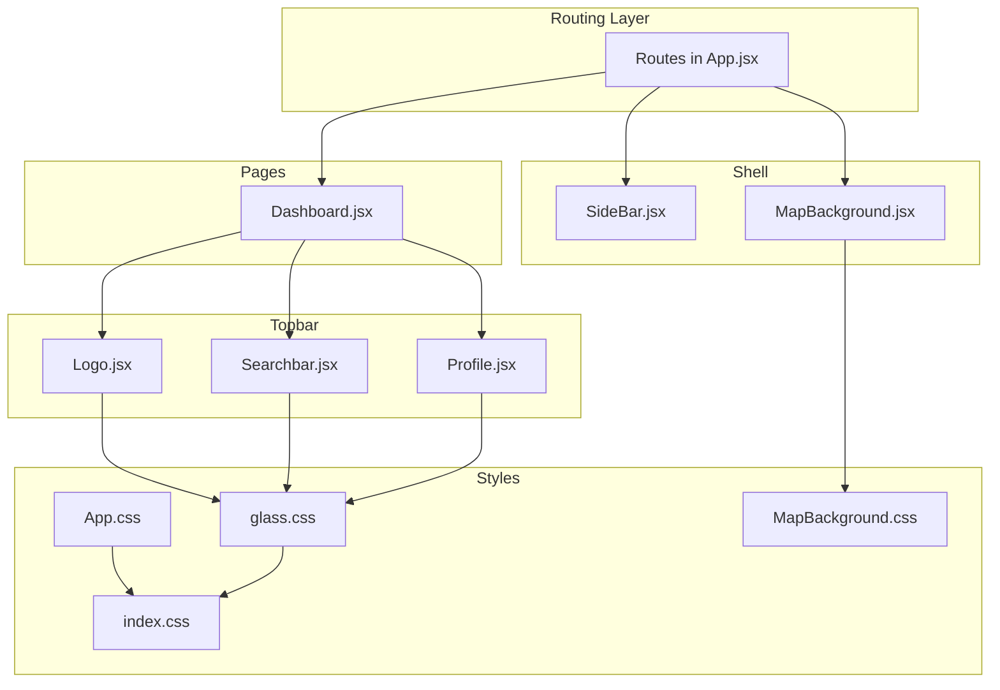
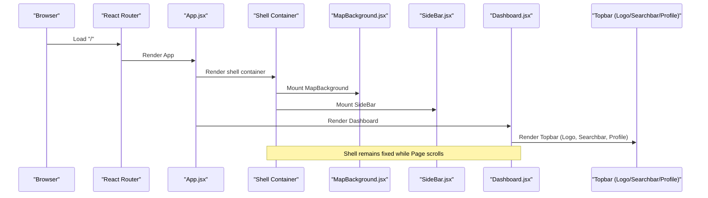
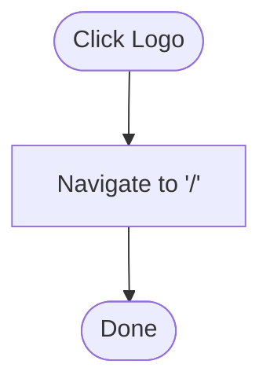
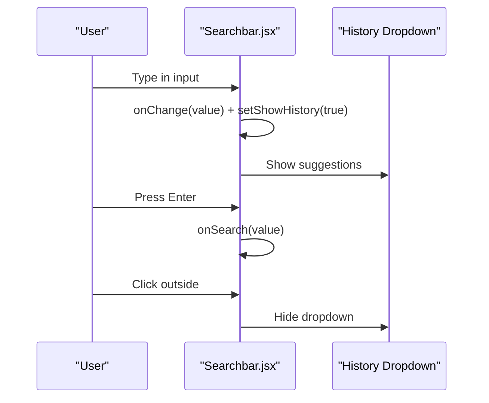
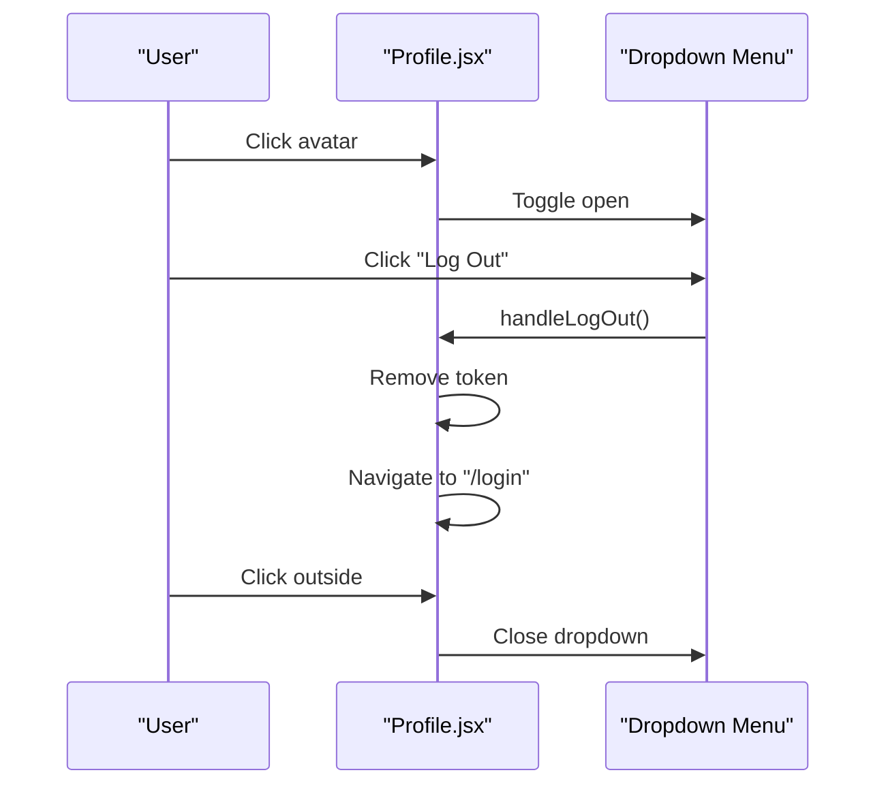
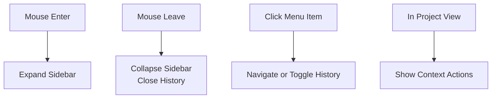
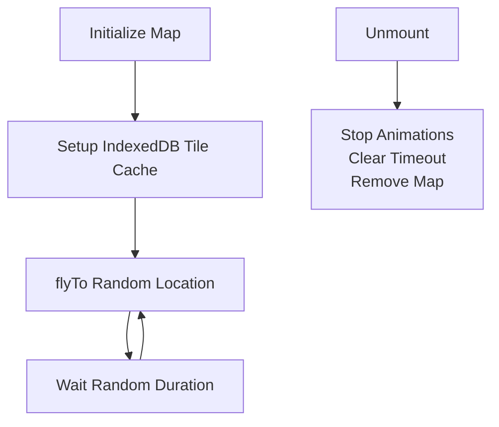
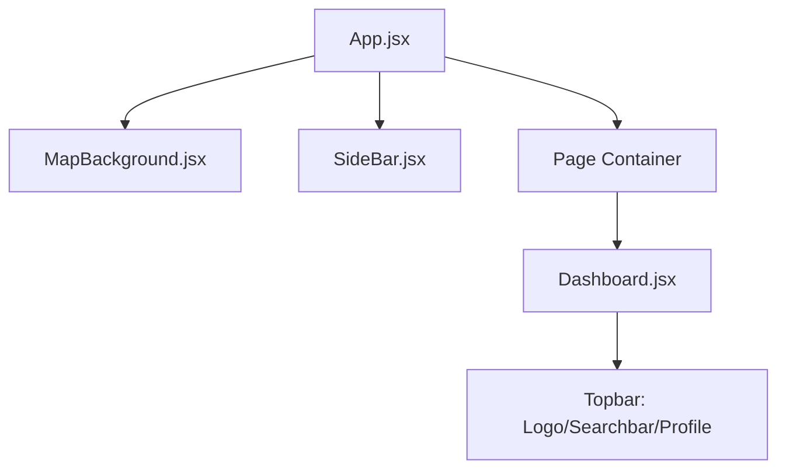
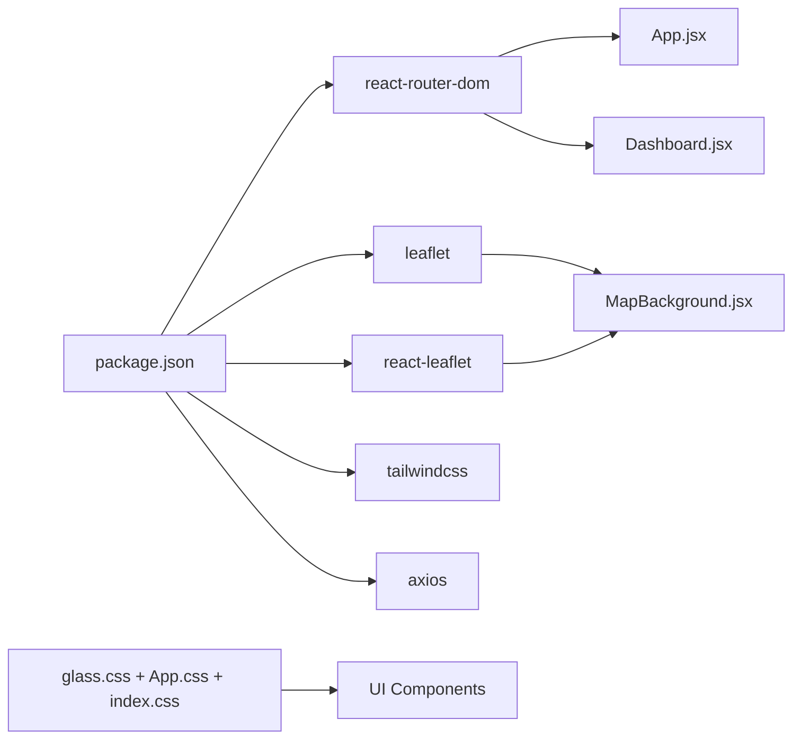

# UI Component Library

<cite>
**Referenced Files in This Document**
- [App.jsx](file://frontend/src/App.jsx)
- [main.jsx](file://frontend/src/main.jsx)
- [Dashboard.jsx](file://frontend/src/pages/dashboard/Dashboard.jsx)
- [Logo.jsx](file://frontend/src/components/topbar/Logo.jsx)
- [Searchbar.jsx](file://frontend/src/components/topbar/Searchbar.jsx)
- [Profile.jsx](file://frontend/src/components/topbar/Profile.jsx)
- [SideBar.jsx](file://frontend/src/components/sidebar/SideBar.jsx)
- [MapBackground.jsx](file://frontend/src/components/background/MapBackground.jsx)
- [MapBackground.css](file://frontend/src/components/background/MapBackground.css)
- [glass.css](file://frontend/src/glass.css)
- [App.css](file://frontend/src/App.css)
- [index.css](file://frontend/src/index.css)
- [package.json](file://frontend/package.json)
- [tailwind.config.js](file://frontend/tailwind.config.js)
</cite>

## Table of Contents
1. [Introduction](#introduction)
2. [Project Structure](#project-structure)
3. [Core Components](#core-components)
4. [Architecture Overview](#architecture-overview)
5. [Detailed Component Analysis](#detailed-component-analysis)
6. [Dependency Analysis](#dependency-analysis)
7. [Performance Considerations](#performance-considerations)
8. [Troubleshooting Guide](#troubleshooting-guide)
9. [Conclusion](#conclusion)
10. [Appendices](#appendices)

## Introduction
This document describes the UI component library used in the application’s frontend. It focuses on reusable UI components that form the application shell and enhance user interaction:
- Topbar components: Logo, Profile, Searchbar
- Sidebar navigation: SideBar
- Background map: MapBackground

It explains component props, styling approaches, integration patterns, customization options, responsive design, accessibility, cross-browser compatibility, and performance optimization. It also documents the component hierarchy and how these components relate to the overall application layout.

## Project Structure
The UI components are organized by feature:
- Topbar: Logo, Profile, Searchbar
- Sidebar: SideBar
- Background: MapBackground with associated styles
- Global styles: glass morphism, app-level themes, and Leaflet overrides

**Diagram sources**
- [App.jsx](file://frontend/src/App.jsx#L21-L58)
- [SideBar.jsx](file://frontend/src/components/sidebar/SideBar.jsx#L1-L185)
- [MapBackground.jsx](file://frontend/src/components/background/MapBackground.jsx#L1-L174)
- [Logo.jsx](file://frontend/src/components/topbar/Logo.jsx#L1-L45)
- [Searchbar.jsx](file://frontend/src/components/topbar/Searchbar.jsx#L1-L133)
- [Profile.jsx](file://frontend/src/components/topbar/Profile.jsx#L1-L186)
- [Dashboard.jsx](file://frontend/src/pages/dashboard/Dashboard.jsx#L315-L391)
- [glass.css](file://frontend/src/glass.css#L1-L79)
- [App.css](file://frontend/src/App.css#L1-L63)
- [index.css](file://frontend/src/index.css#L1-L23)
- [MapBackground.css](file://frontend/src/components/background/MapBackground.css#L1-L49)

**Section sources**
- [App.jsx](file://frontend/src/App.jsx#L21-L58)
- [main.jsx](file://frontend/src/main.jsx#L1-L14)
- [Dashboard.jsx](file://frontend/src/pages/dashboard/Dashboard.jsx#L315-L391)
- [glass.css](file://frontend/src/glass.css#L1-L79)
- [App.css](file://frontend/src/App.css#L1-L63)
- [index.css](file://frontend/src/index.css#L1-L23)
- [MapBackground.css](file://frontend/src/components/background/MapBackground.css#L1-L49)

## Core Components
This section summarizes the primary UI components and their roles.

- Logo
  - Purpose: Brand identity and home navigation trigger.
  - Props: None.
  - Behavior: Click navigates to the root route; hover applies subtle background highlight.
  - Styling: Inline styles with hover effect; SVG icon included.

- Searchbar
  - Purpose: Project search with live suggestion dropdown.
  - Props: value, onChange, onSearch.
  - Behavior: Tracks input, toggles suggestion dropdown, triggers onSearch on Enter, closes dropdown on outside click.
  - Styling: Glass morphism container; blurred background; search icon overlay.

- Profile
  - Purpose: User avatar with dropdown menu.
  - Props: None.
  - Behavior: Toggles dropdown on click; handles logout; closes dropdown on outside click; includes animated slide-in.
  - Styling: Glass morphism; gradient avatar; animated dropdown with backdrop blur.

- SideBar
  - Purpose: Navigation and contextual actions with collapsible behavior.
  - Props: None.
  - Behavior: Collapses on mouse leave; expands on hover; toggles history dropdown; navigates on item click; shows project-specific items in project views.
  - Styling: Backdrop blur background; smooth width transitions; active state highlighting.

- MapBackground
  - Purpose: Fullscreen animated map background with tile caching.
  - Props: None.
  - Behavior: Initializes Leaflet map; fly-to random locations; caches tiles via IndexedDB; cleans up on unmount.
  - Styling: Z-index stacking with filters and Leaflet overrides.

**Section sources**
- [Logo.jsx](file://frontend/src/components/topbar/Logo.jsx#L4-L43)
- [Searchbar.jsx](file://frontend/src/components/topbar/Searchbar.jsx#L3-L119)
- [Profile.jsx](file://frontend/src/components/topbar/Profile.jsx#L4-L131)
- [SideBar.jsx](file://frontend/src/components/sidebar/SideBar.jsx#L4-L132)
- [MapBackground.jsx](file://frontend/src/components/background/MapBackground.jsx#L6-L172)

## Architecture Overview
The application uses React Router for routing and composes the shell (sidebar and background) around page content. The topbar is rendered inside the Dashboard page.

**Diagram sources**
- [App.jsx](file://frontend/src/App.jsx#L21-L58)
- [Dashboard.jsx](file://frontend/src/pages/dashboard/Dashboard.jsx#L315-L391)
- [MapBackground.jsx](file://frontend/src/components/background/MapBackground.jsx#L68-L169)
- [SideBar.jsx](file://frontend/src/components/sidebar/SideBar.jsx#L21-L131)

## Detailed Component Analysis

### Topbar Components

#### Logo
- Purpose: Clickable brand logo that navigates to the home route.
- Props: None.
- Events: onClick triggers navigation.
- Styling: Inline styles with hover background change; SVG icon embedded.
- Accessibility: No explicit ARIA attributes; consider adding role and aria-label if needed.

**Diagram sources**
- [Logo.jsx](file://frontend/src/components/topbar/Logo.jsx#L7-L10)

**Section sources**
- [Logo.jsx](file://frontend/src/components/topbar/Logo.jsx#L4-L43)

#### Searchbar
- Purpose: Text input with search icon and suggestion dropdown.
- Props: value (string), onChange (function), onSearch (function).
- Events: onChange updates internal state and shows history; onFocus shows history; onKeyDown Enter triggers onSearch; outside click hides history.
- Styling: Centered container with input styled as glass morphism; dropdown positioned absolutely; search icon overlay.
- Customization: Adjust width via inline style; customize placeholder text; override history button style constant.

**Diagram sources**
- [Searchbar.jsx](file://frontend/src/components/topbar/Searchbar.jsx#L34-L119)

**Section sources**
- [Searchbar.jsx](file://frontend/src/components/topbar/Searchbar.jsx#L3-L119)

#### Profile
- Purpose: User avatar with dropdown menu containing account actions and logout.
- Props: None.
- Events: Click avatar toggles dropdown; menu item clicks handled internally; outside click closes dropdown; logout clears token and navigates.
- Styling: Gradient avatar; dropdown with backdrop blur and slide-in animation; hover effects per menu item.
- Customization: Replace gradient avatar initials; add/remove menu items; adjust animation keyframes.

**Diagram sources**
- [Profile.jsx](file://frontend/src/components/topbar/Profile.jsx#L25-L131)

**Section sources**
- [Profile.jsx](file://frontend/src/components/topbar/Profile.jsx#L4-L186)

### Sidebar Navigation

#### SideBar
- Purpose: Persistent navigation with collapsible behavior and contextual actions.
- Props: None.
- Events: Mouse enter expands sidebar; mouse leave collapses and closes history; item clicks navigate or toggle history; project view adds employee status action.
- Styling: Backdrop blur background; smooth width transition; active state highlights; history dropdown with controlled max-height.
- Customization: Add/remove menu items; adjust width and spacing; integrate additional context menus.

**Diagram sources**
- [SideBar.jsx](file://frontend/src/components/sidebar/SideBar.jsx#L21-L132)

**Section sources**
- [SideBar.jsx](file://frontend/src/components/sidebar/SideBar.jsx#L4-L185)

### Background Map Component

#### MapBackground
- Purpose: Fullscreen animated map background using Leaflet with tile caching.
- Props: None.
- Lifecycle: Initializes map on mount; sets center and zoom; disables user interactions; fly-to random locations periodically; caches tiles via IndexedDB; cleans up on unmount.
- Styling: Z-index stacking with filters; Leaflet container sizing; CSS to hide controls; optional map filter overlay.
- Customization: Change initial center/zoom; adjust animation timing; modify tile layer URL; tune blur/saturation filters.

**Diagram sources**
- [MapBackground.jsx](file://frontend/src/components/background/MapBackground.jsx#L68-L169)
- [MapBackground.css](file://frontend/src/components/background/MapBackground.css#L1-L49)

**Section sources**
- [MapBackground.jsx](file://frontend/src/components/background/MapBackground.jsx#L6-L172)
- [MapBackground.css](file://frontend/src/components/background/MapBackground.css#L1-L49)

### Component Integration and Layout

#### Application Shell Composition
- App.jsx renders the shell (MapBackground and SideBar) around page content for authenticated routes. The main content area is scrollable and positioned above the background.
- Dashboard.jsx composes the topbar (Logo, Searchbar, Profile) within the page content area.

**Diagram sources**
- [App.jsx](file://frontend/src/App.jsx#L21-L58)
- [Dashboard.jsx](file://frontend/src/pages/dashboard/Dashboard.jsx#L315-L391)

**Section sources**
- [App.jsx](file://frontend/src/App.jsx#L21-L58)
- [Dashboard.jsx](file://frontend/src/pages/dashboard/Dashboard.jsx#L315-L391)

## Dependency Analysis
External libraries and their roles:
- react-router-dom: Routing and navigation
- leaflet + react-leaflet: Map rendering and integration
- tailwindcss: Utility-first CSS framework
- glass morphism styles: Shared visual theme across components

**Diagram sources**
- [package.json](file://frontend/package.json#L12-L29)
- [glass.css](file://frontend/src/glass.css#L1-L79)
- [App.css](file://frontend/src/App.css#L1-L63)
- [index.css](file://frontend/src/index.css#L1-L23)
- [MapBackground.jsx](file://frontend/src/components/background/MapBackground.jsx#L1-L5)
- [App.jsx](file://frontend/src/App.jsx#L1-L13)
- [Dashboard.jsx](file://frontend/src/pages/dashboard/Dashboard.jsx#L1-L12)

**Section sources**
- [package.json](file://frontend/package.json#L12-L29)
- [tailwind.config.js](file://frontend/tailwind.config.js#L1-L20)

## Performance Considerations
- MapBackground
  - Animation loop uses timeouts; ensure cleanup on unmount to prevent memory leaks.
  - Tile caching via IndexedDB reduces network requests; handle IndexedDB errors gracefully.
  - Consider throttling animation frequency for lower-powered devices.
- Searchbar
  - Debounce input events if integrating with expensive search APIs.
  - Limit suggestion list size to reduce DOM rendering cost.
- Profile
  - Dropdown visibility toggled via state; ensure minimal re-renders by keeping sub-components pure.
- General
  - Use CSS transforms and opacity for animations to leverage GPU acceleration.
  - Prefer CSS custom properties for theming to avoid style recalculation churn.

[No sources needed since this section provides general guidance]

## Troubleshooting Guide
- Map does not render
  - Verify Leaflet CSS is imported and Leaflet container has dimensions.
  - Check browser console for tile loading errors; confirm IndexedDB availability.
- Dropdowns not closing
  - Ensure click-outside handlers are attached and cleaned up on unmount.
- Styles not applying
  - Confirm glass morphism and Tailwind imports are present and loaded before component rendering.
- Navigation issues
  - Validate router configuration and ensure protected routes wrap page content.

**Section sources**
- [MapBackground.jsx](file://frontend/src/components/background/MapBackground.jsx#L68-L169)
- [Profile.jsx](file://frontend/src/components/topbar/Profile.jsx#L9-L18)
- [index.css](file://frontend/src/index.css#L1-L23)
- [Dashboard.jsx](file://frontend/src/pages/dashboard/Dashboard.jsx#L315-L391)

## Conclusion
The UI component library centers on a cohesive shell: a full-screen animated map background, a collapsible sidebar, and a topbar with brand navigation, search, and user profile controls. Components share a glass morphism aesthetic and rely on React Router for navigation. The design emphasizes responsiveness and performance through careful animation management, caching, and utility-driven styling.

[No sources needed since this section summarizes without analyzing specific files]

## Appendices

### Component Prop Interfaces and Usage Patterns
- Logo
  - Props: None
  - Usage: Place within topbar row alongside Searchbar and Profile
- Searchbar
  - Props: value (string), onChange(fn), onSearch(fn)
  - Usage: Controlled input; pass current value and callbacks from parent
- Profile
  - Props: None
  - Usage: Place at topbar end; integrates with routing for logout
- SideBar
  - Props: None
  - Usage: Fixed position; expands on hover; integrates with routing for navigation
- MapBackground
  - Props: None
  - Usage: Fullscreen background; ensure proper z-index stacking

**Section sources**
- [Logo.jsx](file://frontend/src/components/topbar/Logo.jsx#L4-L43)
- [Searchbar.jsx](file://frontend/src/components/topbar/Searchbar.jsx#L3-L119)
- [Profile.jsx](file://frontend/src/components/topbar/Profile.jsx#L4-L131)
- [SideBar.jsx](file://frontend/src/components/sidebar/SideBar.jsx#L4-L132)
- [MapBackground.jsx](file://frontend/src/components/background/MapBackground.jsx#L6-L172)

### Styling and Theming References
- Glass morphism
  - Shared styles for backdrop blur, borders, shadows, and interactive states
- App-level theme
  - Root variables for gradients, card backgrounds, and typography
- Leaflet overrides
  - Hide controls and ensure container sizing

**Section sources**
- [glass.css](file://frontend/src/glass.css#L1-L79)
- [App.css](file://frontend/src/App.css#L1-L63)
- [index.css](file://frontend/src/index.css#L9-L14)
- [MapBackground.css](file://frontend/src/components/background/MapBackground.css#L18-L49)