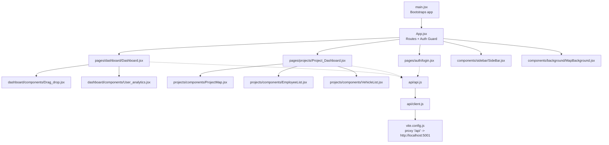
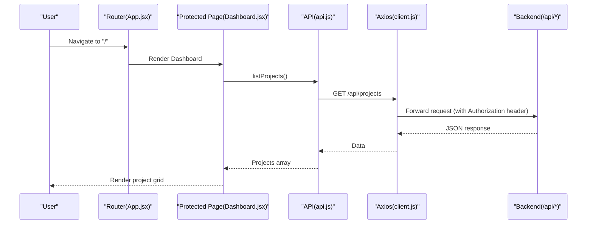
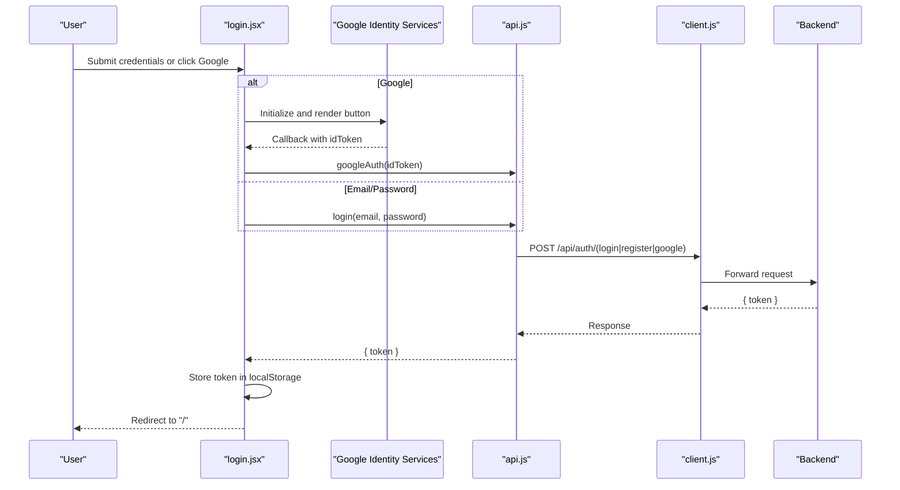
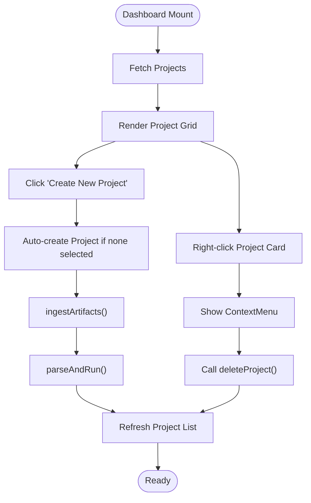
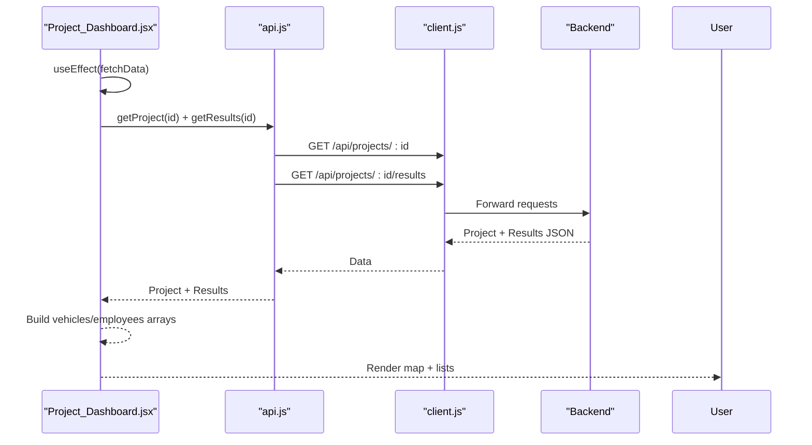
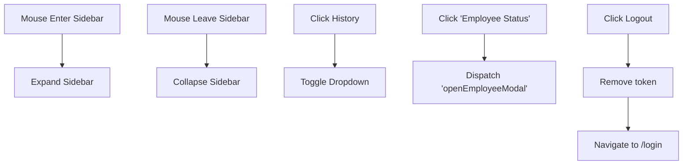
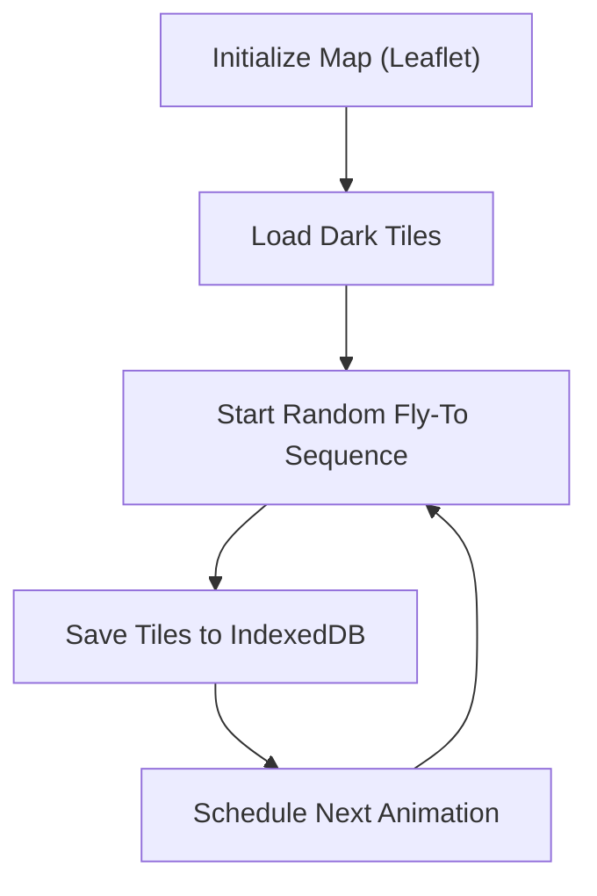
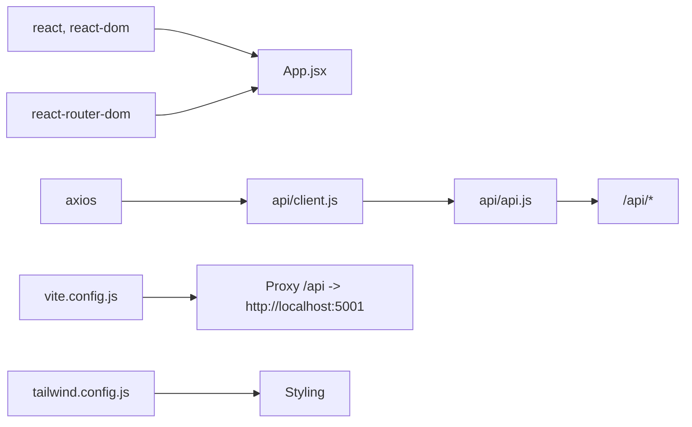

# Web Interface (React)

<cite>
**Referenced Files in This Document**
- [frontend/src/main.jsx](file://frontend/src/main.jsx)
- [frontend/src/App.jsx](file://frontend/src/App.jsx)
- [frontend/src/api/client.js](file://frontend/src/api/client.js)
- [frontend/src/api/api.js](file://frontend/src/api/api.js)
- [frontend/vite.config.js](file://frontend/vite.config.js)
- [frontend/package.json](file://frontend/package.json)
- [frontend/src/pages/dashboard/Dashboard.jsx](file://frontend/src/pages/dashboard/Dashboard.jsx)
- [frontend/src/pages/dashboard/components/Drag_drop.jsx](file://frontend/src/pages/dashboard/components/Drag_drop.jsx)
- [frontend/src/pages/dashboard/components/User_analytics.jsx](file://frontend/src/pages/dashboard/components/User_analytics.jsx)
- [frontend/src/pages/projects/Project_Dashboard.jsx](file://frontend/src/pages/projects/Project_Dashboard.jsx)
- [frontend/src/components/sidebar/SideBar.jsx](file://frontend/src/components/sidebar/SideBar.jsx)
- [frontend/src/components/background/MapBackground.jsx](file://frontend/src/components/background/MapBackground.jsx)
- [frontend/src/pages/auth/login.jsx](file://frontend/src/pages/auth/login.jsx)
- [frontend/src/config.js](file://frontend/src/config.js)
- [frontend/tailwind.config.js](file://frontend/tailwind.config.js)
</cite>

## Table of Contents
1. [Introduction](#introduction)
2. [Project Structure](#project-structure)
3. [Core Components](#core-components)
4. [Architecture Overview](#architecture-overview)
5. [Detailed Component Analysis](#detailed-component-analysis)
6. [Dependency Analysis](#dependency-analysis)
7. [Performance Considerations](#performance-considerations)
8. [Troubleshooting Guide](#troubleshooting-guide)
9. [Conclusion](#conclusion)
10. [Appendices](#appendices)

## Introduction
This document explains the React web interface for the Route Optimization platform. It covers the application architecture, component structure, routing and authentication guards, state management patterns, dashboard and project pages, API integration via Axios, responsive layout and styling, Vite build configuration and proxy setup, and deployment considerations. It also highlights performance optimizations, UX patterns, and cross-browser compatibility notes derived from the codebase.

## Project Structure
The frontend is a Vite-built React application with:
- A strict router with protected routes and a dedicated login page
- A dashboard for project listing and quick ingestion
- A project-specific dashboard for results visualization
- A sidebar with navigation and contextual actions
- A full-screen map background with animated camera movement and tile caching
- Tailwind CSS for styling and theming

**Diagram sources**
- [frontend/src/main.jsx](file://frontend/src/main.jsx#L1-L14)
- [frontend/src/App.jsx](file://frontend/src/App.jsx#L21-L58)
- [frontend/src/pages/dashboard/Dashboard.jsx](file://frontend/src/pages/dashboard/Dashboard.jsx#L1-L394)
- [frontend/src/pages/dashboard/components/Drag_drop.jsx](file://frontend/src/pages/dashboard/components/Drag_drop.jsx#L1-L90)
- [frontend/src/pages/dashboard/components/User_analytics.jsx](file://frontend/src/pages/dashboard/components/User_analytics.jsx#L1-L132)
- [frontend/src/pages/projects/Project_Dashboard.jsx](file://frontend/src/pages/projects/Project_Dashboard.jsx#L1-L252)
- [frontend/src/components/sidebar/SideBar.jsx](file://frontend/src/components/sidebar/SideBar.jsx#L1-L185)
- [frontend/src/components/background/MapBackground.jsx](file://frontend/src/components/background/MapBackground.jsx#L1-L174)
- [frontend/src/api/api.js](file://frontend/src/api/api.js#L1-L70)
- [frontend/src/api/client.js](file://frontend/src/api/client.js#L1-L14)
- [frontend/vite.config.js](file://frontend/vite.config.js#L1-L17)

**Section sources**
- [frontend/src/main.jsx](file://frontend/src/main.jsx#L1-L14)
- [frontend/src/App.jsx](file://frontend/src/App.jsx#L21-L58)
- [frontend/vite.config.js](file://frontend/vite.config.js#L1-L17)

## Core Components
- Routing and Authentication
  - Strict routing with nested routes inside a protected wrapper
  - Authentication guard checks for a token in local storage and redirects unauthenticated users to the login page
  - Login page supports email/password and Google OAuth 2.0 with dynamic script injection
- Dashboard
  - Project listing with search, context menu, and creation flow
  - Drag-and-drop ingestion that auto-creates a project if none selected
  - Analytics summary cards aggregating metrics from executed projects
- Project Dashboard
  - Parallel loading of project metadata and results
  - Vehicle and employee lists with modal interactions
  - Short map preview and quick metrics pills
- Sidebar
  - Collapsible navigation with hover-expand and dropdown history
  - Context-aware items (e.g., Employee Status) and logout
- Background Map
  - Leaflet-based dark-mode map with animated fly-to transitions
  - IndexedDB-backed tile caching for offline resilience and reduced bandwidth

**Section sources**
- [frontend/src/App.jsx](file://frontend/src/App.jsx#L14-L58)
- [frontend/src/pages/auth/login.jsx](file://frontend/src/pages/auth/login.jsx#L76-L372)
- [frontend/src/pages/dashboard/Dashboard.jsx](file://frontend/src/pages/dashboard/Dashboard.jsx#L197-L394)
- [frontend/src/pages/dashboard/components/Drag_drop.jsx](file://frontend/src/pages/dashboard/components/Drag_drop.jsx#L4-L90)
- [frontend/src/pages/dashboard/components/User_analytics.jsx](file://frontend/src/pages/dashboard/components/User_analytics.jsx#L51-L132)
- [frontend/src/pages/projects/Project_Dashboard.jsx](file://frontend/src/pages/projects/Project_Dashboard.jsx#L13-L252)
- [frontend/src/components/sidebar/SideBar.jsx](file://frontend/src/components/sidebar/SideBar.jsx#L4-L185)
- [frontend/src/components/background/MapBackground.jsx](file://frontend/src/components/background/MapBackground.jsx#L68-L174)

## Architecture Overview
The React app uses a layered approach:
- Entry point initializes React and wraps the app in a router
- App defines routes and a RequireAuth wrapper
- Pages orchestrate data fetching and render child components
- API module encapsulates HTTP calls via a configured Axios client
- Vite dev server proxies API requests to the backend

**Diagram sources**
- [frontend/src/App.jsx](file://frontend/src/App.jsx#L21-L58)
- [frontend/src/pages/dashboard/Dashboard.jsx](file://frontend/src/pages/dashboard/Dashboard.jsx#L208-L227)
- [frontend/src/api/api.js](file://frontend/src/api/api.js#L31-L34)
- [frontend/src/api/client.js](file://frontend/src/api/client.js#L3-L12)
- [frontend/vite.config.js](file://frontend/vite.config.js#L8-L14)

## Detailed Component Analysis

### Authentication and Login Flow
- Google Sign-In integration dynamically loads the GSI SDK and renders a button
- Local login registers or authenticates, stores a token, and navigates to the dashboard
- The Axios client injects Authorization headers automatically for subsequent requests

**Diagram sources**
- [frontend/src/pages/auth/login.jsx](file://frontend/src/pages/auth/login.jsx#L89-L140)
- [frontend/src/pages/auth/login.jsx](file://frontend/src/pages/auth/login.jsx#L142-L168)
- [frontend/src/api/api.js](file://frontend/src/api/api.js#L4-L19)
- [frontend/src/api/client.js](file://frontend/src/api/client.js#L8-L12)

**Section sources**
- [frontend/src/pages/auth/login.jsx](file://frontend/src/pages/auth/login.jsx#L76-L372)
- [frontend/src/api/api.js](file://frontend/src/api/api.js#L4-L19)
- [frontend/src/api/client.js](file://frontend/src/api/client.js#L1-L14)

### Dashboard: Project Grid, Context Menu, and Analytics
- ProjectCard renders project entries with status indicators and context menu support
- ContextMenu appears on right-click and triggers deletion via API
- DragDrop handles file selection/drop, auto-creating a project if needed, uploading artifacts, and triggering parsing/run
- UserAnalytics computes and displays aggregated metrics across executed projects

**Diagram sources**
- [frontend/src/pages/dashboard/Dashboard.jsx](file://frontend/src/pages/dashboard/Dashboard.jsx#L208-L286)
- [frontend/src/pages/dashboard/components/Drag_drop.jsx](file://frontend/src/pages/dashboard/components/Drag_drop.jsx#L9-L44)
- [frontend/src/pages/dashboard/components/User_analytics.jsx](file://frontend/src/pages/dashboard/components/User_analytics.jsx#L298-L313)

**Section sources**
- [frontend/src/pages/dashboard/Dashboard.jsx](file://frontend/src/pages/dashboard/Dashboard.jsx#L197-L394)
- [frontend/src/pages/dashboard/components/Drag_drop.jsx](file://frontend/src/pages/dashboard/components/Drag_drop.jsx#L4-L90)
- [frontend/src/pages/dashboard/components/User_analytics.jsx](file://frontend/src/pages/dashboard/components/User_analytics.jsx#L51-L132)

### Project Dashboard: Results Visualization
- Uses Promise.all to fetch project metadata and results concurrently
- Builds vehicle and employee arrays from rides and metrics
- Renders a short map preview, vehicle list, and employee list with modals

**Diagram sources**
- [frontend/src/pages/projects/Project_Dashboard.jsx](file://frontend/src/pages/projects/Project_Dashboard.jsx#L31-L101)
- [frontend/src/api/api.js](file://frontend/src/api/api.js#L36-L64)
- [frontend/src/api/client.js](file://frontend/src/api/client.js#L3-L12)

**Section sources**
- [frontend/src/pages/projects/Project_Dashboard.jsx](file://frontend/src/pages/projects/Project_Dashboard.jsx#L13-L252)
- [frontend/src/api/api.js](file://frontend/src/api/api.js#L25-L69)

### Sidebar Navigation and Context Actions
- Collapsible sidebar with hover-expand and dropdown history
- Emits a custom event to open the Employee Modal from the project view
- Logout clears the token and navigates to login

**Diagram sources**
- [frontend/src/components/sidebar/SideBar.jsx](file://frontend/src/components/sidebar/SideBar.jsx#L22-L132)

**Section sources**
- [frontend/src/components/sidebar/SideBar.jsx](file://frontend/src/components/sidebar/SideBar.jsx#L4-L185)

### Background Map: Animated Leaflet Layer with Tile Caching
- Initializes a Leaflet map centered on Bangalore with dark tiles
- Fly-to animation moves the viewport randomly with easing and timing
- IndexedDB-backed tile caching improves performance and resilience

**Diagram sources**
- [frontend/src/components/background/MapBackground.jsx](file://frontend/src/components/background/MapBackground.jsx#L68-L174)

**Section sources**
- [frontend/src/components/background/MapBackground.jsx](file://frontend/src/components/background/MapBackground.jsx#L6-L174)

## Dependency Analysis
- Runtime dependencies include React, React Router, Axios, Framer Motion, Recharts, React Leaflet, and Google Maps utilities
- Dev tooling includes Vite, Tailwind CSS, PostCSS, ESLint, and TypeScript types
- Vite overrides the bundler to rolldown-vite and proxies /api to the backend server

**Diagram sources**
- [frontend/package.json](file://frontend/package.json#L12-L29)
- [frontend/vite.config.js](file://frontend/vite.config.js#L1-L17)
- [frontend/src/api/client.js](file://frontend/src/api/client.js#L1-L14)
- [frontend/src/api/api.js](file://frontend/src/api/api.js#L1-L70)
- [frontend/tailwind.config.js](file://frontend/tailwind.config.js#L1-L20)

**Section sources**
- [frontend/package.json](file://frontend/package.json#L12-L47)
- [frontend/vite.config.js](file://frontend/vite.config.js#L1-L17)
- [frontend/src/api/client.js](file://frontend/src/api/client.js#L1-L14)
- [frontend/src/api/api.js](file://frontend/src/api/api.js#L1-L70)
- [frontend/tailwind.config.js](file://frontend/tailwind.config.js#L1-L20)

## Performance Considerations
- Parallel data fetching in the project dashboard reduces load time
- IndexedDB tile caching minimizes network usage and improves responsiveness
- CSS-based animations and transitions avoid heavy JavaScript-driven motion
- Responsive grid layouts and flexbox reduce reflows and repaints
- Avoid unnecessary re-renders by passing memoized callbacks and using minimal state updates

[No sources needed since this section provides general guidance]

## Troubleshooting Guide
- Authentication failures
  - Verify token presence in local storage after login
  - Confirm Authorization header is attached by the Axios interceptor
- API errors
  - Check Vite proxy configuration for /api requests
  - Ensure backend CORS and origin settings permit the frontend origin
- Google Sign-In not working
  - Confirm VITE_GOOGLE_CLIENT_ID is set and the GSI script loads successfully
- Map rendering issues
  - Ensure Leaflet CSS is imported and the container has a defined size
  - IndexedDB errors are handled gracefully; if caching fails, tiles fall back to network

**Section sources**
- [frontend/src/api/client.js](file://frontend/src/api/client.js#L8-L12)
- [frontend/vite.config.js](file://frontend/vite.config.js#L8-L14)
- [frontend/src/pages/auth/login.jsx](file://frontend/src/pages/auth/login.jsx#L87-L140)
- [frontend/src/components/background/MapBackground.jsx](file://frontend/src/components/background/MapBackground.jsx#L21-L52)

## Conclusion
The React web interface follows a clean separation of concerns: routing and auth in App.jsx, page-level orchestration in Dashboard and Project_Dashboard, reusable UI components, and a thin API layer built on Axios. The Vite setup enables efficient development with a proxy to the backend, while the Leaflet map and tile caching provide a smooth, responsive experience. The design emphasizes clarity, performance, and maintainability.

[No sources needed since this section summarizes without analyzing specific files]

## Appendices

### API Integration Patterns
- Centralized API module exports named functions per domain (auth, projects, pipeline)
- Axios client sets base URL and attaches Authorization header from local storage
- Drag-and-drop ingestion orchestrates project creation, artifact upload, and pipeline run in sequence

**Section sources**
- [frontend/src/api/api.js](file://frontend/src/api/api.js#L1-L70)
- [frontend/src/api/client.js](file://frontend/src/api/client.js#L1-L14)
- [frontend/src/pages/dashboard/components/Drag_drop.jsx](file://frontend/src/pages/dashboard/components/Drag_drop.jsx#L9-L44)

### Responsive Design and Styling
- Tailwind CSS configured with a custom color palette and content paths
- Layouts use CSS Grid and Flexbox for adaptive column widths and spacing
- Interactive elements use hover/focus states and subtle transitions

**Section sources**
- [frontend/tailwind.config.js](file://frontend/tailwind.config.js#L1-L20)
- [frontend/src/pages/dashboard/Dashboard.jsx](file://frontend/src/pages/dashboard/Dashboard.jsx#L316-L390)
- [frontend/src/pages/projects/Project_Dashboard.jsx](file://frontend/src/pages/projects/Project_Dashboard.jsx#L207-L246)

### Vite Build and Deployment Setup
- Vite dev server runs on port 5173 with a proxy for /api to the backend
- Scripts include dev, build, lint, and preview
- The project uses a custom bundler override (rolldown-vite) and modern JS/TS toolchain

**Section sources**
- [frontend/vite.config.js](file://frontend/vite.config.js#L1-L17)
- [frontend/package.json](file://frontend/package.json#L6-L11)

### Cross-Browser Compatibility Notes
- The code relies on modern APIs (IndexedDB, fetch, async/await) and CSS features supported by current browsers
- If targeting older environments, consider polyfills for fetch and Promise, and transpile stage-3 features as needed

[No sources needed since this section provides general guidance]